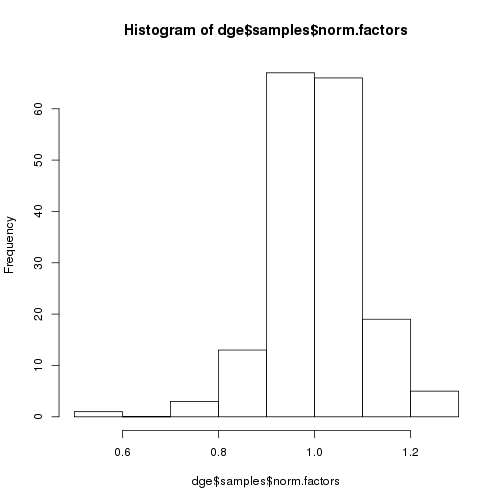

**Script:** `2_gpdata_dge_G_Z.R`

**Directory of Code:**  `/mnt/research/ernstc_lab/miRNA_eQTL_Sscrofa11/4_dge_G_objects/scripts`

**Date:**  12/4/17

**Input File Directory:**  

1. `/mnt/research/ernstc_lab/miRNA_eQTL_Sscrofa11/3_miRNA_expression_mx`
2. `/mnt/research/ernstc_lab/RNAseq_ASE/SNP60K_Ss11/SNP60_Ss11_Map/`
3. `/mnt/research/ernstc_lab/miRNA_eQTL_Sscrofa11/reference_sequences/`

**Input File(s):** 

1. `1_mean_mature_mirna_exp.Rdata.Rdata`

2. `MSUPRP_gpData_Ss11.Rdata`

3. `2_mature_mirna_annotation.Rdata`


**Output File Directory:** `/mnt/research/ernstc_lab/miRNA_eQTL_Sscrofa11/4_dge_G_objects`

**Output File(s):** 

1. `3_msuprp_mirna_gpdata.Rdata`

**Table of contents:**

1. [Objectives](#objectives)
2. [Install libraries](#install-libraries)
3. [Load data](#load-data)
4. [Analysis](#analysis)
5. [Save data](#save-data)

## Objectives

The Objectives of this script are to: 

Create the gpdata object needed for the miRNA eQTL analysis.

Add in PRKAG3 SNPs to gpdata object (Jun 2017) 

Filter the miRNA expression profiles by abundance across libraries and apply the voom transformation for use in the miRNA eQTL analysis.

Create the Z and G matrices for use in the miRNA eQTL analysis.

---

The gpdata object will be filtered from the MSUPRP gpdata object in the following ways:

The covariate data will be reduced to include only animals in this analysis (n=174), and will have the additional column of growth_group as a factor.  

The genotype data will be compiled as follows:

1. First, extract the F2 population genotypes from the MSUPRP$geno object and calculate AFs

2. Subset the genotype data to include the 174 F2 animals in this analysis

3. Filter those genotypes for MAF < 0.10 (being sure to take both ends of the distribution), removal of fixed SNPs, those located on sex chromosomes

4. Remove these markers from both the SNP dataset and the map data.

The phenotype data in the gpdata object will consist of the filtered, normalized miRNA expression profiles

## This analysis conducted using R/3.2.0, not R/3.1.0

## Install libraries


```r
setwd("/mnt/research/ernstc_lab/miRNA_eQTL_Sscrofa11/4_dge_G_objects/scripts/")

library(synbreed)
library(regress)
library(limma)
library(edgeR)
library(gwaR)
library(parallel)
library(qvalue)
```

## Load data


```r
rm(list=ls())
```

Load Yeni's function for standardizing the Z matrix:


```r
load("/mnt/research/pigsnp/GBLUP-based_GWA_Package/test_functions/testpkg/funct_eqtl.Rdata")
ls()
```

```
## [1] "absmap"     "add_legend" "AddPosGene" "manhpt"     "plot.GMA"  
## [6] "stb"        "tbpos"      "zstandard"
```

Load the miRNA expression data:


```r
load("/mnt/research/ernstc_lab/miRNA_eQTL_Sscrofa11/3_miRNA_expression_mx/1_mean_mature_mirna_exp.Rdata")
```

Load the MSUPRP gpdata object:


```r
load("/mnt/research/ernstc_lab/RNAseq_ASE/SNP60K_Ss11/SNP60_Ss11_Map/MSUPRP_gpData_Ss11.Rdata")
```

Load the mature miRNA annotation:


```r
load("../2_mature_mirna_annotation.Rdata")
ls()
```

```
##  [1] "absmap"                "add_legend"           
##  [3] "AddPosGene"            "manhpt"               
##  [5] "MSUPRP"                "MSUPRP168"            
##  [7] "no.zero.dfmeanrcround" "plot.GMA"             
##  [9] "stb"                   "tbpos"                
## [11] "total.mature.annot2"   "zstandard"
```

```r
# rm(PRKAG3)
```

## Analysis

no.zero.dfmeanrcround is a matrix of gene expression, with dimensions genes x samples (335 x 174)


```r
dim(no.zero.dfmeanrcround)
```

```
## [1] 335 174
```

```r
head(colnames(no.zero.dfmeanrcround))
```

```
## [1] "1034" "1036" "1041" "1049" "1058" "1060"
```

```r
head(rownames(no.zero.dfmeanrcround))
```

```
## [1] "ssc-let-7a"    "ssc-let-7c"    "ssc-let-7d-3p" "ssc-let-7d-5p"
## [5] "ssc-let-7e"    "ssc-let-7f"
```

Create vector of animal IDs from the column names of the expression matrix for subsetting the gpdata object:


```r
pigid <- colnames(no.zero.dfmeanrcround)
length(pigid)
```

```
## [1] 174
```

```r
head(pigid)
```

```
## [1] "1034" "1036" "1041" "1049" "1058" "1060"
```

---

### Covariate Data

Number of SNPs per chromosome in the new SNP map (Ssc 11.1)!


```r
table(as.character(MSUPRP$map$chr))
```

```
## 
##    1   10   11   12   13   14   15   16   17   18    2    3    4    5    6 
## 5092 1449 1577 1347 3312 3288 2325 1591 1408 1005 2830 2309 2975 1899 2724 
##    7    8    9    X    Y 
## 2665 2257 2674  394    9
```

Dimensions samples x categories (174 x categories), including growth_group as a factor:


Remove covariate data from animals not in this analysis:


```r
todisc <- MSUPRP$covar$id[!MSUPRP$covar$id %in% pigid]
length(todisc)
```

```
## [1] 863
```

```r
redMSU <- discard.individuals(MSUPRP, todisc)

dim(redMSU$pedigree)
```

```
## [1] 174   5
```

```r
dim(redMSU$geno)
```

```
## [1]   174 43130
```

Create the growth_group column as a factor by combining selcrit and Status


```r
redMSU$covar <- data.frame(redMSU$covar,
        growth_group=paste(redMSU$covar$selcrit, redMSU$covar$Status, sep="-"))
```

Change the levels of the factor growth_group to have lma-L the first level


```r
redMSU$covar$growth_group<-relevel(redMSU$covar$growth_group, ref = "lma-L")

is.factor(redMSU$covar$growth_group)
```

```
## [1] TRUE
```

```r
dim(redMSU$covar)
```

```
## [1] 174  25
```

```r
head(redMSU$covar)
```

```
##      id phenotyped genotyped family sex litter wt_10wk bf10_22wk lma_22wk
## 26 1034       TRUE      TRUE     NA   F      5   30.84     16.51    47.55
## 28 1036       TRUE      TRUE     NA   F      5   29.48     18.80    31.16
## 33 1041       TRUE      TRUE     NA   M      5   32.66     21.08    41.94
## 41 1049       TRUE      TRUE     NA   M      5   29.03     21.59    31.94
## 50 1058       TRUE      TRUE     NA   F     10   24.95     10.16    39.10
## 52 1060       TRUE      TRUE     NA   F     10   20.87     17.02    31.03
##    slgdt_cd age_slg car_wt Status selcrit microarray_Dye microarray_file
## 26        2     160  85.49      H     lma            cy3     slide33.gpr
## 28        2     160  71.66      L     lma            cy5     slide33.gpr
## 33        2     160  80.27      H     lma            cy5     slide34.gpr
## 41        2     160  81.86      L     lma            cy3     slide34.gpr
## 50        2     159  72.11      H     lma            cy5     slide52.gpr
## 52        2     159  70.75      L     lma            cy3     slide52.gpr
##    Color Hairden earset Spots Underbelly face_color line_origin perc_duroc
## 26  <NA>    <NA>   <NA>  <NA>       <NA>         NA          NA  0.5051327
## 28  <NA>    <NA>   <NA>  <NA>       <NA>         NA          NA  0.5471133
## 33  <NA>    <NA>   <NA>  <NA>       <NA>         NA          NA  0.4721328
## 41  <NA>    <NA>   <NA>  <NA>       <NA>         NA          NA  0.4565887
## 50  <NA>    <NA>   <NA>  <NA>       <NA>         NA          NA  0.4336773
## 52  <NA>    <NA>   <NA>  <NA>       <NA>         NA          NA  0.5354381
##    growth_group
## 26        lma-H
## 28        lma-L
## 33        lma-H
## 41        lma-L
## 50        lma-H
## 52        lma-L
```

```r
if (sum(redMSU$covar$id!=pigid)!=0) stop ("pigids of redMSU$covar not correct")
```

The dataframe of covariates is complete.

---

### Genotype Filtering

First, extract the F2 population genotypes from the MSUPRP$geno object and calculate MAFs:


```r
dim(MSUPRP$geno)
```

```
## [1]  1015 43130
```

Remember that all the animals with ID bigger than 6000 are F0 and smaller than 1000 are F1, thus remove those animals to retain the F2s:


```r
geno_f2<-MSUPRP$geno[!((as.numeric(rownames(MSUPRP$geno))<=1000) | (as.numeric(rownames(MSUPRP$geno))>=6000)),]
dim(geno_f2)
```

```
## [1]   940 43130
```

Calculate allele frequency for all the F2 animals:


```r
allele_freq<-colMeans(geno_f2,na.rm=T)/2
length(allele_freq)
```

```
## [1] 43130
```

```r
summary(allele_freq)
```

```
##    Min. 1st Qu.  Median    Mean 3rd Qu.    Max. 
## 0.01011 0.28720 0.51060 0.50810 0.73240 0.98990
```

Filter the subset of 174 animals' genotypes for MAF < 0.10 (being sure to take both ends of the distribution), removal of fixed SNPs, and those on sex chromosomes.

Extract the genotype object from the reduced gpdata object (the 174 animals and all the SNP markers):


```r
genomat<-redMSU$geno
dim(genomat)
```

```
## [1]   174 43130
```

Filter SNPs for minor allele frequency calculated using entire F2s (maf >= 0.10 retained):
How many SNPs have a af < 0.10 and >0.90?

We filter this way since we don't know which allele is "minor" in each SNP based on allele frequency (if A or B is the minor allele):


```r
length(which(allele_freq<0.10)) + length(which(allele_freq>0.90))
```

```
## [1] 6559
```

```r
length(names(which(allele_freq>=0.10 & allele_freq<=0.90)))
```

```
## [1] 36571
```

```r
length(allele_freq) - length(names(which(allele_freq>=0.10 & allele_freq<=0.90)))
```

```
## [1] 6559
```

Retain all SNPs with af >= 0.10 and <=0.90 (maf < 0.10 discarded):


```r
genomat <- genomat[,allele_freq>=0.10 & allele_freq <=0.90]
```

Dimensions of remaining SNP marker matrix:


```r
dim(genomat)
```

```
## [1]   174 36571
```

Calculate standard deviation of SNP markers (if equal to 0, marker is fixed and must be removed):


```r
sdv <- apply(genomat, 2, sd)
length(sdv)
```

```
## [1] 36571
```

```r
if(sum(names(sdv) != colnames(genomat)) != 0) stop ("SNP names not the same between redMSU$geno and sdv")

sum(sdv == 0)
```

```
## [1] 0
```

To make sure the proper number of SNPs were deleted, calculate the difference between the two datasets:


```r
ncol(genomat) - sum(sdv == 0)
```

```
## [1] 36571
```

Remove fixed SNPs from genotype matrix:


```r
genomat <- genomat[,sdv>0]

dim(genomat)
```

```
## [1]   174 36571
```

#### Eliminate markers on sex chromosomes:


```r
# #' Extract the map object, convert to data.frame, and replace in the MSUPRP gpdata object, prior to filtering out SNPs.
# map <- data.frame(chr=as.character(redMSU$map[[1]]),pos=redMSU$map[[2]])
# rownames(map) <- colnames(redMSU$geno)
# head(map)
# redMSU$map <- map
# str(redMSU$map)

# #' Check to make sure the PRKAG3 markers successfully added to the map object
# grep("PRKAG3", rownames(map))
# map[grep("PRKAG3", rownames(map)),]

# #' Check for NA's in the genotypes:
# table(redMSU$geno[,grep("PRKAG3", colnames(redMSU$geno))])
```

Convert redMSU map chr labels to character (factor includes scaffold ids)


```r
redMSU$map$chr<-as.character(redMSU$map$chr)

table(redMSU$map$chr)
```

```
## 
##    1   10   11   12   13   14   15   16   17   18    2    3    4    5    6 
## 5092 1449 1577 1347 3312 3288 2325 1591 1408 1005 2830 2309 2975 1899 2724 
##    7    8    9    X    Y 
## 2665 2257 2674  394    9
```

Identify SNPs on sex chr (chr == 19)


```r
xchr <- rownames(redMSU$map)[redMSU$map$chr == "X"]
ychr <- rownames(redMSU$map)[redMSU$map$chr == "Y"]
length(xchr)
```

```
## [1] 394
```

```r
length(ychr)
```

```
## [1] 9
```

How many SNPs in my dataset are on the sex chr:

On X:


```r
sum((colnames(genomat) %in% xchr))
```

```
## [1] 276
```

On Y:


```r
sum((colnames(genomat) %in% ychr))
```

```
## [1] 3
```

Filter out the SNPs on the sex chromosome


```r
genomatfil <- genomat[,!(colnames(genomat) %in% xchr)]
genomatfil <- genomatfil[,!(colnames(genomatfil) %in% ychr)]
```

This object contains the markers that are not fixed, have a maf > 0.10, and are not mapped to the sex chromosomes:


```r
dim(genomatfil)
```

```
## [1]   174 36292
```

```r
if (sum(colnames(genomatfil) %in% xchr) != 0) stop ("sex chromosome filter did not work correctly")
if (sum(colnames(genomatfil) %in% ychr) != 0) stop ("sex chromosome filter did not work correctly")

if (sum(rownames(genomatfil) != colnames(no.zero.dfmeanrcround)) != 0) stop ("rownames of genotype data and count data not the same")

ncol(MSUPRP$geno)
```

```
## [1] 43130
```

```r
ncol(genomatfil)
```

```
## [1] 36292
```

Check on how many SNPs are being deleted:


```r
ncol(MSUPRP$geno) - ncol(genomatfil)
```

```
## [1] 6838
```

Create the todel vector, containing the names of the SNPs in the gpdata geno object NOT found in the filtered genotype matrix:


```r
todel <- colnames(redMSU$geno)[!colnames(redMSU$geno) %in% colnames(genomatfil)]
length(todel)
```

```
## [1] 6838
```

That means that, in total, we have removed 6838 SNPs from the gpdata geno object. 

Using discard.markers allows us to remove both the markers we don't want, and the map information we don't want, all in one step.


```r
MSUPRP_miRNA <- discard.markers(redMSU, todel)
dim(MSUPRP_miRNA$geno)
```

```
## [1]   174 36292
```

The filtering of genotypes is complete. This will be used in the GBLUP and GWAS for the G matrix (genomic relationship matrix) after standardizing the SNPs. 


```r
summary_MSUPRP_miRNA<-summary(MSUPRP_miRNA)
summary_MSUPRP_miRNA$geno
```

```
## $nMarkers
## [1] 36292
## 
## $genotypes
##     0     1     2 
## 0.281 0.427 0.292 
## 
## $nNA
## [1] 0
## 
## $markerChr
## 
##    1   10   11   12   13   14   15   16   17   18    2    3    4    5    6 
## 4365 1240 1309 1188 2858 2773 2028 1403 1224  780 2412 1839 2633 1588 2282 
##    7    8    9 
## 2236 1941 2193 
## 
## $mappedMarkers
## [1] 36292
```

```r
summary_MSUPRP_miRNA$pedigree
```

```
## Number of 
## 	 individuals  174 
## 	 males :  86 , females :  88 
## 	 Par 1 (sire)  0 
## 	 Par 2 (dam)   0 
## 	 generations  1
```

```r
summary_MSUPRP_miRNA$covar
```

```
## $n
## [1] 174
## 
## $nphenotyped
## [1] 174
## 
## $ngenotyped
## [1] 174
```

```r
str(summary_MSUPRP_miRNA$pheno)
```

```
##  'table' chr [1:7, 1:67] "Min.   :0.77  " "1st Qu.:1.27  " ...
##  - attr(*, "dimnames")=List of 2
##   ..$ : chr [1:7] "" "" "" "" ...
##   ..$ : chr [1:67] "   wt_birth" "    wt_3wk" "    wt_6wk" "   wt_10wk" ...
```

---

### Phenotype Data (miRNA Expression Profile Preparation) 

Create the dge object and transform the read counts: log-cpm, then filter genes by expression (1 cpm in 44 or more samples retained):

Create the dge object:


```r
dge<-DGEList(counts=no.zero.dfmeanrcround,genes=total.mature.annot2)
dim(dge)
```

```
## [1] 335 174
```

```r
dge[1:5,1:5]
```

```
## An object of class "DGEList"
## $counts
##                1034  1036  1041  1049  1058
## ssc-let-7a    48132 23427 28448 29860 40758
## ssc-let-7c    32745 14987 18144 18681 34313
## ssc-let-7d-3p   381   192   198   269   778
## ssc-let-7d-5p  4925  1938  2511  3076  3472
## ssc-let-7e     2811  1302  1463  1690  2512
## 
## $samples
##      group lib.size norm.factors
## 1034     1  1462358            1
## 1036     1   830436            1
## 1041     1   944837            1
## 1049     1  1081483            1
## 1058     1  1257197            1
## 
## $genes
##                        Name  chr0     start       end width strand  type
## ssc-let-7a       ssc-let-7a  chr3  44864443  44864464    22      + miRNA
## ssc-let-7c       ssc-let-7c chr13 191559351 191559372    22      + miRNA
## ssc-let-7d-3p ssc-let-7d-3p  chr3  44867331  44867352    22      + miRNA
## ssc-let-7d-5p ssc-let-7d-5p  chr3  44867277  44867298    22      + miRNA
## ssc-let-7e       ssc-let-7e  chr6  51858385  51858406    22      + miRNA
##                      Alias          Precursors
## ssc-let-7a    MIMAT0013865 MI0017984,MI0013085
## ssc-let-7c    MIMAT0002151           MI0002445
## ssc-let-7d-3p MIMAT0025357           MI0022120
## ssc-let-7d-5p MIMAT0025356           MI0022120
## ssc-let-7e    MIMAT0013866           MI0013086
```

Calculate the read counts per million in order to filter miRNAs by normalized expression:


```r
cpm.dge<-cpm(dge)
dim(cpm.dge)
```

```
## [1] 335 174
```

```r
cpm.dge[1:5,1:5]
```

```
##                     1034       1036      1041       1049      1058
## ssc-let-7a    32913.9650 28210.4822 30108.897 27610.2352 32419.740
## ssc-let-7c    22391.9177 18047.1463 19203.312 17273.5031 27293.256
## ssc-let-7d-3p   260.5381   231.2038   209.560   248.7325   618.837
## ssc-let-7d-5p  3367.8484  2333.7139  2657.601  2844.2426  2761.699
## ssc-let-7e     1922.2379  1567.8511  1548.415  1562.6690  1998.096
```

```r
if (sum(rownames(no.zero.dfmeanrcround)!=rownames(cpm.dge))!=0) stop ("miRNAs not the same between read counts and cpm")
if (sum(colnames(no.zero.dfmeanrcround)!=colnames(cpm.dge))!=0) stop ("animal ids not the same between read counts and cpm")
```

Filter miRNAs with at least 1 cpm in at least 1/4 of the samples (174/4=43.5-->44)


```r
filtercpm<-rowSums(cpm.dge>=1)>=44
sum(filtercpm)
```

```
## [1] 295
```

We are removing 40 miRNA profiles from the analysis

So, keep the miRNA profiles in dge based on those retained in the cpm-filtering step:

This retains the rounded, filtered mean read counts, not the cpm.


```r
dge<-dge[filtercpm,]
names(dge)
```

```
## [1] "counts"  "samples" "genes"
```

```r
dge[1:5,1:5]
```

```
## An object of class "DGEList"
## $counts
##                1034  1036  1041  1049  1058
## ssc-let-7a    48132 23427 28448 29860 40758
## ssc-let-7c    32745 14987 18144 18681 34313
## ssc-let-7d-3p   381   192   198   269   778
## ssc-let-7d-5p  4925  1938  2511  3076  3472
## ssc-let-7e     2811  1302  1463  1690  2512
## 
## $samples
##      group lib.size norm.factors
## 1034     1  1462358            1
## 1036     1   830436            1
## 1041     1   944837            1
## 1049     1  1081483            1
## 1058     1  1257197            1
## 
## $genes
##                        Name  chr0     start       end width strand  type
## ssc-let-7a       ssc-let-7a  chr3  44864443  44864464    22      + miRNA
## ssc-let-7c       ssc-let-7c chr13 191559351 191559372    22      + miRNA
## ssc-let-7d-3p ssc-let-7d-3p  chr3  44867331  44867352    22      + miRNA
## ssc-let-7d-5p ssc-let-7d-5p  chr3  44867277  44867298    22      + miRNA
## ssc-let-7e       ssc-let-7e  chr6  51858385  51858406    22      + miRNA
##                      Alias          Precursors
## ssc-let-7a    MIMAT0013865 MI0017984,MI0013085
## ssc-let-7c    MIMAT0002151           MI0002445
## ssc-let-7d-3p MIMAT0025357           MI0022120
## ssc-let-7d-5p MIMAT0025356           MI0022120
## ssc-let-7e    MIMAT0013866           MI0013086
```

```r
dim(dge$counts)
```

```
## [1] 295 174
```

```r
if (sum(colnames(dge)!=colnames(cpm.dge))!=0) stop ("colnames not the same between dge and cpm.dge")
```

Apply the TMM normalization:


```r
dge<-calcNormFactors(dge)
head(dge$samples)
```

```
##      group lib.size norm.factors
## 1034     1  1462358    1.0600569
## 1036     1   830436    1.0612208
## 1041     1   944837    1.0625273
## 1049     1  1081483    1.1020920
## 1058     1  1257197    1.2027002
## 1060     1   927156    0.9505157
```

```r
hist(dge$samples$norm.factors)
```



```r
dge<-estimateCommonDisp(dge,verbose=TRUE)
```

```
## Disp = 0.11373 , BCV = 0.3372
```

```r
dge$common.dispersion
```

```
## [1] 0.1137292
```

This function (estimateCommonDisp) applies normalization factors, caluclates normalized expression based on robust count of normalized reads.
Save this object before voom transformation so we can access the pseudo.counts if needed.
Run voom transformation:


```r
v<-voom(dge,plot=TRUE)
```


```r
names(v)
```

```
## [1] "genes"   "targets" "E"       "weights" "design"
```

```r
dim(v$weights)
```

```
## [1] 295 174
```

```r
dim(v$genes)
```

```
## [1] 295   9
```

```r
v$genes[1:5,1:5]
```

```
##                        Name  chr0     start       end width
## ssc-let-7a       ssc-let-7a  chr3  44864443  44864464    22
## ssc-let-7c       ssc-let-7c chr13 191559351 191559372    22
## ssc-let-7d-3p ssc-let-7d-3p  chr3  44867331  44867352    22
## ssc-let-7d-5p ssc-let-7d-5p  chr3  44867277  44867298    22
## ssc-let-7e       ssc-let-7e  chr6  51858385  51858406    22
```

```r
v$weights[1:5,1:5]
```

```
##           [,1]      [,2]      [,3]      [,4]      [,5]
## [1,] 12.739579 11.819073 12.025105 12.303396 12.697604
## [2,] 11.974140 11.103495 11.300026 11.562518 11.934603
## [3,]  5.793730  5.330961  5.420053  5.546369  5.768169
## [4,]  9.002745  8.164449  8.356027  8.606709  8.963905
## [5,]  8.102738  7.193156  7.407590  7.691216  8.064036
```

```r
v$targets[1:5,]
```

```
##      group lib.size norm.factors
## 1034     1  1550183     1.060057
## 1036     1   881276     1.061221
## 1041     1  1003915     1.062527
## 1049     1  1191894     1.102092
## 1058     1  1512031     1.202700
```

Extract the voom precision weights and transform them for use in the GBLUP error term:


```r
wt<-t(v$weights)
dim(wt)
```

```
## [1] 174 295
```

```r
wt[1:5,1:5]
```

```
##          [,1]     [,2]     [,3]     [,4]     [,5]
## [1,] 12.73958 11.97414 5.793730 9.002745 8.102738
## [2,] 11.81907 11.10349 5.330961 8.164449 7.193156
## [3,] 12.02511 11.30003 5.420053 8.356027 7.407590
## [4,] 12.30340 11.56252 5.546369 8.606709 7.691216
## [5,] 12.69760 11.93460 5.768169 8.963905 8.064036
```

Standardize the voom weights: [(1/sqrt(wt))/mean(1/sqrt(wt))]


```r
wtsq<-1/sqrt(wt)
wtcen<-as.matrix(sweep(wtsq,2,FUN="/",STATS=colMeans(1/sqrt(wt))))
rownames(wtcen)<-rownames(t(v$E))
colnames(wtcen)<-colnames(t(v$E))
dim(wtcen)
```

```
## [1] 174 295
```

```r
wtcen[1:5,1:5]
```

```
##      ssc-let-7a ssc-let-7c ssc-let-7d-3p ssc-let-7d-5p ssc-let-7e
## 1034  0.9627891  0.9622429     0.9592847     0.9502803  0.9418588
## 1036  0.9995787  0.9992566     1.0000549     0.9978741  0.9996361
## 1041  0.9909786  0.9905290     0.9918017     0.9863686  0.9850612
## 1049  0.9797070  0.9792209     0.9804428     0.9718978  0.9667278
## 1058  0.9643792  0.9638355     0.9614078     0.9523368  0.9441162
```

Now, replace the gpdata "pheno" object with the voom-adjusted read counts:

The pheno object must be a data frame with rows of animals and columns of miRNAs.
So, the voom-transformed read count matrix (E) must be transposed to comply, and then be made into an array of 3 dimensions:


```r
MSUPRP_miRNA$pheno <- array(t(v$E), dim=c(ncol(v$E),nrow(v$E),1))
rownames(MSUPRP_miRNA$pheno)<- colnames(v$E)
colnames(MSUPRP_miRNA$pheno)<- rownames(v$E)
dim(MSUPRP_miRNA$pheno)
```

```
## [1] 174 295   1
```

```r
MSUPRP_miRNA$pheno[1:5,1:5,1]
```

```
##      ssc-let-7a ssc-let-7c ssc-let-7d-3p ssc-let-7d-5p ssc-let-7e
## 1034   14.92228   14.36657      7.943100      11.63362   10.82469
## 1036   14.69825   14.05380      7.771047      11.10306   10.52940
## 1041   14.79043   14.14161      7.627356      11.28869   10.50957
## 1049   14.61269   13.93607      7.820885      11.33382   10.46998
## 1058   14.71832   14.47000      9.008064      11.16527   10.69842
```

```r
if (sum(MSUPRP_miRNA$pheno[,,1] != t(v$E)) != 0) stop ("pheno object not equal to voom counts")
if (sum(rownames(MSUPRP_miRNA$pheno) != rownames(MSUPRP_miRNA$geno)) != 0) stop ("pheno object rownames not equal to geno object rownames")
if (sum(rownames(MSUPRP_miRNA$pheno) != MSUPRP_miRNA$covar$id) != 0) stop ("pheno object rownames not equal to covar id column")
sum(rownames(no.zero.dfmeanrcround) %in% colnames(MSUPRP_miRNA$pheno))
```

```
## [1] 295
```

Create the correct gpdata summary for the updated final_MSUPRP_miRNA:


```r
summary_MSUPRP_miRNA<-summary(MSUPRP_miRNA)
summary_MSUPRP_miRNA$pheno[,1:10]
```

```
##    ssc.let.7a        ssc.let.7c      ssc.let.7d.3p      ssc.let.7d.5p    
##  "Min.   :14.23  " "Min.   :13.42  " "Min.   : 7.074  " "Min.   :10.48  "
##  "1st Qu.:14.76  " "1st Qu.:14.05  " "1st Qu.: 7.911  " "1st Qu.:11.29  "
##  "Median :14.92  " "Median :14.26  " "Median : 8.179  " "Median :11.51  "
##  "Mean   :14.92  " "Mean   :14.25  " "Mean   : 8.218  " "Mean   :11.51  "
##  "3rd Qu.:15.08  " "3rd Qu.:14.46  " "3rd Qu.: 8.432  " "3rd Qu.:11.75  "
##  "Max.   :15.69  " "Max.   :15.02  " "Max.   :12.059  " "Max.   :12.39  "
##    ssc.let.7e        ssc.let.7f        ssc.let.7g        ssc.let.7i      
##  "Min.   : 9.26  " "Min.   :12.19  " "Min.   :11.45  " "Min.   : 9.947  "
##  "1st Qu.:10.36  " "1st Qu.:14.30  " "1st Qu.:13.27  " "1st Qu.:12.369  "
##  "Median :10.70  " "Median :14.49  " "Median :13.44  " "Median :12.535  "
##  "Mean   :10.64  " "Mean   :14.46  " "Mean   :13.44  " "Mean   :12.514  "
##  "3rd Qu.:10.92  " "3rd Qu.:14.63  " "3rd Qu.:13.62  " "3rd Qu.:12.697  "
##  "Max.   :11.84  " "Max.   :15.34  " "Max.   :14.21  " "Max.   :13.231  "
##    ssc.miR.1        ssc.miR.100     
##  "Min.   :15.98  " "Min.   :10.35  "
##  "1st Qu.:17.90  " "1st Qu.:10.83  "
##  "Median :18.07  " "Median :11.10  "
##  "Mean   :18.00  " "Mean   :11.25  "
##  "3rd Qu.:18.16  " "3rd Qu.:11.43  "
##  "Max.   :18.77  " "Max.   :13.50  "
```

Add miRNA assembly data for the 43 miRNAs that lack it in old map 

Query Ensembl and see how many now have assembly data, then insert into mature annotation file
This object is ready to be saved, and used in GBLUP and GWA analyses.

---

### Standardize the matrix of SNPs and create G matrix:

Using zstandard, the function created by Yeni Bernal Rubio:

This Z matrix is constructed using the allele frequencies of the entire F2 population and extracting the markers present in this analysis:

Need to filter the allele_freq object to retain the correct SNP markers.


```r
length(allele_freq)
```

```
## [1] 43130
```

```r
head(colnames(MSUPRP_miRNA$geno))
```

```
## [1] "MARC0044150" "ASGA0000014" "H3GA0000026" "ASGA0000021" "ALGA0000009"
## [6] "ALGA0000014"
```

```r
allele_freq<-allele_freq[colnames(MSUPRP_miRNA$geno)]
length(allele_freq)
```

```
## [1] 36292
```

```r
if(sum(names(allele_freq) != colnames(MSUPRP_miRNA$geno)) !=0) stop ("allele freq don't match SNP matrix")
```

Use the heterogeneous protocol from Yeni's function, computing Z with VanRaden et al 2008 option 2, like Jose Luis paper:


```r
Z<-zstandard(MSUPRP_miRNA$geno, alfreq=allele_freq, procedure="heterogeneous")
dim(Z)
```

```
## [1]   174 36292
```

```r
G<-Z%*%t(Z)
dim(G)
```

```
## [1] 174 174
```

```r
summary(diag(G))
```

```
##    Min. 1st Qu.  Median    Mean 3rd Qu.    Max. 
##  0.6333  0.9051  0.9457  0.9414  0.9785  1.0730
```

```r
IQR(diag(G))
```

```
## [1] 0.07336399
```


## Save data

Save full gpdata object with filtered genotypes, map information, and covariate information, and updated pheno data:


```r
save(MSUPRP_miRNA, summary_MSUPRP_miRNA, file="../3_msuprp_mirna_gpdata.Rdata")
```

Save dge object and voom output with weights:


```r
save(dge, v, wtcen, file = "../4_normalized_dge_voom.Rdata")
```

Save the Z and G matrices:


```r
save(Z, G, file = "../5_Z_G_miRNA.Rdata")
```

