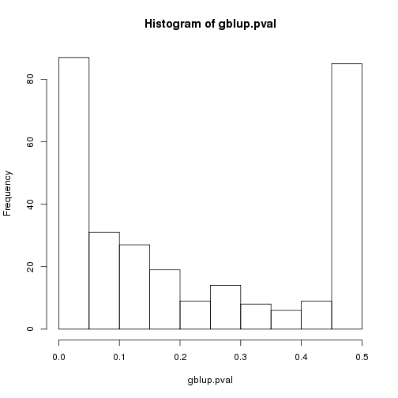

**Script:** `1_miRNA_gblup_gwas.R`

**Directory of Code:**  `/mnt/research/ernstc_lab/miRNA_eQTL_Sscrofa11/5_gblup_gwa_eqtl/scripts`

**Date:**  12/5/17

**Input File Directory:**  `/mnt/research/ernstc_lab/miRNA_eQTL_Sscrofa11/4_dge_G_objects/`

**Input File(s):** 

1. `3_msuprp_mirna_gpdata.Rdata`

2. `4_normalized_dge_voom.Rdata`

3. `5_Z_G_miRNA.Rdata`

**Output File Directory:** `/mnt/research/ernstc_lab/miRNA_eQTL_Sscrofa11/5_gblup_gwa_eqtl`

**Output File(s):** 

1. `1_gblup_full_results.Rdata`, `1_gblup_results_summary.Rdata`

2. `2_gwa_results.Rdata`

**Table of contents:**

1. [Objectives](#objectives)
2. [Install libraries](#install-libraries)
3. [Load data](#load-data)
4. [Analysis](#analysis)
5. [Save data](#save-data)

## Objectives
The objective of this script is to conduct a gblup and gwa scan for the 295 MSUPRP F2 pig miRNA expression profiles.

This analysis will utilize the gwaR package developed by our lab group: <https://github.com/steibelj/gwaR>

## Install libraries


```r
rm(list=ls())
setwd("/mnt/research/ernstc_lab/miRNA_eQTL_Sscrofa11/5_gblup_gwa_eqtl/scripts/")

library(synbreed)
library(regress)
library(limma)
library(edgeR)
library(gwaR)
library(parallel)
library(qvalue)
library(plyr)
```

## Load data

The final miRNA gpdata object with the voom-adjusted counts as phenotype data:


```r
load("../../4_dge_G_objects/3_msuprp_mirna_gpdata.Rdata")
```

The normalized dge object and voom centered precision weights:


```r
load("../../4_dge_G_objects/4_normalized_dge_voom.Rdata")
```

The standardized Z and G matrices:


```r
load("../../4_dge_G_objects/5_Z_G_miRNA.Rdata")
ls()
```

```
## [1] "dge"                  "G"                    "MSUPRP_miRNA"        
## [4] "summary_MSUPRP_miRNA" "v"                    "wtcen"               
## [7] "Z"
```

## Analysis

Create the design for the GBLUP model:


```r
design_1<-c(~sex + growth_group)
```

Create miRnames, the list of the miRNAs to be input into the gblup analysis:


```r
miRnames<-colnames(MSUPRP_miRNA$pheno)
length(miRnames)
```

```
## [1] 295
```

## Run gblup:


```r
system.time({
rst.gblup<-lapply(miRnames, function(x) gblup(rsp=x, data=MSUPRP_miRNA, design=design_1, G=G, vdata=NULL, wt=wtcen, pos=c(T,T)))

names(rst.gblup)<-miRnames
})
```

```
## Warning: solution lies close to zero for some positive variance components, their standard errors may not be valid
## Warning: solution lies close to zero for some positive variance components, their standard errors may not be valid
## Warning: solution lies close to zero for some positive variance components, their standard errors may not be valid
## Warning: solution lies close to zero for some positive variance components, their standard errors may not be valid
## Warning: solution lies close to zero for some positive variance components, their standard errors may not be valid
## Warning: solution lies close to zero for some positive variance components, their standard errors may not be valid
## Warning: solution lies close to zero for some positive variance components, their standard errors may not be valid
## Warning: solution lies close to zero for some positive variance components, their standard errors may not be valid
## Warning: solution lies close to zero for some positive variance components, their standard errors may not be valid
## Warning: solution lies close to zero for some positive variance components, their standard errors may not be valid
## Warning: solution lies close to zero for some positive variance components, their standard errors may not be valid
## Warning: solution lies close to zero for some positive variance components, their standard errors may not be valid
## Warning: solution lies close to zero for some positive variance components, their standard errors may not be valid
## Warning: solution lies close to zero for some positive variance components, their standard errors may not be valid
## Warning: solution lies close to zero for some positive variance components, their standard errors may not be valid
## Warning: solution lies close to zero for some positive variance components, their standard errors may not be valid
## Warning: solution lies close to zero for some positive variance components, their standard errors may not be valid
## Warning: solution lies close to zero for some positive variance components, their standard errors may not be valid
## Warning: solution lies close to zero for some positive variance components, their standard errors may not be valid
## Warning: solution lies close to zero for some positive variance components, their standard errors may not be valid
## Warning: solution lies close to zero for some positive variance components, their standard errors may not be valid
## Warning: solution lies close to zero for some positive variance components, their standard errors may not be valid
## Warning: solution lies close to zero for some positive variance components, their standard errors may not be valid
## Warning: solution lies close to zero for some positive variance components, their standard errors may not be valid
## Warning: solution lies close to zero for some positive variance components, their standard errors may not be valid
## Warning: solution lies close to zero for some positive variance components, their standard errors may not be valid
## Warning: solution lies close to zero for some positive variance components, their standard errors may not be valid
## Warning: solution lies close to zero for some positive variance components, their standard errors may not be valid
## Warning: solution lies close to zero for some positive variance components, their standard errors may not be valid
## Warning: solution lies close to zero for some positive variance components, their standard errors may not be valid
## Warning: solution lies close to zero for some positive variance components, their standard errors may not be valid
## Warning: solution lies close to zero for some positive variance components, their standard errors may not be valid
## Warning: solution lies close to zero for some positive variance components, their standard errors may not be valid
## Warning: solution lies close to zero for some positive variance components, their standard errors may not be valid
## Warning: solution lies close to zero for some positive variance components, their standard errors may not be valid
## Warning: solution lies close to zero for some positive variance components, their standard errors may not be valid
## Warning: solution lies close to zero for some positive variance components, their standard errors may not be valid
## Warning: solution lies close to zero for some positive variance components, their standard errors may not be valid
## Warning: solution lies close to zero for some positive variance components, their standard errors may not be valid
## Warning: solution lies close to zero for some positive variance components, their standard errors may not be valid
## Warning: solution lies close to zero for some positive variance components, their standard errors may not be valid
## Warning: solution lies close to zero for some positive variance components, their standard errors may not be valid
## Warning: solution lies close to zero for some positive variance components, their standard errors may not be valid
## Warning: solution lies close to zero for some positive variance components, their standard errors may not be valid
## Warning: solution lies close to zero for some positive variance components, their standard errors may not be valid
## Warning: solution lies close to zero for some positive variance components, their standard errors may not be valid
## Warning: solution lies close to zero for some positive variance components, their standard errors may not be valid
## Warning: solution lies close to zero for some positive variance components, their standard errors may not be valid
## Warning: solution lies close to zero for some positive variance components, their standard errors may not be valid
## Warning: solution lies close to zero for some positive variance components, their standard errors may not be valid
## Warning: solution lies close to zero for some positive variance components, their standard errors may not be valid
## Warning: solution lies close to zero for some positive variance components, their standard errors may not be valid
## Warning: solution lies close to zero for some positive variance components, their standard errors may not be valid
## Warning: solution lies close to zero for some positive variance components, their standard errors may not be valid
## Warning: solution lies close to zero for some positive variance components, their standard errors may not be valid
## Warning: solution lies close to zero for some positive variance components, their standard errors may not be valid
## Warning: solution lies close to zero for some positive variance components, their standard errors may not be valid
## Warning: solution lies close to zero for some positive variance components, their standard errors may not be valid
## Warning: solution lies close to zero for some positive variance components, their standard errors may not be valid
## Warning: solution lies close to zero for some positive variance components, their standard errors may not be valid
## Warning: solution lies close to zero for some positive variance components, their standard errors may not be valid
## Warning: solution lies close to zero for some positive variance components, their standard errors may not be valid
## Warning: solution lies close to zero for some positive variance components, their standard errors may not be valid
## Warning: solution lies close to zero for some positive variance components, their standard errors may not be valid
## Warning: solution lies close to zero for some positive variance components, their standard errors may not be valid
## Warning: solution lies close to zero for some positive variance components, their standard errors may not be valid
## Warning: solution lies close to zero for some positive variance components, their standard errors may not be valid
## Warning: solution lies close to zero for some positive variance components, their standard errors may not be valid
## Warning: solution lies close to zero for some positive variance components, their standard errors may not be valid
## Warning: solution lies close to zero for some positive variance components, their standard errors may not be valid
## Warning: solution lies close to zero for some positive variance components, their standard errors may not be valid
## Warning: solution lies close to zero for some positive variance components, their standard errors may not be valid
## Warning: solution lies close to zero for some positive variance components, their standard errors may not be valid
## Warning: solution lies close to zero for some positive variance components, their standard errors may not be valid
## Warning: solution lies close to zero for some positive variance components, their standard errors may not be valid
## Warning: solution lies close to zero for some positive variance components, their standard errors may not be valid
## Warning: solution lies close to zero for some positive variance components, their standard errors may not be valid
## Warning: solution lies close to zero for some positive variance components, their standard errors may not be valid
## Warning: solution lies close to zero for some positive variance components, their standard errors may not be valid
## Warning: solution lies close to zero for some positive variance components, their standard errors may not be valid
## Warning: solution lies close to zero for some positive variance components, their standard errors may not be valid
## Warning: solution lies close to zero for some positive variance components, their standard errors may not be valid
## Warning: solution lies close to zero for some positive variance components, their standard errors may not be valid
## Warning: solution lies close to zero for some positive variance components, their standard errors may not be valid
## Warning: solution lies close to zero for some positive variance components, their standard errors may not be valid
## Warning: solution lies close to zero for some positive variance components, their standard errors may not be valid
## Warning: solution lies close to zero for some positive variance components, their standard errors may not be valid
## Warning: solution lies close to zero for some positive variance components, their standard errors may not be valid
## Warning: solution lies close to zero for some positive variance components, their standard errors may not be valid
## Warning: solution lies close to zero for some positive variance components, their standard errors may not be valid
## Warning: solution lies close to zero for some positive variance components, their standard errors may not be valid
## Warning: solution lies close to zero for some positive variance components, their standard errors may not be valid
## Warning: solution lies close to zero for some positive variance components, their standard errors may not be valid
## Warning: solution lies close to zero for some positive variance components, their standard errors may not be valid
## Warning: solution lies close to zero for some positive variance components, their standard errors may not be valid
## Warning: solution lies close to zero for some positive variance components, their standard errors may not be valid
## Warning: solution lies close to zero for some positive variance components, their standard errors may not be valid
## Warning: solution lies close to zero for some positive variance components, their standard errors may not be valid
## Warning: solution lies close to zero for some positive variance components, their standard errors may not be valid
## Warning: solution lies close to zero for some positive variance components, their standard errors may not be valid
## Warning: solution lies close to zero for some positive variance components, their standard errors may not be valid
## Warning: solution lies close to zero for some positive variance components, their standard errors may not be valid
## Warning: solution lies close to zero for some positive variance components, their standard errors may not be valid
## Warning: solution lies close to zero for some positive variance components, their standard errors may not be valid
## Warning: solution lies close to zero for some positive variance components, their standard errors may not be valid
## Warning: solution lies close to zero for some positive variance components, their standard errors may not be valid
## Warning: solution lies close to zero for some positive variance components, their standard errors may not be valid
## Warning: solution lies close to zero for some positive variance components, their standard errors may not be valid
## Warning: solution lies close to zero for some positive variance components, their standard errors may not be valid
## Warning: solution lies close to zero for some positive variance components, their standard errors may not be valid
## Warning: solution lies close to zero for some positive variance components, their standard errors may not be valid
## Warning: solution lies close to zero for some positive variance components, their standard errors may not be valid
## Warning: solution lies close to zero for some positive variance components, their standard errors may not be valid
## Warning: solution lies close to zero for some positive variance components, their standard errors may not be valid
## Warning: solution lies close to zero for some positive variance components, their standard errors may not be valid
## Warning: solution lies close to zero for some positive variance components, their standard errors may not be valid
## Warning: solution lies close to zero for some positive variance components, their standard errors may not be valid
## Warning: solution lies close to zero for some positive variance components, their standard errors may not be valid
## Warning: solution lies close to zero for some positive variance components, their standard errors may not be valid
## Warning: solution lies close to zero for some positive variance components, their standard errors may not be valid
## Warning: solution lies close to zero for some positive variance components, their standard errors may not be valid
## Warning: solution lies close to zero for some positive variance components, their standard errors may not be valid
## Warning: solution lies close to zero for some positive variance components, their standard errors may not be valid
## Warning: solution lies close to zero for some positive variance components, their standard errors may not be valid
## Warning: solution lies close to zero for some positive variance components, their standard errors may not be valid
## Warning: solution lies close to zero for some positive variance components, their standard errors may not be valid
## Warning: solution lies close to zero for some positive variance components, their standard errors may not be valid
## Warning: solution lies close to zero for some positive variance components, their standard errors may not be valid
## Warning: solution lies close to zero for some positive variance components, their standard errors may not be valid
## Warning: solution lies close to zero for some positive variance components, their standard errors may not be valid
## Warning: solution lies close to zero for some positive variance components, their standard errors may not be valid
## Warning: solution lies close to zero for some positive variance components, their standard errors may not be valid
```

```
##    user  system elapsed 
## 176.693   0.342 177.032
```

Check standard error of G and wt, if NA eliminate from analysis:

First, what does this output look like:


```r
rst.gblup$`ssc-let-7a`
```

```
## gblup analysis of trait: ssc-let-7a 
## 
## fixed effects equation:
## y ~ sex + growth_group
## 
## random effects equation:
## ~G + wt
## 
## log-likelihood: 144.0939 converged in: 6 iterations 
## 
## estimated fixed effects:
##                      Estimate   StdError     test.st      p.value
## (Intercept)       15.01165637 0.04217525 355.9351817 0.000000e+00
## sexM              -0.01334255 0.03862922  -0.3454005 7.297933e-01
## growth_groupbf-H  -0.12314850 0.05616463  -2.1926343 2.833373e-02
## growth_groupbf-L  -0.22731147 0.05602900  -4.0570323 4.970021e-05
## growth_grouplma-H -0.01835002 0.05216359  -0.3517784 7.250045e-01
## 
## estimated variance components:
##       Estimate    StdError  prop.var
## G  0.006850584 0.008011816 0.1010852
## wt 0.060919835 0.009176512 0.8989148
```

coefm[6:7,2] is the standard errors of G and the wt


```r
rst.gblup$`ssc-let-7a`$coefm[6:7,2]
```

```
##           G          wt 
## 0.008011816 0.009176512
```

```r
std<-do.call(rbind, lapply(rst.gblup,function(x) x$coefm[6:7,2]))
```

Check how many NAs in standard error:


```r
sum(is.na(rowSums(std)))
```

```
## [1] 0
```

Retain only those miRNAs with a non-NA Standard Error


```r
miRnames<-miRnames[!is.na(rowSums(std))]
length(miRnames)
```

```
## [1] 295
```

Perform Likelihood Ratio Test on gblup results:


```r
system.time({
like<-lapply(rst.gblup, lrt)
names(like)<-miRnames
})
```

```
##    user  system elapsed 
##  17.435   0.000  17.424
```

See what these results look like:


```r
like$`ssc-let-7a`
```

```
## $pvalue
## [1] 0.07811384
## 
## $llik
##       full      red      dif
## 1 144.0939 143.0887 1.005183
## 
## $vars
##           full    reduced perc.full
## G  0.006850584         NA 0.1010852
## wt 0.060919835 0.06767333 0.8989148
```

Multiple test corrections: FDR:

Obtain p-values from LRT


```r
gblup.pval<-unlist(lapply(like, function(x) x$pvalue))
```

Create histogram of LRT p-values to see how much they deviate from expectation


```r
hist(gblup.pval)
```



Calculate q-values from LRT p-values:


```r
system.time({
	gblup.qval<-qvalue(gblup.pval,lambda=0)$qvalue
})
```

```
##    user  system elapsed 
##   0.011   0.000   0.038
```

Total number of miRNAs with significant h2 at FDR < 0.05


```r
sum(gblup.qval<0.05)
```

```
## [1] 46
```

Matrix of standard errors of GBLUP:


```r
std<-std[miRnames,]
colnames(std)<-paste("stdEr", colnames(std), sep="-")
head(std)
```

```
##                   stdEr-G    stdEr-wt
## ssc-let-7a    0.008011816 0.009176512
## ssc-let-7c    0.007657903 0.009776807
## ssc-let-7d-3p 0.027021243 0.037234622
## ssc-let-7d-5p 0.012971540 0.014998053
## ssc-let-7e    0.015786305 0.020689828
## ssc-let-7f    0.012095622 0.015871653
```

Matrix of gblup results:


```r
summary.rst.gblup<-do.call(rbind, 
	lapply(miRnames, function(x) cbind(t(like[[x]]$vars[1]),
	 h2=like[[x]]$vars[1,3],
		like[[x]]$llik,
	lrtpvalue=like[[x]]$pvalue)))

rownames(summary.rst.gblup)<-miRnames

head(summary.rst.gblup)
```

```
##                         G         wt         h2      full       red
## ssc-let-7a    0.006850584 0.06091984 0.10108516 144.09393 143.08875
## ssc-let-7c    0.004909165 0.06749574 0.06780156 138.01809 137.65134
## ssc-let-7d-3p 0.012461026 0.26497279 0.04491531  24.23445  24.09533
## ssc-let-7d-5p 0.012419486 0.09762438 0.11285941 103.34571 101.91083
## ssc-let-7e    0.011130747 0.14123810 0.07305133  75.24822  74.53212
## ssc-let-7f    0.007280502 0.11031995 0.06190879  96.95765  96.57675
##                     dif  lrtpvalue
## ssc-let-7a    1.0051827 0.07811384
## ssc-let-7c    0.3667467 0.19587657
## ssc-let-7d-3p 0.1391202 0.29892841
## ssc-let-7d-5p 1.4348755 0.04512942
## ssc-let-7e    0.7161002 0.11570283
## ssc-let-7f    0.3808956 0.19138426
```

Join it with the standard errors from the GBLUP:


```r
if(sum(rownames(summary.rst.gblup) != rownames(std)) != 0) stop ("SNP ids not in same order between gblup summary mx and std object")

summary.rst.gblup<-cbind(summary.rst.gblup[,1:3], std, summary.rst.gblup[,4:ncol(summary.rst.gblup)], qvalue=gblup.qval)
head(summary.rst.gblup)
```

```
##                         G         wt         h2     stdEr-G    stdEr-wt
## ssc-let-7a    0.006850584 0.06091984 0.10108516 0.008011816 0.009176512
## ssc-let-7c    0.004909165 0.06749574 0.06780156 0.007657903 0.009776807
## ssc-let-7d-3p 0.012461026 0.26497279 0.04491531 0.027021243 0.037234622
## ssc-let-7d-5p 0.012419486 0.09762438 0.11285941 0.012971540 0.014998053
## ssc-let-7e    0.011130747 0.14123810 0.07305133 0.015786305 0.020689828
## ssc-let-7f    0.007280502 0.11031995 0.06190879 0.012095622 0.015871653
##                    full       red       dif  lrtpvalue    qvalue
## ssc-let-7a    144.09393 143.08875 1.0051827 0.07811384 0.2133665
## ssc-let-7c    138.01809 137.65134 0.3667467 0.19587657 0.3523390
## ssc-let-7d-3p  24.23445  24.09533 0.1391202 0.29892841 0.4730402
## ssc-let-7d-5p 103.34571 101.91083 1.4348755 0.04512942 0.1548044
## ssc-let-7e     75.24822  74.53212 0.7161002 0.11570283 0.2615140
## ssc-let-7f     96.95765  96.57675 0.3808956 0.19138426 0.3503540
```

---

## Run GWA:

First, transpose standardized Z matrix:


```r
Zt<-t(Z)
dim(Zt)
```

```
## [1] 36292   174
```

The following function performs these functions:

1. Conducts the GWA analysis, using the results of the gblup:

2. Calculates z-scores and calculates p-values from ghat and var(ghat) (Gualdrón Duarte 2014):

3. Conducts Multiple Test Correction for the GWA via FDR:

4. Returns the sign of the SNP effect (+ or -)


```r
gwasum <- function(gbrst, ztp) {
	# Conduct GWA (returns vectors of ghat and var(ghat) for each miRNA):
	rst.gwa <- gwas(gbrst, x=ztp)
	# Calculate z-scores and get pvalues from ghat and var(ghat) (Gualdrón Duarte 2014):
	gwa.pval<- getpvalue(rst.gwa, log.p=F, is.z=F)
	# Multiple test correction for the GWA--FDR:
	gwa.qval<- qvalue(gwa.pval,lambda=0)
	# Determine if the SNP effect was + or -:
	sign<-ifelse(rst.gwa$ghat < 0, "-", "+") 

	return(data.frame(SNPid=rownames(rst.gwa), gwa.ghat=rst.gwa$ghat, gwa.pval, gwa.qval=gwa.qval$qvalues, SNP.sign=sign))

}
```

Apply the gwasum function to the list of gblup results, returning a data.frame by using ldply:


```r
system.time({
rst.gwa<- ldply(rst.gblup, gwasum, ztp=Zt)
})
```

```
##     user   system  elapsed 
## 1462.590   18.176 1479.878
```

```r
colnames(rst.gwa)[1] <- "miRNA"
```

How many rows should be in this data.frame?


```r
length(unique(rst.gwa$SNPid)) * length(unique(rst.gwa$miRNA))
```

```
## [1] 10706140
```

Check the dimensions of the data.frame and see results:


```r
dim(rst.gwa)
```

```
## [1] 10706140        6
```

```r
head(rst.gwa)
```

```
##        miRNA       SNPid      gwa.ghat  gwa.pval  gwa.qval SNP.sign
## 1 ssc-let-7a MARC0044150 -8.141343e-04 0.5536644 0.9987386        -
## 2 ssc-let-7a ASGA0000014  9.309480e-05 0.9542821 0.9987386        +
## 3 ssc-let-7a H3GA0000026  8.022728e-05 0.9531063 0.9987386        +
## 4 ssc-let-7a ASGA0000021  8.141343e-04 0.5536644 0.9987386        +
## 5 ssc-let-7a ALGA0000009  8.022728e-05 0.9531063 0.9987386        +
## 6 ssc-let-7a ALGA0000014  8.022728e-05 0.9531063 0.9987386        +
```

---
Check significance per gene at FDR < 0.05:


```r
threshold <- 0.05
sig5<-(rst.gwa$gwa.qval < threshold)
length(sig5[sig5!=0])
```

```
## [1] 315
```

```r
sum(sig5)
```

```
## [1] 315
```

```r
gblup.h2.se.nms<-unique(rst.gwa[which(sig5!=0),"miRNA"])

gblup.h2.se<-lapply(gblup.h2.se.nms, function(x) varcomp(rst.gblup[[x]]))
names(gblup.h2.se)<-gblup.h2.se.nms

gblup.h2.se
```

```
## $`ssc-let-7d-5p`
##      Estimate   StdError  prop.var        se
## G  0.01241949 0.01297154 0.1128594 0.1159794
## wt 0.09762438 0.01499805 0.8871406 0.1705514
## 
## $`ssc-let-7g`
##       Estimate   StdError   prop.var        se
## G  0.008951554 0.01006096 0.09900429 0.1100571
## wt 0.081464264 0.01235231 0.90099571 0.1653043
## 
## $`ssc-miR-128`
##      Estimate    StdError  prop.var        se
## G  0.01507975 0.009502241 0.2364495 0.1424582
## wt 0.04869603 0.008583515 0.7635505 0.1855421
## 
## $`ssc-miR-1306-3p`
##      Estimate   StdError   prop.var        se
## G  0.01180419 0.03148526 0.03481179 0.0925206
## wt 0.32728185 0.04532090 0.96518821 0.1486502
## 
## $`ssc-miR-140-5p`
##      Estimate   StdError  prop.var        se
## G  0.03582054 0.01714857 0.3521502 0.1573777
## wt 0.06589894 0.01323164 0.6478498 0.1838114
## 
## $`ssc-miR-1468`
##      Estimate   StdError  prop.var        se
## G  0.02670427 0.01934461 0.1926334 0.1347669
## wt 0.11192316 0.01880609 0.8073666 0.1828552
## 
## $`ssc-miR-184`
##     Estimate  StdError  prop.var        se
## G  0.7368154 0.2273820 0.6309237 0.1730666
## wt 0.4310205 0.1281235 0.3690763 0.1471493
## 
## $`ssc-miR-190b`
##     Estimate  StdError  prop.var        se
## G  0.4189117 0.1550669 0.5010021 0.1684019
## wt 0.4172359 0.1007777 0.4989979 0.1682099
## 
## $`ssc-miR-345-3p`
##      Estimate   StdError  prop.var        se
## G  0.04854557 0.02073449 0.4145554 0.1631561
## wt 0.06855717 0.01480755 0.5854446 0.1789720
## 
## $`ssc-miR-429`
##     Estimate  StdError  prop.var        se
## G  0.6492319 0.3171283 0.3415546 0.1560972
## wt 1.2515826 0.2481705 0.6584454 0.1842058
## 
## $`ssc-miR-6782-3p`
##     Estimate   StdError  prop.var        se
## G  0.3930876 0.14266902 0.5180366 0.1698966
## wt 0.3657152 0.09046846 0.4819634 0.1664101
## 
## $`ssc-miR-7135-3p`
##        Estimate   StdError     prop.var         se
## G  5.949730e-08 0.07512223 6.182358e-08 0.07805943
## wt 9.623722e-01 0.12649665 9.999999e-01 0.13270651
## 
## $`ssc-miR-874`
##     Estimate  StdError  prop.var        se
## G  0.2635225 0.1414311 0.2958546 0.1501214
## wt 0.6271938 0.1180918 0.7041454 0.1851022
## 
## $`ssc-miR-95`
##      Estimate    StdError  prop.var        se
## G  0.02177111 0.009272933 0.4158449 0.1632643
## wt 0.03058282 0.006621661 0.5841551 0.1788611
## 
## $`ssc-miR-9785-5p`
##     Estimate  StdError prop.var        se
## G  0.3979502 0.2488659 0.237537 0.1421514
## wt 1.2773687 0.2256219 0.762463 0.1850709
## 
## $`ssc-miR-9810-3p`
##     Estimate  StdError  prop.var        se
## G  0.1891615 0.1544681 0.1611489 0.1280383
## wt 0.9846690 0.1597347 0.8388511 0.1790812
## 
## $`ssc-miR-9843-3p`
##      Estimate   StdError  prop.var        se
## G  0.08953193 0.04671831 0.3112429 0.1528311
## wt 0.19812744 0.03795294 0.6887571 0.1856497
```

The next step will be to further characterize the eQTL results.

## Save data


```r
save(rst.gblup, file="../1_gblup_full_results.Rdata")
save(summary.rst.gblup, gblup.h2.se, file="../1_gblup_results_summary.Rdata")
save(rst.gwa, file="../2_gwa_results.Rdata")
```

