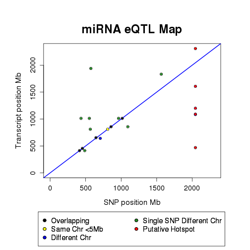
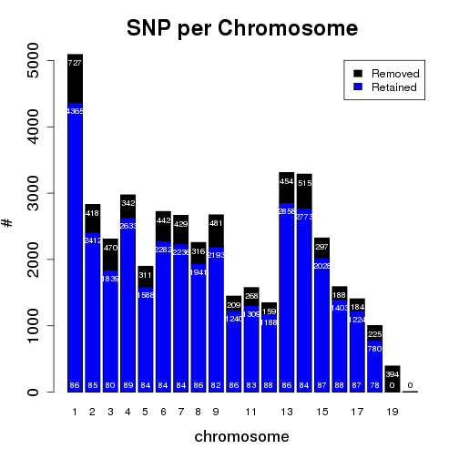

**Script: ** `3_mirna_eQTL_characterization.R`

**Directory of Code:**  `/mnt/research/ernstc_lab/miRNA_eQTL_Sscrofa11/5_gblup_gwa_eqtl/scripts`

**Date:**  `12/7/17`

**Input File Directory:**  

1. `/mnt/research/ernstc_lab/miRNA_eQTL_Sscrofa11/5_gblup_gwa_eqtl/`

2. `/mnt/research/pigeqtl/analyses/eQTL/paper/output/`

3. `/mnt/research/ernstc_lab/miRNA_eQTL_Sscrofa11/4_dge_G_objects`

**Input File(s):** 

1. `3_eqtl_summary_tables_maps.Rdata`

2. `MSUPRP_miRNA.Rdata`

3. `funct_eqtl.Rdata`

4. `6_mirna_precursor_annot_ssc11.Rdata`

**Output File Directory:** 

1. `/mnt/research/ernstc_lab/miRNA_eQTL_Sscrofa11/5_gblup_gwa_eqtl/`

2. `/mnt/research/ernstc_lab/miRNA_eQTL_Sscrofa11/6_mirna_eQTL_target_prediction/`

**Output File(s):** 

1. `1_mirna_names.txt`

2. `4_miRNA_eQTL_local_distant_regulators.Rdata`

**Table of contents:**

1. [Objectives](#objectives)
2. [Install libraries](#install-libraries)
3. [Load data](#load-data)
4. [Analysis](#analysis)
5. [Visualize](#visualize)
6. [Save data](#save-data)

## Objectives

The objective of this script is to characterize the miRNA eQTL results. This includes:

Using the summary file from the miRNA eQTL analysis determine the number of miRNA eQTL peaks
that have local regulation and distant regulation.

Looking only at the eQTL peaks on the same chromosome or overlapping with the mapped gene position check how many markers are before and after the gene position.

Create a data frame containing the results of the eQTL scan along with a column
specifying the eQTL regulator type, local (cis), distant (tran)

This analysis will be completed using functions created by DV in directory /mnt/research/pigeqtl/analyses/eQTL/paper/code/corrected-Z`

## Install libraries


```r
library(synbreed)
library(regress)
library(limma)
library(edgeR)
library(gwaR)
library(parallel)
library(qvalue)
```

## Load data


```r
rm(list=ls())
setwd("/mnt/research/ernstc_lab/miRNA_eQTL_Sscrofa11/5_gblup_gwa_eqtl/scripts")
```

Load DV's functions:


```r
load("/mnt/research/pigeqtl/analyses/eQTL/paper/output/funct_eqtl.Rdata")
```

Load the gwa results:


```r
load("../2_gwa_results.Rdata")
```

Load the miRNA eQTLsummary tables:


```r
load("../3_eqtl_summary_tables_maps.Rdata")
```

Load the MSUPRP_miRNA gpdata object for the mapping information:


```r
load("../../4_dge_G_objects/3_msuprp_mirna_gpdata.Rdata")
```

Load the miRNA annotation files to obtain info for miRNA eQTL with multiple precursors:


```r
load("../../4_dge_G_objects/6_mirna_precursor_annot_ssc11.Rdata")
```

Load the MSUPRP gpdata object:


```r
load("/mnt/research/ernstc_lab/RNAseq_ASE/SNP60K_Ss11/SNP60_Ss11_Map/MSUPRP_gpData_Ss11.Rdata")
ls()
```

```
##  [1] "absmap"               "absposmap"            "add_legend"          
##  [4] "AddPosGene"           "annotation"           "distance"            
##  [7] "fullsum.eqtl"         "inrange"              "manhpt"              
## [10] "map.full"             "mirpeaks"             "MSUPRP"              
## [13] "MSUPRP168"            "MSUPRP_miRNA"         "peakrng"             
## [16] "plot.GMA"             "rst.gwa"              "sigpval"             
## [19] "stb"                  "stb.nm"               "sum.eqtl"            
## [22] "summary_MSUPRP_miRNA" "tbpos"                "zstandard"
```

## Analysis
eQTL peaks


```r
head(sum.eqtl)
```

```
##             miRNA chr.miR start.miR  end.miR  mid.miR strand miRBase.ID
## 1   ssc-let-7d-5p       3  43468501 43468596 43468548      +  MI0022120
## 2      ssc-let-7g      13  34406135 34406222 34406178      -  MI0013087
## 3     ssc-miR-128      15  16273557 16273638 16273598      -  MI0002451
## 4 ssc-miR-1306-3p      14  51473918 51473997 51473958      +  MI0013148
## 5  ssc-miR-140-5p       6  17077517 17077610 17077564      -  MI0002437
## 6  ssc-miR-140-5p       6  17077517 17077610 17077564      -  MI0002437
##           SNP chr.snp   pos.snp snp.sign       pvalue       qvalue
## 1 MARC0093624      15 122218534        - 3.093005e-07 0.0112251325
## 2 MARC0093624      15 122218534        - 1.643296e-07 0.0059638506
## 3 ALGA0023517       4  15332045        + 1.204780e-06 0.0437238842
## 4 H3GA0034702      12  52402985        + 1.689468e-07 0.0061314188
## 5 ASGA0017748       4   7188213        - 1.146296e-06 0.0138671279
## 6 ALGA0117081       6  16973006        - 1.254506e-08 0.0004302663
```

```r
str(sum.eqtl)
```

```
## 'data.frame':	23 obs. of  13 variables:
##  $ miRNA     : chr  "ssc-let-7d-5p" "ssc-let-7g" "ssc-miR-128" "ssc-miR-1306-3p" ...
##  $ chr.miR   : num  3 13 15 14 6 6 19 7 7 7 ...
##  $ start.miR : num  43468501 34406135 16273557 51473918 17077517 ...
##  $ end.miR   : num  43468596 34406222 16273638 51473997 17077610 ...
##  $ mid.miR   : num  43468548 34406178 16273598 51473958 17077564 ...
##  $ strand    : chr  "+" "-" "-" "+" ...
##  $ miRBase.ID: chr  "MI0022120" "MI0013087" "MI0002451" "MI0013148" ...
##  $ SNP       : chr  "MARC0093624" "MARC0093624" "ALGA0023517" "H3GA0034702" ...
##  $ chr.snp   : chr  "15" "15" "4" "12" ...
##  $ pos.snp   : int  122218534 122218534 15332045 52402985 7188213 16973006 122218534 9463123 126505748 169927307 ...
##  $ snp.sign  : chr  "-" "-" "+" "+" ...
##  $ pvalue    : num  3.09e-07 1.64e-07 1.20e-06 1.69e-07 1.15e-06 ...
##  $ qvalue    : num  0.01123 0.00596 0.04372 0.00613 0.01387 ...
```

---

Separate the first column for use in the Target Prediction analysis, substituting the "ssc" for "hsa":


```r
hsamir<-data.frame(V1=unique(gsub("ssc-", "", sum.eqtl$miRNA)))
hsamir
```

```
##             V1
## 1    let-7d-5p
## 2       let-7g
## 3      miR-128
## 4  miR-1306-3p
## 5   miR-140-5p
## 6     miR-1468
## 7      miR-184
## 8     miR-190b
## 9   miR-345-3p
## 10     miR-429
## 11 miR-6782-3p
## 12 miR-7135-3p
## 13     miR-874
## 14      miR-95
## 15 miR-9785-5p
## 16 miR-9810-3p
## 17 miR-9843-3p
```

Save that table for use in target prediction analysis:


```r
write.table(hsamir, file="../../6_mirna_eQTL_target_prediction/1_mirna_names.txt", quote=FALSE, sep="\t", row.names=FALSE, col.names=FALSE)
```

---

eQTL peaks with unknown position


```r
as.character(sum.eqtl$miRNA[is.na(sum.eqtl$chr.miR)])
```

```
## [1] "ssc-miR-6782-3p" "ssc-miR-9785-5p"
```

Hotspots


```r
tail(sort(table(as.character(fullsum.eqtl$SNP))))
```

```
## 
## MARC0109723 MARC0114345 WUR10000071 H3GA0052416 MARC0027291 MARC0093624 
##           1           1           1           3           5           5
```

```r
mk <- table(as.character(fullsum.eqtl$SNP))

table(mk)
```

```
## mk
##   1   3   5 
## 302   1   2
```

Names of hotspot SNP (SNP associated with at least 4 miRNAs)


```r
nm <- names(mk[mk >= 4])
nm
```

```
## [1] "MARC0027291" "MARC0093624"
```

Check map positions of hotspot SNP:


```r
MSUPRP_miRNA$map[nm,]
```

```
##             chr       pos   snp
## MARC0027291  15 121872813 [T/C]
## MARC0093624  15 122218534 [T/C]
```

All my hotspot SNP are on chromosome 15; LD?


```r
abspos<-absposmap
abspos[nm]
```

```
## MARC0027291 MARC0093624 
##  2044864378  2045210099
```

Want to extract the miRNA information for each potential hotspot SNP


```r
htsp.mir<-list()
for(i in nm){
htsp.mir[[i]]<-fullsum.eqtl[grep(i, as.character(fullsum.eqtl$SNP)), c("miRNA", "chr.miR")]
}

htsp.mir
```

```
## $MARC0027291
##               miRNA chr.miR
## 1     ssc-let-7d-5p       3
## 3        ssc-let-7g      13
## 64   ssc-miR-345-3p       7
## 291      ssc-miR-95       8
## 313 ssc-miR-9843-3p       8
## 
## $MARC0093624
##               miRNA chr.miR
## 2     ssc-let-7d-5p       3
## 4        ssc-let-7g      13
## 10     ssc-miR-1468      19
## 293      ssc-miR-95       8
## 315 ssc-miR-9843-3p       8
```

Build a matrix of qvalues for all the miRNAs.

This will be used in plotting the eQTL map and determining local vs distal-acting miRNA eQTL


```r
sigmirqval<-do.call(cbind, lapply(unique(as.character(sum.eqtl$miRNA)), function(x) rst.gwa[rst.gwa$miRNA==x, "gwa.qval"]))

colnames(sigmirqval)<-unique(as.character(sum.eqtl$miRNA))
rownames(sigmirqval)<-rownames(MSUPRP_miRNA$map)
dim(sigmirqval)
```

```
## [1] 36292    17
```

```r
head(sigmirqval)
```

```
##             ssc-let-7d-5p ssc-let-7g ssc-miR-128 ssc-miR-1306-3p
## MARC0044150     0.9993967  0.9986615   0.9867537       0.9905657
## ASGA0000014     0.9993967  0.9986615   0.9968339       0.9730384
## H3GA0000026     0.9993967  0.9986615   0.9968339       0.9905657
## ASGA0000021     0.9993967  0.9986615   0.9867537       0.9905657
## ALGA0000009     0.9993967  0.9986615   0.9968339       0.9905657
## ALGA0000014     0.9993967  0.9986615   0.9968339       0.9905657
##             ssc-miR-140-5p ssc-miR-1468 ssc-miR-184 ssc-miR-190b
## MARC0044150      0.9831813     0.999012   0.9973142    0.9891956
## ASGA0000014      0.9954914     0.999012   0.9973142    0.9891956
## H3GA0000026      0.9831813     0.999012   0.9973142    0.9891956
## ASGA0000021      0.9831813     0.999012   0.9973142    0.9891956
## ALGA0000009      0.9831813     0.999012   0.9973142    0.9891956
## ALGA0000014      0.9831813     0.999012   0.9973142    0.9891956
##             ssc-miR-345-3p ssc-miR-429 ssc-miR-6782-3p ssc-miR-7135-3p
## MARC0044150      0.9711343   0.9995223       0.9992438       0.9992836
## ASGA0000014      0.9980259   0.9995223       0.9997279       0.9992836
## H3GA0000026      0.9980259   0.9995223       0.9992438       0.9992836
## ASGA0000021      0.9711343   0.9995223       0.9992438       0.9992836
## ALGA0000009      0.9980259   0.9995223       0.9992438       0.9992836
## ALGA0000014      0.9980259   0.9995223       0.9992438       0.9992836
##             ssc-miR-874 ssc-miR-95 ssc-miR-9785-5p ssc-miR-9810-3p
## MARC0044150   0.9998416  0.9982665       0.9995425       0.9943876
## ASGA0000014   0.9998416  0.9982665       0.9995425       0.9388891
## H3GA0000026   0.9998416  0.9982665       0.9995425       0.9933507
## ASGA0000021   0.9998416  0.9982665       0.9995425       0.9943876
## ALGA0000009   0.9998416  0.9982665       0.9995425       0.9933507
## ALGA0000014   0.9998416  0.9982665       0.9995425       0.9933507
##             ssc-miR-9843-3p
## MARC0044150       0.9495849
## ASGA0000014       0.9943139
## H3GA0000026       0.9943139
## ASGA0000021       0.9495849
## ALGA0000009       0.9943139
## ALGA0000014       0.9943139
```

```r
str(sigmirqval)
```

```
##  num [1:36292, 1:17] 0.999 0.999 0.999 0.999 0.999 ...
##  - attr(*, "dimnames")=List of 2
##   ..$ : chr [1:36292] "MARC0044150" "ASGA0000014" "H3GA0000026" "ASGA0000021" ...
##   ..$ : chr [1:17] "ssc-let-7d-5p" "ssc-let-7g" "ssc-miR-128" "ssc-miR-1306-3p" ...
```

Check for correctness in building this matrix:


```r
names(rst.gwa)
```

```
## [1] "miRNA"    "SNPid"    "gwa.ghat" "gwa.pval" "gwa.qval" "SNP.sign"
```

```r
head(rst.gwa)
```

```
##        miRNA       SNPid      gwa.ghat  gwa.pval  gwa.qval SNP.sign
## 1 ssc-let-7a MARC0044150 -8.141343e-04 0.5536644 0.9987386        -
## 2 ssc-let-7a ASGA0000014  9.309480e-05 0.9542821 0.9987386        +
## 3 ssc-let-7a H3GA0000026  8.022728e-05 0.9531063 0.9987386        +
## 4 ssc-let-7a ASGA0000021  8.141343e-04 0.5536644 0.9987386        +
## 5 ssc-let-7a ALGA0000009  8.022728e-05 0.9531063 0.9987386        +
## 6 ssc-let-7a ALGA0000014  8.022728e-05 0.9531063 0.9987386        +
```

Rownames didn't change between datasets:


```r
if (sum(unique(rst.gwa$SNPid)!=rownames(sigmirqval)) !=0) stop("Rownames changed between datasets")
```

Print the sum of the q-values not equal between the gwa results and the subset matrix:


```r
for (i in colnames(sigmirqval)){
	print(sum(rst.gwa[rst.gwa$miRNA==i,"gwa.qval"] != sigmirqval[,i]))
}
```

```
## [1] 0
## [1] 0
## [1] 0
## [1] 0
## [1] 0
## [1] 0
## [1] 0
## [1] 0
## [1] 0
## [1] 0
## [1] 0
## [1] 0
## [1] 0
## [1] 0
## [1] 0
## [1] 0
## [1] 0
```

Looks good.
Extract the q-values for 17 significant miRNA associations with hotspot SNPs:


```r
htsp.qv <- sigmirqval[nm,]
dim(htsp.qv)
```

```
## [1]  2 17
```

```r
head(htsp.qv)
```

```
##             ssc-let-7d-5p  ssc-let-7g ssc-miR-128 ssc-miR-1306-3p
## MARC0027291    0.02084592 0.048752328   0.9700828       0.9927744
## MARC0093624    0.01122513 0.005963851   0.9700828       0.9794198
##             ssc-miR-140-5p ssc-miR-1468 ssc-miR-184 ssc-miR-190b
## MARC0027291      0.9918069   0.12403684   0.9973142    0.9891956
## MARC0093624      0.9831813   0.02014524   0.9973142    0.9891956
##             ssc-miR-345-3p ssc-miR-429 ssc-miR-6782-3p ssc-miR-7135-3p
## MARC0027291     0.03581458   0.9995223       0.9992438       0.9992836
## MARC0093624     0.08073759   0.9995223       0.8807372       0.9992836
##             ssc-miR-874 ssc-miR-95 ssc-miR-9785-5p ssc-miR-9810-3p
## MARC0027291   0.9998416 0.04636241       0.9995425       0.9933507
## MARC0093624   0.9998416 0.04636241       0.9995425       0.9933507
##             ssc-miR-9843-3p
## MARC0027291     0.005757036
## MARC0093624     0.003225619
```

---

Table of positions for significant miRNA-marker associations within a hotspot using gene-wise FDR

tbpos = table of positions; takes the qvalues and absolute positions of hotspot SNPs & miRNAs (htsp.qv), 
and puts them into a table for use in the eQTL map function later on.


```r
threshold <- 0.05
```

ttp.htsp = table to plot. hotspot


```r
ttp.htsp <- tbpos(qval=htsp.qv, abspos=abspos, threshold=threshold)
dim(ttp.htsp)
```

```
## [1] 10  6
```

```r
ttp.htsp
```

```
##               Gene         SNP    pos.snp   pos.gene       diff
## 1    ssc-let-7d-5p MARC0027291 2044864378  469111363 1575753015
## 2    ssc-let-7d-5p MARC0093624 2045210099  469111363 1576098736
## 3       ssc-let-7g MARC0027291 2044864378 1607599735  437264643
## 4       ssc-let-7g MARC0093624 2045210099 1607599735  437610364
## 5     ssc-miR-1468 MARC0093624 2045210099 2309114795  263904696
## 6   ssc-miR-345-3p MARC0027291 2044864378 1085613121  959251257
## 7       ssc-miR-95 MARC0027291 2044864378 1089201828  955662550
## 8       ssc-miR-95 MARC0093624 2045210099 1089201828  956008271
## 9  ssc-miR-9843-3p MARC0027291 2044864378 1200281554  844582824
## 10 ssc-miR-9843-3p MARC0093624 2045210099 1200281554  844928545
##         qvalue
## 1  0.020845924
## 2  0.011225132
## 3  0.048752328
## 4  0.005963851
## 5  0.020145239
## 6  0.035814581
## 7  0.046362406
## 8  0.046362406
## 9  0.005757036
## 10 0.003225619
```

Table of positions for all gene-marker associations and for significant eQTL SNPs

Notice, it removed the miRNAs that don't have assembly information, miR-6782-3p and miR-9785-5p.

It can't add it to the eQTL map if it doesn't have mapping information. 


```r
ttp.all <- tbpos(qval=sigmirqval, abspos=abspos, threshold=threshold)
dim(ttp.all)
```

```
## [1] 294   6
```

```r
head(ttp.all)
```

```
##              Gene         SNP    pos.snp   pos.gene       diff      qvalue
## 1   ssc-let-7d-5p MARC0027291 2044864378  469111363 1575753015 0.020845924
## 2   ssc-let-7d-5p MARC0093624 2045210099  469111363 1576098736 0.011225132
## 3      ssc-let-7g MARC0027291 2044864378 1607599735  437264643 0.048752328
## 4      ssc-let-7g MARC0093624 2045210099 1607599735  437610364 0.005963851
## 5     ssc-miR-128 ALGA0023517  573675287 1939265163 1365589876 0.043723884
## 6 ssc-miR-1306-3p H3GA0034702 1564596885 1832773780  268176895 0.006131419
```

```r
table(as.character(ttp.all$Gene))
```

```
## 
##   ssc-let-7d-5p      ssc-let-7g     ssc-miR-128 ssc-miR-1306-3p 
##               2               2               1               1 
##  ssc-miR-140-5p    ssc-miR-1468     ssc-miR-184    ssc-miR-190b 
##               3               1              49               4 
##  ssc-miR-345-3p     ssc-miR-429 ssc-miR-7135-3p     ssc-miR-874 
##               2              91              14             116 
##      ssc-miR-95 ssc-miR-9810-3p ssc-miR-9843-3p 
##               3               2               3
```

Also lose 21 SNPs, which are the ones significantly associated to miR-6782-3p and miR-9785-5p:


```r
table(sigmirqval[,"ssc-miR-6782-3p"]<threshold)
```

```
## 
## FALSE  TRUE 
## 36288     4
```

```r
names(which(sigmirqval[,"ssc-miR-6782-3p"]<threshold))
```

```
## [1] "H3GA0029481" "ASGA0094215" "DIAS0000707" "H3GA0029745"
```

```r
table(as.character(ttp.all$SNP) %in% names(which(sigmirqval[,"ssc-miR-6782-3p"]<threshold)))
```

```
## 
## FALSE 
##   294
```

```r
table(sigmirqval[,"ssc-miR-9785-5p"]<threshold)
```

```
## 
## FALSE  TRUE 
## 36275    17
```

```r
names(which(sigmirqval[,"ssc-miR-9785-5p"]<threshold))
```

```
##  [1] "ASGA0013780" "DRGA0003812" "INRA0010427" "ASGA0013843" "ASGA0105049"
##  [6] "ALGA0123606" "ALGA0123533" "ASGA0099825" "MARC0075820" "ASGA0014023"
## [11] "ALGA0018363" "ALGA0118443" "MARC0063080" "MARC0058300" "ALGA0115191"
## [16] "ASGA0014219" "ALGA0121561"
```

```r
table(as.character(ttp.all$SNP) %in% names(which(sigmirqval[,"ssc-miR-9785-5p"]<threshold)))
```

```
## 
## FALSE 
##   294
```

Build a data.frame of the miRNA eQTL peak positions and their lengths


```r
ttp.peaks <- data.frame(miRNA=sum.eqtl[,"miRNA"], SNP=sum.eqtl[,"SNP"],
	pos.snp=abspos[as.character(sum.eqtl$SNP)],
	pos.miR=abspos[as.character(sum.eqtl$miRNA)],
	diff=abs(abspos[as.character(sum.eqtl$miRNA)] - abspos[as.character(sum.eqtl$SNP)]),
	qvalue=sum.eqtl[,"qvalue"])
head(ttp.peaks)
```

```
##             miRNA         SNP    pos.snp    pos.miR       diff
## 1   ssc-let-7d-5p MARC0093624 2045210099  469111363 1576098736
## 2      ssc-let-7g MARC0093624 2045210099 1607599735  437610364
## 3     ssc-miR-128 ALGA0023517  573675287 1939265163 1365589876
## 4 ssc-miR-1306-3p H3GA0034702 1564596885 1832773780  268176895
## 5  ssc-miR-140-5p ASGA0017748  565531455  810720748  245189293
## 6  ssc-miR-140-5p ALGA0117081  810616190  810720748     104558
##         qvalue
## 1 0.0112251325
## 2 0.0059638506
## 3 0.0437238842
## 4 0.0061314188
## 5 0.0138671279
## 6 0.0004302663
```

```r
ttp.peaks
```

```
##              miRNA         SNP    pos.snp    pos.miR       diff
## 1    ssc-let-7d-5p MARC0093624 2045210099  469111363 1576098736
## 2       ssc-let-7g MARC0093624 2045210099 1607599735  437610364
## 3      ssc-miR-128 ALGA0023517  573675287 1939265163 1365589876
## 4  ssc-miR-1306-3p H3GA0034702 1564596885 1832773780  268176895
## 5   ssc-miR-140-5p ASGA0017748  565531455  810720748  245189293
## 6   ssc-miR-140-5p ALGA0117081  810616190  810720748     104558
## 7     ssc-miR-1468 MARC0093624 2045210099 2309114795  263904696
## 8      ssc-miR-184 DBWU0000430  435105938 1012764421  577658483
## 9      ssc-miR-184 ASGA0016793  552148563 1012764421  460615858
## 10     ssc-miR-184 M1GA0026172  963570491 1012764421   49193930
## 11     ssc-miR-184 ASGA0034057 1015379296 1012764421    2614875
## 12    ssc-miR-190b ALGA0026452  645369434  653883889    8514455
## 13  ssc-miR-345-3p H3GA0052416 2044797821 1085613121  959184700
## 14     ssc-miR-429 ALGA0118516  857386394  857135145     251249
## 15     ssc-miR-429 ALGA0046283 1093342138  857135145  236206993
## 16 ssc-miR-6782-3p DIAS0000707 1389185572         NA         NA
## 17 ssc-miR-7135-3p ALGA0124095  454030998  454014796      16202
## 18     ssc-miR-874 ALGA0016550  414029120  413948022      81098
## 19     ssc-miR-874 ALGA0122273  486660285  413948022   72712263
## 20      ssc-miR-95 MARC0093624 2045210099 1089201828  956008271
## 21 ssc-miR-9785-5p ALGA0121561  432964185         NA         NA
## 22 ssc-miR-9810-3p ALGA0030853  705555892  641413652   64142240
## 23 ssc-miR-9843-3p MARC0093624 2045210099 1200281554  844928545
##          qvalue
## 1  1.122513e-02
## 2  5.963851e-03
## 3  4.372388e-02
## 4  6.131419e-03
## 5  1.386713e-02
## 6  4.302663e-04
## 7  2.014524e-02
## 8  4.137664e-02
## 9  4.159521e-02
## 10 1.423912e-02
## 11 1.996397e-07
## 12 1.700660e-02
## 13 3.581458e-02
## 14 5.359585e-06
## 15 3.101300e-02
## 16 1.549147e-04
## 17 1.172551e-02
## 18 2.874277e-09
## 19 2.064148e-02
## 20 4.636241e-02
## 21 3.693384e-02
## 22 3.269221e-02
## 23 3.225619e-03
```

Local eQTL (na.omit to remove the miRNA with no map position data)


```r
local <- na.omit(mirpeaks[mirpeaks$chr.miR == mirpeaks$chr.snp,])
dim(local)
```

```
## [1]  6 14
```

```r
local
```

```
##              miRNA chr.miR start.miR   end.miR range.miR miRBase.ID
## 6   ssc-miR-140-5p       6  17077517  17077610        93  MI0002437
## 11     ssc-miR-184       7  48345017  48345099        82  MI0002421
## 12    ssc-miR-190b       4  95540606  95540688        82  MI0017988
## 14     ssc-miR-429       6  63491921  63492001        80  MI0017991
## 17 ssc-miR-7135-3p       3  28371952  28372010        58  MI0023568
## 18     ssc-miR-874       2 139660118 139660201        83  MI0022157
##    chr.snp range.peak   min.pos   max.pos num.snp         SNP   pos.snp
## 6        6     389705  16583301  16973006       2 ALGA0117081  16973006
## 11       7   43229663  43560865  86790528      46 ASGA0034057  50959933
## 12       4   14432476  87026192 101458668       4 ALGA0026452  87026192
## 14       6   23594459  42970844  66565303      90 ALGA0118516  63743210
## 17       3     704850  27716152  28421002      14 ALGA0124095  28388183
## 18       2   21713538 127788285 149501823     115 ALGA0016550 139741258
##          qvalue
## 6  4.302663e-04
## 11 1.996397e-07
## 12 1.700660e-02
## 14 5.359585e-06
## 17 1.172551e-02
## 18 2.874277e-09
```

Distant eQTL (na.omit to remove the miRNA with no map position data)


```r
distant <- na.omit(mirpeaks[mirpeaks$chr.miR != mirpeaks$chr.snp,])
dim(distant)
```

```
## [1] 15 14
```

```r
distant
```

```
##              miRNA chr.miR start.miR   end.miR range.miR miRBase.ID
## 1    ssc-let-7d-5p       3  43468501  43468596        95  MI0022120
## 2       ssc-let-7g      13  34406135  34406222        87  MI0013087
## 3      ssc-miR-128      15  16273557  16273638        81  MI0002451
## 4  ssc-miR-1306-3p      14  51473918  51473997        79  MI0013148
## 5   ssc-miR-140-5p       6  17077517  17077610        93  MI0002437
## 7     ssc-miR-1468      19  50337088  50337170        82  MI0022160
## 8      ssc-miR-184       7  48345017  48345099        82  MI0002421
## 9      ssc-miR-184       7  48345017  48345099        82  MI0002421
## 10     ssc-miR-184       7  48345017  48345099        82  MI0002421
## 13  ssc-miR-345-3p       7 121193716 121193799        83  MI0013117
## 15     ssc-miR-429       6  63491921  63492001        80  MI0017991
## 19     ssc-miR-874       2 139660118 139660201        83  MI0022157
## 20      ssc-miR-95       8   3030934   3031014        80  MI0002436
## 22 ssc-miR-9810-3p       4  83070363  83070457        94  MI0031577
## 23 ssc-miR-9843-3p       8 114110660 114110740        80  MI0031612
##    chr.snp range.peak   min.pos   max.pos num.snp         SNP   pos.snp
## 1       15     345721 121872813 122218534       2 MARC0093624 122218534
## 2       15     345721 121872813 122218534       2 MARC0093624 122218534
## 3        4          0  15332045  15332045       1 ALGA0023517  15332045
## 4       12          0  52402985  52402985       1 H3GA0034702  52402985
## 5        4          0   7188213   7188213       1 ASGA0017748   7188213
## 7       15          0 122218534 122218534       1 MARC0093624 122218534
## 8        3          0   9463123   9463123       1 DBWU0000430   9463123
## 9        3          0 126505748 126505748       1 ASGA0016793 126505748
## 10       6          0 169927307 169927307       1 M1GA0026172 169927307
## 13      15      66557 121806256 121872813       2 H3GA0052416 121806256
## 15       8          0   7171284   7171284       1 ALGA0046283   7171284
## 19       3          0  61017470  61017470       1 ALGA0122273  61017470
## 20      15     412278 121806256 122218534       3 MARC0093624 122218534
## 22       5      76120  16314194  16390314       2 ALGA0030853  16390314
## 23      15     412278 121806256 122218534       3 MARC0093624 122218534
##         qvalue
## 1  0.011225132
## 2  0.005963851
## 3  0.043723884
## 4  0.006131419
## 5  0.013867128
## 7  0.020145239
## 8  0.041376640
## 9  0.041595207
## 10 0.014239117
## 13 0.035814581
## 15 0.031013003
## 19 0.020641476
## 20 0.046362406
## 22 0.032692213
## 23 0.003225619
```

Compute the distance between the mapped position of the gene expression and the position of the peak


```r
distancemir<-function(peaks){
    dist <- data.frame(start.min=peaks$start.miR - peaks$min.pos, max.end=peaks$max.pos - peaks$end.miR, diff=abs(peaks$pos.snp - ((peaks$end.miR + peaks$start.miR)/2)))
    return(dist)
}
```

Identify the local regulators:


```r
distL <- distancemir(local)
dim(distL)
```

```
## [1] 6 3
```

```r
distL
```

```
##   start.min  max.end      diff
## 1    494216  -104604  104557.5
## 2   4784152 38445429 2614875.0
## 3   8514414  5917980 8514455.0
## 4  20521077  3073302  251249.0
## 5    655800    48992   16202.0
## 6  11871833  9841622   81098.5
```

Make sure the correct amount of miRNAs are in the "distant" category (distD not used downstream):


```r
distD <- distancemir(distant)
dim(distD)
```

```
## [1] 15  3
```

```r
distD
```

```
##     start.min   max.end        diff
## 1   -78404312  78749938  78749985.5
## 2   -87466678  87812312  87812355.5
## 3      941512   -941593    941552.5
## 4     -929067    928988    929027.5
## 5     9889304  -9889397   9889350.5
## 6   -71881446  71881364  71881405.0
## 7    38881894 -38881976  38881935.0
## 8   -78160731  78160649  78160690.0
## 9  -121582290 121582208 121582249.0
## 10    -612540    679014    612498.5
## 11   56320637 -56320717  56320677.0
## 12   78642648 -78642731  78642689.5
## 13 -118775322 119187520 119187560.0
## 14   66756169 -66680143  66680096.0
## 15   -7695596   8107794   8107834.0
```

miRNA expression mapped within the eQTL peak


```r
cisI <- local[distL$start.min > 0 & distL$max.end > 0,]
nrow(cisI)
```

```
## [1] 5
```

```r
cisI
```

```
##              miRNA chr.miR start.miR   end.miR range.miR miRBase.ID
## 11     ssc-miR-184       7  48345017  48345099        82  MI0002421
## 12    ssc-miR-190b       4  95540606  95540688        82  MI0017988
## 14     ssc-miR-429       6  63491921  63492001        80  MI0017991
## 17 ssc-miR-7135-3p       3  28371952  28372010        58  MI0023568
## 18     ssc-miR-874       2 139660118 139660201        83  MI0022157
##    chr.snp range.peak   min.pos   max.pos num.snp         SNP   pos.snp
## 11       7   43229663  43560865  86790528      46 ASGA0034057  50959933
## 12       4   14432476  87026192 101458668       4 ALGA0026452  87026192
## 14       6   23594459  42970844  66565303      90 ALGA0118516  63743210
## 17       3     704850  27716152  28421002      14 ALGA0124095  28388183
## 18       2   21713538 127788285 149501823     115 ALGA0016550 139741258
##          qvalue
## 11 1.996397e-07
## 12 1.700660e-02
## 14 5.359585e-06
## 17 1.172551e-02
## 18 2.874277e-09
```

eQTL peak within the mapped position of the miRNA expression (only one marker within peak)


```r
cisII <- local[distL$start.min < 0 & distL$max.end < 0,]
nrow(cisII)
```

```
## [1] 0
```

miRNA expressions mapped in close proximity to the eQTL peak (less than 10MB)


```r
# miRNA maps to the right hand side of its peak
cisIIIa <- local[distL$start.min > 0 & distL$max.end < 0,]
cisIIIa <- data.frame(cisIIIa, dist=abs(ifelse(cisIIIa$max.pos - cisIIIa$start.miR < 0,
	cisIIIa$max.pos - cisIIIa$start.miR, cisIIIa$pos.snp - cisIIIa$start.miR)),
	contained=ifelse(cisIIIa$max.pos - cisIIIa$start.miR < 0, "No", "Yes"))
cisIIIa<-data.frame(cisIIIa,position=rep("right",nrow(cisIIIa)))
nrow(cisIIIa)
```

```
## [1] 1
```

```r
cisIIIa
```

```
##            miRNA chr.miR start.miR  end.miR range.miR miRBase.ID chr.snp
## 6 ssc-miR-140-5p       6  17077517 17077610        93  MI0002437       6
##   range.peak  min.pos  max.pos num.snp         SNP  pos.snp       qvalue
## 6     389705 16583301 16973006       2 ALGA0117081 16973006 0.0004302663
##     dist contained position
## 6 104511        No    right
```

```r
# miRNA maps to the left hand side of its peak
cisIIIb <- local[distL$start.min < 0 & distL$max.end > 0,]
cisIIIb <- data.frame(cisIIIb, dist=abs(ifelse(cisIIIb$end.miR - cisIIIb$min.pos < 0,
	cisIIIb$end.miR - cisIIIb$min.pos, cisIIIb$end.miR - cisIIIb$pos.snp)),
	contained=ifelse(cisIIIb$end.miR - cisIIIb$min.pos < 0, "No", "Yes"))
cisIIIb<-data.frame(cisIIIb,position=rep("left",nrow(cisIIIb)))
nrow(cisIIIb)
```

```
## [1] 0
```

miRNA overlapping peak region


```r
cisIII <- rbind(cisIIIa,cisIIIb)
cisIII <- cisIII[cisIII$contained == "Yes",]
nrow(cisIII)
```

```
## [1] 0
```

miRNAs on the same chromosome as peak


```r
cisIV <- rbind(cisIIIa,cisIIIb)
cisIV <- cisIV[!cisIV$contained == "Yes",]
nrow(cisIV)
```

```
## [1] 1
```

```r
cisIV
```

```
##            miRNA chr.miR start.miR  end.miR range.miR miRBase.ID chr.snp
## 6 ssc-miR-140-5p       6  17077517 17077610        93  MI0002437       6
##   range.peak  min.pos  max.pos num.snp         SNP  pos.snp       qvalue
## 6     389705 16583301 16973006       2 ALGA0117081 16973006 0.0004302663
##     dist contained position
## 6 104511        No    right
```

eQTL mapped less than 5Mb from miRNA


```r
idx <- abs(cisIV$dist) < 5e6
nrow(cisIV[idx,])
```

```
## [1] 1
```

```r
cisIV
```

```
##            miRNA chr.miR start.miR  end.miR range.miR miRBase.ID chr.snp
## 6 ssc-miR-140-5p       6  17077517 17077610        93  MI0002437       6
##   range.peak  min.pos  max.pos num.snp         SNP  pos.snp       qvalue
## 6     389705 16583301 16973006       2 ALGA0117081 16973006 0.0004302663
##     dist contained position
## 6 104511        No    right
```

eQTL mapped on same chromosome but at a distance greater than 5MB


```r
idx <- abs(cisIV$dist) > 5e6
nrow(cisIV[idx,])
```

```
## [1] 0
```

```r
tranI <- cisIV[idx,]
cisIV <- cisIV[!idx,]
tranI
```

```
##  [1] miRNA      chr.miR    start.miR  end.miR    range.miR  miRBase.ID
##  [7] chr.snp    range.peak min.pos    max.pos    num.snp    SNP       
## [13] pos.snp    qvalue     dist       contained  position  
## <0 rows> (or 0-length row.names)
```

eQTL mapped on a different chromosome than the mapped position of the miRNA expression


```r
tranII <- distant[distant$range.peak > 0 & distant$chr.miR %in% 1:19,]
nrow(tranII)
```

```
## [1] 6
```

```r
tranII
```

```
##              miRNA chr.miR start.miR   end.miR range.miR miRBase.ID
## 1    ssc-let-7d-5p       3  43468501  43468596        95  MI0022120
## 2       ssc-let-7g      13  34406135  34406222        87  MI0013087
## 13  ssc-miR-345-3p       7 121193716 121193799        83  MI0013117
## 20      ssc-miR-95       8   3030934   3031014        80  MI0002436
## 22 ssc-miR-9810-3p       4  83070363  83070457        94  MI0031577
## 23 ssc-miR-9843-3p       8 114110660 114110740        80  MI0031612
##    chr.snp range.peak   min.pos   max.pos num.snp         SNP   pos.snp
## 1       15     345721 121872813 122218534       2 MARC0093624 122218534
## 2       15     345721 121872813 122218534       2 MARC0093624 122218534
## 13      15      66557 121806256 121872813       2 H3GA0052416 121806256
## 20      15     412278 121806256 122218534       3 MARC0093624 122218534
## 22       5      76120  16314194  16390314       2 ALGA0030853  16390314
## 23      15     412278 121806256 122218534       3 MARC0093624 122218534
##         qvalue
## 1  0.011225132
## 2  0.005963851
## 13 0.035814581
## 20 0.046362406
## 22 0.032692213
## 23 0.003225619
```

eQTL mapped on a different chromosome than the mapped position of the miRNA expression but with only one marker in peak


```r
tranIII <- distant[distant$range.peak == 0 & distant$chr.miR %in% 1:19,]
nrow(tranIII)
```

```
## [1] 9
```

```r
tranIII
```

```
##              miRNA chr.miR start.miR   end.miR range.miR miRBase.ID
## 3      ssc-miR-128      15  16273557  16273638        81  MI0002451
## 4  ssc-miR-1306-3p      14  51473918  51473997        79  MI0013148
## 5   ssc-miR-140-5p       6  17077517  17077610        93  MI0002437
## 7     ssc-miR-1468      19  50337088  50337170        82  MI0022160
## 8      ssc-miR-184       7  48345017  48345099        82  MI0002421
## 9      ssc-miR-184       7  48345017  48345099        82  MI0002421
## 10     ssc-miR-184       7  48345017  48345099        82  MI0002421
## 15     ssc-miR-429       6  63491921  63492001        80  MI0017991
## 19     ssc-miR-874       2 139660118 139660201        83  MI0022157
##    chr.snp range.peak   min.pos   max.pos num.snp         SNP   pos.snp
## 3        4          0  15332045  15332045       1 ALGA0023517  15332045
## 4       12          0  52402985  52402985       1 H3GA0034702  52402985
## 5        4          0   7188213   7188213       1 ASGA0017748   7188213
## 7       15          0 122218534 122218534       1 MARC0093624 122218534
## 8        3          0   9463123   9463123       1 DBWU0000430   9463123
## 9        3          0 126505748 126505748       1 ASGA0016793 126505748
## 10       6          0 169927307 169927307       1 M1GA0026172 169927307
## 15       8          0   7171284   7171284       1 ALGA0046283   7171284
## 19       3          0  61017470  61017470       1 ALGA0122273  61017470
##         qvalue
## 3  0.043723884
## 4  0.006131419
## 5  0.013867128
## 7  0.020145239
## 8  0.041376640
## 9  0.041595207
## 10 0.014239117
## 15 0.031013003
## 19 0.020641476
```

---
 
Function to plot eQTL peaks


```r
plot.GMA <-
function (ttp, abspos, ...) {
    plot(ttp[,"pos.snp"],ttp[,"pos.miR"],ylim=c(min(abspos),
         max(abspos)),xlim=c(min(abspos),max(abspos)), pch=1,
         cex.main=2,cex.lab=1.3,
         cex.axis=1.2, ...)
    abline(0,1, col="blue", lwd=2)
}
```

eQTL Plot

Change map positions to Mb for mapping


```r
absposmb<-abspos/1e6
head(absposmb)
```

```
## MARC0044150 ASGA0000005 ASGA0000014 ASGA0000021 H3GA0000026 H3GA0000032 
##    0.205163    0.239523    0.261794    0.289363    0.309120    0.373626
```

```r
ttp.peaks$pos.snp<-ttp.peaks$pos.snp/1e6
ttp.peaks$pos.miR<-ttp.peaks$pos.miR/1e6
head(ttp.peaks)
```

```
##             miRNA         SNP   pos.snp   pos.miR       diff       qvalue
## 1   ssc-let-7d-5p MARC0093624 2045.2101  469.1114 1576098736 0.0112251325
## 2      ssc-let-7g MARC0093624 2045.2101 1607.5997  437610364 0.0059638506
## 3     ssc-miR-128 ALGA0023517  573.6753 1939.2652 1365589876 0.0437238842
## 4 ssc-miR-1306-3p H3GA0034702 1564.5969 1832.7738  268176895 0.0061314188
## 5  ssc-miR-140-5p ASGA0017748  565.5315  810.7207  245189293 0.0138671279
## 6  ssc-miR-140-5p ALGA0117081  810.6162  810.7207     104558 0.0004302663
```

```r
dim(ttp.peaks)
```

```
## [1] 23  6
```

```r
par(oma=c(5,2,2,2))
plot.GMA(ttp=ttp.peaks, abspos=absposmb, xlab="SNP position Mb",
		ylab="Transcript position Mb", main="miRNA eQTL Map")

# miRNA expression mapped within the eQTL peak
points(ttp.peaks[match(cisI$SNP,as.character(ttp.peaks$SNP)),"pos.snp"],
	ttp.peaks[match(cisI$SNP,as.character(ttp.peaks$SNP)),"pos.miR"],
	col="black", pch=20)

# miRNAs on the same chromosome as peak
points(ttp.peaks[match(cisIV$SNP,as.character(ttp.peaks$SNP)),"pos.snp"],
	ttp.peaks[match(cisIV$SNP,as.character(ttp.peaks$SNP)),"pos.miR"],
	col="yellow", pch=20)

# miR-eQTL mapped on a different chromosome than the mapped position of the miRNA expression (> 1 SNP in peak)
points(ttp.peaks[match(tranII$miRNA,as.character(ttp.peaks$miRNA)),"pos.snp"], ttp.peaks[match(tranII$miRNA, as.character(ttp.peaks$miRNA)),"pos.miR"],
	col="blue", pch=20)

# miR-eQTL mapped on a different chromosome than the mapped position of the miRNA expression but with only one marker in peak
points(ttp.peaks[match(tranIII$SNP,as.character(ttp.peaks$SNP)),"pos.snp"], ttp.peaks[match(tranIII$SNP,as.character(ttp.peaks$SNP)),"pos.miR"],
	col="forestgreen", pch=20)

# Putative hotspot SNP
points(ttp.peaks[as.character(ttp.peaks$SNP) %in% nm,"pos.snp"], ttp.peaks[as.character(ttp.peaks$SNP) %in% nm,"pos.miR"],
	col="red", pch=20)


add_legend(-0.75,-0.75, legend=c("Overlapping", "Same Chr <5Mb",
	"Different Chr", "Single SNP Different Chr", "Putative Hotspot"),
	pch=c(19,19,19,19,19), bty="o",ncol=2, cex=1.2)
	add_legend(-0.75,-0.75, legend=c("Overlapping", "Same Chr <5Mb",
	"Different Chr", "Single SNP Different Chr", "Putative Hotspot"),
	pch=c(20,20,20,20,20), col=c("black", "yellow",
	"blue", "forestgreen", "red"), bty="n",ncol=2, cex=1.2)
```



Save maps for markers_around_peaks.R analysis

Complete map (unfiltered SNPs; X=19, Y=20)


```r
comp.snp.map <- MSUPRP$map
comp.snp.map$chr<-as.character(comp.snp.map$chr)
comp.snp.map$chr<-gsub("X", "19", comp.snp.map$chr)
comp.snp.map$chr<-gsub("Y", "20", comp.snp.map$chr)

dim(comp.snp.map)
```

```
## [1] 43130     3
```

```r
table(comp.snp.map$chr)
```

```
## 
##    1   10   11   12   13   14   15   16   17   18   19    2   20    3    4 
## 5092 1449 1577 1347 3312 3288 2325 1591 1408 1005  394 2830    9 2309 2975 
##    5    6    7    8    9 
## 1899 2724 2665 2257 2674
```

Reduced map (SNPs used in this eQTL analysis)


```r
snp.map <- MSUPRP_miRNA$map
snp.map$chr<-as.character(snp.map$chr)
dim(snp.map)
```

```
## [1] 36292     3
```

```r
head(snp.map)
```

```
##             chr    pos   snp
## MARC0044150   1 205163 [A/G]
## ASGA0000014   1 261794 [A/C]
## H3GA0000026   1 309120 [A/G]
## ASGA0000021   1 289363 [A/C]
## ALGA0000009   1 408640 [T/C]
## ALGA0000014   1 381075 [T/C]
```

```r
table(snp.map$chr)
```

```
## 
##    1   10   11   12   13   14   15   16   17   18    2    3    4    5    6 
## 4365 1240 1309 1188 2858 2773 2028 1403 1224  780 2412 1839 2633 1588 2282 
##    7    8    9 
## 2236 1941 2193
```

Change the scale of the snp position to Mb


```r
snp.map$pos <- snp.map$pos /1e6
comp.snp.map$pos <- comp.snp.map$pos /1e6
```

----

Looking only at the eQTL peaks on the same chromosome or overlapping with the mapped gene position check how many markers are before and after the gene position.

Number of snp per chromosome


```r
# Complete map
nsnpall <- c(table(as.numeric(comp.snp.map[,"chr"])))
nsnpall
```

```
##    1    2    3    4    5    6    7    8    9   10   11   12   13   14   15 
## 5092 2830 2309 2975 1899 2724 2665 2257 2674 1449 1577 1347 3312 3288 2325 
##   16   17   18   19   20 
## 1591 1408 1005  394    9
```

```r
# Filtered map
nsnpred <- c(table(as.numeric(snp.map[,"chr"])),0,0)
names(nsnpred) <- 1:20
nsnpred
```

```
##    1    2    3    4    5    6    7    8    9   10   11   12   13   14   15 
## 4365 2412 1839 2633 1588 2282 2236 1941 2193 1240 1309 1188 2858 2773 2028 
##   16   17   18   19   20 
## 1403 1224  780    0    0
```

```r
# Percent
perc <- round(nsnpred / nsnpall * 100)
perc
```

```
##  1  2  3  4  5  6  7  8  9 10 11 12 13 14 15 16 17 18 19 20 
## 86 85 80 89 84 84 84 86 82 86 83 88 86 84 87 88 87 78  0  0
```

Plot number of snp per chromosome


```r
# + snpmap, fig.align='center', fig.width=16, fig.height=12
nsnp <- rbind(nsnpred, nsnpall=nsnpall - nsnpred)
bp <- barplot(nsnp, col=c("blue","black"), ylim=c(0,max(nsnpall)+10),
	main="SNP per Chromosome", xlab="chromosome", ylab="#", cex.main=2,
	cex.axis=1.5, cex.lab=1.5, legend=c("Retained", "Removed"))
text(bp, nsnp[1,]-130, labels=nsnp[1,], col="white", cex=0.75)
text(bp, colSums(nsnp)-130, labels=nsnp[2,], col="white", cex=0.75)
text(bp[1:19], 100, labels=perc[1:19], col="white", cex=0.75)
text(bp[20], 100, labels=perc[20], col="black", cex=0.75)
```



Check the position of miR-140-5p eQTL that is potentially local-acting:


```r
mirpeaks[mirpeaks$miRNA=="ssc-miR-140-5p",]
```

```
##            miRNA chr.miR start.miR  end.miR range.miR miRBase.ID chr.snp
## 5 ssc-miR-140-5p       6  17077517 17077610        93  MI0002437       4
## 6 ssc-miR-140-5p       6  17077517 17077610        93  MI0002437       6
##   range.peak  min.pos  max.pos num.snp         SNP  pos.snp       qvalue
## 5          0  7188213  7188213       1 ASGA0017748  7188213 0.0138671279
## 6     389705 16583301 16973006       2 ALGA0117081 16973006 0.0004302663
```

```r
mirpeaks[mirpeaks$miRNA=="ssc-miR-140-5p","max.pos"]<mirpeaks[mirpeaks$miRNA=="ssc-miR-140-5p","start.miR"]
```

```
## [1] TRUE TRUE
```

The SNPs in the peak end before the miRNA transcript starts. 
Check how many SNPs lie between the end of the eQTL peak and the start of the miRNA:


```r
mirpeaks[6,"max.pos"]
```

```
## [1] 16973006
```

```r
mirpeaks[6,"start.miR"]
```

```
## [1] 17077517
```

```r
mirpeaks[6,"start.miR"]-mirpeaks[6,"max.pos"]
```

```
## [1] 104511
```

```r
map.full["ssc-miR-140-5p",]
```

```
##                chr      pos
## ssc-miR-140-5p   6 17077564
```

```r
map.full["ALGA0117081",]
```

```
##             chr      pos
## ALGA0117081   6 16973006
```

```r
ssc6<-map.full[map.full$chr=="6",]
dim(ssc6)
```

```
## [1] 2286    2
```

```r
ssc6<-ssc6[-c(2283, 2284, 2285, 2286),]
ssc6<-ssc6[order(ssc6$pos),]

ssc6[ssc6$pos>mirpeaks[6,"max.pos"] & ssc6$pos<mirpeaks[6,"start.miR"],]
```

```
##             chr      pos
## ASGA0102265   6 16981769
## MARC0033972   6 16988486
```

```r
ssc6[310:330,]
```

```
##             chr      pos
## MARC0068796   6 16798605
## ALGA0034653   6 16810825
## ALGA0034650   6 16834986
## ASGA0101603   6 16854564
## MARC0029800   6 16945017
## ALGA0117081   6 16973006
## ASGA0102265   6 16981769
## MARC0033972   6 16988486
## CASI0009615   6 17234295
## DIAS0001800   6 17315441
## DRGA0006522   6 17377003
## ASGA0027678   6 17443835
## ALGA0034669   6 17459517
## MARC0046484   6 17488557
## MARC0009254   6 17502570
## MARC0022388   6 17527735
## ASGA0105179   6 17535028
## ASGA0102674   6 17580878
## MARC0031004   6 17729820
## ALGA0118254   6 17785071
## ALGA0104373   6 17795768
```

So only two SNPs lie between the miRNA and the eQTL peak, covering 100kb of the genome. 


```r
mirpeaks[6,"start.miR"]-mirpeaks[6,"max.pos"]
```

```
## [1] 104511
```


Investigate correlation of genotypes between the SNPs between the miR-eQTL and the miRNA:


```r
snp.btwn<- c("ASGA0102265", "MARC0033972", "ALGA0117081")
```

Examine allele frequencies of the hotspot SNPs

Remember that all the animals with ID bigger than 6000 are F0 and smaller than 1000 are F1, thus remove those animals to retain the F2s:


```r
geno_f2<-MSUPRP$geno[!((as.numeric(rownames(MSUPRP$geno))<=1000) | (as.numeric(rownames(MSUPRP$geno))>=6000)),]
dim(geno_f2)
```

```
## [1]   940 43130
```

Subset the hotspot SNPs:


```r
geno.btwn<-geno_f2[,snp.btwn]
dim(geno.btwn)
```

```
## [1] 940   3
```

Subset the 174 animals:


```r
geno.btwn<-geno.btwn[rownames(MSUPRP_miRNA$geno),]
dim(geno.btwn)
```

```
## [1] 174   3
```

```r
head(geno.btwn)
```

```
##      ASGA0102265 MARC0033972 ALGA0117081
## 1034           0           0           0
## 1036           0           0           1
## 1041           0           1           2
## 1049           0           0           0
## 1058           0           1           1
## 1060           0           0           0
```

```r
if(sum(rownames(geno.btwn)!=rownames(MSUPRP_miRNA$geno)) != 0) stop ("Animal IDs not correct for genotype object")

geno.cor<-cor(geno.btwn)
geno.cor
```

```
##             ASGA0102265 MARC0033972 ALGA0117081
## ASGA0102265   1.0000000   0.4115186   0.4821530
## MARC0033972   0.4115186   1.0000000   0.7978528
## ALGA0117081   0.4821530   0.7978528   1.0000000
```

```r
dim(rst.gwa)
```

```
## [1] 10706140        6
```

```r
head(rst.gwa)
```

```
##        miRNA       SNPid      gwa.ghat  gwa.pval  gwa.qval SNP.sign
## 1 ssc-let-7a MARC0044150 -8.141343e-04 0.5536644 0.9987386        -
## 2 ssc-let-7a ASGA0000014  9.309480e-05 0.9542821 0.9987386        +
## 3 ssc-let-7a H3GA0000026  8.022728e-05 0.9531063 0.9987386        +
## 4 ssc-let-7a ASGA0000021  8.141343e-04 0.5536644 0.9987386        +
## 5 ssc-let-7a ALGA0000009  8.022728e-05 0.9531063 0.9987386        +
## 6 ssc-let-7a ALGA0000014  8.022728e-05 0.9531063 0.9987386        +
```

```r
mir1405p<-rst.gwa[rst.gwa$miRNA=="ssc-miR-140-5p",] 
dim(mir1405p)
```

```
## [1] 36292     6
```

```r
mir1405p[mir1405p$SNPid=="ASGA0102265",]
```

```
##                  miRNA       SNPid    gwa.ghat    gwa.pval  gwa.qval
## 1791457 ssc-miR-140-5p ASGA0102265 -0.01881679 0.005448978 0.8238806
##         SNP.sign
## 1791457        -
```

```r
mir1405p[mir1405p$SNPid=="MARC0033972",]
```

```
##                  miRNA       SNPid    gwa.ghat     gwa.pval gwa.qval
## 1791458 ssc-miR-140-5p MARC0033972 -0.02539888 0.0003470683 0.320085
##         SNP.sign
## 1791458        -
```

```r
mir1405p[mir1405p$SNPid=="ALGA0117081",]
```

```
##                  miRNA       SNPid    gwa.ghat     gwa.pval     gwa.qval
## 1791456 ssc-miR-140-5p ALGA0117081 -0.03993451 1.254506e-08 0.0004302663
##         SNP.sign
## 1791456        -
```

--------

Classify eQTL Peaks

Local eQTL (same chr)


```r
cis <- rbind(cisI, cisII, cisIII[cisIII$contained == "Yes",1:13])
cis$miRNA <- as.character(cis$miRNA)
cis$SNP <- as.character(cis$SNP)
nrow(cis)
```

```
## [1] 5
```

```r
cisIII <- cisIII[!cisIII$contained == "Yes",]
cisIII
```

```
##  [1] miRNA      chr.miR    start.miR  end.miR    range.miR  miRBase.ID
##  [7] chr.snp    range.peak min.pos    max.pos    num.snp    SNP       
## [13] pos.snp    qvalue     dist       contained  position  
## <0 rows> (or 0-length row.names)
```

```r
cis <- data.frame(cis, regulator=rep("cis", nrow(cis)))
cis
```

```
##              miRNA chr.miR start.miR   end.miR range.miR miRBase.ID
## 11     ssc-miR-184       7  48345017  48345099        82  MI0002421
## 12    ssc-miR-190b       4  95540606  95540688        82  MI0017988
## 14     ssc-miR-429       6  63491921  63492001        80  MI0017991
## 17 ssc-miR-7135-3p       3  28371952  28372010        58  MI0023568
## 18     ssc-miR-874       2 139660118 139660201        83  MI0022157
##    chr.snp range.peak   min.pos   max.pos num.snp         SNP   pos.snp
## 11       7   43229663  43560865  86790528      46 ASGA0034057  50959933
## 12       4   14432476  87026192 101458668       4 ALGA0026452  87026192
## 14       6   23594459  42970844  66565303      90 ALGA0118516  63743210
## 17       3     704850  27716152  28421002      14 ALGA0124095  28388183
## 18       2   21713538 127788285 149501823     115 ALGA0016550 139741258
##          qvalue regulator
## 11 1.996397e-07       cis
## 12 1.700660e-02       cis
## 14 5.359585e-06       cis
## 17 1.172551e-02       cis
## 18 2.874277e-09       cis
```

Distant eQTL


```r
# Same chromosome, < 5Mb
transc<-cisIV[,1:14]
# Different chromosome
tran <- rbind(transc, tranII, tranIII)
tran$miRNA <- as.character(tran$miRNA)
tran$SNP <- as.character(tran$SNP)
nrow(tran)
```

```
## [1] 16
```

```r
tran <- data.frame(tran, regulator=c("transc.5Mb",rep("tran", nrow(tran)-1)))
tran
```

```
##              miRNA chr.miR start.miR   end.miR range.miR miRBase.ID
## 6   ssc-miR-140-5p       6  17077517  17077610        93  MI0002437
## 1    ssc-let-7d-5p       3  43468501  43468596        95  MI0022120
## 2       ssc-let-7g      13  34406135  34406222        87  MI0013087
## 13  ssc-miR-345-3p       7 121193716 121193799        83  MI0013117
## 20      ssc-miR-95       8   3030934   3031014        80  MI0002436
## 22 ssc-miR-9810-3p       4  83070363  83070457        94  MI0031577
## 23 ssc-miR-9843-3p       8 114110660 114110740        80  MI0031612
## 3      ssc-miR-128      15  16273557  16273638        81  MI0002451
## 4  ssc-miR-1306-3p      14  51473918  51473997        79  MI0013148
## 5   ssc-miR-140-5p       6  17077517  17077610        93  MI0002437
## 7     ssc-miR-1468      19  50337088  50337170        82  MI0022160
## 8      ssc-miR-184       7  48345017  48345099        82  MI0002421
## 9      ssc-miR-184       7  48345017  48345099        82  MI0002421
## 10     ssc-miR-184       7  48345017  48345099        82  MI0002421
## 15     ssc-miR-429       6  63491921  63492001        80  MI0017991
## 19     ssc-miR-874       2 139660118 139660201        83  MI0022157
##    chr.snp range.peak   min.pos   max.pos num.snp         SNP   pos.snp
## 6        6     389705  16583301  16973006       2 ALGA0117081  16973006
## 1       15     345721 121872813 122218534       2 MARC0093624 122218534
## 2       15     345721 121872813 122218534       2 MARC0093624 122218534
## 13      15      66557 121806256 121872813       2 H3GA0052416 121806256
## 20      15     412278 121806256 122218534       3 MARC0093624 122218534
## 22       5      76120  16314194  16390314       2 ALGA0030853  16390314
## 23      15     412278 121806256 122218534       3 MARC0093624 122218534
## 3        4          0  15332045  15332045       1 ALGA0023517  15332045
## 4       12          0  52402985  52402985       1 H3GA0034702  52402985
## 5        4          0   7188213   7188213       1 ASGA0017748   7188213
## 7       15          0 122218534 122218534       1 MARC0093624 122218534
## 8        3          0   9463123   9463123       1 DBWU0000430   9463123
## 9        3          0 126505748 126505748       1 ASGA0016793 126505748
## 10       6          0 169927307 169927307       1 M1GA0026172 169927307
## 15       8          0   7171284   7171284       1 ALGA0046283   7171284
## 19       3          0  61017470  61017470       1 ALGA0122273  61017470
##          qvalue  regulator
## 6  0.0004302663 transc.5Mb
## 1  0.0112251325       tran
## 2  0.0059638506       tran
## 13 0.0358145813       tran
## 20 0.0463624059       tran
## 22 0.0326922130       tran
## 23 0.0032256190       tran
## 3  0.0437238842       tran
## 4  0.0061314188       tran
## 5  0.0138671279       tran
## 7  0.0201452391       tran
## 8  0.0413766403       tran
## 9  0.0415952075       tran
## 10 0.0142391174       tran
## 15 0.0310130026       tran
## 19 0.0206414757       tran
```

```r
regul <- rbind(cis, tran)
rownames(regul) <- NULL
```

Add eQTL peaks lacking assembly information:


```r
regul <- rbind(regul, data.frame(mirpeaks[!mirpeaks$miRNA %in% regul$miRNA,],
	regulator=rep(NA, sum(!mirpeaks$miRNA %in% regul$miRNA))))
regul
```

```
##               miRNA chr.miR start.miR   end.miR range.miR miRBase.ID
## 1       ssc-miR-184       7  48345017  48345099        82  MI0002421
## 2      ssc-miR-190b       4  95540606  95540688        82  MI0017988
## 3       ssc-miR-429       6  63491921  63492001        80  MI0017991
## 4   ssc-miR-7135-3p       3  28371952  28372010        58  MI0023568
## 5       ssc-miR-874       2 139660118 139660201        83  MI0022157
## 6    ssc-miR-140-5p       6  17077517  17077610        93  MI0002437
## 7     ssc-let-7d-5p       3  43468501  43468596        95  MI0022120
## 8        ssc-let-7g      13  34406135  34406222        87  MI0013087
## 9    ssc-miR-345-3p       7 121193716 121193799        83  MI0013117
## 10       ssc-miR-95       8   3030934   3031014        80  MI0002436
## 11  ssc-miR-9810-3p       4  83070363  83070457        94  MI0031577
## 12  ssc-miR-9843-3p       8 114110660 114110740        80  MI0031612
## 13      ssc-miR-128      15  16273557  16273638        81  MI0002451
## 14  ssc-miR-1306-3p      14  51473918  51473997        79  MI0013148
## 15   ssc-miR-140-5p       6  17077517  17077610        93  MI0002437
## 16     ssc-miR-1468      19  50337088  50337170        82  MI0022160
## 17      ssc-miR-184       7  48345017  48345099        82  MI0002421
## 18      ssc-miR-184       7  48345017  48345099        82  MI0002421
## 19      ssc-miR-184       7  48345017  48345099        82  MI0002421
## 20      ssc-miR-429       6  63491921  63492001        80  MI0017991
## 21      ssc-miR-874       2 139660118 139660201        83  MI0022157
## 161 ssc-miR-6782-3p      NA        NA        NA        NA  MI0031620
## 211 ssc-miR-9785-5p      NA        NA        NA        NA  MI0031545
##     chr.snp range.peak   min.pos   max.pos num.snp         SNP   pos.snp
## 1         7   43229663  43560865  86790528      46 ASGA0034057  50959933
## 2         4   14432476  87026192 101458668       4 ALGA0026452  87026192
## 3         6   23594459  42970844  66565303      90 ALGA0118516  63743210
## 4         3     704850  27716152  28421002      14 ALGA0124095  28388183
## 5         2   21713538 127788285 149501823     115 ALGA0016550 139741258
## 6         6     389705  16583301  16973006       2 ALGA0117081  16973006
## 7        15     345721 121872813 122218534       2 MARC0093624 122218534
## 8        15     345721 121872813 122218534       2 MARC0093624 122218534
## 9        15      66557 121806256 121872813       2 H3GA0052416 121806256
## 10       15     412278 121806256 122218534       3 MARC0093624 122218534
## 11        5      76120  16314194  16390314       2 ALGA0030853  16390314
## 12       15     412278 121806256 122218534       3 MARC0093624 122218534
## 13        4          0  15332045  15332045       1 ALGA0023517  15332045
## 14       12          0  52402985  52402985       1 H3GA0034702  52402985
## 15        4          0   7188213   7188213       1 ASGA0017748   7188213
## 16       15          0 122218534 122218534       1 MARC0093624 122218534
## 17        3          0   9463123   9463123       1 DBWU0000430   9463123
## 18        3          0 126505748 126505748       1 ASGA0016793 126505748
## 19        6          0 169927307 169927307       1 M1GA0026172 169927307
## 20        8          0   7171284   7171284       1 ALGA0046283   7171284
## 21        3          0  61017470  61017470       1 ALGA0122273  61017470
## 161      10    9750125  18022870  27772995       4 DIAS0000707  24871779
## 211       3   27074955   7321370  34396325      17 ALGA0121561   7321370
##           qvalue  regulator
## 1   1.996397e-07        cis
## 2   1.700660e-02        cis
## 3   5.359585e-06        cis
## 4   1.172551e-02        cis
## 5   2.874277e-09        cis
## 6   4.302663e-04 transc.5Mb
## 7   1.122513e-02       tran
## 8   5.963851e-03       tran
## 9   3.581458e-02       tran
## 10  4.636241e-02       tran
## 11  3.269221e-02       tran
## 12  3.225619e-03       tran
## 13  4.372388e-02       tran
## 14  6.131419e-03       tran
## 15  1.386713e-02       tran
## 16  2.014524e-02       tran
## 17  4.137664e-02       tran
## 18  4.159521e-02       tran
## 19  1.423912e-02       tran
## 20  3.101300e-02       tran
## 21  2.064148e-02       tran
## 161 1.549147e-04       <NA>
## 211 3.693384e-02       <NA>
```

eQTL plot with updated classifications:


```r
par(oma=c(5,2,2,2))
plot.GMA(ttp=ttp.peaks, abspos=absposmb, xlab="SNP position Mb",
		ylab="Transcript position Mb")

points(ttp.peaks[rownames(cis),"pos.snp"],
	ttp.peaks[rownames(cis),"pos.miR"], pch=20, col="white")

points(ttp.peaks[rownames(tran),"pos.snp"], ttp.peaks[rownames(tran),"pos.miR"],
	col="forestgreen", pch=20)

add_legend(-.25,-0.75,legend=c("Local",
	"Distant"),
	pch=c(1,1), bty="o",ncol=2, cex=1.2)
	add_legend(-0.25, -0.75,legend=c("Local",
	"Distant"),
	pch=c(1,19), 
	col=c("black","forestgreen"), bty="n",ncol=2, cex=1.2)
```


## Save data

Save the data frame containing all the regulators, defining them as cis or trans (local or distant)


```r
save(regul, file="../4_miRNA_eQTL_local_distal_regulators.Rdata")
```

