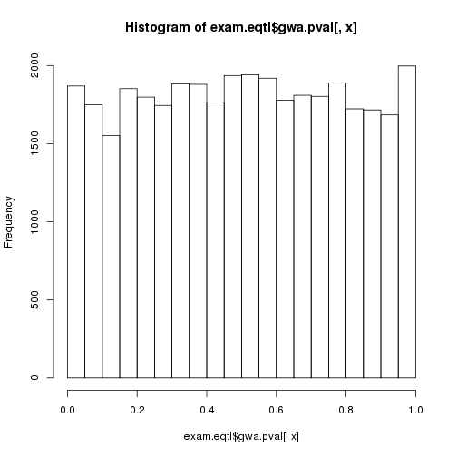
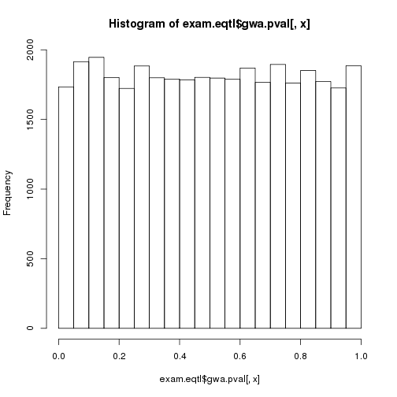

**Script:** `5_mirna_eqtl_examine_peaks.R`

**Directory of Code:**  `/mnt/research/ernstc_lab/miRNA_eQTL_Sscrofa11/5_gblup_gwa_eqtl/scripts`

**Date:**  `12/11/17`

**Input File Directory:**  

1. `/mnt/research/ernstc_lab/miRNA_eQTL_Sscrofa11/5_gblup_gwa_eqtl/`

2. `/mnt/research/ernstc_lab/miRNA_eQTL_Sscrofa11/4_dge_G_objects/`

**Input File(s):** 

1. `2_gwa_results.Rdata`, `3_eqtl_summary_tables_maps.Rdata`

2. `6_mirna_precursor_annot_ssc11.Rdata`, `3_msuprp_mirna_gpdata.Rdata`, `4_normalized_dge_voom.Rdata`, `5_Z_G_miRNA.Rdata`

**Output File Directory:** 

1. `/mnt/research/ernstc_lab/miRNA_eQTL_Sscrofa11/5_gblup_gwa_eqtl/`

**Output File(s):** 

1. `7_exam_eqtl_peaks_fix_snps.Rdata`

**Table of contents:**

1. [Objectives](#objectives)
2. [Install libraries](#install-libraries)
3. [Load data](#load-data)
4. [Analysis](#analysis)
5. [Visualize](#visualize)
6. [Save data](#save-data)

## Objectives

For each of the significant miRNA eQTL peaks identifyed in the miRNA eQTL scan this code will:

1. Compute the variance explained by the markers +/- 1Mb surrounding eQTL peaks significanly associated to the miRNA expression in question

2. Test the significance of the variance accounted for by the markers in these regions associated to the miRNA expression

3. Fit the top significant marker per miRNA eQTL peak (by p-value) as a covariate in the model

4. Observe resulting peaks (if any) after fixing the top significant SNP (p-value) per eQTL peak

## Install libraries


```r
rm(list=ls())

setwd("/mnt/research/ernstc_lab/miRNA_eQTL_Sscrofa11/5_gblup_gwa_eqtl/scripts")

library(regress)
library (limma)
library (edgeR)
library(gwaR)
library(parallel)
library(qvalue)
library(corrplot)
```

```
## corrplot 0.84 loaded
```

## Load data

Load DV's eqtl functions:


```r
load("/mnt/research/pigeqtl/analyses/eQTL/paper/output/funct_eqtl.Rdata")
```

Load required data:


```r
load("../2_gwa_results.Rdata")
load("../3_eqtl_summary_tables_maps.Rdata")
load("../../4_dge_G_objects/6_mirna_precursor_annot_ssc11.Rdata")
load("../../4_dge_G_objects/3_msuprp_mirna_gpdata.Rdata")
load("../../4_dge_G_objects/4_normalized_dge_voom.Rdata")
load("../../4_dge_G_objects/5_Z_G_miRNA.Rdata")

ls()
```

```
##  [1] "absmap"               "absposmap"            "add_legend"          
##  [4] "AddPosGene"           "annotation"           "dge"                 
##  [7] "distance"             "fullsum.eqtl"         "G"                   
## [10] "inrange"              "manhpt"               "map.full"            
## [13] "mirpeaks"             "MSUPRP_miRNA"         "peakrng"             
## [16] "plot.GMA"             "rst.gwa"              "sigpval"             
## [19] "stb"                  "stb.nm"               "sum.eqtl"            
## [22] "summary_MSUPRP_miRNA" "tbpos"                "v"                   
## [25] "wtcen"                "Z"                    "zstandard"
```

## Analysis

Create covariates for analysis:


```r
X <- data.frame(sex=as.factor(MSUPRP_miRNA$covar$sex),
	 selcrit=as.factor(MSUPRP_miRNA$covar$growth_group))
rownames(X) <- MSUPRP_miRNA$covar$id
```

Change miRNAs and markers to characters in correct format:


```r
sum.eqtl$miRNA<-gsub("-",".", as.character(sum.eqtl$miRNA))
sum.eqtl$SNP<-as.character(sum.eqtl$SNP)

fullsum.eqtl$miRNA<-gsub("-",".", as.character(fullsum.eqtl$miRNA))
fullsum.eqtl$SNP<-as.character(fullsum.eqtl$SNP)

rownames(map.full)<-gsub("-",".", rownames(map.full))
tail(map.full)
```

```
##                  chr       pos
## ssc.miR.7135.3p    3  28371981
## ssc.miR.874        2 139660160
## ssc.miR.95         8   3030974
## ssc.miR.9785.5p <NA>       NaN
## ssc.miR.9810.3p    4  83070410
## ssc.miR.9843.3p    8 114110700
```

```r
map.full$chr<-as.numeric(map.full$chr)
map.full<-map.full[order(map.full$chr),]

mirpeaks$miRNA<-gsub("-", ".", mirpeaks$miRNA)
```

Matrix of miRNAs expressions and covariates


```r
data <- data.frame(t(v$E), X, Z[,as.character(unique(mirpeaks$SNP))])

colnames(wtcen)<-gsub("-",".", colnames(wtcen))
head(colnames(wtcen))
```

```
## [1] "ssc.let.7a"    "ssc.let.7c"    "ssc.let.7d.3p" "ssc.let.7d.5p"
## [5] "ssc.let.7e"    "ssc.let.7f"
```

### Compute variance accounted associated markers

Vector of genes to test


```r
rsp <- gsub("-",".", unique(mirpeaks$miRNA))
length(rsp)
```

```
## [1] 17
```

Design for GBLUP


```r
design <- c(~sex + selcrit)
```

GBLUP


```r
system.time({
    rst.gblup <- lapply(rsp, function(x) gblup(rsp=x, data=data,
        design=design, G=G, vdata=NULL, wt=wtcen, pos=c(T,T)))
    names(rst.gblup) <- rsp
})
```

Create map without miRNA positions:


```r
map.nomir<-map.full[-grep("ssc*", rownames(map.full)),]
grep("ssc*", rownames(map.nomir))
```

```
## integer(0)
```

```r
dim(map.nomir)
```

```
## [1] 36292     2
```

```r
str(map.nomir)
```

```
## 'data.frame':	36292 obs. of  2 variables:
##  $ chr: num  1 1 1 1 1 1 1 1 1 1 ...
##  $ pos: num  205163 261794 309120 289363 408640 ...
```

Isolate SNP regions +/- 1Mb from each miReQTL peak for determining variance accounted for by SNP with in associated genomic region.

Notice the range in coverage of 2Mb window is between 10 - 69 SNPs


```r
eqtl.2Mbregions<-lapply(1:nrow(mirpeaks), function(x) inrange(chr=mirpeaks$chr.snp[x], start=mirpeaks$pos.snp[x]-1E6, end=mirpeaks$pos.snp[x]+1E6, map=map.nomir, single="pos", range=NULL))
```


Test Peak


```r
system.time({
lrt.peak<-lapply(1:length(mirpeaks$miRNA), function(a) test.peak(gb=rst.gblup[[mirpeaks$miRNA[a]]], x=t(Z), peak_pos=rownames(eqtl.2Mbregions[[a]])))
})
```

```
##    user  system elapsed 
##  30.377   0.289  30.642
```

```r
# Eliminate NULL results
length(lrt.peak)
```

```
## [1] 23
```

```r
lrt.peak <- lrt.peak[unlist(lapply(lrt.peak, length)) == 3]
length(lrt.peak)
```

```
## [1] 23
```

Compute qvalues


```r
pval <- unlist(lapply(lrt.peak, function(x) x$pvalue))
qval <- qvalue(pval, lambda=0)$qvalue
sum(qval<0.05)
```

```
## [1] 23
```

Merge the results of the LRT for each eQTL peak


```r
varpeak <- do.call (rbind, lapply(1:length(lrt.peak), function(x)
		cbind(t(lrt.peak[[x]]$vars[1]), h2=lrt.peak[[x]]$vars[1, 3],
		lrt.peak[[x]]$llik, pvalue=lrt.peak[[x]]$pvalue)))

rownames(varpeak) <- paste(mirpeaks$miRNA, "row", rownames(mirpeaks), sep=".")

varpeak <- cbind(varpeak, qvalue=qval)
```

---

Summary variance explaned by +/- 1Mb peak window


```r
summary(varpeak$h2)
```

```
##    Min. 1st Qu.  Median    Mean 3rd Qu.    Max. 
## 0.05968 0.13940 0.18040 0.21390 0.26420 0.60070
```

```r
varpeak
```

```
##                                 G         wt         G_bkg         h2
## ssc.let.7d.5p.row.1    0.02306223 0.08487903  0.0051286442 0.20396438
## ssc.let.7g.row.2       0.01544330 0.07557369 -0.0008222378 0.17122170
## ssc.miR.128.row.3      0.01305627 0.05099970  0.0005945254 0.20195161
## ssc.miR.1306.3p.row.4  0.20994228 0.28815907 -0.0452717391 0.46362312
## ssc.miR.140.5p.row.5   0.01048849 0.05814036  0.0333913198 0.10280804
## ssc.miR.140.5p.row.6   0.02434213 0.06721169  0.0097142422 0.24037320
## ssc.miR.1468.row.7     0.01962487 0.10595471  0.0105358693 0.14417811
## ssc.miR.184.row.8      0.21540157 0.42822245  0.5883365947 0.17484453
## ssc.miR.184.row.9      0.12558703 0.42333139  0.6346001371 0.10611327
## ssc.miR.184.row.10     0.17121553 0.35413376  0.7472648553 0.13453845
## ssc.miR.184.row.11     0.30050305 0.48478187  0.2582079757 0.28797805
## ssc.miR.190b.row.12    0.26620073 0.44914087  0.1750386206 0.29897422
## ssc.miR.345.3p.row.13  0.02383891 0.06750430  0.0238936071 0.20686890
## ssc.miR.429.row.14     0.30274570 1.32354617 -0.0201159656 0.18848851
## ssc.miR.429.row.15     0.24582739 1.09617634  0.5904439758 0.12721037
## ssc.miR.6782.3p.row.16 0.58922444 0.41456048 -0.0228715543 0.60068958
## ssc.miR.7135.3p.row.17 0.05438379 0.92023626 -0.0634340922 0.05968462
## ssc.miR.874.row.18     0.25856037 0.50200024  0.0588318747 0.31555130
## ssc.miR.874.row.19     0.13681756 0.60810251  0.1990885048 0.14493254
## ssc.miR.95.row.20      0.00759191 0.03061869  0.0114326791 0.15292926
## ssc.miR.9785.5p.row.21 0.59580468 1.37156929 -0.0394652989 0.30904196
## ssc.miR.9810.3p.row.22 0.11736538 0.95364658  0.0597674888 0.10379158
## ssc.miR.9843.3p.row.23 0.05268222 0.18265685  0.0566778121 0.18040814
##                              full         red       dif       pvalue
## ssc.let.7d.5p.row.1     112.02368  103.345741  8.677938 1.549693e-05
## ssc.let.7g.row.2        127.67131  119.715457  7.955852 3.318351e-05
## ssc.miR.128.row.3       158.49436  152.061593  6.432765 1.673451e-04
## ssc.miR.1306.3p.row.4    28.50601    7.486834 21.019174 4.475048e-11
## ssc.miR.140.5p.row.5    120.76245  115.914172  4.848278 9.230680e-04
## ssc.miR.140.5p.row.6    127.03077  115.914173 11.116593 1.207320e-06
## ssc.miR.1468.row.7       92.39343   85.394026  6.999403 9.146341e-05
## ssc.miR.184.row.8       -75.86748  -78.749405  2.881920 8.179638e-03
## ssc.miR.184.row.9       -76.38016  -78.749401  2.369244 1.474749e-02
## ssc.miR.184.row.10      -76.22554  -78.749407  2.523868 1.232906e-02
## ssc.miR.184.row.11      -56.96173  -78.749400 21.787668 2.039741e-11
## ssc.miR.190b.row.12     -45.57388  -56.503044 10.929160 1.467705e-06
## ssc.miR.345.3p.row.13   115.23327  106.165704  9.067565 1.028850e-05
## ssc.miR.429.row.14     -109.47568 -131.780380 22.304697 1.202674e-11
## ssc.miR.429.row.15     -125.97495 -131.780377  5.805426 3.278406e-04
## ssc.miR.6782.3p.row.16  -19.51641  -47.674305 28.157891 3.085901e-14
## ssc.miR.7135.3p.row.17  -73.60046  -79.961955  6.361494 1.805941e-04
## ssc.miR.874.row.18      -43.31899  -68.946225 25.627237 4.056781e-13
## ssc.miR.874.row.19      -66.41955  -68.946206  2.526653 1.228950e-02
## ssc.miR.95.row.20       182.42379  174.215722  8.208068 2.542525e-05
## ssc.miR.9785.5p.row.21 -116.66080 -124.028068  7.367270 6.187906e-05
## ssc.miR.9810.3p.row.22  -89.51240  -95.704274  6.191872 2.165440e-04
## ssc.miR.9843.3p.row.23   33.79303   26.813286  6.979743 9.339635e-05
##                              qvalue
## ssc.let.7d.5p.row.1    3.960327e-05
## ssc.let.7g.row.2       6.938369e-05
## ssc.miR.128.row.3      2.565959e-04
## ssc.miR.1306.3p.row.4  2.058522e-10
## ssc.miR.140.5p.row.5   1.117398e-03
## ssc.miR.140.5p.row.6   4.628059e-06
## ssc.miR.1468.row.7     1.534369e-04
## ssc.miR.184.row.8      9.406583e-03
## ssc.miR.184.row.9      1.474749e-02
## ssc.miR.184.row.10     1.288948e-02
## ssc.miR.184.row.11     1.172851e-10
## ssc.miR.190b.row.12    4.822460e-06
## ssc.miR.345.3p.row.13  2.957944e-05
## ssc.miR.429.row.14     9.220497e-11
## ssc.miR.429.row.15     4.189074e-04
## ssc.miR.6782.3p.row.16 7.097573e-13
## ssc.miR.7135.3p.row.17 2.596040e-04
## ssc.miR.874.row.18     4.665298e-12
## ssc.miR.874.row.19     1.288948e-02
## ssc.miR.95.row.20      5.847807e-05
## ssc.miR.9785.5p.row.21 1.186015e-04
## ssc.miR.9810.3p.row.22 2.929713e-04
## ssc.miR.9843.3p.row.23 1.534369e-04
```

Investigate the two miRNAs that yield NAs in GWA:


```r
rst.gblup$"ssc.miR.184"
```

```
## gblup analysis of trait: ssc.miR.184 
## 
## fixed effects equation:
## y ~ sex + selcrit
## 
## random effects equation:
## ~G + wt
## 
## log-likelihood: -78.7494 converged in: 5 iterations 
## 
## estimated fixed effects:
##                 Estimate  StdError    test.st    p.value
## (Intercept)   4.06097197 0.1557079 26.0806995 0.00000000
## sexM         -0.01651650 0.1335464 -0.1236761 0.90157176
## selcritbf-H  -0.05030609 0.2069825 -0.2430452 0.80797042
## selcritbf-L  -0.18664261 0.2073714 -0.9000403 0.36809881
## selcritlma-H  0.36022062 0.1821033  1.9781117 0.04791611
## 
## estimated variance components:
##     Estimate  StdError  prop.var
## G  0.7368154 0.2273820 0.6309237
## wt 0.4310205 0.1281235 0.3690763
```

```r
rst.gblup$"ssc.miR.6782.3p"
```

```
## gblup analysis of trait: ssc.miR.6782.3p 
## 
## fixed effects equation:
## y ~ sex + selcrit
## 
## random effects equation:
## ~G + wt
## 
## log-likelihood: -47.67432 converged in: 4 iterations 
## 
## estimated fixed effects:
##                 Estimate  StdError    test.st      p.value
## (Intercept)   6.19518163 0.1305682 47.4478492 0.0000000000
## sexM         -0.17718894 0.1133540 -1.5631474 0.1180179324
## selcritbf-H   0.14416117 0.1735219  0.8307951 0.4060893969
## selcritbf-L   0.03815576 0.1736239  0.2197610 0.8260573029
## selcritlma-H  0.51076911 0.1551360  3.2923953 0.0009933787
## 
## estimated variance components:
##     Estimate   StdError  prop.var
## G  0.3930876 0.14266902 0.5180366
## wt 0.3657152 0.09046846 0.4819634
```

```r
rst.gblup$"ssc.miR.7135.3p"
```

```
## gblup analysis of trait: ssc.miR.7135.3p 
## 
## fixed effects equation:
## y ~ sex + selcrit
## 
## random effects equation:
## ~G + wt
## 
## log-likelihood: -81.07658 converged in: 6 iterations 
## 
## estimated fixed effects:
##                 Estimate  StdError    test.st   p.value
## (Intercept)   1.72369205 0.1587597 10.8572413 0.0000000
## sexM         -0.09106164 0.1484455 -0.6134346 0.5395890
## selcritbf-H   0.28769952 0.2115405  1.3600211 0.1738232
## selcritbf-L   0.33823442 0.2116479  1.5980998 0.1100208
## selcritlma-H  0.29171855 0.1980292  1.4731087 0.1407217
## 
## estimated variance components:
##        Estimate   StdError     prop.var
## G  5.949730e-08 0.07512223 6.182358e-08
## wt 9.623722e-01 0.12649665 9.999999e-01
```

```r
rst.gblup$"ssc.miR.9810.3p"
```

```
## gblup analysis of trait: ssc.miR.9810.3p 
## 
## fixed effects equation:
## y ~ sex + selcrit
## 
## random effects equation:
## ~G + wt
## 
## log-likelihood: -95.70424 converged in: 7 iterations 
## 
## estimated fixed effects:
##                Estimate  StdError    test.st      p.value
## (Intercept)   1.1744849 0.1738439  6.7559752 1.418776e-11
## sexM         -0.1163920 0.1583182 -0.7351775 4.622314e-01
## selcritbf-H  -0.4863569 0.2327139 -2.0899351 3.662363e-02
## selcritbf-L  -0.2215523 0.2321517 -0.9543430 3.399100e-01
## selcritlma-H  0.3367368 0.2131570  1.5797592 1.141620e-01
## 
## estimated variance components:
##     Estimate  StdError  prop.var
## G  0.1891615 0.1544681 0.1611489
## wt 0.9846690 0.1597347 0.8388511
```

### GWA fixed top SNP per eQTL peak

Genome Wide Association fixing significant SNPs per peak for each miRNA expression containing one or more eQTL


```r
Z <- t(Z)
system.time({
	rst.gwa.pkfx <- lapply(1:length(mirpeaks$miRNA), function(a) run.gwa(rsp=mirpeaks$miRNA[a], data=data,
		design=as.formula(paste("~sex + selcrit +", as.character(mirpeaks[a, "SNP"]))), G=G, vdata=NULL,
		wt=wtcen, x=Z[!rownames(Z) %in% mirpeaks[a,"SNP"],], LRT=F, threshold = 0.05, returnz = T,
        pos=c(T,T)))
names(rst.gwa.pkfx)<-1:length(rst.gwa.pkfx)
})
```

```
## Warning in sqrt(gw[, 2]): NaNs produced

## Warning in sqrt(gw[, 2]): NaNs produced

## Warning in sqrt(gw[, 2]): NaNs produced

## Warning in sqrt(gw[, 2]): NaNs produced
```

Calculate pvalues from GWA Zscores


```r
gwa.pv <- lapply(rst.gwa.pkfx, getpvalue, log.p=F, is.z=T)
```

Merge the results of the GWA into a matrix


```r
rst.gwa.pkfx <- do.call(cbind, rst.gwa.pkfx)
```

Gene-wise Multiple Test Correction (FDR) for GWA pvalues (compute qvalues)


```r
system.time({
	gwa.qv <- do.call(cbind, lapply(gwa.pv, function(x) qvalue(x)$qvalues))
})
```

```
##    user  system elapsed 
##   7.284   0.004   7.281
```

Merge the pvalues of the GWA into a matrix


```r
gwa.pv <- do.call(cbind, gwa.pv)
```

Merge results of eQTL analysis into one R object


```r
nms.gwa <- mirpeaks$miRNA
names(nms.gwa) <- colnames(gwa.pv) 
exam.eqtl <- list(varpeak=varpeak, gwa=rst.gwa.pkfx, gwa.pval=gwa.pv, gwa.qval=gwa.qv, nms.gwa=nms.gwa)
```

Number of genes still containing a significant peak


```r
threshold <- 0.05
qval <- exam.eqtl$gwa.qval
sig <- qval < threshold
colSums(sig)
```

```
##   1   2   3   4   5   6   7   8   9  10  11  12  13  14  15  16  17  18 
##   0   0   0   0  17   1   0  64  63  26  NA   0   0   0  91  NA  NA   0 
##  19  20  21  22  23 
## 126   0   0  NA   0
```

```r
gw <- colSums(sig)[colSums(sig)!=0]
length(gw)
```

```
## [1] 11
```

```r
summary(gw)
```

```
##    Min. 1st Qu.  Median    Mean 3rd Qu.    Max.    NA's 
##    1.00   21.50   63.00   55.43   77.50  126.00       4
```

```r
gw
```

```
##    5    6    8    9   10 <NA>   15 <NA> <NA>   19 <NA> 
##   17    1   64   63   26   NA   91   NA   NA  126   NA
```

Remove NAs (ssc.miR.184 (column 11), ssc-miR-7135-3p (column 16), ssc-miR-874 (column 17), and ssc-miR-9810-3p (column 22))


```r
gw<-gw[!is.na(gw)]
gw
```

```
##   5   6   8   9  10  15  19 
##  17   1  64  63  26  91 126
```

Reduce qval matrix, retain only miRNAs with a significant association remaining


```r
qval <- qval[,names(gw)]

nmt <- exam.eqtl$nms.gwa[colnames(qval)]
dim(qval)
```

```
## [1] 36291     7
```

Create pval object to extract correct peak SNP:


```r
pval2<-exam.eqtl$gwa.pval[,colnames(qval)]
```

Separate nmt into groups based on y-axis appropriate for Manhattan plots:


```r
nmt
```

```
##                5                6                8                9 
## "ssc.miR.140.5p" "ssc.miR.140.5p"    "ssc.miR.184"    "ssc.miR.184" 
##               10               15               19 
##    "ssc.miR.184"    "ssc.miR.429"    "ssc.miR.874"
```

```r
nmt4<-nmt[c(1,2)]

nmt6<-nmt[c(5,6)]

nmt8<-nmt[c(3,4)]

nmt10<-nmt[7]
```

---
Investigate why I'm getting NAs in the rst.gwa.pkfx:


```r
SNP11<-c(as.character(mirpeaks[11,"SNP"]), rownames(rst.gwa.pkfx)[is.na(rst.gwa.pkfx[,11])])
corZmiR11<-cor(t(Z[SNP11,]))

SNP16<-c(as.character(mirpeaks[16,"SNP"]),rownames(rst.gwa.pkfx)[is.na(rst.gwa.pkfx[,16])])
corZmiR16<-cor(t(Z[SNP16,]))

SNP17<-c(as.character(mirpeaks[17,"SNP"]), rownames(rst.gwa.pkfx)[is.na(rst.gwa.pkfx[,17])])
corZmiR17<-cor(t(Z[SNP17,]))

SNP22<-c(as.character(mirpeaks[22,"SNP"]), rownames(rst.gwa.pkfx)[is.na(rst.gwa.pkfx[,22])])
corZmiR22<-cor(t(Z[SNP22,]))
```

It's because of the LD! Notice the extremely strong correlation between the SNPs in each case.


```r
corZmiR11
```

```
##             ASGA0034057 ALGA0041952 M1GA0010398 ALGA0041972 ALGA0041993
## ASGA0034057           1          -1          -1          -1          -1
## ALGA0041952          -1           1           1           1           1
## M1GA0010398          -1           1           1           1           1
## ALGA0041972          -1           1           1           1           1
## ALGA0041993          -1           1           1           1           1
## H3GA0021767          -1           1           1           1           1
##             H3GA0021767
## ASGA0034057          -1
## ALGA0041952           1
## M1GA0010398           1
## ALGA0041972           1
## ALGA0041993           1
## H3GA0021767           1
```

```r
corZmiR16
```

```
##             DIAS0000707 ASGA0094215
## DIAS0000707           1          -1
## ASGA0094215          -1           1
```

```r
corZmiR17
```

```
##             ALGA0124095 ALGA0124095
## ALGA0124095           1           1
## ALGA0124095           1           1
```

```r
corZmiR22
```

```
##             ALGA0030853 MARC0021620
## ALGA0030853           1           1
## MARC0021620           1           1
```

Identify the correlation of the SNPs in the four complete eQTL peaks yielding NAs:

miRNA-184 eQTL peak contains 46 SNPs:


```r
snp.184<-fullsum.eqtl[fullsum.eqtl$miRNA=="ssc.miR.184","SNP"]
```

Only want the significant SNP on SSC7; this needs to be removed.


```r
length(snp.184)
```

```
## [1] 49
```

```r
head(map.full[snp.184,])
```

```
##             chr       pos
## DBWU0000430   3   9463123
## ASGA0016793   3 126505748
## M1GA0026172   6 169927307
## ASGA0033449   7  43560865
## ALGA0041512   7  47324213
## MARC0035819   7  48310091
```

```r
snp.184<-snp.184[4:length(snp.184)]
length(snp.184)
```

```
## [1] 46
```

```r
head(snp.184)
```

```
## [1] "ASGA0033449" "ALGA0041512" "MARC0035819" "ASGA0033771" "ALGA0041952"
## [6] "M1GA0010398"
```

Calculate correlation:


```r
corsnp.184<-cor(t(Z[snp.184,]))
```

miRNA-6782-3p eQTL peak contains 4 SNP


```r
snp.6782<-fullsum.eqtl[fullsum.eqtl$miRNA=="ssc.miR.6782.3p","SNP"]
length(snp.6782)
```

```
## [1] 4
```

```r
corsnp.6782<-cor(t(Z[snp.6782,]))
```

miRNA-7135-3p eQTL peak contains 14 SNP:


```r
snp.7135<-fullsum.eqtl[fullsum.eqtl$miRNA=="ssc.miR.7135.3p","SNP"]
length(snp.7135)
```

```
## [1] 14
```

Calculate correlation:


```r
corsnp.7135<-cor(t(Z[snp.7135,]))
```

miRNA-9810-3p eQTL peak contains 2 SNP:


```r
snp.9810<-fullsum.eqtl[fullsum.eqtl$miRNA=="ssc.miR.9810.3p","SNP"]
length(snp.9810)
```

```
## [1] 2
```

Calculate correlation:


```r
corsnp.9810<-cor(t(Z[snp.9810,]))
```

#### These correlations will be visualized using corrplot package later on.
---

Create tables to summarize results of fixing peak eQTL:


```r
annotation$miRNA<-gsub("-",".", annotation$miRNA)
annotation<-annotation[-4,]
rownames(annotation)<-annotation$miRNA

stb.nmiR<-function(nm,qval,pval,map,annotation,Z,threshold=0.01,gene.name="genes",pergene=TRUE){
    idx <- qval < threshold
    snp <- names(qval)[idx]
    snp.effect <- ifelse(Z[idx] < 0, x<-"-", x<-"+")
    gene <- rep(nm, sum(idx))

    rst <- data.frame(miR=gene, chr.miR=annotation[gene,"chr0"],
        start.miR=annotation[gene,"start"]/1e6, 
        end.miR=annotation[gene,"end"]/1e6,
        strand=annotation[gene,"strand"], 
        SNP=snp, 
        chr.snp=map[snp,"chr"], 
        pos.snp=map[snp,"pos"], 
        snp.effect=snp.effect,
        pvalue=pval[idx],
        qvalue=qval[idx], 
        row.names=NULL)

    if(pergene){
        id<-unique(rst[,"miR"])
        x<-list()

        for (i in id){
            a<-rst[rst[,"miR"]==i,]

            if (length(unique(a[,"chr.snp"]))==1){
                a<-a[order(a[,"pvalue"])[1],]

                } else {

                b<-a[order(a[,"pvalue"]),]
                a<-list()

                    for (j in unique(b$chr.snp)){
                        a[[j]]<-b[b[,"chr.snp"]==j,][1,]
                    }

                a<-do.call(rbind,a)
                }

        x[[i]]<-a

        }

    rst<-do.call(rbind,x)
    }
    rownames(rst)<-NULL
    return(rst)
}
```

Summary Table for all miRNA-marker associations


```r
sumtb.exam <- lapply(names(nmt), function(x) stb.nmiR(nm=nmt[[x]],
    qval=qval[,x], pval=pval2[,x], map=map.full, annotation=annotation, Z=exam.eqtl$gwa[,x],
    threshold=0.05, pergene=F))
names(sumtb.exam) <- names(nmt)
length(sumtb.exam)
```

```
## [1] 7
```

```r
sumtb.exam
```

```
## $`5`
##               miR chr.miR start.miR  end.miR strand         SNP chr.snp
## 1  ssc.miR.140.5p       6  17.07752 17.07761      - MARC0095910       6
## 2  ssc.miR.140.5p       6  17.07752 17.07761      - ASGA0097772       6
## 3  ssc.miR.140.5p       6  17.07752 17.07761      - ASGA0027615       6
## 4  ssc.miR.140.5p       6  17.07752 17.07761      - H3GA0017590       6
## 5  ssc.miR.140.5p       6  17.07752 17.07761      - ASGA0092503       6
## 6  ssc.miR.140.5p       6  17.07752 17.07761      - ALGA0116461       6
## 7  ssc.miR.140.5p       6  17.07752 17.07761      - ASGA0099030       6
## 8  ssc.miR.140.5p       6  17.07752 17.07761      - MARC0089151       6
## 9  ssc.miR.140.5p       6  17.07752 17.07761      - ASGA0100039       6
## 10 ssc.miR.140.5p       6  17.07752 17.07761      - ASGA0094960       6
## 11 ssc.miR.140.5p       6  17.07752 17.07761      - ASGA0096127       6
## 12 ssc.miR.140.5p       6  17.07752 17.07761      - ASGA0096326       6
## 13 ssc.miR.140.5p       6  17.07752 17.07761      - ALGA0034631       6
## 14 ssc.miR.140.5p       6  17.07752 17.07761      - ASGA0027643       6
## 15 ssc.miR.140.5p       6  17.07752 17.07761      - ALGA0034638       6
## 16 ssc.miR.140.5p       6  17.07752 17.07761      - ASGA0095962       6
## 17 ssc.miR.140.5p       6  17.07752 17.07761      - MARC0029800       6
##     pos.snp snp.effect       pvalue       qvalue
## 1   9968408          - 1.810576e-05 0.0410672474
## 2   9987846          + 1.810576e-05 0.0410672474
## 3  13714959          + 8.437773e-06 0.0339032198
## 4  13908922          + 1.555305e-05 0.0410672474
## 5  14410150          - 1.271922e-05 0.0384660864
## 6  14416751          - 1.025857e-05 0.0339032198
## 7  14603792          - 1.027625e-05 0.0339032198
## 8  14539308          + 1.027625e-05 0.0339032198
## 9  14850196          - 2.167819e-05 0.0462778247
## 10 14863001          - 1.027625e-05 0.0339032198
## 11 15034130          - 1.027625e-05 0.0339032198
## 12 15444591          - 1.027625e-05 0.0339032198
## 13 15543463          + 1.027625e-05 0.0339032198
## 14 15638703          - 1.696939e-05 0.0410672474
## 15 15717287          - 1.027625e-05 0.0339032198
## 16 16516182          - 2.502355e-08 0.0004540648
## 17 16945017          - 1.667475e-08 0.0004540648
## 
## $`6`
##              miR chr.miR start.miR  end.miR strand         SNP chr.snp
## 1 ssc.miR.140.5p       6  17.07752 17.07761      - ASGA0017748       4
##   pos.snp snp.effect      pvalue    qvalue
## 1 7188213          - 1.16369e-06 0.0396093
## 
## $`8`
##            miR chr.miR start.miR end.miR strand         SNP chr.snp
## 1  ssc.miR.184       7  48.34502 48.3451      + M1GA0024350       6
## 2  ssc.miR.184       7  48.34502 48.3451      + ASGA0033430       7
## 3  ssc.miR.184       7  48.34502 48.3451      + ALGA0041516       7
## 4  ssc.miR.184       7  48.34502 48.3451      + DIAS0000121       7
## 5  ssc.miR.184       7  48.34502 48.3451      + ALGA0041631       7
## 6  ssc.miR.184       7  48.34502 48.3451      + MARC0035819       7
## 7  ssc.miR.184       7  48.34502 48.3451      + ALGA0041941       7
## 8  ssc.miR.184       7  48.34502 48.3451      + H3GA0021739       7
## 9  ssc.miR.184       7  48.34502 48.3451      + ALGA0041952       7
## 10 ssc.miR.184       7  48.34502 48.3451      + ALGA0041959       7
## 11 ssc.miR.184       7  48.34502 48.3451      + ASGA0034027       7
## 12 ssc.miR.184       7  48.34502 48.3451      + M1GA0010399       7
## 13 ssc.miR.184       7  48.34502 48.3451      + H3GA0021745       7
## 14 ssc.miR.184       7  48.34502 48.3451      + ASGA0034040       7
## 15 ssc.miR.184       7  48.34502 48.3451      + H3GA0021762       7
## 16 ssc.miR.184       7  48.34502 48.3451      + ALGA0041993       7
## 17 ssc.miR.184       7  48.34502 48.3451      + H3GA0021767       7
## 18 ssc.miR.184       7  48.34502 48.3451      + ALGA0042001       7
## 19 ssc.miR.184       7  48.34502 48.3451      + MARC0058847       7
## 20 ssc.miR.184       7  48.34502 48.3451      + DRGA0007655       7
## 21 ssc.miR.184       7  48.34502 48.3451      + M1GA0010406       7
## 22 ssc.miR.184       7  48.34502 48.3451      + INRA0025982       7
## 23 ssc.miR.184       7  48.34502 48.3451      + ALGA0042042       7
## 24 ssc.miR.184       7  48.34502 48.3451      + ASGA0034107       7
## 25 ssc.miR.184       7  48.34502 48.3451      + ASGA0034108       7
## 26 ssc.miR.184       7  48.34502 48.3451      + ASGA0034141       7
## 27 ssc.miR.184       7  48.34502 48.3451      + MARC0040683       7
## 28 ssc.miR.184       7  48.34502 48.3451      + H3GA0021832       7
## 29 ssc.miR.184       7  48.34502 48.3451      + INRA0026056       7
## 30 ssc.miR.184       7  48.34502 48.3451      + ASGA0034178       7
## 31 ssc.miR.184       7  48.34502 48.3451      + M1GA0010426       7
## 32 ssc.miR.184       7  48.34502 48.3451      + ASGA0034184       7
## 33 ssc.miR.184       7  48.34502 48.3451      + H3GA0021880       7
## 34 ssc.miR.184       7  48.34502 48.3451      + ASGA0034207       7
## 35 ssc.miR.184       7  48.34502 48.3451      + ALGA0042216       7
## 36 ssc.miR.184       7  48.34502 48.3451      + SIRI0001223       7
## 37 ssc.miR.184       7  48.34502 48.3451      + SIRI0001226       7
## 38 ssc.miR.184       7  48.34502 48.3451      + ASGA0034310       7
## 39 ssc.miR.184       7  48.34502 48.3451      + ALGA0042327       7
## 40 ssc.miR.184       7  48.34502 48.3451      + ALGA0042329       7
## 41 ssc.miR.184       7  48.34502 48.3451      + ASGA0034316       7
## 42 ssc.miR.184       7  48.34502 48.3451      + DRGA0007705       7
## 43 ssc.miR.184       7  48.34502 48.3451      + ALGA0042336       7
## 44 ssc.miR.184       7  48.34502 48.3451      + MARC0029793       7
## 45 ssc.miR.184       7  48.34502 48.3451      + MARC0073603       7
## 46 ssc.miR.184       7  48.34502 48.3451      + INRA0026398       7
## 47 ssc.miR.184       7  48.34502 48.3451      + ASGA0034445       7
## 48 ssc.miR.184       7  48.34502 48.3451      + ALGA0042499       7
## 49 ssc.miR.184       7  48.34502 48.3451      + H3GA0022038       7
## 50 ssc.miR.184       7  48.34502 48.3451      + ALGA0042501       7
## 51 ssc.miR.184       7  48.34502 48.3451      + ASGA0034456       7
## 52 ssc.miR.184       7  48.34502 48.3451      + ALGA0043345       7
## 53 ssc.miR.184       7  48.34502 48.3451      + M1GA0010526       7
## 54 ssc.miR.184       7  48.34502 48.3451      + H3GA0022313       7
## 55 ssc.miR.184       7  48.34502 48.3451      + DRGA0007969       7
## 56 ssc.miR.184       7  48.34502 48.3451      + ALGA0043295       7
## 57 ssc.miR.184       7  48.34502 48.3451      + MARC0089086       7
## 58 ssc.miR.184       7  48.34502 48.3451      + M1GA0010520       7
## 59 ssc.miR.184       7  48.34502 48.3451      + ASGA0034956       7
## 60 ssc.miR.184       7  48.34502 48.3451      + ASGA0034939       7
## 61 ssc.miR.184       7  48.34502 48.3451      + ALGA0043246       7
## 62 ssc.miR.184       7  48.34502 48.3451      + ALGA0043227       7
## 63 ssc.miR.184       7  48.34502 48.3451      + ASGA0037326       7
## 64 ssc.miR.184       7  48.34502 48.3451      + MARC0060950       7
##      pos.snp snp.effect       pvalue       qvalue
## 1  169917171          + 4.028437e-05 3.110553e-02
## 2   43391869          - 5.077215e-05 3.290307e-02
## 3   47390389          + 7.121599e-09 1.653224e-05
## 4   47750129          - 8.127758e-05 4.608820e-02
## 5   48241646          + 1.035889e-05 9.398366e-03
## 6   48310091          + 6.762275e-06 6.292557e-03
## 7   50205289          + 5.449090e-05 3.469350e-02
## 8   50310444          + 1.469531e-11 7.618679e-08
## 9   50340666          - 6.216839e-05 3.823988e-02
## 10  50450039          + 1.469531e-11 7.618679e-08
## 11  50493399          + 1.887997e-10 6.228847e-07
## 12  50516626          + 1.469531e-11 7.618679e-08
## 13  50556512          - 1.216535e-08 2.597015e-05
## 14  50603520          + 4.441998e-11 1.612046e-07
## 15  50716500          + 1.469531e-11 7.618679e-08
## 16  50682389          + 1.469531e-11 7.618679e-08
## 17  50996708          - 1.469531e-11 7.618679e-08
## 18  50908147          + 6.216839e-05 3.823988e-02
## 19  51013727          + 1.469531e-11 7.618679e-08
## 20  51234823          + 2.305306e-11 9.295762e-08
## 21  51308241          - 7.288743e-09 1.653224e-05
## 22  51358815          - 2.305306e-11 9.295762e-08
## 23  51446311          + 3.937076e-10 1.099080e-06
## 24  51570546          + 3.937076e-10 1.099080e-06
## 25  51610273          + 6.056310e-08 1.221053e-04
## 26  52139305          + 1.131687e-06 1.579618e-03
## 27  52151659          + 8.392177e-07 1.324176e-03
## 28  52458631          - 4.220896e-07 6.962751e-04
## 29  53056677          + 6.628048e-05 3.989062e-02
## 30  53483855          + 4.899754e-06 4.805864e-03
## 31  53498685          + 2.101565e-06 2.355377e-03
## 32  53514650          + 1.632371e-06 2.194088e-03
## 33  54972413          - 2.206685e-06 2.355377e-03
## 34  55272636          + 2.206685e-06 2.355377e-03
## 35  55558934          + 2.206685e-06 2.355377e-03
## 36  55591480          + 2.206685e-06 2.355377e-03
## 37  55591778          + 2.206685e-06 2.355377e-03
## 38  60442075          + 2.605879e-06 2.626943e-03
## 39  60756181          + 2.605879e-06 2.626943e-03
## 40  60891731          + 5.910181e-06 5.644379e-03
## 41  61028364          + 6.837242e-09 1.653224e-05
## 42  61127162          + 9.468996e-07 1.374557e-03
## 43  61141099          - 9.468996e-07 1.374557e-03
## 44  66900190          - 2.052908e-06 2.355377e-03
## 45  68080352          - 1.350659e-05 1.139925e-02
## 46  68110112          + 1.350659e-05 1.139925e-02
## 47  68130280          - 1.622907e-07 3.099839e-04
## 48  68190779          + 2.082405e-05 1.679390e-02
## 49  68213063          - 2.135723e-05 1.684947e-02
## 50  68314641          - 2.082405e-05 1.679390e-02
## 51  68344394          - 1.350659e-05 1.139925e-02
## 52  86401731          - 4.624790e-05 3.166760e-02
## 53  86501701          - 4.624790e-05 3.166760e-02
## 54  86550623          - 4.624790e-05 3.166760e-02
## 55  86718901          + 4.624790e-05 3.166760e-02
## 56  86746286          + 4.624790e-05 3.166760e-02
## 57  86773430          - 4.624790e-05 3.166760e-02
## 58  86874281          - 6.924882e-05 3.989062e-02
## 59  86894885          + 6.924882e-05 3.989062e-02
## 60  86935202          + 4.872978e-05 3.215368e-02
## 61  87063591          + 4.872978e-05 3.215368e-02
## 62  87247822          - 6.924882e-05 3.989062e-02
## 63  46283437          + 1.804936e-07 3.275147e-04
## 64  46569153          + 3.835400e-07 6.628120e-04
## 
## $`9`
##            miR chr.miR start.miR end.miR strand         SNP chr.snp
## 1  ssc.miR.184       7  48.34502 48.3451      + M1GA0024350       6
## 2  ssc.miR.184       7  48.34502 48.3451      + ALGA0041516       7
## 3  ssc.miR.184       7  48.34502 48.3451      + ALGA0041631       7
## 4  ssc.miR.184       7  48.34502 48.3451      + MARC0035819       7
## 5  ssc.miR.184       7  48.34502 48.3451      + ALGA0041941       7
## 6  ssc.miR.184       7  48.34502 48.3451      + H3GA0021739       7
## 7  ssc.miR.184       7  48.34502 48.3451      + ALGA0041952       7
## 8  ssc.miR.184       7  48.34502 48.3451      + ALGA0041959       7
## 9  ssc.miR.184       7  48.34502 48.3451      + ASGA0034027       7
## 10 ssc.miR.184       7  48.34502 48.3451      + M1GA0010399       7
## 11 ssc.miR.184       7  48.34502 48.3451      + H3GA0021745       7
## 12 ssc.miR.184       7  48.34502 48.3451      + ASGA0034040       7
## 13 ssc.miR.184       7  48.34502 48.3451      + H3GA0021762       7
## 14 ssc.miR.184       7  48.34502 48.3451      + ALGA0041993       7
## 15 ssc.miR.184       7  48.34502 48.3451      + H3GA0021767       7
## 16 ssc.miR.184       7  48.34502 48.3451      + ALGA0042001       7
## 17 ssc.miR.184       7  48.34502 48.3451      + MARC0058847       7
## 18 ssc.miR.184       7  48.34502 48.3451      + DRGA0007655       7
## 19 ssc.miR.184       7  48.34502 48.3451      + M1GA0010406       7
## 20 ssc.miR.184       7  48.34502 48.3451      + INRA0025982       7
## 21 ssc.miR.184       7  48.34502 48.3451      + ALGA0042042       7
## 22 ssc.miR.184       7  48.34502 48.3451      + ASGA0034107       7
## 23 ssc.miR.184       7  48.34502 48.3451      + ASGA0034108       7
## 24 ssc.miR.184       7  48.34502 48.3451      + ASGA0034141       7
## 25 ssc.miR.184       7  48.34502 48.3451      + MARC0040683       7
## 26 ssc.miR.184       7  48.34502 48.3451      + H3GA0021832       7
## 27 ssc.miR.184       7  48.34502 48.3451      + INRA0026056       7
## 28 ssc.miR.184       7  48.34502 48.3451      + ASGA0034178       7
## 29 ssc.miR.184       7  48.34502 48.3451      + M1GA0010426       7
## 30 ssc.miR.184       7  48.34502 48.3451      + ASGA0034184       7
## 31 ssc.miR.184       7  48.34502 48.3451      + H3GA0021880       7
## 32 ssc.miR.184       7  48.34502 48.3451      + ASGA0034207       7
## 33 ssc.miR.184       7  48.34502 48.3451      + ALGA0042216       7
## 34 ssc.miR.184       7  48.34502 48.3451      + SIRI0001223       7
## 35 ssc.miR.184       7  48.34502 48.3451      + SIRI0001226       7
## 36 ssc.miR.184       7  48.34502 48.3451      + ASGA0034310       7
## 37 ssc.miR.184       7  48.34502 48.3451      + ALGA0042327       7
## 38 ssc.miR.184       7  48.34502 48.3451      + ALGA0042329       7
## 39 ssc.miR.184       7  48.34502 48.3451      + ASGA0034316       7
## 40 ssc.miR.184       7  48.34502 48.3451      + DRGA0007705       7
## 41 ssc.miR.184       7  48.34502 48.3451      + ALGA0042336       7
## 42 ssc.miR.184       7  48.34502 48.3451      + MARC0029793       7
## 43 ssc.miR.184       7  48.34502 48.3451      + MARC0073603       7
## 44 ssc.miR.184       7  48.34502 48.3451      + INRA0026398       7
## 45 ssc.miR.184       7  48.34502 48.3451      + ASGA0034445       7
## 46 ssc.miR.184       7  48.34502 48.3451      + ALGA0042499       7
## 47 ssc.miR.184       7  48.34502 48.3451      + H3GA0022038       7
## 48 ssc.miR.184       7  48.34502 48.3451      + ALGA0042501       7
## 49 ssc.miR.184       7  48.34502 48.3451      + ASGA0034456       7
## 50 ssc.miR.184       7  48.34502 48.3451      + ASGA0034572       7
## 51 ssc.miR.184       7  48.34502 48.3451      + ALGA0043345       7
## 52 ssc.miR.184       7  48.34502 48.3451      + M1GA0010526       7
## 53 ssc.miR.184       7  48.34502 48.3451      + H3GA0022313       7
## 54 ssc.miR.184       7  48.34502 48.3451      + DRGA0007969       7
## 55 ssc.miR.184       7  48.34502 48.3451      + ALGA0043295       7
## 56 ssc.miR.184       7  48.34502 48.3451      + MARC0089086       7
## 57 ssc.miR.184       7  48.34502 48.3451      + M1GA0010520       7
## 58 ssc.miR.184       7  48.34502 48.3451      + ASGA0034956       7
## 59 ssc.miR.184       7  48.34502 48.3451      + ASGA0034939       7
## 60 ssc.miR.184       7  48.34502 48.3451      + ALGA0043246       7
## 61 ssc.miR.184       7  48.34502 48.3451      + ALGA0043227       7
## 62 ssc.miR.184       7  48.34502 48.3451      + ASGA0037326       7
## 63 ssc.miR.184       7  48.34502 48.3451      + MARC0060950       7
##      pos.snp snp.effect       pvalue       qvalue
## 1  169917171          + 5.001773e-06 5.162131e-03
## 2   47390389          + 2.279347e-08 4.574157e-05
## 3   48241646          + 1.812517e-05 1.722945e-02
## 4   48310091          + 5.895668e-05 3.971394e-02
## 5   50205289          + 2.630558e-05 2.111584e-02
## 6   50310444          + 9.144037e-12 4.718598e-08
## 7   50340666          - 3.823870e-05 2.877630e-02
## 8   50450039          + 9.144037e-12 4.718598e-08
## 9   50493399          + 1.270582e-10 4.172372e-07
## 10  50516626          + 9.144037e-12 4.718598e-08
## 11  50556512          - 3.104753e-09 7.476681e-06
## 12  50603520          + 5.091299e-11 1.839084e-07
## 13  50716500          + 9.144037e-12 4.718598e-08
## 14  50682389          + 9.144037e-12 4.718598e-08
## 15  50996708          - 9.144037e-12 4.718598e-08
## 16  50908147          + 3.823870e-05 2.877630e-02
## 17  51013727          + 9.144037e-12 4.718598e-08
## 18  51234823          + 1.363609e-11 5.472936e-08
## 19  51308241          - 1.005177e-09 2.593509e-06
## 20  51358815          - 1.363609e-11 5.472936e-08
## 21  51446311          + 1.890781e-10 5.253769e-07
## 22  51570546          + 1.890781e-10 5.253769e-07
## 23  51610273          + 7.994325e-09 1.698658e-05
## 24  52139305          + 6.258094e-07 8.694443e-04
## 25  52151659          + 3.626766e-07 5.695932e-04
## 26  52458631          - 4.944702e-07 7.442211e-04
## 27  53056677          + 3.952465e-05 2.913701e-02
## 28  53483855          + 7.599115e-05 4.357080e-02
## 29  53498685          + 3.696377e-05 2.877630e-02
## 30  53514650          + 2.181228e-05 1.808848e-02
## 31  54972413          - 2.203340e-05 1.808848e-02
## 32  55272636          + 2.203340e-05 1.808848e-02
## 33  55558934          + 2.203340e-05 1.808848e-02
## 34  55591480          + 2.203340e-05 1.808848e-02
## 35  55591778          + 2.203340e-05 1.808848e-02
## 36  60442075          + 4.630283e-06 4.919282e-03
## 37  60756181          + 4.630283e-06 4.919282e-03
## 38  60891731          + 1.820099e-06 2.348065e-03
## 39  61028364          + 7.199140e-09 1.625301e-05
## 40  61127162          + 2.521522e-07 4.140122e-04
## 41  61141099          - 2.521522e-07 4.140122e-04
## 42  66900190          - 9.338000e-07 1.249290e-03
## 43  68080352          - 4.293121e-06 4.846143e-03
## 44  68110112          + 4.293121e-06 4.846143e-03
## 45  68130280          - 1.571888e-07 2.838995e-04
## 46  68190779          + 9.991228e-06 9.754167e-03
## 47  68213063          - 3.808756e-06 4.744148e-03
## 48  68314641          - 9.991228e-06 9.754167e-03
## 49  68344394          - 4.293121e-06 4.846143e-03
## 50  78429656          - 4.415233e-05 3.189751e-02
## 51  86401731          - 6.978269e-05 4.065641e-02
## 52  86501701          - 6.978269e-05 4.065641e-02
## 53  86550623          - 6.978269e-05 4.065641e-02
## 54  86718901          + 6.978269e-05 4.065641e-02
## 55  86746286          + 6.978269e-05 4.065641e-02
## 56  86773430          - 6.978269e-05 4.065641e-02
## 57  86874281          - 6.156842e-05 3.971394e-02
## 58  86894885          + 6.156842e-05 3.971394e-02
## 59  86935202          + 6.075839e-05 3.971394e-02
## 60  87063591          + 6.075839e-05 3.971394e-02
## 61  87247822          - 6.156842e-05 3.971394e-02
## 62  46283437          + 1.333712e-07 2.535604e-04
## 63  46569153          + 6.078386e-07 8.694443e-04
## 
## $`10`
##            miR chr.miR start.miR end.miR strand         SNP chr.snp
## 1  ssc.miR.184       7  48.34502 48.3451      + ASGA0016793       3
## 2  ssc.miR.184       7  48.34502 48.3451      + ALGA0041516       7
## 3  ssc.miR.184       7  48.34502 48.3451      + H3GA0021739       7
## 4  ssc.miR.184       7  48.34502 48.3451      + ALGA0041959       7
## 5  ssc.miR.184       7  48.34502 48.3451      + ASGA0034027       7
## 6  ssc.miR.184       7  48.34502 48.3451      + M1GA0010399       7
## 7  ssc.miR.184       7  48.34502 48.3451      + H3GA0021745       7
## 8  ssc.miR.184       7  48.34502 48.3451      + ASGA0034040       7
## 9  ssc.miR.184       7  48.34502 48.3451      + H3GA0021762       7
## 10 ssc.miR.184       7  48.34502 48.3451      + ALGA0041993       7
## 11 ssc.miR.184       7  48.34502 48.3451      + H3GA0021767       7
## 12 ssc.miR.184       7  48.34502 48.3451      + MARC0058847       7
## 13 ssc.miR.184       7  48.34502 48.3451      + DRGA0007655       7
## 14 ssc.miR.184       7  48.34502 48.3451      + M1GA0010406       7
## 15 ssc.miR.184       7  48.34502 48.3451      + INRA0025982       7
## 16 ssc.miR.184       7  48.34502 48.3451      + ALGA0042042       7
## 17 ssc.miR.184       7  48.34502 48.3451      + ASGA0034107       7
## 18 ssc.miR.184       7  48.34502 48.3451      + ASGA0034108       7
## 19 ssc.miR.184       7  48.34502 48.3451      + ASGA0034141       7
## 20 ssc.miR.184       7  48.34502 48.3451      + MARC0040683       7
## 21 ssc.miR.184       7  48.34502 48.3451      + H3GA0021832       7
## 22 ssc.miR.184       7  48.34502 48.3451      + ASGA0034316       7
## 23 ssc.miR.184       7  48.34502 48.3451      + MARC0029793       7
## 24 ssc.miR.184       7  48.34502 48.3451      + ASGA0034445       7
## 25 ssc.miR.184       7  48.34502 48.3451      + ASGA0037326       7
## 26 ssc.miR.184       7  48.34502 48.3451      + MARC0060950       7
##      pos.snp snp.effect       pvalue       qvalue
## 1  126505748          + 1.415663e-05 2.233731e-02
## 2   47390389          + 3.092031e-07 7.641887e-04
## 3   50310444          + 1.738503e-09 8.985624e-06
## 4   50450039          + 1.738503e-09 8.985624e-06
## 5   50493399          + 1.665008e-08 4.906939e-05
## 6   50516626          + 1.738503e-09 8.985624e-06
## 7   50556512          - 5.623781e-07 1.275579e-03
## 8   50603520          + 4.777373e-09 1.733756e-05
## 9   50716500          + 1.738503e-09 8.985624e-06
## 10  50682389          + 1.738503e-09 8.985624e-06
## 11  50996708          - 1.738503e-09 8.985624e-06
## 12  51013727          + 1.738503e-09 8.985624e-06
## 13  51234823          + 2.228393e-09 8.985624e-06
## 14  51308241          - 3.158588e-07 7.641887e-04
## 15  51358815          - 2.228393e-09 8.985624e-06
## 16  51446311          + 1.757742e-08 4.906939e-05
## 17  51570546          + 1.757742e-08 4.906939e-05
## 18  51610273          + 1.381918e-06 2.786178e-03
## 19  52139305          + 3.034396e-05 4.286305e-02
## 20  52151659          + 2.383872e-05 3.604712e-02
## 21  52458631          - 3.070842e-05 4.286305e-02
## 22  61028364          + 8.094957e-07 1.728083e-03
## 23  66900190          - 4.431037e-06 8.040337e-03
## 24  68130280          - 2.168275e-06 4.141519e-03
## 25  46283437          + 4.664487e-06 8.060899e-03
## 26  46569153          + 9.888208e-06 1.631150e-02
## 
## $`15`
##            miR chr.miR start.miR end.miR strand         SNP chr.snp
## 1  ssc.miR.429       6  63.49192  63.492      + ALGA0035224       6
## 2  ssc.miR.429       6  63.49192  63.492      + H3GA0054921       6
## 3  ssc.miR.429       6  63.49192  63.492      + MARC0039619       6
## 4  ssc.miR.429       6  63.49192  63.492      + ASGA0094554       6
## 5  ssc.miR.429       6  63.49192  63.492      + ALGA0110714       6
## 6  ssc.miR.429       6  63.49192  63.492      + MARC0029756       6
## 7  ssc.miR.429       6  63.49192  63.492      + DIAS0000991       6
## 8  ssc.miR.429       6  63.49192  63.492      + MARC0094560       6
## 9  ssc.miR.429       6  63.49192  63.492      + MARC0070998       6
## 10 ssc.miR.429       6  63.49192  63.492      + ALGA0100920       6
## 11 ssc.miR.429       6  63.49192  63.492      + MARC0027286       6
## 12 ssc.miR.429       6  63.49192  63.492      + ALGA0114446       6
## 13 ssc.miR.429       6  63.49192  63.492      + ALGA0114125       6
## 14 ssc.miR.429       6  63.49192  63.492      + ALGA0035299       6
## 15 ssc.miR.429       6  63.49192  63.492      + M1GA0008519       6
## 16 ssc.miR.429       6  63.49192  63.492      + INRA0021527       6
## 17 ssc.miR.429       6  63.49192  63.492      + ALGA0035355       6
## 18 ssc.miR.429       6  63.49192  63.492      + H3GA0017980       6
## 19 ssc.miR.429       6  63.49192  63.492      + ALGA0035365       6
## 20 ssc.miR.429       6  63.49192  63.492      + ASGA0083191       6
## 21 ssc.miR.429       6  63.49192  63.492      + M1GA0008559       6
## 22 ssc.miR.429       6  63.49192  63.492      + ASGA0028271       6
## 23 ssc.miR.429       6  63.49192  63.492      + M1GA0008562       6
## 24 ssc.miR.429       6  63.49192  63.492      + ALGA0035387       6
## 25 ssc.miR.429       6  63.49192  63.492      + ALGA0035381       6
## 26 ssc.miR.429       6  63.49192  63.492      + ASGA0090044       6
## 27 ssc.miR.429       6  63.49192  63.492      + MARC0001121       6
## 28 ssc.miR.429       6  63.49192  63.492      + MARC0082369       6
## 29 ssc.miR.429       6  63.49192  63.492      + ALGA0115003       6
## 30 ssc.miR.429       6  63.49192  63.492      + ASGA0103261       6
## 31 ssc.miR.429       6  63.49192  63.492      + M1GA0024345       6
## 32 ssc.miR.429       6  63.49192  63.492      + ALGA0117083       6
## 33 ssc.miR.429       6  63.49192  63.492      + ALGA0118145       6
## 34 ssc.miR.429       6  63.49192  63.492      + MARC0018157       6
## 35 ssc.miR.429       6  63.49192  63.492      + M1GA0024787       6
## 36 ssc.miR.429       6  63.49192  63.492      + ALGA0106537       6
## 37 ssc.miR.429       6  63.49192  63.492      + MARC0011569       6
## 38 ssc.miR.429       6  63.49192  63.492      + ASGA0030400       6
## 39 ssc.miR.429       6  63.49192  63.492      + M1GA0009140       6
## 40 ssc.miR.429       6  63.49192  63.492      + ASGA0030401       6
## 41 ssc.miR.429       6  63.49192  63.492      + H3GA0019376       6
## 42 ssc.miR.429       6  63.49192  63.492      + MARC0020138       6
## 43 ssc.miR.429       6  63.49192  63.492      + MARC0011716       6
## 44 ssc.miR.429       6  63.49192  63.492      + ALGA0123831       6
## 45 ssc.miR.429       6  63.49192  63.492      + H3GA0056560       6
## 46 ssc.miR.429       6  63.49192  63.492      + M1GA0025298       6
## 47 ssc.miR.429       6  63.49192  63.492      + MARC0048569       6
## 48 ssc.miR.429       6  63.49192  63.492      + M1GA0026195       6
## 49 ssc.miR.429       6  63.49192  63.492      + ASGA0095121       6
## 50 ssc.miR.429       6  63.49192  63.492      + ALGA0118516       6
## 51 ssc.miR.429       6  63.49192  63.492      + ALGA0106326       6
## 52 ssc.miR.429       6  63.49192  63.492      + ASGA0082593       6
## 53 ssc.miR.429       6  63.49192  63.492      + MARC0016324       6
## 54 ssc.miR.429       6  63.49192  63.492      + ALGA0102896       6
## 55 ssc.miR.429       6  63.49192  63.492      + MARC0030882       6
## 56 ssc.miR.429       6  63.49192  63.492      + H3GA0053081       6
## 57 ssc.miR.429       6  63.49192  63.492      + H3GA0052563       6
## 58 ssc.miR.429       6  63.49192  63.492      + H3GA0054032       6
## 59 ssc.miR.429       6  63.49192  63.492      + ALGA0120293       6
## 60 ssc.miR.429       6  63.49192  63.492      + MARC0054213       6
## 61 ssc.miR.429       6  63.49192  63.492      + ALGA0119347       6
## 62 ssc.miR.429       6  63.49192  63.492      + ALGA0112499       6
## 63 ssc.miR.429       6  63.49192  63.492      + ALGA0118319       6
## 64 ssc.miR.429       6  63.49192  63.492      + ASGA0083587       6
## 65 ssc.miR.429       6  63.49192  63.492      + ASGA0103561       6
## 66 ssc.miR.429       6  63.49192  63.492      + ALGA0105608       6
## 67 ssc.miR.429       6  63.49192  63.492      + H3GA0056767       6
## 68 ssc.miR.429       6  63.49192  63.492      + ASGA0106067       6
## 69 ssc.miR.429       6  63.49192  63.492      + ASGA0083172       6
## 70 ssc.miR.429       6  63.49192  63.492      + ALGA0119904       6
## 71 ssc.miR.429       6  63.49192  63.492      + ASGA0099318       6
## 72 ssc.miR.429       6  63.49192  63.492      + MARC0078128       6
## 73 ssc.miR.429       6  63.49192  63.492      + ALGA0119054       6
## 74 ssc.miR.429       6  63.49192  63.492      + ASGA0103330       6
## 75 ssc.miR.429       6  63.49192  63.492      + ASGA0085124       6
## 76 ssc.miR.429       6  63.49192  63.492      + H3GA0056749       6
## 77 ssc.miR.429       6  63.49192  63.492      + H3GA0056817       6
## 78 ssc.miR.429       6  63.49192  63.492      + ALGA0118773       6
## 79 ssc.miR.429       6  63.49192  63.492      + ALGA0117348       6
## 80 ssc.miR.429       6  63.49192  63.492      + MARC0082219       6
## 81 ssc.miR.429       6  63.49192  63.492      + ALGA0110424       6
## 82 ssc.miR.429       6  63.49192  63.492      + ALGA0124340       6
## 83 ssc.miR.429       6  63.49192  63.492      + ASGA0101898       6
## 84 ssc.miR.429       6  63.49192  63.492      + MARC0086195       6
## 85 ssc.miR.429       6  63.49192  63.492      + ASGA0084610       6
## 86 ssc.miR.429       6  63.49192  63.492      + ASGA0090386       6
## 87 ssc.miR.429       6  63.49192  63.492      + ASGA0102561       6
## 88 ssc.miR.429       6  63.49192  63.492      + ALGA0113112       6
## 89 ssc.miR.429       6  63.49192  63.492      + CASI0010084       6
## 90 ssc.miR.429       6  63.49192  63.492      + ALGA0116892       6
## 91 ssc.miR.429       6  63.49192  63.492      + ALGA0107570       6
##     pos.snp snp.effect       pvalue       qvalue
## 1  42970844          - 6.519941e-06 2.658598e-03
## 2  44059341          - 7.317987e-08 5.532856e-05
## 3  44759890          + 1.991410e-07 1.095004e-04
## 4  61761131          - 7.164710e-09 1.083394e-05
## 5  47001652          - 4.041877e-07 1.856756e-04
## 6  47444962          + 3.576060e-06 1.474759e-03
## 7  49817645          + 1.991410e-07 1.095004e-04
## 8  49883373          - 4.041877e-07 1.856756e-04
## 9  50602824          + 8.760549e-08 5.918004e-05
## 10 50604798          - 3.712308e-08 3.408526e-05
## 11 50902184          - 3.712308e-08 3.408526e-05
## 12 51038832          + 3.712308e-08 3.408526e-05
## 13 51094497          + 1.991410e-07 1.095004e-04
## 14 51427663          + 1.991410e-07 1.095004e-04
## 15 51439243          + 1.991410e-07 1.095004e-04
## 16 56427227          + 4.748268e-08 4.102843e-05
## 17 56360299          + 4.748268e-08 4.102843e-05
## 18 56221493          + 9.861229e-09 1.118356e-05
## 19 58817365          + 9.861229e-09 1.118356e-05
## 20 58819012          + 9.861229e-09 1.118356e-05
## 21 58871156          + 9.861229e-09 1.118356e-05
## 22 59068025          + 1.243085e-08 1.367055e-05
## 23 59150980          - 7.164710e-09 1.083394e-05
## 24 59042429          + 9.861229e-09 1.118356e-05
## 25 59101126          + 9.679194e-09 1.118356e-05
## 26 59865226          - 4.310352e-09 1.083394e-05
## 27 60112015          - 4.310352e-09 1.083394e-05
## 28 60282797          + 7.164710e-09 1.083394e-05
## 29 60492855          - 5.809872e-08 4.486086e-05
## 30 60650460          - 5.809872e-08 4.486086e-05
## 31 60578567          + 3.277456e-08 3.303949e-05
## 32 60714725          + 5.809872e-08 4.486086e-05
## 33 60876263          - 7.164710e-09 1.083394e-05
## 34 60966969          + 7.164710e-09 1.083394e-05
## 35 61401730          + 7.164710e-09 1.083394e-05
## 36 61410450          + 7.164710e-09 1.083394e-05
## 37 61261671          - 3.277456e-08 3.303949e-05
## 38 62121278          - 9.679194e-09 1.118356e-05
## 39 62190493          - 7.164710e-09 1.083394e-05
## 40 62235659          - 7.164710e-09 1.083394e-05
## 41 62281315          + 3.756882e-08 3.408526e-05
## 42 62350290          - 7.164710e-09 1.083394e-05
## 43 62509658          - 7.164710e-09 1.083394e-05
## 44 63399677          + 9.679194e-09 1.118356e-05
## 45 63336711          + 7.164710e-09 1.083394e-05
## 46 63567557          - 7.164710e-09 1.083394e-05
## 47 63566418          - 7.164710e-09 1.083394e-05
## 48 63470629          - 7.164710e-09 1.083394e-05
## 49 63596920          - 7.164710e-09 1.083394e-05
## 50 63743210          + 4.344530e-09 1.083394e-05
## 51 64407960          - 4.344530e-09 1.083394e-05
## 52 64432983          - 4.310352e-09 1.083394e-05
## 53 64629304          - 6.346969e-09 1.083394e-05
## 54 64783619          + 2.178815e-08 2.325629e-05
## 55 64904540          - 3.973374e-09 1.083394e-05
## 56 64982199          + 1.340970e-07 8.252108e-05
## 57 65034185          + 1.340970e-07 8.252108e-05
## 58 65189989          - 4.321044e-09 1.083394e-05
## 59 65164411          + 1.052765e-06 4.442545e-04
## 60 65230892          - 1.403532e-07 8.489265e-05
## 61 65350175          + 1.052765e-06 4.442545e-04
## 62 65440909          + 2.447097e-07 1.250811e-04
## 63 65464862          + 3.342598e-07 1.596134e-04
## 64 65466320          + 2.447097e-07 1.250811e-04
## 65 65388863          + 2.447097e-07 1.250811e-04
## 66 65491229          - 3.342598e-07 1.596134e-04
## 67 65483397          - 3.342598e-07 1.596134e-04
## 68 65483240          + 3.342598e-07 1.596134e-04
## 69 65514681          + 3.342598e-07 1.596134e-04
## 70 65523948          + 1.737777e-06 7.248928e-04
## 71 65527502          - 2.447097e-07 1.250811e-04
## 72 65628375          + 2.447097e-07 1.250811e-04
## 73 65721779          + 1.447026e-07 8.608857e-05
## 74 65775703          - 7.884096e-07 3.406211e-04
## 75 66003236          + 9.131967e-08 5.918004e-05
## 76 66019963          + 7.283198e-07 3.184513e-04
## 77 66029921          + 9.131967e-08 5.918004e-05
## 78 66046060          - 7.283198e-07 3.184513e-04
## 79 66068747          + 9.131967e-08 5.918004e-05
## 80 66083353          - 9.131967e-08 5.918004e-05
## 81 66139476          + 3.540370e-07 1.668618e-04
## 82 66250398          - 1.341584e-07 8.252108e-05
## 83 66231991          + 9.131967e-08 5.918004e-05
## 84 66365094          - 9.131967e-08 5.918004e-05
## 85 66270118          + 9.131967e-08 5.918004e-05
## 86 66427942          + 4.464947e-07 2.000462e-04
## 87 66465907          + 4.464947e-07 2.000462e-04
## 88 66475413          - 5.325562e-08 4.392500e-05
## 89 66551434          - 5.325562e-08 4.392500e-05
## 90 66565303          - 6.735948e-06 2.716159e-03
## 91 72773992          - 9.944947e-05 3.966067e-02
## 
## $`19`
##             miR chr.miR start.miR  end.miR strand         SNP chr.snp
## 1   ssc.miR.874       2  139.6601 139.6602      - ALGA0015746       2
## 2   ssc.miR.874       2  139.6601 139.6602      - ASGA0011772       2
## 3   ssc.miR.874       2  139.6601 139.6602      - ASGA0106018       2
## 4   ssc.miR.874       2  139.6601 139.6602      - MARC0093022       2
## 5   ssc.miR.874       2  139.6601 139.6602      - ALGA0015931       2
## 6   ssc.miR.874       2  139.6601 139.6602      - ASGA0011891       2
## 7   ssc.miR.874       2  139.6601 139.6602      - ASGA0011900       2
## 8   ssc.miR.874       2  139.6601 139.6602      - ASGA0011904       2
## 9   ssc.miR.874       2  139.6601 139.6602      - MARC0112131       2
## 10  ssc.miR.874       2  139.6601 139.6602      - ALGA0123643       2
## 11  ssc.miR.874       2  139.6601 139.6602      - ASGA0011920       2
## 12  ssc.miR.874       2  139.6601 139.6602      - DRGA0003596       2
## 13  ssc.miR.874       2  139.6601 139.6602      - H3GA0007722       2
## 14  ssc.miR.874       2  139.6601 139.6602      - ALGA0016062       2
## 15  ssc.miR.874       2  139.6601 139.6602      - DRGA0003644       2
## 16  ssc.miR.874       2  139.6601 139.6602      - ALGA0016212       2
## 17  ssc.miR.874       2  139.6601 139.6602      - ALGA0016219       2
## 18  ssc.miR.874       2  139.6601 139.6602      - ALGA0016220       2
## 19  ssc.miR.874       2  139.6601 139.6602      - ALGA0117249       2
## 20  ssc.miR.874       2  139.6601 139.6602      - MARC0033202       2
## 21  ssc.miR.874       2  139.6601 139.6602      - ALGA0107789       2
## 22  ssc.miR.874       2  139.6601 139.6602      - ALGA0016380       2
## 23  ssc.miR.874       2  139.6601 139.6602      - ASGA0012270       2
## 24  ssc.miR.874       2  139.6601 139.6602      - ALGA0016424       2
## 25  ssc.miR.874       2  139.6601 139.6602      - ASGA0097135       2
## 26  ssc.miR.874       2  139.6601 139.6602      - ALGA0105825       2
## 27  ssc.miR.874       2  139.6601 139.6602      - ASGA0092262       2
## 28  ssc.miR.874       2  139.6601 139.6602      - ALGA0016512       2
## 29  ssc.miR.874       2  139.6601 139.6602      - MARC0109723       2
## 30  ssc.miR.874       2  139.6601 139.6602      - ALGA0113220       2
## 31  ssc.miR.874       2  139.6601 139.6602      - ALGA0119486       2
## 32  ssc.miR.874       2  139.6601 139.6602      - MARC0015373       2
## 33  ssc.miR.874       2  139.6601 139.6602      - ASGA0096478       2
## 34  ssc.miR.874       2  139.6601 139.6602      - ALGA0116547       2
## 35  ssc.miR.874       2  139.6601 139.6602      - MARC0057925       2
## 36  ssc.miR.874       2  139.6601 139.6602      - ASGA0103938       2
## 37  ssc.miR.874       2  139.6601 139.6602      - H3GA0054288       2
## 38  ssc.miR.874       2  139.6601 139.6602      - H3GA0053178       2
## 39  ssc.miR.874       2  139.6601 139.6602      - H3GA0008017       2
## 40  ssc.miR.874       2  139.6601 139.6602      - ALGA0107974       2
## 41  ssc.miR.874       2  139.6601 139.6602      - ASGA0082084       2
## 42  ssc.miR.874       2  139.6601 139.6602      - ASGA0083935       2
## 43  ssc.miR.874       2  139.6601 139.6602      - ALGA0016550       2
## 44  ssc.miR.874       2  139.6601 139.6602      - MARC0057570       2
## 45  ssc.miR.874       2  139.6601 139.6602      - ALGA0114418       2
## 46  ssc.miR.874       2  139.6601 139.6602      - DIAS0001406       2
## 47  ssc.miR.874       2  139.6601 139.6602      - DIAS0004466       2
## 48  ssc.miR.874       2  139.6601 139.6602      - DIAS0000702       2
## 49  ssc.miR.874       2  139.6601 139.6602      - MARC0035418       2
## 50  ssc.miR.874       2  139.6601 139.6602      - DIAS0000550       2
## 51  ssc.miR.874       2  139.6601 139.6602      - ASGA0012482       2
## 52  ssc.miR.874       2  139.6601 139.6602      - ASGA0012477       2
## 53  ssc.miR.874       2  139.6601 139.6602      - ASGA0012490       2
## 54  ssc.miR.874       2  139.6601 139.6602      - ALGA0016578       2
## 55  ssc.miR.874       2  139.6601 139.6602      - ALGA0016592       2
## 56  ssc.miR.874       2  139.6601 139.6602      - H3GA0008030       2
## 57  ssc.miR.874       2  139.6601 139.6602      - MARC0105379       2
## 58  ssc.miR.874       2  139.6601 139.6602      - DBWU0000054       2
## 59  ssc.miR.874       2  139.6601 139.6602      - MARC0087200       2
## 60  ssc.miR.874       2  139.6601 139.6602      - ALGA0118922       2
## 61  ssc.miR.874       2  139.6601 139.6602      - M1GA0025140       2
## 62  ssc.miR.874       2  139.6601 139.6602      - ALGA0116887       2
## 63  ssc.miR.874       2  139.6601 139.6602      - ASGA0092829       2
## 64  ssc.miR.874       2  139.6601 139.6602      - MARC0022138       2
## 65  ssc.miR.874       2  139.6601 139.6602      - ASGA0089640       2
## 66  ssc.miR.874       2  139.6601 139.6602      - H3GA0008060       2
## 67  ssc.miR.874       2  139.6601 139.6602      - M1GA0003286       2
## 68  ssc.miR.874       2  139.6601 139.6602      - ASGA0102830       2
## 69  ssc.miR.874       2  139.6601 139.6602      - MARC0014750       2
## 70  ssc.miR.874       2  139.6601 139.6602      - MARC0035023       2
## 71  ssc.miR.874       2  139.6601 139.6602      - ASGA0100977       2
## 72  ssc.miR.874       2  139.6601 139.6602      - ALGA0114080       2
## 73  ssc.miR.874       2  139.6601 139.6602      - M1GA0024073       2
## 74  ssc.miR.874       2  139.6601 139.6602      - MARC0050442       2
## 75  ssc.miR.874       2  139.6601 139.6602      - M1GA0024862       2
## 76  ssc.miR.874       2  139.6601 139.6602      - ASGA0099181       2
## 77  ssc.miR.874       2  139.6601 139.6602      - M1GA0026135       2
## 78  ssc.miR.874       2  139.6601 139.6602      - ASGA0094027       2
## 79  ssc.miR.874       2  139.6601 139.6602      - ASGA0097127       2
## 80  ssc.miR.874       2  139.6601 139.6602      - ASGA0090552       2
## 81  ssc.miR.874       2  139.6601 139.6602      - ASGA0089701       2
## 82  ssc.miR.874       2  139.6601 139.6602      - MARC0067006       2
## 83  ssc.miR.874       2  139.6601 139.6602      - MARC0054325       2
## 84  ssc.miR.874       2  139.6601 139.6602      - MARC0091371       2
## 85  ssc.miR.874       2  139.6601 139.6602      - MARC0089203       2
## 86  ssc.miR.874       2  139.6601 139.6602      - H3GA0008100       2
## 87  ssc.miR.874       2  139.6601 139.6602      - ALGA0016693       2
## 88  ssc.miR.874       2  139.6601 139.6602      - ALGA0016695       2
## 89  ssc.miR.874       2  139.6601 139.6602      - ASGA0093027       2
## 90  ssc.miR.874       2  139.6601 139.6602      - MARC0037895       2
## 91  ssc.miR.874       2  139.6601 139.6602      - ASGA0094253       2
## 92  ssc.miR.874       2  139.6601 139.6602      - ALGA0108863       2
## 93  ssc.miR.874       2  139.6601 139.6602      - ALGA0109571       2
## 94  ssc.miR.874       2  139.6601 139.6602      - MARC0114345       2
## 95  ssc.miR.874       2  139.6601 139.6602      - ALGA0106386       2
## 96  ssc.miR.874       2  139.6601 139.6602      - MARC0075850       2
## 97  ssc.miR.874       2  139.6601 139.6602      - ASGA0089698       2
## 98  ssc.miR.874       2  139.6601 139.6602      - MARC0086959       2
## 99  ssc.miR.874       2  139.6601 139.6602      - ALGA0121565       2
## 100 ssc.miR.874       2  139.6601 139.6602      - ALGA0016744       2
## 101 ssc.miR.874       2  139.6601 139.6602      - ALGA0124167       2
## 102 ssc.miR.874       2  139.6601 139.6602      - ALGA0016788       2
## 103 ssc.miR.874       2  139.6601 139.6602      - ASGA0012712       2
## 104 ssc.miR.874       2  139.6601 139.6602      - ASGA0103220       2
## 105 ssc.miR.874       2  139.6601 139.6602      - ALGA0016849       2
## 106 ssc.miR.874       2  139.6601 139.6602      - ASGA0012719       2
## 107 ssc.miR.874       2  139.6601 139.6602      - ALGA0114773       2
## 108 ssc.miR.874       2  139.6601 139.6602      - ALGA0016883       2
## 109 ssc.miR.874       2  139.6601 139.6602      - ASGA0012738       2
## 110 ssc.miR.874       2  139.6601 139.6602      - H3GA0008193       2
## 111 ssc.miR.874       2  139.6601 139.6602      - DRGA0003711       2
## 112 ssc.miR.874       2  139.6601 139.6602      - ASGA0012759       2
## 113 ssc.miR.874       2  139.6601 139.6602      - ALGA0123896       2
## 114 ssc.miR.874       2  139.6601 139.6602      - MARC0020514       2
## 115 ssc.miR.874       2  139.6601 139.6602      - ALGA0122343       2
## 116 ssc.miR.874       2  139.6601 139.6602      - ASGA0102908       2
## 117 ssc.miR.874       2  139.6601 139.6602      - ALGA0116993       2
## 118 ssc.miR.874       2  139.6601 139.6602      - ALGA0117251       2
## 119 ssc.miR.874       2  139.6601 139.6602      - ALGA0120935       2
## 120 ssc.miR.874       2  139.6601 139.6602      - ASGA0104922       2
## 121 ssc.miR.874       2  139.6601 139.6602      - ALGA0116650       2
## 122 ssc.miR.874       2  139.6601 139.6602      - ALGA0109457       2
## 123 ssc.miR.874       2  139.6601 139.6602      - ALGA0103207       2
## 124 ssc.miR.874       2  139.6601 139.6602      - ALGA0113824       2
## 125 ssc.miR.874       2  139.6601 139.6602      - ASGA0105629       2
## 126 ssc.miR.874       2  139.6601 139.6602      - MARC0035424       2
##       pos.snp snp.effect       pvalue       qvalue
## 1   127788285          + 5.441952e-08 8.228911e-05
## 2   128014156          - 4.622571e-06 2.750126e-03
## 3   128812713          - 3.466370e-05 1.429523e-02
## 4   130287062          + 8.442362e-05 2.836868e-02
## 5   130287402          + 8.442362e-05 2.836868e-02
## 6   130341527          + 8.442362e-05 2.836868e-02
## 7   130385972          - 5.971713e-05 2.234221e-02
## 8   130418018          + 3.759031e-05 1.482815e-02
## 9   130494312          - 3.759031e-05 1.482815e-02
## 10  130538001          + 8.340764e-05 2.836868e-02
## 11  130563853          + 3.759031e-05 1.482815e-02
## 12  130961368          + 6.252223e-05 2.315300e-02
## 13  132436304          + 1.527937e-06 1.179795e-03
## 14  132579889          + 5.941329e-06 3.317181e-03
## 15  132906083          - 1.281261e-04 3.874855e-02
## 16  134598604          + 1.503647e-05 7.275845e-03
## 17  134635088          + 2.633089e-05 1.151294e-02
## 18  134646977          - 1.503647e-05 7.275845e-03
## 19  135393134          - 3.308450e-06 2.187060e-03
## 20  136007600          + 1.083993e-04 3.334612e-02
## 21  136031271          - 1.083993e-04 3.334612e-02
## 22  136705204          + 6.444235e-05 2.338677e-02
## 23  136757141          + 6.444235e-05 2.338677e-02
## 24  137400940          + 1.053954e-04 3.334612e-02
## 25  137670952          + 1.462479e-04 4.350394e-02
## 26  137978736          - 1.692427e-04 4.953215e-02
## 27  137983895          - 4.187055e-05 1.633897e-02
## 28  138611465          - 2.400581e-05 1.075549e-02
## 29  138802466          - 1.896926e-05 8.825814e-03
## 30  138871706          + 9.214498e-05 3.067921e-02
## 31  139019678          + 1.109262e-05 5.669893e-03
## 32  139089803          - 3.777875e-06 2.393636e-03
## 33  139263695          - 2.714772e-07 2.662751e-04
## 34  139310250          - 1.363843e-04 4.090514e-02
## 35  139333678          - 2.714772e-07 2.662751e-04
## 36  139348004          - 4.370662e-06 2.643595e-03
## 37  139360036          - 2.192846e-07 2.340605e-04
## 38  139405915          - 1.730480e-04 4.990404e-02
## 39  139589380          - 5.826198e-06 3.303728e-03
## 40  139630262          + 3.217494e-09 8.982006e-06
## 41  139648087          + 9.942737e-09 2.004622e-05
## 42  139652871          + 3.558588e-09 9.224621e-06
## 43  139741258          + 3.632115e-13 1.318131e-08
## 44  139905277          - 1.443147e-12 1.844739e-08
## 45  140095053          - 1.546475e-12 1.844739e-08
## 46  140185741          - 3.985887e-12 1.844739e-08
## 47  140186587          + 3.985887e-12 1.844739e-08
## 48  140205800          - 7.411404e-05 2.636934e-02
## 49  140212006          + 3.985887e-12 1.844739e-08
## 50  140264977          - 8.300693e-09 1.772003e-05
## 51  140439663          - 1.719383e-11 6.933125e-08
## 52  140461869          - 2.204479e-11 8.000273e-08
## 53  140583599          + 7.951031e-06 4.243395e-03
## 54  140628503          - 5.442753e-11 1.646025e-07
## 55  140747609          + 4.066548e-12 1.844739e-08
## 56  140815761          - 5.442753e-11 1.646025e-07
## 57  140865388          + 4.066548e-12 1.844739e-08
## 58  140868878          - 3.104635e-05 1.325533e-02
## 59  140902143          - 2.718896e-05 1.174660e-02
## 60  141103138          + 8.046286e-08 1.123107e-04
## 61  141355736          + 1.192109e-07 1.351963e-04
## 62  141679643          - 8.145321e-05 2.836868e-02
## 63  142671797          + 2.302168e-05 1.044350e-02
## 64  142674548          + 3.820773e-06 2.393636e-03
## 65  142675693          + 1.433934e-06 1.131281e-03
## 66  143014968          - 4.010744e-07 3.732151e-04
## 67  143058699          - 5.811008e-07 5.021126e-04
## 68  143130658          + 7.848252e-06 4.243395e-03
## 69  143225650          - 7.862706e-06 4.243395e-03
## 70  143568383          + 1.168125e-06 9.420535e-04
## 71  143595433          - 5.225888e-05 1.975549e-02
## 72  143614039          + 5.225888e-05 1.975549e-02
## 73  143881780          + 7.354981e-09 1.668248e-05
## 74  143906760          + 7.354981e-09 1.668248e-05
## 75  143919087          - 3.314549e-06 2.187060e-03
## 76  143929271          + 2.238432e-08 3.692497e-05
## 77  143952061          - 1.269109e-04 3.870354e-02
## 78  143955274          + 2.238432e-08 3.692497e-05
## 79  143975064          + 2.238432e-08 3.692497e-05
## 80  143977225          - 1.404073e-05 6.980168e-03
## 81  143979198          + 2.238432e-08 3.692497e-05
## 82  143987649          + 3.060615e-06 2.095713e-03
## 83  144081684          + 1.658702e-06 1.254083e-03
## 84  144110484          + 1.732636e-04 4.990404e-02
## 85  144137238          - 5.627559e-06 3.241742e-03
## 86  144216751          - 2.979885e-06 2.079673e-03
## 87  144256921          + 1.025221e-04 3.334612e-02
## 88  144277821          + 1.025221e-04 3.334612e-02
## 89  144550590          + 1.084247e-04 3.334612e-02
## 90  144602295          + 1.592220e-04 4.697825e-02
## 91  144602806          + 1.084247e-04 3.334612e-02
## 92  144606717          + 1.084247e-04 3.334612e-02
## 93  144612753          - 1.084247e-04 3.334612e-02
## 94  144699882          + 9.389244e-08 1.216947e-04
## 95  144747974          - 1.140575e-07 1.335246e-04
## 96  145098496          + 6.689815e-08 9.711203e-05
## 97  145126432          - 2.158342e-06 1.566567e-03
## 98  145122551          - 3.151204e-07 3.009483e-04
## 99  145121017          + 2.158342e-06 1.566567e-03
## 100 145198286          + 2.777552e-06 1.976473e-03
## 101 145338881          - 3.610682e-05 1.472306e-02
## 102 145424076          - 4.432694e-07 3.923583e-04
## 103 145959095          - 9.031508e-06 4.682321e-03
## 104 146116533          - 5.580246e-06 3.241742e-03
## 105 146274062          - 8.942216e-06 4.682321e-03
## 106 146286826          + 1.023586e-07 1.238232e-04
## 107 146475331          + 4.962780e-05 1.916003e-02
## 108 146596832          - 8.361934e-08 1.123937e-04
## 109 146660528          + 1.023586e-07 1.238232e-04
## 110 146737278          - 3.387324e-08 5.344755e-05
## 111 146949742          - 1.232583e-07 1.355506e-04
## 112 146989432          + 2.520227e-07 2.613188e-04
## 113 147528447          - 4.335207e-06 2.643595e-03
## 114 147530240          - 2.195349e-05 1.008499e-02
## 115 148212315          + 3.825491e-06 2.393636e-03
## 116 148679862          - 4.118983e-07 3.737050e-04
## 117 148788256          - 1.203293e-05 6.065099e-03
## 118 148668538          - 1.574186e-05 7.516945e-03
## 119 148668028          - 6.154611e-07 5.194349e-04
## 120 148631405          - 1.847922e-05 8.709470e-03
## 121 148616044          - 1.100637e-06 9.078006e-04
## 122 148914582          + 2.492864e-05 1.103275e-02
## 123 149114055          - 3.262697e-05 1.360995e-02
## 124 149121511          + 3.262697e-05 1.360995e-02
## 125 149501823          - 8.185814e-05 2.836868e-02
## 126 149466993          - 6.836070e-05 2.456315e-02
```

Summary table for all miRNA eQTL peaks (pergene=T)


```r
rsumtb.exam <- lapply(names(nmt), function(x) stb.nmiR(nm=nmt[x],
    qval=qval[,x], pval=pval2[,x], map=map.full, annotation=annotation, Z=exam.eqtl$gwa[,x],
    threshold=0.05, pergene=T))
names(rsumtb.exam) <- names(nmt)
length(rsumtb.exam)
```

```
## [1] 7
```

```r
rsumtb.exam
```

```
## $`5`
##              miR chr.miR start.miR  end.miR strand         SNP chr.snp
## 1 ssc.miR.140.5p       6  17.07752 17.07761      - MARC0029800       6
##    pos.snp snp.effect       pvalue       qvalue
## 1 16945017          - 1.667475e-08 0.0004540648
## 
## $`6`
##              miR chr.miR start.miR  end.miR strand         SNP chr.snp
## 1 ssc.miR.140.5p       6  17.07752 17.07761      - ASGA0017748       4
##   pos.snp snp.effect      pvalue    qvalue
## 1 7188213          - 1.16369e-06 0.0396093
## 
## $`8`
##           miR chr.miR start.miR end.miR strand         SNP chr.snp
## 1 ssc.miR.184       7  48.34502 48.3451      + M1GA0024350       6
## 2 ssc.miR.184       7  48.34502 48.3451      + H3GA0021762       7
##     pos.snp snp.effect       pvalue       qvalue
## 1 169917171          + 4.028437e-05 3.110553e-02
## 2  50716500          + 1.469531e-11 7.618679e-08
## 
## $`9`
##           miR chr.miR start.miR end.miR strand         SNP chr.snp
## 1 ssc.miR.184       7  48.34502 48.3451      + M1GA0024350       6
## 2 ssc.miR.184       7  48.34502 48.3451      + H3GA0021739       7
##     pos.snp snp.effect       pvalue       qvalue
## 1 169917171          + 5.001773e-06 5.162131e-03
## 2  50310444          + 9.144037e-12 4.718598e-08
## 
## $`10`
##           miR chr.miR start.miR end.miR strand         SNP chr.snp
## 1 ssc.miR.184       7  48.34502 48.3451      + ASGA0016793       3
## 2 ssc.miR.184       7  48.34502 48.3451      + H3GA0021762       7
##     pos.snp snp.effect       pvalue       qvalue
## 1 126505748          + 1.415663e-05 2.233731e-02
## 2  50716500          + 1.738503e-09 8.985624e-06
## 
## $`15`
##           miR chr.miR start.miR end.miR strand         SNP chr.snp
## 1 ssc.miR.429       6  63.49192  63.492      + MARC0030882       6
##    pos.snp snp.effect       pvalue       qvalue
## 1 64904540          - 3.973374e-09 1.083394e-05
## 
## $`19`
##           miR chr.miR start.miR  end.miR strand         SNP chr.snp
## 1 ssc.miR.874       2  139.6601 139.6602      - ALGA0016550       2
##     pos.snp snp.effect       pvalue       qvalue
## 1 139741258          + 3.632115e-13 1.318131e-08
```

Identify which SNP has the minimum p-value for reporting


```r
lapply(1:length(sumtb.exam), function(x) sumtb.exam[[x]][sumtb.exam[[x]]$pvalue==min(sumtb.exam[[x]]$pvalue),])
```

```
## [[1]]
##               miR chr.miR start.miR  end.miR strand         SNP chr.snp
## 17 ssc.miR.140.5p       6  17.07752 17.07761      - MARC0029800       6
##     pos.snp snp.effect       pvalue       qvalue
## 17 16945017          - 1.667475e-08 0.0004540648
## 
## [[2]]
##              miR chr.miR start.miR  end.miR strand         SNP chr.snp
## 1 ssc.miR.140.5p       6  17.07752 17.07761      - ASGA0017748       4
##   pos.snp snp.effect      pvalue    qvalue
## 1 7188213          - 1.16369e-06 0.0396093
## 
## [[3]]
##            miR chr.miR start.miR end.miR strand         SNP chr.snp
## 15 ssc.miR.184       7  48.34502 48.3451      + H3GA0021762       7
## 16 ssc.miR.184       7  48.34502 48.3451      + ALGA0041993       7
## 17 ssc.miR.184       7  48.34502 48.3451      + H3GA0021767       7
##     pos.snp snp.effect       pvalue       qvalue
## 15 50716500          + 1.469531e-11 7.618679e-08
## 16 50682389          + 1.469531e-11 7.618679e-08
## 17 50996708          - 1.469531e-11 7.618679e-08
## 
## [[4]]
##            miR chr.miR start.miR end.miR strand         SNP chr.snp
## 6  ssc.miR.184       7  48.34502 48.3451      + H3GA0021739       7
## 8  ssc.miR.184       7  48.34502 48.3451      + ALGA0041959       7
## 10 ssc.miR.184       7  48.34502 48.3451      + M1GA0010399       7
##     pos.snp snp.effect       pvalue       qvalue
## 6  50310444          + 9.144037e-12 4.718598e-08
## 8  50450039          + 9.144037e-12 4.718598e-08
## 10 50516626          + 9.144037e-12 4.718598e-08
## 
## [[5]]
##            miR chr.miR start.miR end.miR strand         SNP chr.snp
## 9  ssc.miR.184       7  48.34502 48.3451      + H3GA0021762       7
## 10 ssc.miR.184       7  48.34502 48.3451      + ALGA0041993       7
##     pos.snp snp.effect       pvalue       qvalue
## 9  50716500          + 1.738503e-09 8.985624e-06
## 10 50682389          + 1.738503e-09 8.985624e-06
## 
## [[6]]
##            miR chr.miR start.miR end.miR strand         SNP chr.snp
## 55 ssc.miR.429       6  63.49192  63.492      + MARC0030882       6
##     pos.snp snp.effect       pvalue       qvalue
## 55 64904540          - 3.973374e-09 1.083394e-05
## 
## [[7]]
##            miR chr.miR start.miR  end.miR strand         SNP chr.snp
## 43 ssc.miR.874       2  139.6601 139.6602      - ALGA0016550       2
##      pos.snp snp.effect       pvalue       qvalue
## 43 139741258          + 3.632115e-13 1.318131e-08
```

```r
lapply(1:length(rsumtb.exam), function(x) rsumtb.exam[[x]][rsumtb.exam[[x]]$pvalue==min(rsumtb.exam[[x]]$pvalue),])
```

```
## [[1]]
##              miR chr.miR start.miR  end.miR strand         SNP chr.snp
## 1 ssc.miR.140.5p       6  17.07752 17.07761      - MARC0029800       6
##    pos.snp snp.effect       pvalue       qvalue
## 1 16945017          - 1.667475e-08 0.0004540648
## 
## [[2]]
##              miR chr.miR start.miR  end.miR strand         SNP chr.snp
## 1 ssc.miR.140.5p       6  17.07752 17.07761      - ASGA0017748       4
##   pos.snp snp.effect      pvalue    qvalue
## 1 7188213          - 1.16369e-06 0.0396093
## 
## [[3]]
##           miR chr.miR start.miR end.miR strand         SNP chr.snp
## 2 ssc.miR.184       7  48.34502 48.3451      + H3GA0021762       7
##    pos.snp snp.effect       pvalue       qvalue
## 2 50716500          + 1.469531e-11 7.618679e-08
## 
## [[4]]
##           miR chr.miR start.miR end.miR strand         SNP chr.snp
## 2 ssc.miR.184       7  48.34502 48.3451      + H3GA0021739       7
##    pos.snp snp.effect       pvalue       qvalue
## 2 50310444          + 9.144037e-12 4.718598e-08
## 
## [[5]]
##           miR chr.miR start.miR end.miR strand         SNP chr.snp
## 2 ssc.miR.184       7  48.34502 48.3451      + H3GA0021762       7
##    pos.snp snp.effect       pvalue       qvalue
## 2 50716500          + 1.738503e-09 8.985624e-06
## 
## [[6]]
##           miR chr.miR start.miR end.miR strand         SNP chr.snp
## 1 ssc.miR.429       6  63.49192  63.492      + MARC0030882       6
##    pos.snp snp.effect       pvalue       qvalue
## 1 64904540          - 3.973374e-09 1.083394e-05
## 
## [[7]]
##           miR chr.miR start.miR  end.miR strand         SNP chr.snp
## 1 ssc.miR.874       2  139.6601 139.6602      - ALGA0016550       2
##     pos.snp snp.effect       pvalue       qvalue
## 1 139741258          + 3.632115e-13 1.318131e-08
```

Create data.frame of eQTL peaks for diferentiationg between local and distant regulators:


```r
peakrngmir<-function(nmtb, sumtb){

# Positions of SNPs in eQTL peak
    nmtb <- nmtb
    map.CI <- sumtb[sumtb$miR==nmtb,c("SNP","chr.snp","pos.snp","qvalue")]

# Number of associated markers by chromosome
    chr <- table(map.CI$chr.snp)
    cat("Number of markers per chromosomal peak for",nmtb,":")
    print(chr)
    idx <- as.numeric(names(chr))

    min.pos <- unlist(lapply(idx, function(x) min(map.CI[map.CI$chr.snp == x,"pos.snp"])))
    max.pos <- unlist(lapply(idx, function(x) max(map.CI[map.CI$chr.snp == x,"pos.snp"])))

    start.miR <- rep(sumtb[sumtb$miR == nmtb,"start.miR"][1], length(idx))
    end.miR <- rep(sumtb[sumtb$miR == nmtb,"end.miR"][1], length(idx))

# Identify the position of marker extreams for each peak
    peaks <- data.frame(miRNA=rep(nmtb,length(idx)),
                chr.miR=rep(sumtb[sumtb$miR == nmtb,"chr.miR"][1], length(idx)),
                start.miR=start.miR, end.miR=end.miR, range.miR=end.miR-start.miR,
                chr.snp=idx, range.peak=max.pos-min.pos,
                min.pos=min.pos, max.pos=max.pos, num.snp=as.vector(chr))

    return(peaks)
}

# data.frame(peakrngmir(nmtb=nmt[[3]], sumtb=sumtb.exam[[3]]),rsumtb.exam[[3]][,c("SNP","pos.snp")])
```

```r
peaks.exam <- lapply(names(nmt), function(x) data.frame(peakrngmir(nmtb=nmt[x],sumtb=sumtb.exam[[x]]),rsumtb.exam[[x]][,c("SNP","pos.snp")]))
names(peaks.exam) <- names(nmt)
```

Compare the previous peaks with those obtained after fixing the sig assoc snps


```r
for (i in names(nmt)){
cat(nmt[i], '\n')
cat('\n','All the peaks for this miRNA:','\n')
print(mirpeaks[mirpeaks$miRNA == nmt[i],])
cat('\n','Fixed this top snp:','\n')
print(mirpeaks[names(nmt),][i,])
cat('\n','Peak after fixing top SNP:','\n')
print(peaks.exam[[i]])
cat('\n','\n','\n')
}
```

```
## ssc.miR.140.5p 
## 
##  All the peaks for this miRNA: 
##            miRNA chr.miR start.miR  end.miR range.miR miRBase.ID chr.snp
## 5 ssc.miR.140.5p       6  17077517 17077610        93  MI0002437       4
## 6 ssc.miR.140.5p       6  17077517 17077610        93  MI0002437       6
##   range.peak  min.pos  max.pos num.snp         SNP  pos.snp       qvalue
## 5          0  7188213  7188213       1 ASGA0017748  7188213 0.0138671279
## 6     389705 16583301 16973006       2 ALGA0117081 16973006 0.0004302663
## 
##  Fixed this top snp: 
##            miRNA chr.miR start.miR  end.miR range.miR miRBase.ID chr.snp
## 5 ssc.miR.140.5p       6  17077517 17077610        93  MI0002437       4
##   range.peak min.pos max.pos num.snp         SNP pos.snp     qvalue
## 5          0 7188213 7188213       1 ASGA0017748 7188213 0.01386713
## 
##  Peak after fixing top SNP: 
##            miRNA chr.miR start.miR  end.miR range.miR chr.snp range.peak
## 5 ssc.miR.140.5p       6  17.07752 17.07761   9.3e-05       6    6976609
##   min.pos  max.pos num.snp         SNP  pos.snp
## 5 9968408 16945017      17 MARC0029800 16945017
## 
##  
##  
## ssc.miR.140.5p 
## 
##  All the peaks for this miRNA: 
##            miRNA chr.miR start.miR  end.miR range.miR miRBase.ID chr.snp
## 5 ssc.miR.140.5p       6  17077517 17077610        93  MI0002437       4
## 6 ssc.miR.140.5p       6  17077517 17077610        93  MI0002437       6
##   range.peak  min.pos  max.pos num.snp         SNP  pos.snp       qvalue
## 5          0  7188213  7188213       1 ASGA0017748  7188213 0.0138671279
## 6     389705 16583301 16973006       2 ALGA0117081 16973006 0.0004302663
## 
##  Fixed this top snp: 
##            miRNA chr.miR start.miR  end.miR range.miR miRBase.ID chr.snp
## 6 ssc.miR.140.5p       6  17077517 17077610        93  MI0002437       6
##   range.peak  min.pos  max.pos num.snp         SNP  pos.snp       qvalue
## 6     389705 16583301 16973006       2 ALGA0117081 16973006 0.0004302663
## 
##  Peak after fixing top SNP: 
##            miRNA chr.miR start.miR  end.miR range.miR chr.snp range.peak
## 6 ssc.miR.140.5p       6  17.07752 17.07761   9.3e-05       4          0
##   min.pos max.pos num.snp         SNP pos.snp
## 6 7188213 7188213       1 ASGA0017748 7188213
## 
##  
##  
## ssc.miR.184 
## 
##  All the peaks for this miRNA: 
##          miRNA chr.miR start.miR  end.miR range.miR miRBase.ID chr.snp
## 8  ssc.miR.184       7  48345017 48345099        82  MI0002421       3
## 9  ssc.miR.184       7  48345017 48345099        82  MI0002421       3
## 10 ssc.miR.184       7  48345017 48345099        82  MI0002421       6
## 11 ssc.miR.184       7  48345017 48345099        82  MI0002421       7
##    range.peak   min.pos   max.pos num.snp         SNP   pos.snp
## 8           0   9463123   9463123       1 DBWU0000430   9463123
## 9           0 126505748 126505748       1 ASGA0016793 126505748
## 10          0 169927307 169927307       1 M1GA0026172 169927307
## 11   43229663  43560865  86790528      46 ASGA0034057  50959933
##          qvalue
## 8  4.137664e-02
## 9  4.159521e-02
## 10 1.423912e-02
## 11 1.996397e-07
## 
##  Fixed this top snp: 
##         miRNA chr.miR start.miR  end.miR range.miR miRBase.ID chr.snp
## 8 ssc.miR.184       7  48345017 48345099        82  MI0002421       3
##   range.peak min.pos max.pos num.snp         SNP pos.snp     qvalue
## 8          0 9463123 9463123       1 DBWU0000430 9463123 0.04137664
## 
##  Peak after fixing top SNP: 
##         miRNA chr.miR start.miR end.miR range.miR chr.snp range.peak
## 1 ssc.miR.184       7  48.34502 48.3451   8.2e-05       6          0
## 2 ssc.miR.184       7  48.34502 48.3451   8.2e-05       7   43855953
##     min.pos   max.pos num.snp         SNP   pos.snp
## 1 169917171 169917171       1 M1GA0024350 169917171
## 2  43391869  87247822      63 H3GA0021762  50716500
## 
##  
##  
## ssc.miR.184 
## 
##  All the peaks for this miRNA: 
##          miRNA chr.miR start.miR  end.miR range.miR miRBase.ID chr.snp
## 8  ssc.miR.184       7  48345017 48345099        82  MI0002421       3
## 9  ssc.miR.184       7  48345017 48345099        82  MI0002421       3
## 10 ssc.miR.184       7  48345017 48345099        82  MI0002421       6
## 11 ssc.miR.184       7  48345017 48345099        82  MI0002421       7
##    range.peak   min.pos   max.pos num.snp         SNP   pos.snp
## 8           0   9463123   9463123       1 DBWU0000430   9463123
## 9           0 126505748 126505748       1 ASGA0016793 126505748
## 10          0 169927307 169927307       1 M1GA0026172 169927307
## 11   43229663  43560865  86790528      46 ASGA0034057  50959933
##          qvalue
## 8  4.137664e-02
## 9  4.159521e-02
## 10 1.423912e-02
## 11 1.996397e-07
## 
##  Fixed this top snp: 
##         miRNA chr.miR start.miR  end.miR range.miR miRBase.ID chr.snp
## 9 ssc.miR.184       7  48345017 48345099        82  MI0002421       3
##   range.peak   min.pos   max.pos num.snp         SNP   pos.snp     qvalue
## 9          0 126505748 126505748       1 ASGA0016793 126505748 0.04159521
## 
##  Peak after fixing top SNP: 
##         miRNA chr.miR start.miR end.miR range.miR chr.snp range.peak
## 1 ssc.miR.184       7  48.34502 48.3451   8.2e-05       6          0
## 2 ssc.miR.184       7  48.34502 48.3451   8.2e-05       7   40964385
##     min.pos   max.pos num.snp         SNP   pos.snp
## 1 169917171 169917171       1 M1GA0024350 169917171
## 2  46283437  87247822      62 H3GA0021739  50310444
## 
##  
##  
## ssc.miR.184 
## 
##  All the peaks for this miRNA: 
##          miRNA chr.miR start.miR  end.miR range.miR miRBase.ID chr.snp
## 8  ssc.miR.184       7  48345017 48345099        82  MI0002421       3
## 9  ssc.miR.184       7  48345017 48345099        82  MI0002421       3
## 10 ssc.miR.184       7  48345017 48345099        82  MI0002421       6
## 11 ssc.miR.184       7  48345017 48345099        82  MI0002421       7
##    range.peak   min.pos   max.pos num.snp         SNP   pos.snp
## 8           0   9463123   9463123       1 DBWU0000430   9463123
## 9           0 126505748 126505748       1 ASGA0016793 126505748
## 10          0 169927307 169927307       1 M1GA0026172 169927307
## 11   43229663  43560865  86790528      46 ASGA0034057  50959933
##          qvalue
## 8  4.137664e-02
## 9  4.159521e-02
## 10 1.423912e-02
## 11 1.996397e-07
## 
##  Fixed this top snp: 
##          miRNA chr.miR start.miR  end.miR range.miR miRBase.ID chr.snp
## 10 ssc.miR.184       7  48345017 48345099        82  MI0002421       6
##    range.peak   min.pos   max.pos num.snp         SNP   pos.snp     qvalue
## 10          0 169927307 169927307       1 M1GA0026172 169927307 0.01423912
## 
##  Peak after fixing top SNP: 
##         miRNA chr.miR start.miR end.miR range.miR chr.snp range.peak
## 1 ssc.miR.184       7  48.34502 48.3451   8.2e-05       3          0
## 2 ssc.miR.184       7  48.34502 48.3451   8.2e-05       7   21846843
##     min.pos   max.pos num.snp         SNP   pos.snp
## 1 126505748 126505748       1 ASGA0016793 126505748
## 2  46283437  68130280      25 H3GA0021762  50716500
## 
##  
##  
## ssc.miR.429 
## 
##  All the peaks for this miRNA: 
##          miRNA chr.miR start.miR  end.miR range.miR miRBase.ID chr.snp
## 14 ssc.miR.429       6  63491921 63492001        80  MI0017991       6
## 15 ssc.miR.429       6  63491921 63492001        80  MI0017991       8
##    range.peak  min.pos  max.pos num.snp         SNP  pos.snp       qvalue
## 14   23594459 42970844 66565303      90 ALGA0118516 63743210 5.359585e-06
## 15          0  7171284  7171284       1 ALGA0046283  7171284 3.101300e-02
## 
##  Fixed this top snp: 
##          miRNA chr.miR start.miR  end.miR range.miR miRBase.ID chr.snp
## 15 ssc.miR.429       6  63491921 63492001        80  MI0017991       8
##    range.peak min.pos max.pos num.snp         SNP pos.snp   qvalue
## 15          0 7171284 7171284       1 ALGA0046283 7171284 0.031013
## 
##  Peak after fixing top SNP: 
##          miRNA chr.miR start.miR end.miR range.miR chr.snp range.peak
## 15 ssc.miR.429       6  63.49192  63.492     8e-05       6   29803148
##     min.pos  max.pos num.snp         SNP  pos.snp
## 15 42970844 72773992      91 MARC0030882 64904540
## 
##  
##  
## ssc.miR.874 
## 
##  All the peaks for this miRNA: 
##          miRNA chr.miR start.miR   end.miR range.miR miRBase.ID chr.snp
## 18 ssc.miR.874       2 139660118 139660201        83  MI0022157       2
## 19 ssc.miR.874       2 139660118 139660201        83  MI0022157       3
##    range.peak   min.pos   max.pos num.snp         SNP   pos.snp
## 18   21713538 127788285 149501823     115 ALGA0016550 139741258
## 19          0  61017470  61017470       1 ALGA0122273  61017470
##          qvalue
## 18 2.874277e-09
## 19 2.064148e-02
## 
##  Fixed this top snp: 
##          miRNA chr.miR start.miR   end.miR range.miR miRBase.ID chr.snp
## 19 ssc.miR.874       2 139660118 139660201        83  MI0022157       3
##    range.peak  min.pos  max.pos num.snp         SNP  pos.snp     qvalue
## 19          0 61017470 61017470       1 ALGA0122273 61017470 0.02064148
## 
##  Peak after fixing top SNP: 
##          miRNA chr.miR start.miR  end.miR range.miR chr.snp range.peak
## 19 ssc.miR.874       2  139.6601 139.6602   8.3e-05       2   21713538
##      min.pos   max.pos num.snp         SNP   pos.snp
## 19 127788285 149501823     126 ALGA0016550 139741258
## 
##  
## 
```

---

#### Summary

These GWA resulted in retained miRNA eQTL peaks after fixing peak SNP:


```r
mirpeaks[names(nmt),]
```

```
##             miRNA chr.miR start.miR   end.miR range.miR miRBase.ID chr.snp
## 5  ssc.miR.140.5p       6  17077517  17077610        93  MI0002437       4
## 6  ssc.miR.140.5p       6  17077517  17077610        93  MI0002437       6
## 8     ssc.miR.184       7  48345017  48345099        82  MI0002421       3
## 9     ssc.miR.184       7  48345017  48345099        82  MI0002421       3
## 10    ssc.miR.184       7  48345017  48345099        82  MI0002421       6
## 15    ssc.miR.429       6  63491921  63492001        80  MI0017991       8
## 19    ssc.miR.874       2 139660118 139660201        83  MI0022157       3
##    range.peak   min.pos   max.pos num.snp         SNP   pos.snp
## 5           0   7188213   7188213       1 ASGA0017748   7188213
## 6      389705  16583301  16973006       2 ALGA0117081  16973006
## 8           0   9463123   9463123       1 DBWU0000430   9463123
## 9           0 126505748 126505748       1 ASGA0016793 126505748
## 10          0 169927307 169927307       1 M1GA0026172 169927307
## 15          0   7171284   7171284       1 ALGA0046283   7171284
## 19          0  61017470  61017470       1 ALGA0122273  61017470
##          qvalue
## 5  0.0138671279
## 6  0.0004302663
## 8  0.0413766403
## 9  0.0415952075
## 10 0.0142391174
## 15 0.0310130026
## 19 0.0206414757
```

These GWA resulted in elimated miRNA eQTL peaks after fixing peak SNP:


```r
mirpeaks[!names(exam.eqtl$nms.gwa) %in% names(nmt),]
```

```
##              miRNA chr.miR start.miR   end.miR range.miR miRBase.ID
## 1    ssc.let.7d.5p       3  43468501  43468596        95  MI0022120
## 2       ssc.let.7g      13  34406135  34406222        87  MI0013087
## 3      ssc.miR.128      15  16273557  16273638        81  MI0002451
## 4  ssc.miR.1306.3p      14  51473918  51473997        79  MI0013148
## 7     ssc.miR.1468      19  50337088  50337170        82  MI0022160
## 11     ssc.miR.184       7  48345017  48345099        82  MI0002421
## 12    ssc.miR.190b       4  95540606  95540688        82  MI0017988
## 13  ssc.miR.345.3p       7 121193716 121193799        83  MI0013117
## 14     ssc.miR.429       6  63491921  63492001        80  MI0017991
## 16 ssc.miR.6782.3p      NA        NA        NA        NA  MI0031620
## 17 ssc.miR.7135.3p       3  28371952  28372010        58  MI0023568
## 18     ssc.miR.874       2 139660118 139660201        83  MI0022157
## 20      ssc.miR.95       8   3030934   3031014        80  MI0002436
## 21 ssc.miR.9785.5p      NA        NA        NA        NA  MI0031545
## 22 ssc.miR.9810.3p       4  83070363  83070457        94  MI0031577
## 23 ssc.miR.9843.3p       8 114110660 114110740        80  MI0031612
##    chr.snp range.peak   min.pos   max.pos num.snp         SNP   pos.snp
## 1       15     345721 121872813 122218534       2 MARC0093624 122218534
## 2       15     345721 121872813 122218534       2 MARC0093624 122218534
## 3        4          0  15332045  15332045       1 ALGA0023517  15332045
## 4       12          0  52402985  52402985       1 H3GA0034702  52402985
## 7       15          0 122218534 122218534       1 MARC0093624 122218534
## 11       7   43229663  43560865  86790528      46 ASGA0034057  50959933
## 12       4   14432476  87026192 101458668       4 ALGA0026452  87026192
## 13      15      66557 121806256 121872813       2 H3GA0052416 121806256
## 14       6   23594459  42970844  66565303      90 ALGA0118516  63743210
## 16      10    9750125  18022870  27772995       4 DIAS0000707  24871779
## 17       3     704850  27716152  28421002      14 ALGA0124095  28388183
## 18       2   21713538 127788285 149501823     115 ALGA0016550 139741258
## 20      15     412278 121806256 122218534       3 MARC0093624 122218534
## 21       3   27074955   7321370  34396325      17 ALGA0121561   7321370
## 22       5      76120  16314194  16390314       2 ALGA0030853  16390314
## 23      15     412278 121806256 122218534       3 MARC0093624 122218534
##          qvalue
## 1  1.122513e-02
## 2  5.963851e-03
## 3  4.372388e-02
## 4  6.131419e-03
## 7  2.014524e-02
## 11 1.996397e-07
## 12 1.700660e-02
## 13 3.581458e-02
## 14 5.359585e-06
## 16 1.549147e-04
## 17 1.172551e-02
## 18 2.874277e-09
## 20 4.636241e-02
## 21 3.693384e-02
## 22 3.269221e-02
## 23 3.225619e-03
```

These GWA resulted in NAs after fixing peak SNP, due to highly correlated SNPs in peaks:


```r
mirpeaks[c(11, 16, 17, 22),]
```

```
##              miRNA chr.miR start.miR  end.miR range.miR miRBase.ID chr.snp
## 11     ssc.miR.184       7  48345017 48345099        82  MI0002421       7
## 16 ssc.miR.6782.3p      NA        NA       NA        NA  MI0031620      10
## 17 ssc.miR.7135.3p       3  28371952 28372010        58  MI0023568       3
## 22 ssc.miR.9810.3p       4  83070363 83070457        94  MI0031577       5
##    range.peak  min.pos  max.pos num.snp         SNP  pos.snp       qvalue
## 11   43229663 43560865 86790528      46 ASGA0034057 50959933 1.996397e-07
## 16    9750125 18022870 27772995       4 DIAS0000707 24871779 1.549147e-04
## 17     704850 27716152 28421002      14 ALGA0124095 28388183 1.172551e-02
## 22      76120 16314194 16390314       2 ALGA0030853 16390314 3.269221e-02
```

Note two SNPs of interest, where fixing one of multiple peak SNPs eliminated ALL peaks, while eliminating other peak SNPs did not remove all peaks:

1. ASGA0034057 on SSC7 for miR-184 (four peaks)

2. ALGA0016550 on SSC2 for miR-874 (two peaks)

---

Additional investigation into distribution of p-values for original GWA and GWA with fixed peak SNP:


```r
rst.gwa$miRNA<-gsub("-", ".", rst.gwa$miRNA)

lapply(unique(mirpeaks$miRNA), function(x) hist(rst.gwa[rst.gwa$miRNA==x, "gwa.pval"], breaks=20))
```


```
## [[1]]
## $breaks
##  [1] 0.00 0.05 0.10 0.15 0.20 0.25 0.30 0.35 0.40 0.45 0.50 0.55 0.60 0.65
## [15] 0.70 0.75 0.80 0.85 0.90 0.95 1.00
## 
## $counts
##  [1] 1972 1870 1655 1741 1774 1763 1823 1712 1648 1748 1887 1744 1766 1920
## [15] 1810 1902 1847 2015 1688 2007
## 
## $density
##  [1] 1.0867409 1.0305301 0.9120467 0.9594401 0.9776259 0.9715640 1.0046291
##  [8] 0.9434586 0.9081891 0.9632977 1.0398986 0.9610934 0.9732172 1.0580844
## [15] 0.9974650 1.0481649 1.0178552 1.1104376 0.9302326 1.1060289
## 
## $mids
##  [1] 0.025 0.075 0.125 0.175 0.225 0.275 0.325 0.375 0.425 0.475 0.525
## [12] 0.575 0.625 0.675 0.725 0.775 0.825 0.875 0.925 0.975
## 
## $xname
## [1] "rst.gwa[rst.gwa$miRNA == x, \"gwa.pval\"]"
## 
## $equidist
## [1] TRUE
## 
## attr(,"class")
## [1] "histogram"
## 
## [[2]]
## $breaks
##  [1] 0.00 0.05 0.10 0.15 0.20 0.25 0.30 0.35 0.40 0.45 0.50 0.55 0.60 0.65
## [15] 0.70 0.75 0.80 0.85 0.90 0.95 1.00
## 
## $counts
##  [1] 1925 1843 1769 1635 1834 1799 1832 1658 1664 1955 1868 1843 1848 1763
## [15] 1826 1837 1825 1957 1745 1866
## 
## $density
##  [1] 1.0608399 1.0156508 0.9748705 0.9010250 1.0106911 0.9914031 1.0095889
##  [8] 0.9137000 0.9170065 1.0773724 1.0294280 1.0156508 1.0184063 0.9715640
## [15] 1.0062824 1.0123443 1.0057313 1.0784746 0.9616444 1.0283258
## 
## $mids
##  [1] 0.025 0.075 0.125 0.175 0.225 0.275 0.325 0.375 0.425 0.475 0.525
## [12] 0.575 0.625 0.675 0.725 0.775 0.825 0.875 0.925 0.975
## 
## $xname
## [1] "rst.gwa[rst.gwa$miRNA == x, \"gwa.pval\"]"
## 
## $equidist
## [1] TRUE
## 
## attr(,"class")
## [1] "histogram"
## 
## [[3]]
## $breaks
##  [1] 0.00 0.05 0.10 0.15 0.20 0.25 0.30 0.35 0.40 0.45 0.50 0.55 0.60 0.65
## [15] 0.70 0.75 0.80 0.85 0.90 0.95 1.00
## 
## $counts
##  [1] 1713 1817 1897 1852 1935 1949 1744 1758 1764 1723 1787 1910 2021 1637
## [15] 1677 1849 1819 1850 1807 1783
## 
## $density
##  [1] 0.9440097 1.0013226 1.0454095 1.0206106 1.0663507 1.0740659 0.9610934
##  [8] 0.9688086 0.9721151 0.9495206 0.9847900 1.0525736 1.1137441 0.9021272
## [15] 0.9241706 1.0189573 1.0024248 1.0195084 0.9958117 0.9825857
## 
## $mids
##  [1] 0.025 0.075 0.125 0.175 0.225 0.275 0.325 0.375 0.425 0.475 0.525
## [12] 0.575 0.625 0.675 0.725 0.775 0.825 0.875 0.925 0.975
## 
## $xname
## [1] "rst.gwa[rst.gwa$miRNA == x, \"gwa.pval\"]"
## 
## $equidist
## [1] TRUE
## 
## attr(,"class")
## [1] "histogram"
## 
## [[4]]
## $breaks
##  [1] 0.00 0.05 0.10 0.15 0.20 0.25 0.30 0.35 0.40 0.45 0.50 0.55 0.60 0.65
## [15] 0.70 0.75 0.80 0.85 0.90 0.95 1.00
## 
## $counts
##  [1] 1764 1905 1702 1990 1877 1934 1856 1857 1720 1906 1795 1756 1646 1892
## [15] 1799 1905 1735 1820 1738 1695
## 
## $density
##  [1] 0.9721151 1.0498181 0.9379478 1.0966604 1.0343877 1.0657996 1.0228149
##  [8] 1.0233660 0.9478673 1.0503692 0.9891987 0.9677064 0.9070870 1.0426540
## [15] 0.9914031 1.0498181 0.9561336 1.0029759 0.9577868 0.9340902
## 
## $mids
##  [1] 0.025 0.075 0.125 0.175 0.225 0.275 0.325 0.375 0.425 0.475 0.525
## [12] 0.575 0.625 0.675 0.725 0.775 0.825 0.875 0.925 0.975
## 
## $xname
## [1] "rst.gwa[rst.gwa$miRNA == x, \"gwa.pval\"]"
## 
## $equidist
## [1] TRUE
## 
## attr(,"class")
## [1] "histogram"
## 
## [[5]]
## $breaks
##  [1] 0.00 0.05 0.10 0.15 0.20 0.25 0.30 0.35 0.40 0.45 0.50 0.55 0.60 0.65
## [15] 0.70 0.75 0.80 0.85 0.90 0.95 1.00
## 
## $counts
##  [1] 1774 1659 1760 1785 1875 1860 2001 1918 1839 1945 1872 1713 1889 1773
## [15] 1793 1768 1743 1797 1809 1719
## 
## $density
##  [1] 0.9776259 0.9142511 0.9699107 0.9836879 1.0332856 1.0250193 1.1027224
##  [8] 1.0569823 1.0134465 1.0718616 1.0316323 0.9440097 1.0410008 0.9770748
## [15] 0.9880966 0.9743194 0.9605423 0.9903009 0.9969139 0.9473162
## 
## $mids
##  [1] 0.025 0.075 0.125 0.175 0.225 0.275 0.325 0.375 0.425 0.475 0.525
## [12] 0.575 0.625 0.675 0.725 0.775 0.825 0.875 0.925 0.975
## 
## $xname
## [1] "rst.gwa[rst.gwa$miRNA == x, \"gwa.pval\"]"
## 
## $equidist
## [1] TRUE
## 
## attr(,"class")
## [1] "histogram"
## 
## [[6]]
## $breaks
##  [1] 0.00 0.05 0.10 0.15 0.20 0.25 0.30 0.35 0.40 0.45 0.50 0.55 0.60 0.65
## [15] 0.70 0.75 0.80 0.85 0.90 0.95 1.00
## 
## $counts
##  [1] 1831 1791 1795 1818 1765 1863 1868 2022 1843 1750 1676 1676 1901 1803
## [15] 1695 1753 1964 1842 1798 1838
## 
## $density
##  [1] 1.0090378 0.9869944 0.9891987 1.0018737 0.9726662 1.0266725 1.0294280
##  [8] 1.1142952 1.0156508 0.9643999 0.9236195 0.9236195 1.0476138 0.9936074
## [15] 0.9340902 0.9660531 1.0823322 1.0150997 0.9908520 1.0128954
## 
## $mids
##  [1] 0.025 0.075 0.125 0.175 0.225 0.275 0.325 0.375 0.425 0.475 0.525
## [12] 0.575 0.625 0.675 0.725 0.775 0.825 0.875 0.925 0.975
## 
## $xname
## [1] "rst.gwa[rst.gwa$miRNA == x, \"gwa.pval\"]"
## 
## $equidist
## [1] TRUE
## 
## attr(,"class")
## [1] "histogram"
## 
## [[7]]
## $breaks
##  [1] 0.00 0.05 0.10 0.15 0.20 0.25 0.30 0.35 0.40 0.45 0.50 0.55 0.60 0.65
## [15] 0.70 0.75 0.80 0.85 0.90 0.95 1.00
## 
## $counts
##  [1] 1679 1565 1645 1807 1887 1703 1869 1823 1837 1870 1973 1771 1942 1683
## [15] 1829 2023 1968 1791 1852 1775
## 
## $density
##  [1] 0.9252728 0.8624490 0.9065359 0.9958117 1.0398986 0.9384988 1.0299791
##  [8] 1.0046291 1.0123443 1.0305301 1.0872920 0.9759727 1.0702083 0.9274771
## [15] 1.0079356 1.1148462 1.0845365 0.9869944 1.0206106 0.9781770
## 
## $mids
##  [1] 0.025 0.075 0.125 0.175 0.225 0.275 0.325 0.375 0.425 0.475 0.525
## [12] 0.575 0.625 0.675 0.725 0.775 0.825 0.875 0.925 0.975
## 
## $xname
## [1] "rst.gwa[rst.gwa$miRNA == x, \"gwa.pval\"]"
## 
## $equidist
## [1] TRUE
## 
## attr(,"class")
## [1] "histogram"
## 
## [[8]]
## $breaks
##  [1] 0.00 0.05 0.10 0.15 0.20 0.25 0.30 0.35 0.40 0.45 0.50 0.55 0.60 0.65
## [15] 0.70 0.75 0.80 0.85 0.90 0.95 1.00
## 
## $counts
##  [1] 1751 1626 1673 1813 1892 1833 1676 1768 1907 2054 1950 2012 1853 1770
## [15] 1813 1834 1736 1672 1807 1852
## 
## $density
##  [1] 0.9649510 0.8960652 0.9219663 0.9991183 1.0426540 1.0101400 0.9236195
##  [8] 0.9743194 1.0509203 1.1319299 1.0746170 1.1087843 1.0211617 0.9754216
## [15] 0.9991183 1.0106911 0.9566847 0.9214152 0.9958117 1.0206106
## 
## $mids
##  [1] 0.025 0.075 0.125 0.175 0.225 0.275 0.325 0.375 0.425 0.475 0.525
## [12] 0.575 0.625 0.675 0.725 0.775 0.825 0.875 0.925 0.975
## 
## $xname
## [1] "rst.gwa[rst.gwa$miRNA == x, \"gwa.pval\"]"
## 
## $equidist
## [1] TRUE
## 
## attr(,"class")
## [1] "histogram"
## 
## [[9]]
## $breaks
##  [1] 0.00 0.05 0.10 0.15 0.20 0.25 0.30 0.35 0.40 0.45 0.50 0.55 0.60 0.65
## [15] 0.70 0.75 0.80 0.85 0.90 0.95 1.00
## 
## $counts
##  [1] 1935 1755 1733 1805 1746 1712 1679 1842 1786 1930 1739 1897 1862 1911
## [15] 1737 1856 1812 1847 1884 1824
## 
## $density
##  [1] 1.0663507 0.9671553 0.9550314 0.9947096 0.9621955 0.9434586 0.9252728
##  [8] 1.0150997 0.9842390 1.0635953 0.9583379 1.0454095 1.0261215 1.0531247
## [15] 0.9572358 1.0228149 0.9985672 1.0178552 1.0382453 1.0051802
## 
## $mids
##  [1] 0.025 0.075 0.125 0.175 0.225 0.275 0.325 0.375 0.425 0.475 0.525
## [12] 0.575 0.625 0.675 0.725 0.775 0.825 0.875 0.925 0.975
## 
## $xname
## [1] "rst.gwa[rst.gwa$miRNA == x, \"gwa.pval\"]"
## 
## $equidist
## [1] TRUE
## 
## attr(,"class")
## [1] "histogram"
## 
## [[10]]
## $breaks
##  [1] 0.00 0.05 0.10 0.15 0.20 0.25 0.30 0.35 0.40 0.45 0.50 0.55 0.60 0.65
## [15] 0.70 0.75 0.80 0.85 0.90 0.95 1.00
## 
## $counts
##  [1] 1623 1508 1586 1683 1629 1872 1860 1851 1790 1917 1880 1907 1985 1935
## [15] 1905 1854 1797 1962 1906 1842
## 
## $density
##  [1] 0.8944120 0.8310371 0.8740218 0.9274771 0.8977185 1.0316323 1.0250193
##  [8] 1.0200595 0.9864433 1.0564312 1.0360410 1.0509203 1.0939050 1.0663507
## [15] 1.0498181 1.0217128 0.9903009 1.0812300 1.0503692 1.0150997
## 
## $mids
##  [1] 0.025 0.075 0.125 0.175 0.225 0.275 0.325 0.375 0.425 0.475 0.525
## [12] 0.575 0.625 0.675 0.725 0.775 0.825 0.875 0.925 0.975
## 
## $xname
## [1] "rst.gwa[rst.gwa$miRNA == x, \"gwa.pval\"]"
## 
## $equidist
## [1] TRUE
## 
## attr(,"class")
## [1] "histogram"
## 
## [[11]]
## $breaks
##  [1] 0.00 0.05 0.10 0.15 0.20 0.25 0.30 0.35 0.40 0.45 0.50 0.55 0.60 0.65
## [15] 0.70 0.75 0.80 0.85 0.90 0.95 1.00
## 
## $counts
##  [1] 1758 1610 1624 1905 1843 1754 1922 1891 1889 1843 1869 1857 1770 1780
## [15] 1863 1665 1844 1873 1850 1882
## 
## $density
##  [1] 0.9688086 0.8872479 0.8949631 1.0498181 1.0156508 0.9666042 1.0591866
##  [8] 1.0421029 1.0410008 1.0156508 1.0299791 1.0233660 0.9754216 0.9809324
## [15] 1.0266725 0.9175576 1.0162019 1.0321834 1.0195084 1.0371432
## 
## $mids
##  [1] 0.025 0.075 0.125 0.175 0.225 0.275 0.325 0.375 0.425 0.475 0.525
## [12] 0.575 0.625 0.675 0.725 0.775 0.825 0.875 0.925 0.975
## 
## $xname
## [1] "rst.gwa[rst.gwa$miRNA == x, \"gwa.pval\"]"
## 
## $equidist
## [1] TRUE
## 
## attr(,"class")
## [1] "histogram"
## 
## [[12]]
## $breaks
##  [1] 0.00 0.05 0.10 0.15 0.20 0.25 0.30 0.35 0.40 0.45 0.50 0.55 0.60 0.65
## [15] 0.70 0.75 0.80 0.85 0.90 0.95 1.00
## 
## $counts
##  [1] 1146 1355 1529 1812 1852 1824 1781 1925 1864 1892 1977 2021 1920 1860
## [15] 1925 1871 1962 1892 1931 1953
## 
## $density
##  [1] 0.6315441 0.7467210 0.8426099 0.9985672 1.0206106 1.0051802 0.9814835
##  [8] 1.0608399 1.0272236 1.0426540 1.0894963 1.1137441 1.0580844 1.0250193
## [15] 1.0608399 1.0310812 1.0812300 1.0426540 1.0641464 1.0762703
## 
## $mids
##  [1] 0.025 0.075 0.125 0.175 0.225 0.275 0.325 0.375 0.425 0.475 0.525
## [12] 0.575 0.625 0.675 0.725 0.775 0.825 0.875 0.925 0.975
## 
## $xname
## [1] "rst.gwa[rst.gwa$miRNA == x, \"gwa.pval\"]"
## 
## $equidist
## [1] TRUE
## 
## attr(,"class")
## [1] "histogram"
## 
## [[13]]
## $breaks
##  [1] 0.00 0.05 0.10 0.15 0.20 0.25 0.30 0.35 0.40 0.45 0.50 0.55 0.60 0.65
## [15] 0.70 0.75 0.80 0.85 0.90 0.95 1.00
## 
## $counts
##  [1] 1523 1572 1738 1671 1878 1728 1842 1721 1845 1935 1953 1887 1858 1704
## [15] 1965 1834 2043 1814 1864 1917
## 
## $density
##  [1] 0.8393034 0.8663066 0.9577868 0.9208641 1.0349388 0.9522760 1.0150997
##  [8] 0.9484184 1.0167530 1.0663507 1.0762703 1.0398986 1.0239171 0.9390499
## [15] 1.0828833 1.0106911 1.1258680 0.9996693 1.0272236 1.0564312
## 
## $mids
##  [1] 0.025 0.075 0.125 0.175 0.225 0.275 0.325 0.375 0.425 0.475 0.525
## [12] 0.575 0.625 0.675 0.725 0.775 0.825 0.875 0.925 0.975
## 
## $xname
## [1] "rst.gwa[rst.gwa$miRNA == x, \"gwa.pval\"]"
## 
## $equidist
## [1] TRUE
## 
## attr(,"class")
## [1] "histogram"
## 
## [[14]]
## $breaks
##  [1] 0.00 0.05 0.10 0.15 0.20 0.25 0.30 0.35 0.40 0.45 0.50 0.55 0.60 0.65
## [15] 0.70 0.75 0.80 0.85 0.90 0.95 1.00
## 
## $counts
##  [1] 1877 1734 1763 1736 1744 1768 1658 1659 1890 1735 1920 1886 1786 1986
## [15] 1837 1761 1816 2074 1819 1843
## 
## $density
##  [1] 1.0343877 0.9555825 0.9715640 0.9566847 0.9610934 0.9743194 0.9137000
##  [8] 0.9142511 1.0415519 0.9561336 1.0580844 1.0393475 0.9842390 1.0944561
## [15] 1.0123443 0.9704618 1.0007715 1.1429516 1.0024248 1.0156508
## 
## $mids
##  [1] 0.025 0.075 0.125 0.175 0.225 0.275 0.325 0.375 0.425 0.475 0.525
## [12] 0.575 0.625 0.675 0.725 0.775 0.825 0.875 0.925 0.975
## 
## $xname
## [1] "rst.gwa[rst.gwa$miRNA == x, \"gwa.pval\"]"
## 
## $equidist
## [1] TRUE
## 
## attr(,"class")
## [1] "histogram"
## 
## [[15]]
## $breaks
##  [1] 0.00 0.05 0.10 0.15 0.20 0.25 0.30 0.35 0.40 0.45 0.50 0.55 0.60 0.65
## [15] 0.70 0.75 0.80 0.85 0.90 0.95 1.00
## 
## $counts
##  [1] 1822 1688 1621 1739 1695 1752 1720 1815 1815 1835 1871 1894 1829 1858
## [15] 1904 1899 1926 1838 1871 1900
## 
## $density
##  [1] 1.0040780 0.9302326 0.8933098 0.9583379 0.9340902 0.9655020 0.9478673
##  [8] 1.0002204 1.0002204 1.0112421 1.0310812 1.0437562 1.0079356 1.0239171
## [15] 1.0492671 1.0465116 1.0613909 1.0128954 1.0310812 1.0470627
## 
## $mids
##  [1] 0.025 0.075 0.125 0.175 0.225 0.275 0.325 0.375 0.425 0.475 0.525
## [12] 0.575 0.625 0.675 0.725 0.775 0.825 0.875 0.925 0.975
## 
## $xname
## [1] "rst.gwa[rst.gwa$miRNA == x, \"gwa.pval\"]"
## 
## $equidist
## [1] TRUE
## 
## attr(,"class")
## [1] "histogram"
## 
## [[16]]
## $breaks
##  [1] 0.00 0.05 0.10 0.15 0.20 0.25 0.30 0.35 0.40 0.45 0.50 0.55 0.60 0.65
## [15] 0.70 0.75 0.80 0.85 0.90 0.95 1.00
## 
## $counts
##  [1] 1880 1648 1741 1665 1769 1708 1904 1952 1683 1817 1873 1774 1853 1879
## [15] 2024 2018 1747 1859 1851 1647
## 
## $density
##  [1] 1.0360410 0.9081891 0.9594401 0.9175576 0.9748705 0.9412543 1.0492671
##  [8] 1.0757192 0.9274771 1.0013226 1.0321834 0.9776259 1.0211617 1.0354899
## [15] 1.1153973 1.1120908 0.9627466 1.0244682 1.0200595 0.9076380
## 
## $mids
##  [1] 0.025 0.075 0.125 0.175 0.225 0.275 0.325 0.375 0.425 0.475 0.525
## [12] 0.575 0.625 0.675 0.725 0.775 0.825 0.875 0.925 0.975
## 
## $xname
## [1] "rst.gwa[rst.gwa$miRNA == x, \"gwa.pval\"]"
## 
## $equidist
## [1] TRUE
## 
## attr(,"class")
## [1] "histogram"
## 
## [[17]]
## $breaks
##  [1] 0.00 0.05 0.10 0.15 0.20 0.25 0.30 0.35 0.40 0.45 0.50 0.55 0.60 0.65
## [15] 0.70 0.75 0.80 0.85 0.90 0.95 1.00
## 
## $counts
##  [1] 1852 1914 1881 1727 1639 1862 1660 1781 1914 1917 1835 1851 1820 1782
## [15] 1805 1757 1865 1756 1833 1841
## 
## $density
##  [1] 1.0206106 1.0547779 1.0365921 0.9517249 0.9032294 1.0261215 0.9148022
##  [8] 0.9814835 1.0547779 1.0564312 1.0112421 1.0200595 1.0029759 0.9820346
## [15] 0.9947096 0.9682575 1.0277747 0.9677064 1.0101400 1.0145487
## 
## $mids
##  [1] 0.025 0.075 0.125 0.175 0.225 0.275 0.325 0.375 0.425 0.475 0.525
## [12] 0.575 0.625 0.675 0.725 0.775 0.825 0.875 0.925 0.975
## 
## $xname
## [1] "rst.gwa[rst.gwa$miRNA == x, \"gwa.pval\"]"
## 
## $equidist
## [1] TRUE
## 
## attr(,"class")
## [1] "histogram"
```

```r
lapply(unique(mirpeaks$miRNA), function(x) summary(rst.gwa[rst.gwa$miRNA==x, "gwa.pval"]))
```

```
## [[1]]
##      Min.   1st Qu.    Median      Mean   3rd Qu.      Max. 
## 0.0000003 0.2520000 0.5120000 0.5055000 0.7606000 1.0000000 
## 
## [[2]]
##      Min.   1st Qu.    Median      Mean   3rd Qu.      Max. 
## 0.0000002 0.2520000 0.5052000 0.5026000 0.7553000 1.0000000 
## 
## [[3]]
##      Min.   1st Qu.    Median      Mean   3rd Qu.      Max. 
## 0.0000012 0.2466000 0.4998000 0.4984000 0.7511000 0.9999000 
## 
## [[4]]
##      Min.   1st Qu.    Median      Mean   3rd Qu.      Max. 
## 0.0000002 0.2453000 0.4905000 0.4952000 0.7466000 1.0000000 
## 
## [[5]]
##    Min. 1st Qu.  Median    Mean 3rd Qu.    Max. 
##  0.0000  0.2554  0.4928  0.4984  0.7431  1.0000 
## 
## [[6]]
##      Min.   1st Qu.    Median      Mean   3rd Qu.      Max. 
## 0.0000006 0.2516000 0.4950000 0.4998000 0.7539000 0.9999000 
## 
## [[7]]
##    Min. 1st Qu.  Median    Mean 3rd Qu.    Max. 
##  0.0000  0.2627  0.5133  0.5088  0.7566  1.0000 
## 
## [[8]]
##      Min.   1st Qu.    Median      Mean   3rd Qu.      Max. 
## 0.0000005 0.2584000 0.5035000 0.5029000 0.7441000 1.0000000 
## 
## [[9]]
##      Min.   1st Qu.    Median      Mean   3rd Qu.      Max. 
## 0.0000017 0.2532000 0.5067000 0.5035000 0.7547000 1.0000000 
## 
## [[10]]
##    Min. 1st Qu.  Median    Mean 3rd Qu.    Max. 
##  0.0000  0.2773  0.5239  0.5153  0.7595  1.0000 
## 
## [[11]]
##    Min. 1st Qu.  Median    Mean 3rd Qu.    Max. 
##  0.0000  0.2600  0.5035  0.5048  0.7516  1.0000 
## 
## [[12]]
##      Min.   1st Qu.    Median      Mean   3rd Qu.      Max. 
## 0.0000029 0.2867000 0.5281000 0.5240000 0.7643000 1.0000000 
## 
## [[13]]
##    Min. 1st Qu.  Median    Mean 3rd Qu.    Max. 
##  0.0000  0.2701  0.5191  0.5136  0.7601  0.9999 
## 
## [[14]]
##      Min.   1st Qu.    Median      Mean   3rd Qu.      Max. 
## 0.0000029 0.2559000 0.5158000 0.5071000 0.7568000 1.0000000 
## 
## [[15]]
##      Min.   1st Qu.    Median      Mean   3rd Qu.      Max. 
## 0.0000028 0.2655000 0.5181000 0.5103000 0.7589000 1.0000000 
## 
## [[16]]
##      Min.   1st Qu.    Median      Mean   3rd Qu.      Max. 
## 0.0000018 0.2614000 0.5091000 0.5049000 0.7512000 1.0000000 
## 
## [[17]]
##      Min.   1st Qu.    Median      Mean   3rd Qu.      Max. 
## 0.0000001 0.2511000 0.4999000 0.5000000 0.7495000 1.0000000
```

```r
lapply(1:length(mirpeaks$miRNA), function(x) hist(exam.eqtl$gwa.pval[,x]))
```



```
## [[1]]
## $breaks
##  [1] 0.00 0.05 0.10 0.15 0.20 0.25 0.30 0.35 0.40 0.45 0.50 0.55 0.60 0.65
## [15] 0.70 0.75 0.80 0.85 0.90 0.95 1.00
## 
## $counts
##  [1] 1891 1913 1696 1661 1698 1696 1706 1667 1884 1935 1709 1855 1959 1865
## [15] 1942 1907 1900 1897 1849 1661
## 
## $density
##  [1] 1.0421317 1.0542559 0.9346670 0.9153785 0.9357692 0.9346670 0.9401780
##  [8] 0.9186851 1.0382740 1.0663801 0.9418313 1.0222920 1.0796065 1.0278030
## [15] 1.0702378 1.0509493 1.0470916 1.0454383 1.0189854 0.9153785
## 
## $mids
##  [1] 0.025 0.075 0.125 0.175 0.225 0.275 0.325 0.375 0.425 0.475 0.525
## [12] 0.575 0.625 0.675 0.725 0.775 0.825 0.875 0.925 0.975
## 
## $xname
## [1] "exam.eqtl$gwa.pval[, x]"
## 
## $equidist
## [1] TRUE
## 
## attr(,"class")
## [1] "histogram"
## 
## [[2]]
## $breaks
##  [1] 0.00 0.05 0.10 0.15 0.20 0.25 0.30 0.35 0.40 0.45 0.50 0.55 0.60 0.65
## [15] 0.70 0.75 0.80 0.85 0.90 0.95 1.00
## 
## $counts
##  [1] 1563 1644 1978 1862 1746 1782 1858 1762 1790 2000 1961 1760 1841 1869
## [15] 1816 1708 1823 1857 1845 1826
## 
## $density
##  [1] 0.8613706 0.9060098 1.0900774 1.0261497 0.9622220 0.9820617 1.0239453
##  [8] 0.9710397 0.9864705 1.1022016 1.0807087 0.9699375 1.0145766 1.0300074
## [15] 1.0007991 0.9412802 1.0046568 1.0233942 1.0167810 1.0063101
## 
## $mids
##  [1] 0.025 0.075 0.125 0.175 0.225 0.275 0.325 0.375 0.425 0.475 0.525
## [12] 0.575 0.625 0.675 0.725 0.775 0.825 0.875 0.925 0.975
## 
## $xname
## [1] "exam.eqtl$gwa.pval[, x]"
## 
## $equidist
## [1] TRUE
## 
## attr(,"class")
## [1] "histogram"
## 
## [[3]]
## $breaks
##  [1] 0.00 0.05 0.10 0.15 0.20 0.25 0.30 0.35 0.40 0.45 0.50 0.55 0.60 0.65
## [15] 0.70 0.75 0.80 0.85 0.90 0.95 1.00
## 
## $counts
##  [1] 1769 1830 1974 1803 1923 1871 1751 1772 1775 1799 1746 1856 1755 1804
## [15] 1826 1759 1706 1846 1786 1940
## 
## $density
##  [1] 0.9748974 1.0085145 1.0878730 0.9936348 1.0597669 1.0311096 0.9649775
##  [8] 0.9765507 0.9782040 0.9914304 0.9622220 1.0228431 0.9671819 0.9941859
## [15] 1.0063101 0.9693863 0.9401780 1.0173321 0.9842661 1.0691356
## 
## $mids
##  [1] 0.025 0.075 0.125 0.175 0.225 0.275 0.325 0.375 0.425 0.475 0.525
## [12] 0.575 0.625 0.675 0.725 0.775 0.825 0.875 0.925 0.975
## 
## $xname
## [1] "exam.eqtl$gwa.pval[, x]"
## 
## $equidist
## [1] TRUE
## 
## attr(,"class")
## [1] "histogram"
## 
## [[4]]
## $breaks
##  [1] 0.00 0.05 0.10 0.15 0.20 0.25 0.30 0.35 0.40 0.45 0.50 0.55 0.60 0.65
## [15] 0.70 0.75 0.80 0.85 0.90 0.95 1.00
## 
## $counts
##  [1] 1692 1859 1978 1799 1903 1965 1908 1748 1790 1832 1900 1751 1917 1756
## [15] 1814 1805 1720 1735 1833 1586
## 
## $density
##  [1] 0.9324626 1.0244964 1.0900774 0.9914304 1.0487449 1.0829131 1.0515004
##  [8] 0.9633242 0.9864705 1.0096167 1.0470916 0.9649775 1.0564603 0.9677330
## [15] 0.9996969 0.9947370 0.9478934 0.9561599 1.0101678 0.8740459
## 
## $mids
##  [1] 0.025 0.075 0.125 0.175 0.225 0.275 0.325 0.375 0.425 0.475 0.525
## [12] 0.575 0.625 0.675 0.725 0.775 0.825 0.875 0.925 0.975
## 
## $xname
## [1] "exam.eqtl$gwa.pval[, x]"
## 
## $equidist
## [1] TRUE
## 
## attr(,"class")
## [1] "histogram"
## 
## [[5]]
## $breaks
##  [1] 0.00 0.05 0.10 0.15 0.20 0.25 0.30 0.35 0.40 0.45 0.50 0.55 0.60 0.65
## [15] 0.70 0.75 0.80 0.85 0.90 0.95 1.00
## 
## $counts
##  [1] 1869 1749 1552 1852 1798 1745 1883 1880 1767 1936 1941 1919 1778 1810
## [15] 1803 1889 1723 1716 1684 1997
## 
## $density
##  [1] 1.0300074 0.9638753 0.8553085 1.0206387 0.9908793 0.9616709 1.0377229
##  [8] 1.0360695 0.9737952 1.0669312 1.0696867 1.0575625 0.9798573 0.9974925
## [15] 0.9936348 1.0410295 0.9495467 0.9456890 0.9280538 1.1005483
## 
## $mids
##  [1] 0.025 0.075 0.125 0.175 0.225 0.275 0.325 0.375 0.425 0.475 0.525
## [12] 0.575 0.625 0.675 0.725 0.775 0.825 0.875 0.925 0.975
## 
## $xname
## [1] "exam.eqtl$gwa.pval[, x]"
## 
## $equidist
## [1] TRUE
## 
## attr(,"class")
## [1] "histogram"
## 
## [[6]]
## $breaks
##  [1] 0.00 0.05 0.10 0.15 0.20 0.25 0.30 0.35 0.40 0.45 0.50 0.55 0.60 0.65
## [15] 0.70 0.75 0.80 0.85 0.90 0.95 1.00
## 
## $counts
##  [1] 1626 1915 1914 1852 2009 1906 2046 2052 1777 1712 1848 1753 1744 1705
## [15] 1714 1792 1698 1778 1790 1660
## 
## $density
##  [1] 0.8960899 1.0553581 1.0548070 1.0206387 1.1071616 1.0503982 1.1275523
##  [8] 1.1308589 0.9793062 0.9434846 1.0184343 0.9660797 0.9611198 0.9396269
## [15] 0.9445868 0.9875727 0.9357692 0.9798573 0.9864705 0.9148274
## 
## $mids
##  [1] 0.025 0.075 0.125 0.175 0.225 0.275 0.325 0.375 0.425 0.475 0.525
## [12] 0.575 0.625 0.675 0.725 0.775 0.825 0.875 0.925 0.975
## 
## $xname
## [1] "exam.eqtl$gwa.pval[, x]"
## 
## $equidist
## [1] TRUE
## 
## attr(,"class")
## [1] "histogram"
## 
## [[7]]
## $breaks
##  [1] 0.00 0.05 0.10 0.15 0.20 0.25 0.30 0.35 0.40 0.45 0.50 0.55 0.60 0.65
## [15] 0.70 0.75 0.80 0.85 0.90 0.95 1.00
## 
## $counts
##  [1] 1809 1847 1864 1729 1846 1738 1820 1837 1675 1821 1702 1804 1768 1780
## [15] 1986 1802 1909 1921 1848 1785
## 
## $density
##  [1] 0.9969414 1.0178832 1.0272519 0.9528533 1.0173321 0.9578132 1.0030035
##  [8] 1.0123722 0.9230939 1.0035546 0.9379736 0.9941859 0.9743463 0.9809595
## [15] 1.0944862 0.9930837 1.0520515 1.0586647 1.0184343 0.9837150
## 
## $mids
##  [1] 0.025 0.075 0.125 0.175 0.225 0.275 0.325 0.375 0.425 0.475 0.525
## [12] 0.575 0.625 0.675 0.725 0.775 0.825 0.875 0.925 0.975
## 
## $xname
## [1] "exam.eqtl$gwa.pval[, x]"
## 
## $equidist
## [1] TRUE
## 
## attr(,"class")
## [1] "histogram"
## 
## [[8]]
## $breaks
##  [1] 0.00 0.05 0.10 0.15 0.20 0.25 0.30 0.35 0.40 0.45 0.50 0.55 0.60 0.65
## [15] 0.70 0.75 0.80 0.85 0.90 0.95 1.00
## 
## $counts
##  [1] 1705 1507 1643 1722 1716 1871 1818 2001 1762 1757 1909 1941 1832 1849
## [15] 1825 1768 1891 1985 1834 1955
## 
## $density
##  [1] 0.9396269 0.8305089 0.9054587 0.9489956 0.9456890 1.0311096 1.0019013
##  [8] 1.1027527 0.9710397 0.9682841 1.0520515 1.0696867 1.0096167 1.0189854
## [15] 1.0057590 0.9743463 1.0421317 1.0939351 1.0107189 1.0774021
## 
## $mids
##  [1] 0.025 0.075 0.125 0.175 0.225 0.275 0.325 0.375 0.425 0.475 0.525
## [12] 0.575 0.625 0.675 0.725 0.775 0.825 0.875 0.925 0.975
## 
## $xname
## [1] "exam.eqtl$gwa.pval[, x]"
## 
## $equidist
## [1] TRUE
## 
## attr(,"class")
## [1] "histogram"
## 
## [[9]]
## $breaks
##  [1] 0.00 0.05 0.10 0.15 0.20 0.25 0.30 0.35 0.40 0.45 0.50 0.55 0.60 0.65
## [15] 0.70 0.75 0.80 0.85 0.90 0.95 1.00
## 
## $counts
##  [1] 1710 1614 1666 1731 1615 1902 1850 1895 1880 1741 1807 1954 1854 1821
## [15] 1969 1884 1886 1854 1915 1743
## 
## $density
##  [1] 0.9423824 0.8894767 0.9181340 0.9539555 0.8900278 1.0481938 1.0195365
##  [8] 1.0443361 1.0360695 0.9594665 0.9958392 1.0768510 1.0217409 1.0035546
## [15] 1.0851175 1.0382740 1.0393762 1.0217409 1.0553581 0.9605687
## 
## $mids
##  [1] 0.025 0.075 0.125 0.175 0.225 0.275 0.325 0.375 0.425 0.475 0.525
## [12] 0.575 0.625 0.675 0.725 0.775 0.825 0.875 0.925 0.975
## 
## $xname
## [1] "exam.eqtl$gwa.pval[, x]"
## 
## $equidist
## [1] TRUE
## 
## attr(,"class")
## [1] "histogram"
## 
## [[10]]
## $breaks
##  [1] 0.00 0.05 0.10 0.15 0.20 0.25 0.30 0.35 0.40 0.45 0.50 0.55 0.60 0.65
## [15] 0.70 0.75 0.80 0.85 0.90 0.95 1.00
## 
## $counts
##  [1] 1809 1642 1625 1801 1787 1757 1784 1889 1905 1625 1873 1941 1895 1917
## [15] 1805 1873 1832 1785 1851 1895
## 
## $density
##  [1] 0.9969414 0.9049076 0.8955388 0.9925326 0.9848172 0.9682841 0.9831639
##  [8] 1.0410295 1.0498471 0.8955388 1.0322118 1.0696867 1.0443361 1.0564603
## [15] 0.9947370 1.0322118 1.0096167 0.9837150 1.0200876 1.0443361
## 
## $mids
##  [1] 0.025 0.075 0.125 0.175 0.225 0.275 0.325 0.375 0.425 0.475 0.525
## [12] 0.575 0.625 0.675 0.725 0.775 0.825 0.875 0.925 0.975
## 
## $xname
## [1] "exam.eqtl$gwa.pval[, x]"
## 
## $equidist
## [1] TRUE
## 
## attr(,"class")
## [1] "histogram"
## 
## [[11]]
## $breaks
##  [1] 0.00 0.05 0.10 0.15 0.20 0.25 0.30 0.35 0.40 0.45 0.50 0.55 0.60 0.65
## [15] 0.70 0.75 0.80 0.85 0.90 0.95 1.00
## 
## $counts
##  [1] 1621 1941 1975 1898 1863 1834 2022 1706 1795 1861 1818 1760 1898 1748
## [15] 1925 1808 1704 1688 1708 1713
## 
## $density
##  [1] 0.8934575 1.0698341 1.0885741 1.0461335 1.0268423 1.0108582 1.1144794
##  [8] 0.9403076 0.9893623 1.0257400 1.0020394 0.9700711 1.0461335 0.9634570
## [15] 1.0610153 0.9965276 0.9392052 0.9303864 0.9414099 0.9441658
## 
## $mids
##  [1] 0.025 0.075 0.125 0.175 0.225 0.275 0.325 0.375 0.425 0.475 0.525
## [12] 0.575 0.625 0.675 0.725 0.775 0.825 0.875 0.925 0.975
## 
## $xname
## [1] "exam.eqtl$gwa.pval[, x]"
## 
## $equidist
## [1] TRUE
## 
## attr(,"class")
## [1] "histogram"
## 
## [[12]]
## $breaks
##  [1] 0.00 0.05 0.10 0.15 0.20 0.25 0.30 0.35 0.40 0.45 0.50 0.55 0.60 0.65
## [15] 0.70 0.75 0.80 0.85 0.90 0.95 1.00
## 
## $counts
##  [1] 1867 1718 1846 1897 1741 1764 1909 1879 1880 1662 1849 1879 1843 1897
## [15] 1817 1788 1723 1801 1704 1827
## 
## $density
##  [1] 1.0289052 0.9467912 1.0173321 1.0454383 0.9594665 0.9721419 1.0520515
##  [8] 1.0355184 1.0360695 0.9159296 1.0189854 1.0355184 1.0156788 1.0454383
## [15] 1.0013502 0.9853683 0.9495467 0.9925326 0.9390758 1.0068612
## 
## $mids
##  [1] 0.025 0.075 0.125 0.175 0.225 0.275 0.325 0.375 0.425 0.475 0.525
## [12] 0.575 0.625 0.675 0.725 0.775 0.825 0.875 0.925 0.975
## 
## $xname
## [1] "exam.eqtl$gwa.pval[, x]"
## 
## $equidist
## [1] TRUE
## 
## attr(,"class")
## [1] "histogram"
## 
## [[13]]
## $breaks
##  [1] 0.00 0.05 0.10 0.15 0.20 0.25 0.30 0.35 0.40 0.45 0.50 0.55 0.60 0.65
## [15] 0.70 0.75 0.80 0.85 0.90 0.95 1.00
## 
## $counts
##  [1] 1832 1773 1942 1834 1773 1779 1844 1959 1720 1877 1788 1694 1746 1639
## [15] 1812 1872 1749 1806 2016 1836
## 
## $density
##  [1] 1.0096167 0.9771018 1.0702378 1.0107189 0.9771018 0.9804084 1.0162299
##  [8] 1.0796065 0.9478934 1.0344162 0.9853683 0.9335648 0.9622220 0.9032543
## [15] 0.9985947 1.0316607 0.9638753 0.9952881 1.1110193 1.0118211
## 
## $mids
##  [1] 0.025 0.075 0.125 0.175 0.225 0.275 0.325 0.375 0.425 0.475 0.525
## [12] 0.575 0.625 0.675 0.725 0.775 0.825 0.875 0.925 0.975
## 
## $xname
## [1] "exam.eqtl$gwa.pval[, x]"
## 
## $equidist
## [1] TRUE
## 
## attr(,"class")
## [1] "histogram"
## 
## [[14]]
## $breaks
##  [1] 0.00 0.05 0.10 0.15 0.20 0.25 0.30 0.35 0.40 0.45 0.50 0.55 0.60 0.65
## [15] 0.70 0.75 0.80 0.85 0.90 0.95 1.00
## 
## $counts
##  [1] 1821 1828 2003 1821 1775 1788 1751 1868 1785 1904 1780 1722 1822 1856
## [15] 1878 1740 1802 1745 1698 1904
## 
## $density
##  [1] 1.0035546 1.0074123 1.1038550 1.0035546 0.9782040 0.9853683 0.9649775
##  [8] 1.0294563 0.9837150 1.0492960 0.9809595 0.9489956 1.0041057 1.0228431
## [15] 1.0349673 0.9589154 0.9930837 0.9616709 0.9357692 1.0492960
## 
## $mids
##  [1] 0.025 0.075 0.125 0.175 0.225 0.275 0.325 0.375 0.425 0.475 0.525
## [12] 0.575 0.625 0.675 0.725 0.775 0.825 0.875 0.925 0.975
## 
## $xname
## [1] "exam.eqtl$gwa.pval[, x]"
## 
## $equidist
## [1] TRUE
## 
## attr(,"class")
## [1] "histogram"
## 
## [[15]]
## $breaks
##  [1] 0.00 0.05 0.10 0.15 0.20 0.25 0.30 0.35 0.40 0.45 0.50 0.55 0.60 0.65
## [15] 0.70 0.75 0.80 0.85 0.90 0.95 1.00
## 
## $counts
##  [1] 1594 1735 1599 1690 1646 1777 1776 1812 1910 1872 1911 1794 1905 1980
## [15] 1960 1779 1856 1964 1955 1776
## 
## $density
##  [1] 0.8784547 0.9561599 0.8812102 0.9313604 0.9071120 0.9793062 0.9787551
##  [8] 0.9985947 1.0526026 1.0316607 1.0531537 0.9886749 1.0498471 1.0911796
## [15] 1.0801576 0.9804084 1.0228431 1.0823620 1.0774021 0.9787551
## 
## $mids
##  [1] 0.025 0.075 0.125 0.175 0.225 0.275 0.325 0.375 0.425 0.475 0.525
## [12] 0.575 0.625 0.675 0.725 0.775 0.825 0.875 0.925 0.975
## 
## $xname
## [1] "exam.eqtl$gwa.pval[, x]"
## 
## $equidist
## [1] TRUE
## 
## attr(,"class")
## [1] "histogram"
## 
## [[16]]
## $breaks
##  [1] 0.00 0.05 0.10 0.15 0.20 0.25 0.30 0.35 0.40 0.45 0.50 0.55 0.60 0.65
## [15] 0.70 0.75 0.80 0.85 0.90 0.95 1.00
## 
## $counts
##  [1] 1653 1828 1994 1862 1802 1974 1835 1765 1825 1728 1845 1877 1881 1875
## [15] 1775 1719 1737 1724 1751 1840
## 
## $density
##  [1] 0.9109948 1.0074401 1.0989253 1.0261780 0.9931110 1.0879030 1.0112979
##  [8] 0.9727198 1.0057867 0.9523285 1.0168090 1.0344448 1.0366492 1.0333425
## [15] 0.9782309 0.9473684 0.9572885 0.9501240 0.9650041 1.0140535
## 
## $mids
##  [1] 0.025 0.075 0.125 0.175 0.225 0.275 0.325 0.375 0.425 0.475 0.525
## [12] 0.575 0.625 0.675 0.725 0.775 0.825 0.875 0.925 0.975
## 
## $xname
## [1] "exam.eqtl$gwa.pval[, x]"
## 
## $equidist
## [1] TRUE
## 
## attr(,"class")
## [1] "histogram"
## 
## [[17]]
## $breaks
##  [1] 0.00 0.05 0.10 0.15 0.20 0.25 0.30 0.35 0.40 0.45 0.50 0.55 0.60 0.65
## [15] 0.70 0.75 0.80 0.85 0.90 0.95 1.00
## 
## $counts
##  [1] 1428 1836 1746 1733 1873 1878 1882 1798 1764 1780 1802 1896 1814 1816
## [15] 1742 1760 1707 1942 2025 2068
## 
## $density
##  [1] 0.7869937 1.0118490 0.9622486 0.9550840 1.0322403 1.0349959 1.0372003
##  [8] 0.9909066 0.9721686 0.9809865 0.9931110 1.0449160 0.9997244 1.0008267
## [15] 0.9600441 0.9699642 0.9407550 1.0702673 1.1160099 1.1397079
## 
## $mids
##  [1] 0.025 0.075 0.125 0.175 0.225 0.275 0.325 0.375 0.425 0.475 0.525
## [12] 0.575 0.625 0.675 0.725 0.775 0.825 0.875 0.925 0.975
## 
## $xname
## [1] "exam.eqtl$gwa.pval[, x]"
## 
## $equidist
## [1] TRUE
## 
## attr(,"class")
## [1] "histogram"
## 
## [[18]]
## $breaks
##  [1] 0.00 0.05 0.10 0.15 0.20 0.25 0.30 0.35 0.40 0.45 0.50 0.55 0.60 0.65
## [15] 0.70 0.75 0.80 0.85 0.90 0.95 1.00
## 
## $counts
##  [1] 1891 1835 1808 1880 1870 1780 1716 1754 1741 1886 1821 1757 1889 1841
## [15] 1792 1884 1761 1740 1801 1844
## 
## $density
##  [1] 1.0421317 1.0112700 0.9963903 1.0360695 1.0305585 0.9809595 0.9456890
##  [8] 0.9666308 0.9594665 1.0393762 1.0035546 0.9682841 1.0410295 1.0145766
## [15] 0.9875727 1.0382740 0.9704886 0.9589154 0.9925326 1.0162299
## 
## $mids
##  [1] 0.025 0.075 0.125 0.175 0.225 0.275 0.325 0.375 0.425 0.475 0.525
## [12] 0.575 0.625 0.675 0.725 0.775 0.825 0.875 0.925 0.975
## 
## $xname
## [1] "exam.eqtl$gwa.pval[, x]"
## 
## $equidist
## [1] TRUE
## 
## attr(,"class")
## [1] "histogram"
## 
## [[19]]
## $breaks
##  [1] 0.00 0.05 0.10 0.15 0.20 0.25 0.30 0.35 0.40 0.45 0.50 0.55 0.60 0.65
## [15] 0.70 0.75 0.80 0.85 0.90 0.95 1.00
## 
## $counts
##  [1] 1576 1529 1741 1692 1749 1878 1939 1718 1765 1938 2006 1843 1826 1919
## [15] 1814 1897 1790 1919 1796 1956
## 
## $density
##  [1] 0.8685349 0.8426332 0.9594665 0.9324626 0.9638753 1.0349673 1.0685845
##  [8] 0.9467912 0.9726930 1.0680334 1.1055083 1.0156788 1.0063101 1.0575625
## [15] 0.9996969 1.0454383 0.9864705 1.0575625 0.9897771 1.0779532
## 
## $mids
##  [1] 0.025 0.075 0.125 0.175 0.225 0.275 0.325 0.375 0.425 0.475 0.525
## [12] 0.575 0.625 0.675 0.725 0.775 0.825 0.875 0.925 0.975
## 
## $xname
## [1] "exam.eqtl$gwa.pval[, x]"
## 
## $equidist
## [1] TRUE
## 
## attr(,"class")
## [1] "histogram"
## 
## [[20]]
## $breaks
##  [1] 0.00 0.05 0.10 0.15 0.20 0.25 0.30 0.35 0.40 0.45 0.50 0.55 0.60 0.65
## [15] 0.70 0.75 0.80 0.85 0.90 0.95 1.00
## 
## $counts
##  [1] 1802 1758 1671 1779 1753 1815 1833 1805 1691 1757 1810 1847 1797 1779
## [15] 1899 1938 1878 1894 1858 1927
## 
## $density
##  [1] 0.9930837 0.9688352 0.9208895 0.9804084 0.9660797 1.0002480 1.0101678
##  [8] 0.9947370 0.9319115 0.9682841 0.9974925 1.0178832 0.9903282 0.9804084
## [15] 1.0465405 1.0680334 1.0349673 1.0437850 1.0239453 1.0619713
## 
## $mids
##  [1] 0.025 0.075 0.125 0.175 0.225 0.275 0.325 0.375 0.425 0.475 0.525
## [12] 0.575 0.625 0.675 0.725 0.775 0.825 0.875 0.925 0.975
## 
## $xname
## [1] "exam.eqtl$gwa.pval[, x]"
## 
## $equidist
## [1] TRUE
## 
## attr(,"class")
## [1] "histogram"
## 
## [[21]]
## $breaks
##  [1] 0.00 0.05 0.10 0.15 0.20 0.25 0.30 0.35 0.40 0.45 0.50 0.55 0.60 0.65
## [15] 0.70 0.75 0.80 0.85 0.90 0.95 1.00
## 
## $counts
##  [1] 1832 1834 1832 1718 2016 1794 1944 1834 1813 1784 1850 1797 1852 1781
## [15] 1681 1676 1829 1752 1875 1797
## 
## $density
##  [1] 1.0096167 1.0107189 1.0096167 0.9467912 1.1110193 0.9886749 1.0713400
##  [8] 1.0107189 0.9991458 0.9831639 1.0195365 0.9903282 1.0206387 0.9815106
## [15] 0.9264005 0.9236450 1.0079634 0.9655286 1.0333140 0.9903282
## 
## $mids
##  [1] 0.025 0.075 0.125 0.175 0.225 0.275 0.325 0.375 0.425 0.475 0.525
## [12] 0.575 0.625 0.675 0.725 0.775 0.825 0.875 0.925 0.975
## 
## $xname
## [1] "exam.eqtl$gwa.pval[, x]"
## 
## $equidist
## [1] TRUE
## 
## attr(,"class")
## [1] "histogram"
## 
## [[22]]
## $breaks
##  [1] 0.00 0.05 0.10 0.15 0.20 0.25 0.30 0.35 0.40 0.45 0.50 0.55 0.60 0.65
## [15] 0.70 0.75 0.80 0.85 0.90 0.95 1.00
## 
## $counts
##  [1] 1946 1636 1803 1787 1847 1785 1736 1819 1797 1716 1799 1801 1798 1749
## [15] 1869 1801 2046 1856 1991 1708
## 
## $density
##  [1] 1.0724718 0.9016258 0.9936622 0.9848443 1.0179113 0.9837421 0.9567374
##  [8] 1.0024800 0.9903555 0.9457151 0.9914577 0.9925599 0.9909066 0.9639019
## [15] 1.0300358 0.9925599 1.1275834 1.0228713 1.0972720 0.9413061
## 
## $mids
##  [1] 0.025 0.075 0.125 0.175 0.225 0.275 0.325 0.375 0.425 0.475 0.525
## [12] 0.575 0.625 0.675 0.725 0.775 0.825 0.875 0.925 0.975
## 
## $xname
## [1] "exam.eqtl$gwa.pval[, x]"
## 
## $equidist
## [1] TRUE
## 
## attr(,"class")
## [1] "histogram"
## 
## [[23]]
## $breaks
##  [1] 0.00 0.05 0.10 0.15 0.20 0.25 0.30 0.35 0.40 0.45 0.50 0.55 0.60 0.65
## [15] 0.70 0.75 0.80 0.85 0.90 0.95 1.00
## 
## $counts
##  [1] 1734 1915 1946 1801 1723 1884 1799 1790 1785 1802 1797 1789 1869 1766
## [15] 1895 1762 1851 1772 1726 1885
## 
## $density
##  [1] 0.9556088 1.0553581 1.0724422 0.9925326 0.9495467 1.0382740 0.9914304
##  [8] 0.9864705 0.9837150 0.9930837 0.9903282 0.9859194 1.0300074 0.9732441
## [15] 1.0443361 0.9710397 1.0200876 0.9765507 0.9512000 1.0388251
## 
## $mids
##  [1] 0.025 0.075 0.125 0.175 0.225 0.275 0.325 0.375 0.425 0.475 0.525
## [12] 0.575 0.625 0.675 0.725 0.775 0.825 0.875 0.925 0.975
## 
## $xname
## [1] "exam.eqtl$gwa.pval[, x]"
## 
## $equidist
## [1] TRUE
## 
## attr(,"class")
## [1] "histogram"
```

```r
lapply(1:length(mirpeaks$miRNA), function(x) summary(exam.eqtl$gwa.pval[,x]))
```

```
## [[1]]
##      Min.   1st Qu.    Median      Mean   3rd Qu.      Max. 
## 0.0000122 0.2561000 0.5108000 0.5053000 0.7543000 1.0000000 
## 
## [[2]]
##      Min.   1st Qu.    Median      Mean   3rd Qu.      Max. 
## 0.0002557 0.2588000 0.5040000 0.5041000 0.7494000 1.0000000 
## 
## [[3]]
##      Min.   1st Qu.    Median      Mean   3rd Qu.      Max. 
## 0.0000251 0.2440000 0.4960000 0.4983000 0.7491000 1.0000000 
## 
## [[4]]
##      Min.   1st Qu.    Median      Mean   3rd Qu.      Max. 
## 0.0001471 0.2456000 0.4920000 0.4933000 0.7390000 1.0000000 
## 
## [[5]]
##    Min. 1st Qu.  Median    Mean 3rd Qu.    Max. 
##  0.0000  0.2579  0.5032  0.5022  0.7484  0.9999 
## 
## [[6]]
##      Min.   1st Qu.    Median      Mean   3rd Qu.      Max. 
## 0.0000012 0.2433000 0.4819000 0.4904000 0.7387000 1.0000000 
## 
## [[7]]
##      Min.   1st Qu.    Median      Mean   3rd Qu.      Max. 
## 0.0000324 0.2494000 0.5046000 0.5029000 0.7548000 1.0000000 
## 
## [[8]]
##    Min. 1st Qu.  Median    Mean 3rd Qu.    Max. 
##  0.0000  0.2727  0.5187  0.5122  0.7617  1.0000 
## 
## [[9]]
##    Min. 1st Qu.  Median    Mean 3rd Qu.    Max. 
##  0.0000  0.2677  0.5159  0.5094  0.7553  1.0000 
## 
## [[10]]
##    Min. 1st Qu.  Median    Mean 3rd Qu.    Max. 
##  0.0000  0.2630  0.5148  0.5075  0.7541  1.0000 
## 
## [[11]]
##     Min.  1st Qu.   Median     Mean  3rd Qu.     Max.     NA's 
## 0.000006 0.243600 0.489600 0.493300 0.738000 1.000000        5 
## 
## [[12]]
##      Min.   1st Qu.    Median      Mean   3rd Qu.      Max. 
## 0.0000294 0.2501000 0.4994000 0.4979000 0.7445000 0.9999000 
## 
## [[13]]
##     Min.  1st Qu.   Median     Mean  3rd Qu.     Max. 
## 0.000038 0.248100 0.495100 0.499800 0.756300 1.000000 
## 
## [[14]]
##      Min.   1st Qu.    Median      Mean   3rd Qu.      Max. 
## 0.0002601 0.2459000 0.4949000 0.4973000 0.7455000 1.0000000 
## 
## [[15]]
##    Min. 1st Qu.  Median    Mean 3rd Qu.    Max. 
##  0.0000  0.2730  0.5196  0.5134  0.7570  1.0000 
## 
## [[16]]
##    Min. 1st Qu.  Median    Mean 3rd Qu.    Max.    NA's 
##  0.0000  0.2479  0.4964  0.4967  0.7428  0.9999       1 
## 
## [[17]]
##     Min.  1st Qu.   Median     Mean  3rd Qu.     Max.     NA's 
## 0.000114 0.262800 0.512500 0.511000 0.761400 1.000000        1 
## 
## [[18]]
##      Min.   1st Qu.    Median      Mean   3rd Qu.      Max. 
## 0.0001929 0.2439000 0.4995000 0.4986000 0.7487000 0.9999000 
## 
## [[19]]
##    Min. 1st Qu.  Median    Mean 3rd Qu.    Max. 
##  0.0000  0.2708  0.5151  0.5120  0.7592  1.0000 
## 
## [[20]]
##      Min.   1st Qu.    Median      Mean   3rd Qu.      Max. 
## 0.0000569 0.2595000 0.5137000 0.5081000 0.7609000 1.0000000 
## 
## [[21]]
##     Min.  1st Qu.   Median     Mean  3rd Qu.     Max. 
## 0.000106 0.246900 0.492100 0.496300 0.746100 0.999900 
## 
## [[22]]
##      Min.   1st Qu.    Median      Mean   3rd Qu.      Max.      NA's 
## 0.0000965 0.2513000 0.5081000 0.5042000 0.7590000 0.9999000         1 
## 
## [[23]]
##      Min.   1st Qu.    Median      Mean   3rd Qu.      Max. 
## 0.0001367 0.2483000 0.4991000 0.4991000 0.7478000 1.0000000
```

## Visualize

### Correlation of SNPs giving NAs in the gwa after fixing the peak SNP:

miR-184


```r
corrplot(corsnp.184, method="color", type="upper", mar=c(2,2,2,2), tl.cex=0.7, tl.col="black", title="miR-184 peak SNP ASGA0034057")
```


miR-6782-3p


```r
corrplot(corsnp.6782, method="color", type="upper", mar=c(2,2,2,2), tl.cex=0.7, tl.col="black", title="miR-6782-3p peak SNP DIAS0000707")
```


miR-7135-3p


```r
corrplot(corsnp.7135, method="color", type="upper", mar=c(2,2,2,2), tl.cex=0.8, tl.col="black", tl.srt=45, title="miR-7135-3p peak SNP ALGA0124095")
```


miR-9810-3p


```r
corrplot(corsnp.9810, method="color", type="upper", mar=c(2,2,2,2), tl.cex=0.8, tl.col="black", tl.srt=45, title="miR-9810-3p peak SNP ALGA0030853")
```


### Manhattan Plots


```r
par(oma=c(2,2,2,2))
```

```r
for(i in names(nmt4)){
    manhpt(nm=nmt[i], abspos=absposmap/1e6, rst=qval[,i],
	map=map.full[rownames(qval),], fdr=threshold, ylim=c(0,4))
    points(x=absposmap[sum.eqtl[i,"SNP"]]/1e6, y=(-log10(sum.eqtl[i, "qvalue"])), col="red")
    text(x=absposmap[sum.eqtl[i,"SNP"]]/1e6, y=(-log10(sum.eqtl[i, "qvalue"])), labels=sum.eqtl[i,"SNP"], pos=4)
    }
```


```r
for(i in names(nmt6)){
    manhpt(nm=nmt[i], abspos=absposmap/1e6, rst=qval[,i],
    map=map.full[rownames(qval),], fdr=threshold, ylim=c(0,8))
    points(x=absposmap[sum.eqtl[i,"SNP"]]/1e6, y=(-log10(sum.eqtl[i, "qvalue"])), col="red")
    text(x=absposmap[sum.eqtl[i,"SNP"]]/1e6, y=(-log10(sum.eqtl[i, "qvalue"])), labels=sum.eqtl[i,"SNP"], pos=3)
    }
```


```r
for(i in names(nmt8)){
    manhpt(nm=nmt[i], abspos=absposmap/1e6, rst=qval[,i],
    map=map.full[rownames(qval),], fdr=threshold, ylim=c(0,8))
    points(x=absposmap[sum.eqtl[i,"SNP"]]/1e6, y=(-log10(sum.eqtl[i, "qvalue"])), col="red")
    text(x=absposmap[sum.eqtl[i,"SNP"]]/1e6, y=(-log10(sum.eqtl[i, "qvalue"])), labels=sum.eqtl[i,"SNP"], pos=2)
    }
```


```r
for(i in names(nmt10)){
    manhpt(nm=nmt[i], abspos=absposmap/1e6, rst=qval[,i],
    map=map.full[rownames(qval),], fdr=threshold, ylim=c(0,10))
    points(x=absposmap[sum.eqtl[i,"SNP"]]/1e6, y=(-log10(sum.eqtl[i, "qvalue"])), col="red")
    text(x=absposmap[sum.eqtl[i,"SNP"]]/1e6, y=(-log10(sum.eqtl[i, "qvalue"])), labels=sum.eqtl[i,"SNP"], pos=4)    
}
```


Checking the other peaks, where fixing the top SNP eliminated very large peaks:

miR-874


```r
manhpt(nm="ssc.miR.874", abspos=absposmap/1e6, rst=exam.eqtl$gwa.qval[,18], map=map.full[rownames(qval),], fdr=threshold, ylim=c(0,10))
```

```
## $transcript
## [1] "ssc.miR.874"
## 
## $max
## [1] 0.0338
## 
## $num.snp
## [1] 0
```

```r
points(x=absposmap[sum.eqtl[18,"SNP"]]/1e6, y=(-log10(sum.eqtl[18, "qvalue"])), col="red")
text(x=absposmap[sum.eqtl[18,"SNP"]]/1e6, y=(-log10(sum.eqtl[18, "qvalue"])), labels=sum.eqtl[18,"SNP"], pos=4)
```


miR-429


```r
manhpt(nm="ssc.miR.429", abspos=absposmap/1e6, rst=exam.eqtl$gwa.qval[,14], map=map.full[rownames(qval),], fdr=threshold, ylim=c(0,8))
```

```
## $transcript
## [1] "ssc.miR.429"
## 
## $max
## [1] 0.0221
## 
## $num.snp
## [1] 0
```

```r
points(x=absposmap[sum.eqtl[14,"SNP"]]/1e6, y=(-log10(sum.eqtl[14, "qvalue"])), col="red")
text(x=absposmap[sum.eqtl[14,"SNP"]]/1e6, y=(-log10(sum.eqtl[14, "qvalue"])), labels=sum.eqtl[14,"SNP"], pos=4)
```


miR-184


```r
manhpt(nm="ssc.miR.184", abspos=absposmap/1e6, rst=exam.eqtl$gwa.qval[,11], map=map.full[rownames(qval),], fdr=threshold, ylim=c(0,8))
```

```
## $transcript
## [1] "ssc.miR.184"
## 
## $max
## [1] NaN
## 
## $num.snp
## [1] NA
```

```r
points(x=absposmap[sum.eqtl[11,"SNP"]]/1e6, y=(-log10(sum.eqtl[11, "qvalue"])), col="red")
text(x=absposmap[sum.eqtl[11,"SNP"]]/1e6, y=(-log10(sum.eqtl[11, "qvalue"])), labels=sum.eqtl[11,"SNP"], pos=4)
```


miR-9785-5p


```r
manhpt(nm="ssc.miR.9785-5p", abspos=absposmap/1e6, rst=exam.eqtl$gwa.qval[,21], map=map.full[rownames(qval),], fdr=threshold, ylim=c(0,4))
```

```
## $transcript
## [1] "ssc.miR.9785-5p"
## 
## $max
## [1] 0.0158
## 
## $num.snp
## [1] 0
```

```r
points(x=absposmap[sum.eqtl[21,"SNP"]]/1e6, y=(-log10(sum.eqtl[21, "qvalue"])), col="red")
text(x=absposmap[sum.eqtl[21,"SNP"]]/1e6, y=(-log10(sum.eqtl[21, "qvalue"])), labels=sum.eqtl[21,"SNP"], pos=2)
```


## Save data

Save eQTL results summary:


```r
save(varpeak, lrt.peak, exam.eqtl, sumtb.exam, rsumtb.exam, peaks.exam, file="../7_exam_eqtl_peaks_fix_snps.Rdata")
write.table(varpeak, file="../8_var_expl_peaks.txt", quote=FALSE, row.names=TRUE, col.names=TRUE)
```

