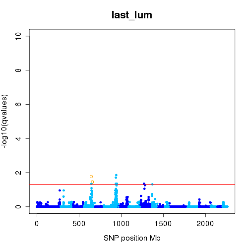
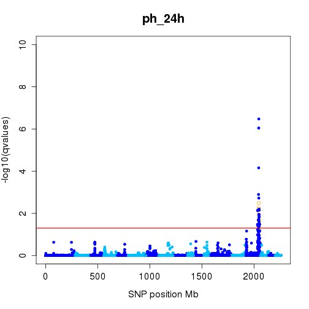
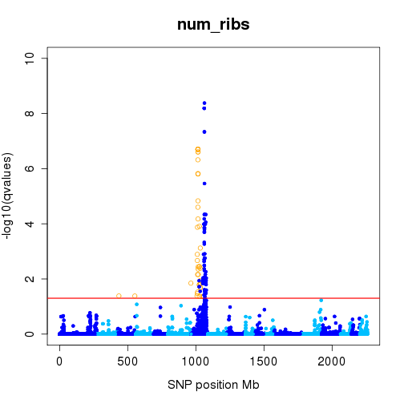
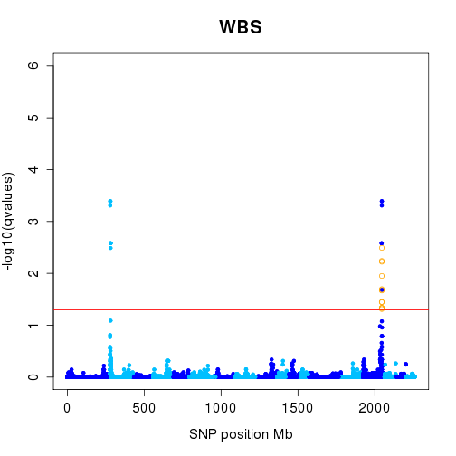
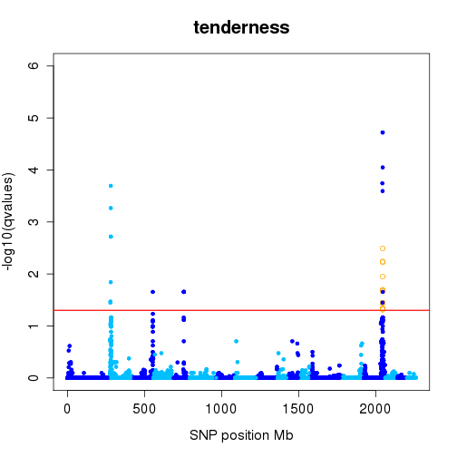
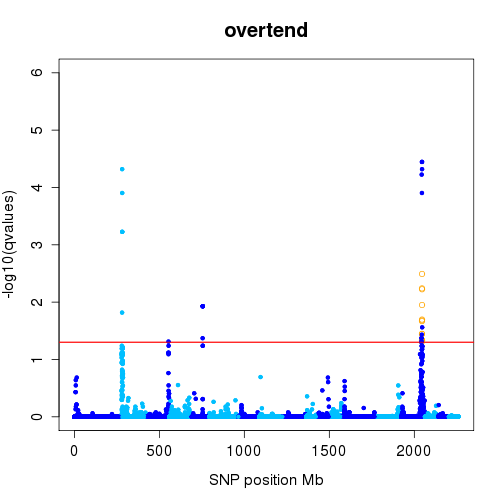
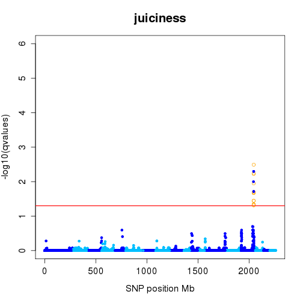
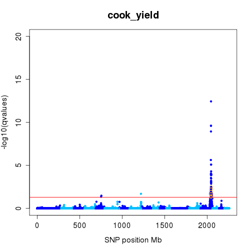
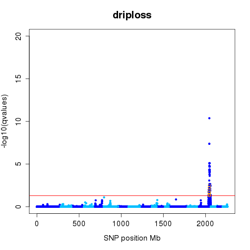
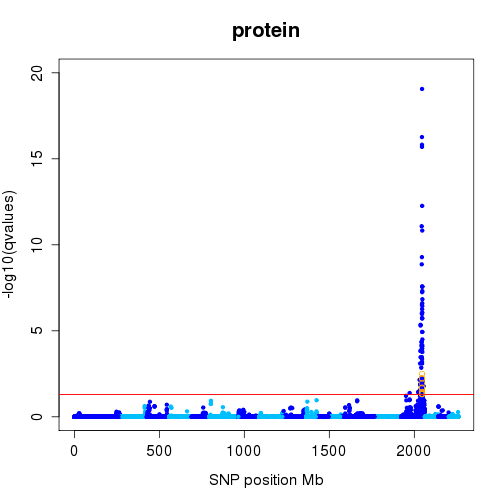

**Script:** `7_mirna_eqtl_pqtl_coloc.R`

**Directory of Code:**  `/mnt/research/ernstc_lab/miRNA_eQTL_Sscrofa11/5_gblup_gwa_eqtl/scripts`

**Date:**  12/18/17

**Input File Directory:**  

1. `/mnt/research/ernstc_lab/RNAseq_ASE/QTL/pQTL60k/` `/mnt/research/pigeqtl/analyses/eQTL/paper/output/corrected-Z/`

2. `/mnt/research/ernstc_lab/RNAseq_ASE/SNP60K_Ss11/SNP60_Ss11_Map/`

3. `/mnt/research/ernstc_lab/miRNA_eQTL_Sscrofa11/4_dge_G_objects`

4. `/mnt/research/ernstc_lab/miRNA_eQTL_Sscrofa11/5_gblup_gwa_eqtl`

**Input File(s):** 

1. `pQTL_60K.Rdata`, `inrange_function.Rdata`

2. `MSUPRP_gpData_Ss11.Rdata`

3. `6_mirna_precursor_annot_ssc11.Rdata`, `3_msuprp_mirna_gpdata.Rdata`, `4_normalized_dge_voom.Rdata`, `5_Z_G_miRNA.Rdata`

4. `1_gblup_results_summary.Rdata`, `2_gwa_results.Rdata`, `4_miRNA_eQTL_local_distal_regulators.Rdata`

**Output File Directory:** 

1. `/mnt/research/ernstc_lab/miRNA_eQTL_Sscrofa11/5_gblup_gwa_eqtl/`

**Output File(s):** 

1. `9_mireqtl_pqtl_coloc_peaks.Rdata`

2. `10_mireqtl_pqtl_coloc_peaks.txt`

3. `11_pQTL_summary.txt`

4. `12_summary_pheno_174.txt`

**Table of contents:**

1. [Objectives](#objectives)
2. [Install libraries](#install-libraries)
3. [Load data](#load-data)
4. [Analysis](#analysis)
5. [Visualize](#visualize)
6. [Save data](#save-data)

## Objectives

The objective of this script is to investigate if axny miRNA eQTL co-localize with pQTL.

## Install libraries


```r
setwd("/mnt/research/ernstc_lab/miRNA_eQTL_Sscrofa11/5_gblup_gwa_eqtl/scripts")

rm(list=ls())

library(methods)
library(limma)
library(edgeR)
```

## Load data


```r
load("/mnt/research/ernstc_lab/RNAseq_ASE/QTL/pQTL60k/pQTL_60k.Rdata")
load("/mnt/research/ernstc_lab/RNAseq_ASE/SNP60K_Ss11/SNP60_Ss11_Map/MSUPRP_gpData_Ss11.Rdata")
load("/mnt/research/pigeqtl/analyses/eQTL/paper/output/corrected-Z/inrange_function.Rdata")
```

Load DV functions:


```r
load("/mnt/research/pigeqtl/analyses/eQTL/paper/output/funct_eqtl.Rdata")

load("../../4_dge_G_objects/6_mirna_precursor_annot_ssc11.Rdata")
load("../../4_dge_G_objects/3_msuprp_mirna_gpdata.Rdata")
load("../../4_dge_G_objects/5_Z_G_miRNA.Rdata")
load("../../5_gblup_gwa_eqtl/1_gblup_results_summary.Rdata")
load("../../5_gblup_gwa_eqtl/2_gwa_results.Rdata")
load("../../5_gblup_gwa_eqtl/4_miRNA_eQTL_local_distal_regulators.Rdata")

ls()
```

```
##  [1] "absmap"               "add_legend"           "AddPosGene"          
##  [4] "annotation"           "distance"             "G"                   
##  [7] "GBLUP"                "gblup.h2.se"          "GWAS"                
## [10] "inrange"              "manhpt"               "MSUPRP"              
## [13] "MSUPRP168"            "MSUPRP_miRNA"         "peakrng"             
## [16] "plot.GMA"             "QTL"                  "QTLpeaks"            
## [19] "regul"                "rst.gwa"              "sigpval"             
## [22] "stb"                  "stb.nm"               "summary_MSUPRP_miRNA"
## [25] "summary.rst.gblup"    "tbpos"                "Z"                   
## [28] "zstandard"
```

## Analysis

### Phenotypic QTL MSUPRP


```r
length(QTL)
```

```
## [1] 25
```

```r
names(QTL)
```

```
##  [1] "bf10_10wk"  "lrf_10wk"   "bf10_13wk"  "lrf_13wk"   "bf10_16wk" 
##  [6] "lma_16wk"   "lrf_16wk"   "bf10_19wk"  "lrf_19wk"   "bf10_22wk" 
## [11] "lrf_22wk"   "dress_ptg"  "cook_yield" "WBS"        "juiciness" 
## [16] "tenderness" "overtend"   "driploss"   "ph_24h"     "car_length"
## [21] "num_ribs"   "last_lum"   "car_bf10"   "loin"       "protein"
```

```r
QTL[[1]]
```

```
##             chr       pos         pval       qval
## ASGA0029650   6 144550432 3.070272e-06 0.04372783
## ASGA0029651   6 144640222 6.613699e-07 0.01562265
## ALGA0104402   6 147743951 7.312776e-07 0.01562265
```

pQTL peak information


```r
dim(QTLpeaks)
```

```
## [1] 46  9
```

```r
QTLpeaks$pheno.chr<-as.factor(make.names(paste(QTLpeaks$pheno, QTLpeaks$chr, sep="."), unique=TRUE))
rownames(QTLpeaks)<-make.names(paste(QTLpeaks$pheno, QTLpeaks$chr, sep="."), unique=TRUE)
head(QTLpeaks)
```

```
##                 pheno chr     start       end sig.snp         snp
## bf10_10wk.6 bf10_10wk   6 144550432 147743951       3 ASGA0029651
## lrf_10wk.6   lrf_10wk   6 114921710 153129074      51 ALGA0104402
## lrf_10wk.12  lrf_10wk  12  41734343  41734343       1 ASGA0054658
## bf10_13wk.3 bf10_13wk   3 112321459 112321459       1 H3GA0010564
## bf10_13wk.6 bf10_13wk   6 142218300 150042424      10 ALGA0104402
## lrf_13wk.6   lrf_13wk   6 108751759 151354003      17 ALGA0104402
##               pos.snp         pval         qval   pheno.chr
## bf10_10wk.6 144640222 6.613699e-07 1.562265e-02 bf10_10wk.6
## lrf_10wk.6  147743951 1.228888e-09 5.250669e-05  lrf_10wk.6
## lrf_10wk.12  41734343 4.619538e-05 4.028143e-02 lrf_10wk.12
## bf10_13wk.3 112321459 1.339311e-06 1.143386e-02 bf10_13wk.3
## bf10_13wk.6 147743951 8.468488e-08 3.049103e-03 bf10_13wk.6
## lrf_13wk.6  147743951 5.452684e-10 2.329768e-05  lrf_13wk.6
```

```r
table(QTLpeaks$pheno)
```

```
## 
##  bf10_10wk   lrf_10wk  bf10_13wk   lrf_13wk  bf10_16wk   lma_16wk 
##          1          2          2          1          1          1 
##   lrf_16wk  bf10_19wk   lrf_19wk  bf10_22wk   lrf_22wk  dress_ptg 
##          2          1          1          1          1          3 
## cook_yield        WBS  juiciness tenderness   overtend   driploss 
##          3          2          1          4          4          1 
##     ph_24h car_length   num_ribs   last_lum   car_bf10       loin 
##          1          2          1          5          2          2 
##    protein 
##          1
```

```r
table(QTLpeaks$chr)
```

```
## 
##  1  2  3  4  5  6  7  8  9 10 11 12 15 
##  1  3  3  1  4 14  5  1  2  1  2  1  8
```

q-values pQTL GWAS


```r
qval <- GWAS$qvalue
dim(qval)
```

```
## [1] 42727    67
```

p-values pQTL GWAS


```r
pval <- GWAS$pvalue
dim(pval)
```

```
## [1] 42727    67
```

Standardized SNP effects pQTL GWA


```r
sdEff <- GWAS$Estimate
dim(sdEff)
```

```
## [1] 42727    67
```

Marker Map


```r
map<-MSUPRP$map
str(map)
```

```
## 'data.frame':	43130 obs. of  3 variables:
##  $ chr: Factor w/ 173 levels "0","1","10","11",..: 2 2 2 2 2 2 2 2 2 2 ...
##  $ pos: int  205163 261794 309120 289363 408640 381075 373626 239523 455096 477400 ...
##  $ snp: Factor w/ 8 levels "[A/C]","[A/G]",..: 2 1 2 1 7 7 8 1 2 7 ...
```

```r
map$chr<-gsub("X", "19", map$chr)
map$chr<-gsub("Y", "20", map$chr)
str(map)
```

```
## 'data.frame':	43130 obs. of  3 variables:
##  $ chr: chr  "1" "1" "1" "1" ...
##  $ pos: int  205163 261794 309120 289363 408640 381075 373626 239523 455096 477400 ...
##  $ snp: Factor w/ 8 levels "[A/C]","[A/G]",..: 2 1 2 1 7 7 8 1 2 7 ...
```

```r
map$chr<-as.numeric(map$chr)
```

Retain marker information for all pQTL


```r
sig <- apply(qval, 2, function(x) x[x < 0.05])
sig <- lapply(names(sig), function(x) data.frame(map[names(sig[[x]]),],
    std.eff=sdEff[names(sig[[x]]),x], pvalue=pval[names(sig[[x]]),x], qvalue=sig[[x]]))
names(sig) <- colnames(qval)
sig <- sig[unlist(lapply(sig, nrow)) > 0]
```

25 of the 67 traits have pQTL:


```r
length(sig)
```

```
## [1] 25
```

```r
names(sig)
```

```
##  [1] "bf10_10wk"  "lrf_10wk"   "bf10_13wk"  "lrf_13wk"   "bf10_16wk" 
##  [6] "lma_16wk"   "lrf_16wk"   "bf10_19wk"  "lrf_19wk"   "bf10_22wk" 
## [11] "lrf_22wk"   "dress_ptg"  "cook_yield" "WBS"        "juiciness" 
## [16] "tenderness" "overtend"   "driploss"   "ph_24h"     "car_length"
## [21] "num_ribs"   "last_lum"   "car_bf10"   "loin"       "protein"
```

If a pQTL contains more than one peak split each peak


```r
idx <- lapply(sig, function(x) as.numeric(names(table(x$chr))))
idx <- idx[unlist(lapply(idx, function(x) length(x) > 1))]

mp <- lapply(1:length(idx), function(x) lapply(1:length(idx[[x]]), function(y) sig[[names(idx)[x]]][sig[[names(idx)[x]]]$chr == idx[[x]][y],]))
names(mp) <- names(idx)

for (i in 1:length(mp)){
names(mp[[i]]) <- paste(names(mp)[[i]], 1:length(mp[[i]]), sep=".")
}

qtl <- sig[!names(sig) %in% names(mp)]
for (i in 1:length(mp)){
qtl <- c(qtl, mp[[i]])
}

# Number of associated markers per QTL peak
length(qtl)
```

```
## [1] 43
```

```r
unlist(lapply(qtl, nrow))
```

```
##    bf10_10wk     lrf_13wk    bf10_16wk     lma_16wk    bf10_19wk 
##            3           17            1            4            1 
##     lrf_19wk    bf10_22wk     lrf_22wk    juiciness     driploss 
##            3            2           16            5           81 
##       ph_24h   car_length     num_ribs      protein   lrf_10wk.1 
##           35            2           91           97           51 
##   lrf_10wk.2  bf10_13wk.1  bf10_13wk.2   lrf_16wk.1   lrf_16wk.2 
##            1            1           10            2            8 
##  dress_ptg.1  dress_ptg.2 cook_yield.1 cook_yield.2 cook_yield.3 
##           68            4            2            1           65 
##        WBS.1        WBS.2 tenderness.1 tenderness.2 tenderness.3 
##            7            6            7            1            5 
## tenderness.4   overtend.1   overtend.2   overtend.3   overtend.4 
##            7            5            1            6           13 
##   last_lum.1   last_lum.2   last_lum.3   last_lum.4   car_bf10.1 
##            1           12            2            1            7 
##   car_bf10.2       loin.1       loin.2 
##           95           28            1
```

Co-localization eQTL with pQTL


```r
# Check all eQTL peaks within a pQTL
sig <- cbind(regul[,c(7:14)], regul[,c(1:6)])
head(sig)
```

```
##   chr.snp range.peak   min.pos   max.pos num.snp         SNP   pos.snp
## 1       7   43229663  43560865  86790528      46 ASGA0034057  50959933
## 2       4   14432476  87026192 101458668       4 ALGA0026452  87026192
## 3       6   23594459  42970844  66565303      90 ALGA0118516  63743210
## 4       3     704850  27716152  28421002      14 ALGA0124095  28388183
## 5       2   21713538 127788285 149501823     115 ALGA0016550 139741258
## 6       6     389705  16583301  16973006       2 ALGA0117081  16973006
##         qvalue           miRNA chr.miR start.miR   end.miR range.miR
## 1 1.996397e-07     ssc-miR-184       7  48345017  48345099        82
## 2 1.700660e-02    ssc-miR-190b       4  95540606  95540688        82
## 3 5.359585e-06     ssc-miR-429       6  63491921  63492001        80
## 4 1.172551e-02 ssc-miR-7135-3p       3  28371952  28372010        58
## 5 2.874277e-09     ssc-miR-874       2 139660118 139660201        83
## 6 4.302663e-04  ssc-miR-140-5p       6  17077517  17077610        93
##   miRBase.ID
## 1  MI0002421
## 2  MI0017988
## 3  MI0017991
## 4  MI0023568
## 5  MI0022157
## 6  MI0002437
```

qtl = pQTL peaks
map = sig refers to range of miR-eQTL peaks

map = rqtl refers to range of pQTL peaks
The inrange function is then used to identify if the pQTL peak lies within a miR-eQTL, 
or overlaps the miR-eQTL peak on the left or the right


Identify miRNA eQTL where the position of the peak miR-eQTL SNP lies between the beginning and end of the pQTL peak:


```r
eqtl.pqtl <- lapply(qtl, function(x) inrange(chr=unique(x$chr), start=min(x$pos),
        end=max(x$pos), map=sig, single="pos.snp", range=NULL))
unlist(lapply(eqtl.pqtl, nrow))[unlist(lapply(eqtl.pqtl, nrow)) > 0]
```

```
##    juiciness     driploss       ph_24h      protein cook_yield.3 
##            6            6            6            6            6 
##        WBS.2 tenderness.4   overtend.4 
##            6            6            6
```

```r
eqtl.pqtl[names(unlist(lapply(eqtl.pqtl, nrow))[unlist(lapply(eqtl.pqtl, nrow)) > 0])]
```

```
## $juiciness
##    chr.snp range.peak   min.pos   max.pos num.snp         SNP   pos.snp
## 7       15     345721 121872813 122218534       2 MARC0093624 122218534
## 8       15     345721 121872813 122218534       2 MARC0093624 122218534
## 9       15      66557 121806256 121872813       2 H3GA0052416 121806256
## 10      15     412278 121806256 122218534       3 MARC0093624 122218534
## 12      15     412278 121806256 122218534       3 MARC0093624 122218534
## 16      15          0 122218534 122218534       1 MARC0093624 122218534
##         qvalue           miRNA chr.miR start.miR   end.miR range.miR
## 7  0.011225132   ssc-let-7d-5p       3  43468501  43468596        95
## 8  0.005963851      ssc-let-7g      13  34406135  34406222        87
## 9  0.035814581  ssc-miR-345-3p       7 121193716 121193799        83
## 10 0.046362406      ssc-miR-95       8   3030934   3031014        80
## 12 0.003225619 ssc-miR-9843-3p       8 114110660 114110740        80
## 16 0.020145239    ssc-miR-1468      19  50337088  50337170        82
##    miRBase.ID
## 7   MI0022120
## 8   MI0013087
## 9   MI0013117
## 10  MI0002436
## 12  MI0031612
## 16  MI0022160
## 
## $driploss
##    chr.snp range.peak   min.pos   max.pos num.snp         SNP   pos.snp
## 7       15     345721 121872813 122218534       2 MARC0093624 122218534
## 8       15     345721 121872813 122218534       2 MARC0093624 122218534
## 9       15      66557 121806256 121872813       2 H3GA0052416 121806256
## 10      15     412278 121806256 122218534       3 MARC0093624 122218534
## 12      15     412278 121806256 122218534       3 MARC0093624 122218534
## 16      15          0 122218534 122218534       1 MARC0093624 122218534
##         qvalue           miRNA chr.miR start.miR   end.miR range.miR
## 7  0.011225132   ssc-let-7d-5p       3  43468501  43468596        95
## 8  0.005963851      ssc-let-7g      13  34406135  34406222        87
## 9  0.035814581  ssc-miR-345-3p       7 121193716 121193799        83
## 10 0.046362406      ssc-miR-95       8   3030934   3031014        80
## 12 0.003225619 ssc-miR-9843-3p       8 114110660 114110740        80
## 16 0.020145239    ssc-miR-1468      19  50337088  50337170        82
##    miRBase.ID
## 7   MI0022120
## 8   MI0013087
## 9   MI0013117
## 10  MI0002436
## 12  MI0031612
## 16  MI0022160
## 
## $ph_24h
##    chr.snp range.peak   min.pos   max.pos num.snp         SNP   pos.snp
## 7       15     345721 121872813 122218534       2 MARC0093624 122218534
## 8       15     345721 121872813 122218534       2 MARC0093624 122218534
## 9       15      66557 121806256 121872813       2 H3GA0052416 121806256
## 10      15     412278 121806256 122218534       3 MARC0093624 122218534
## 12      15     412278 121806256 122218534       3 MARC0093624 122218534
## 16      15          0 122218534 122218534       1 MARC0093624 122218534
##         qvalue           miRNA chr.miR start.miR   end.miR range.miR
## 7  0.011225132   ssc-let-7d-5p       3  43468501  43468596        95
## 8  0.005963851      ssc-let-7g      13  34406135  34406222        87
## 9  0.035814581  ssc-miR-345-3p       7 121193716 121193799        83
## 10 0.046362406      ssc-miR-95       8   3030934   3031014        80
## 12 0.003225619 ssc-miR-9843-3p       8 114110660 114110740        80
## 16 0.020145239    ssc-miR-1468      19  50337088  50337170        82
##    miRBase.ID
## 7   MI0022120
## 8   MI0013087
## 9   MI0013117
## 10  MI0002436
## 12  MI0031612
## 16  MI0022160
## 
## $protein
##    chr.snp range.peak   min.pos   max.pos num.snp         SNP   pos.snp
## 7       15     345721 121872813 122218534       2 MARC0093624 122218534
## 8       15     345721 121872813 122218534       2 MARC0093624 122218534
## 9       15      66557 121806256 121872813       2 H3GA0052416 121806256
## 10      15     412278 121806256 122218534       3 MARC0093624 122218534
## 12      15     412278 121806256 122218534       3 MARC0093624 122218534
## 16      15          0 122218534 122218534       1 MARC0093624 122218534
##         qvalue           miRNA chr.miR start.miR   end.miR range.miR
## 7  0.011225132   ssc-let-7d-5p       3  43468501  43468596        95
## 8  0.005963851      ssc-let-7g      13  34406135  34406222        87
## 9  0.035814581  ssc-miR-345-3p       7 121193716 121193799        83
## 10 0.046362406      ssc-miR-95       8   3030934   3031014        80
## 12 0.003225619 ssc-miR-9843-3p       8 114110660 114110740        80
## 16 0.020145239    ssc-miR-1468      19  50337088  50337170        82
##    miRBase.ID
## 7   MI0022120
## 8   MI0013087
## 9   MI0013117
## 10  MI0002436
## 12  MI0031612
## 16  MI0022160
## 
## $cook_yield.3
##    chr.snp range.peak   min.pos   max.pos num.snp         SNP   pos.snp
## 7       15     345721 121872813 122218534       2 MARC0093624 122218534
## 8       15     345721 121872813 122218534       2 MARC0093624 122218534
## 9       15      66557 121806256 121872813       2 H3GA0052416 121806256
## 10      15     412278 121806256 122218534       3 MARC0093624 122218534
## 12      15     412278 121806256 122218534       3 MARC0093624 122218534
## 16      15          0 122218534 122218534       1 MARC0093624 122218534
##         qvalue           miRNA chr.miR start.miR   end.miR range.miR
## 7  0.011225132   ssc-let-7d-5p       3  43468501  43468596        95
## 8  0.005963851      ssc-let-7g      13  34406135  34406222        87
## 9  0.035814581  ssc-miR-345-3p       7 121193716 121193799        83
## 10 0.046362406      ssc-miR-95       8   3030934   3031014        80
## 12 0.003225619 ssc-miR-9843-3p       8 114110660 114110740        80
## 16 0.020145239    ssc-miR-1468      19  50337088  50337170        82
##    miRBase.ID
## 7   MI0022120
## 8   MI0013087
## 9   MI0013117
## 10  MI0002436
## 12  MI0031612
## 16  MI0022160
## 
## $WBS.2
##    chr.snp range.peak   min.pos   max.pos num.snp         SNP   pos.snp
## 7       15     345721 121872813 122218534       2 MARC0093624 122218534
## 8       15     345721 121872813 122218534       2 MARC0093624 122218534
## 9       15      66557 121806256 121872813       2 H3GA0052416 121806256
## 10      15     412278 121806256 122218534       3 MARC0093624 122218534
## 12      15     412278 121806256 122218534       3 MARC0093624 122218534
## 16      15          0 122218534 122218534       1 MARC0093624 122218534
##         qvalue           miRNA chr.miR start.miR   end.miR range.miR
## 7  0.011225132   ssc-let-7d-5p       3  43468501  43468596        95
## 8  0.005963851      ssc-let-7g      13  34406135  34406222        87
## 9  0.035814581  ssc-miR-345-3p       7 121193716 121193799        83
## 10 0.046362406      ssc-miR-95       8   3030934   3031014        80
## 12 0.003225619 ssc-miR-9843-3p       8 114110660 114110740        80
## 16 0.020145239    ssc-miR-1468      19  50337088  50337170        82
##    miRBase.ID
## 7   MI0022120
## 8   MI0013087
## 9   MI0013117
## 10  MI0002436
## 12  MI0031612
## 16  MI0022160
## 
## $tenderness.4
##    chr.snp range.peak   min.pos   max.pos num.snp         SNP   pos.snp
## 7       15     345721 121872813 122218534       2 MARC0093624 122218534
## 8       15     345721 121872813 122218534       2 MARC0093624 122218534
## 9       15      66557 121806256 121872813       2 H3GA0052416 121806256
## 10      15     412278 121806256 122218534       3 MARC0093624 122218534
## 12      15     412278 121806256 122218534       3 MARC0093624 122218534
## 16      15          0 122218534 122218534       1 MARC0093624 122218534
##         qvalue           miRNA chr.miR start.miR   end.miR range.miR
## 7  0.011225132   ssc-let-7d-5p       3  43468501  43468596        95
## 8  0.005963851      ssc-let-7g      13  34406135  34406222        87
## 9  0.035814581  ssc-miR-345-3p       7 121193716 121193799        83
## 10 0.046362406      ssc-miR-95       8   3030934   3031014        80
## 12 0.003225619 ssc-miR-9843-3p       8 114110660 114110740        80
## 16 0.020145239    ssc-miR-1468      19  50337088  50337170        82
##    miRBase.ID
## 7   MI0022120
## 8   MI0013087
## 9   MI0013117
## 10  MI0002436
## 12  MI0031612
## 16  MI0022160
## 
## $overtend.4
##    chr.snp range.peak   min.pos   max.pos num.snp         SNP   pos.snp
## 7       15     345721 121872813 122218534       2 MARC0093624 122218534
## 8       15     345721 121872813 122218534       2 MARC0093624 122218534
## 9       15      66557 121806256 121872813       2 H3GA0052416 121806256
## 10      15     412278 121806256 122218534       3 MARC0093624 122218534
## 12      15     412278 121806256 122218534       3 MARC0093624 122218534
## 16      15          0 122218534 122218534       1 MARC0093624 122218534
##         qvalue           miRNA chr.miR start.miR   end.miR range.miR
## 7  0.011225132   ssc-let-7d-5p       3  43468501  43468596        95
## 8  0.005963851      ssc-let-7g      13  34406135  34406222        87
## 9  0.035814581  ssc-miR-345-3p       7 121193716 121193799        83
## 10 0.046362406      ssc-miR-95       8   3030934   3031014        80
## 12 0.003225619 ssc-miR-9843-3p       8 114110660 114110740        80
## 16 0.020145239    ssc-miR-1468      19  50337088  50337170        82
##    miRBase.ID
## 7   MI0022120
## 8   MI0013087
## 9   MI0013117
## 10  MI0002436
## 12  MI0031612
## 16  MI0022160
```

rqtl = range of pQTL peaks:


```r
rqtl <- do.call(rbind,lapply(qtl, function(x) data.frame(chr=unique(x$chr),
        min=min(x$pos), max=max(x$pos))))
```

### pQTL peaks lying completely within a miR-eQTL peak:

(start of pQTL peak is after start of miR-eQTL peak, and 
end of pQTL peak is before end of miR-eQTL peak)


```r
PinE <- lapply(1:nrow(sig), function(x) inrange(chr=sig[x, "chr.snp"], start=sig[x, "min.pos"],
        end=sig[x, "max.pos"], map=rqtl, single=NULL, range=c(start="min", end="max")))
names(PinE) <- 1:nrow(sig)
unlist(lapply(PinE, nrow))[unlist(lapply(PinE, nrow)) > 0]
```

```
## 2 
## 1
```

```r
PinE <- do.call(rbind, lapply(names(PinE), function(x)
        data.frame(pqtl=rownames(PinE[[x]]), PinE[[x]], eqtl=rep(x, nrow(PinE[[x]])))))
rownames(PinE) <- NULL

PinE <- lapply(names(qtl), function(x) sig[as.character(PinE$eqtl[grep(x, PinE$pqtl)]),])
names(PinE) <- names(qtl)

unlist(lapply(PinE, nrow))[unlist(lapply(PinE, nrow)) > 0]
```

```
## last_lum.1 
##          1
```

```r
PinE[names(unlist(lapply(PinE, nrow))[unlist(lapply(PinE, nrow)) > 0])]
```

```
## $last_lum.1
##   chr.snp range.peak  min.pos   max.pos num.snp         SNP  pos.snp
## 2       4   14432476 87026192 101458668       4 ALGA0026452 87026192
##      qvalue        miRNA chr.miR start.miR  end.miR range.miR miRBase.ID
## 2 0.0170066 ssc-miR-190b       4  95540606 95540688        82  MI0017988
```

### pQTL peaks overlapping left side of miR-eQTL:

(minimum position of miR-eQTL lies after start of pQTL peak, and before end of pQTL peak)


```r
left <- lapply(qtl, function(x) inrange(chr=unique(x$chr), start=min(x$pos),
        end=max(x$pos), map=sig, single="min.pos", range=NULL))
```

Number of pQTL overlapping left side of miR-eQTL:


```r
sum(lapply(left, nrow) >0)
```

```
## [1] 8
```

```r
unlist(lapply(left, nrow))[unlist(lapply(left, nrow)) > 0]
```

```
##    juiciness     driploss       ph_24h      protein cook_yield.3 
##            6            6            6            6            6 
##        WBS.2 tenderness.4   overtend.4 
##            6            6            6
```

```r
names(unlist(lapply(left, nrow))[unlist(lapply(left, nrow)) > 0])
```

```
## [1] "juiciness"    "driploss"     "ph_24h"       "protein"     
## [5] "cook_yield.3" "WBS.2"        "tenderness.4" "overtend.4"
```

Notice it's the same 6 miRNAs for all of these pQTL:


```r
left[names(unlist(lapply(left, nrow))[unlist(lapply(left, nrow)) > 0])]
```

```
## $juiciness
##    chr.snp range.peak   min.pos   max.pos num.snp         SNP   pos.snp
## 7       15     345721 121872813 122218534       2 MARC0093624 122218534
## 8       15     345721 121872813 122218534       2 MARC0093624 122218534
## 9       15      66557 121806256 121872813       2 H3GA0052416 121806256
## 10      15     412278 121806256 122218534       3 MARC0093624 122218534
## 12      15     412278 121806256 122218534       3 MARC0093624 122218534
## 16      15          0 122218534 122218534       1 MARC0093624 122218534
##         qvalue           miRNA chr.miR start.miR   end.miR range.miR
## 7  0.011225132   ssc-let-7d-5p       3  43468501  43468596        95
## 8  0.005963851      ssc-let-7g      13  34406135  34406222        87
## 9  0.035814581  ssc-miR-345-3p       7 121193716 121193799        83
## 10 0.046362406      ssc-miR-95       8   3030934   3031014        80
## 12 0.003225619 ssc-miR-9843-3p       8 114110660 114110740        80
## 16 0.020145239    ssc-miR-1468      19  50337088  50337170        82
##    miRBase.ID
## 7   MI0022120
## 8   MI0013087
## 9   MI0013117
## 10  MI0002436
## 12  MI0031612
## 16  MI0022160
## 
## $driploss
##    chr.snp range.peak   min.pos   max.pos num.snp         SNP   pos.snp
## 7       15     345721 121872813 122218534       2 MARC0093624 122218534
## 8       15     345721 121872813 122218534       2 MARC0093624 122218534
## 9       15      66557 121806256 121872813       2 H3GA0052416 121806256
## 10      15     412278 121806256 122218534       3 MARC0093624 122218534
## 12      15     412278 121806256 122218534       3 MARC0093624 122218534
## 16      15          0 122218534 122218534       1 MARC0093624 122218534
##         qvalue           miRNA chr.miR start.miR   end.miR range.miR
## 7  0.011225132   ssc-let-7d-5p       3  43468501  43468596        95
## 8  0.005963851      ssc-let-7g      13  34406135  34406222        87
## 9  0.035814581  ssc-miR-345-3p       7 121193716 121193799        83
## 10 0.046362406      ssc-miR-95       8   3030934   3031014        80
## 12 0.003225619 ssc-miR-9843-3p       8 114110660 114110740        80
## 16 0.020145239    ssc-miR-1468      19  50337088  50337170        82
##    miRBase.ID
## 7   MI0022120
## 8   MI0013087
## 9   MI0013117
## 10  MI0002436
## 12  MI0031612
## 16  MI0022160
## 
## $ph_24h
##    chr.snp range.peak   min.pos   max.pos num.snp         SNP   pos.snp
## 7       15     345721 121872813 122218534       2 MARC0093624 122218534
## 8       15     345721 121872813 122218534       2 MARC0093624 122218534
## 9       15      66557 121806256 121872813       2 H3GA0052416 121806256
## 10      15     412278 121806256 122218534       3 MARC0093624 122218534
## 12      15     412278 121806256 122218534       3 MARC0093624 122218534
## 16      15          0 122218534 122218534       1 MARC0093624 122218534
##         qvalue           miRNA chr.miR start.miR   end.miR range.miR
## 7  0.011225132   ssc-let-7d-5p       3  43468501  43468596        95
## 8  0.005963851      ssc-let-7g      13  34406135  34406222        87
## 9  0.035814581  ssc-miR-345-3p       7 121193716 121193799        83
## 10 0.046362406      ssc-miR-95       8   3030934   3031014        80
## 12 0.003225619 ssc-miR-9843-3p       8 114110660 114110740        80
## 16 0.020145239    ssc-miR-1468      19  50337088  50337170        82
##    miRBase.ID
## 7   MI0022120
## 8   MI0013087
## 9   MI0013117
## 10  MI0002436
## 12  MI0031612
## 16  MI0022160
## 
## $protein
##    chr.snp range.peak   min.pos   max.pos num.snp         SNP   pos.snp
## 7       15     345721 121872813 122218534       2 MARC0093624 122218534
## 8       15     345721 121872813 122218534       2 MARC0093624 122218534
## 9       15      66557 121806256 121872813       2 H3GA0052416 121806256
## 10      15     412278 121806256 122218534       3 MARC0093624 122218534
## 12      15     412278 121806256 122218534       3 MARC0093624 122218534
## 16      15          0 122218534 122218534       1 MARC0093624 122218534
##         qvalue           miRNA chr.miR start.miR   end.miR range.miR
## 7  0.011225132   ssc-let-7d-5p       3  43468501  43468596        95
## 8  0.005963851      ssc-let-7g      13  34406135  34406222        87
## 9  0.035814581  ssc-miR-345-3p       7 121193716 121193799        83
## 10 0.046362406      ssc-miR-95       8   3030934   3031014        80
## 12 0.003225619 ssc-miR-9843-3p       8 114110660 114110740        80
## 16 0.020145239    ssc-miR-1468      19  50337088  50337170        82
##    miRBase.ID
## 7   MI0022120
## 8   MI0013087
## 9   MI0013117
## 10  MI0002436
## 12  MI0031612
## 16  MI0022160
## 
## $cook_yield.3
##    chr.snp range.peak   min.pos   max.pos num.snp         SNP   pos.snp
## 7       15     345721 121872813 122218534       2 MARC0093624 122218534
## 8       15     345721 121872813 122218534       2 MARC0093624 122218534
## 9       15      66557 121806256 121872813       2 H3GA0052416 121806256
## 10      15     412278 121806256 122218534       3 MARC0093624 122218534
## 12      15     412278 121806256 122218534       3 MARC0093624 122218534
## 16      15          0 122218534 122218534       1 MARC0093624 122218534
##         qvalue           miRNA chr.miR start.miR   end.miR range.miR
## 7  0.011225132   ssc-let-7d-5p       3  43468501  43468596        95
## 8  0.005963851      ssc-let-7g      13  34406135  34406222        87
## 9  0.035814581  ssc-miR-345-3p       7 121193716 121193799        83
## 10 0.046362406      ssc-miR-95       8   3030934   3031014        80
## 12 0.003225619 ssc-miR-9843-3p       8 114110660 114110740        80
## 16 0.020145239    ssc-miR-1468      19  50337088  50337170        82
##    miRBase.ID
## 7   MI0022120
## 8   MI0013087
## 9   MI0013117
## 10  MI0002436
## 12  MI0031612
## 16  MI0022160
## 
## $WBS.2
##    chr.snp range.peak   min.pos   max.pos num.snp         SNP   pos.snp
## 7       15     345721 121872813 122218534       2 MARC0093624 122218534
## 8       15     345721 121872813 122218534       2 MARC0093624 122218534
## 9       15      66557 121806256 121872813       2 H3GA0052416 121806256
## 10      15     412278 121806256 122218534       3 MARC0093624 122218534
## 12      15     412278 121806256 122218534       3 MARC0093624 122218534
## 16      15          0 122218534 122218534       1 MARC0093624 122218534
##         qvalue           miRNA chr.miR start.miR   end.miR range.miR
## 7  0.011225132   ssc-let-7d-5p       3  43468501  43468596        95
## 8  0.005963851      ssc-let-7g      13  34406135  34406222        87
## 9  0.035814581  ssc-miR-345-3p       7 121193716 121193799        83
## 10 0.046362406      ssc-miR-95       8   3030934   3031014        80
## 12 0.003225619 ssc-miR-9843-3p       8 114110660 114110740        80
## 16 0.020145239    ssc-miR-1468      19  50337088  50337170        82
##    miRBase.ID
## 7   MI0022120
## 8   MI0013087
## 9   MI0013117
## 10  MI0002436
## 12  MI0031612
## 16  MI0022160
## 
## $tenderness.4
##    chr.snp range.peak   min.pos   max.pos num.snp         SNP   pos.snp
## 7       15     345721 121872813 122218534       2 MARC0093624 122218534
## 8       15     345721 121872813 122218534       2 MARC0093624 122218534
## 9       15      66557 121806256 121872813       2 H3GA0052416 121806256
## 10      15     412278 121806256 122218534       3 MARC0093624 122218534
## 12      15     412278 121806256 122218534       3 MARC0093624 122218534
## 16      15          0 122218534 122218534       1 MARC0093624 122218534
##         qvalue           miRNA chr.miR start.miR   end.miR range.miR
## 7  0.011225132   ssc-let-7d-5p       3  43468501  43468596        95
## 8  0.005963851      ssc-let-7g      13  34406135  34406222        87
## 9  0.035814581  ssc-miR-345-3p       7 121193716 121193799        83
## 10 0.046362406      ssc-miR-95       8   3030934   3031014        80
## 12 0.003225619 ssc-miR-9843-3p       8 114110660 114110740        80
## 16 0.020145239    ssc-miR-1468      19  50337088  50337170        82
##    miRBase.ID
## 7   MI0022120
## 8   MI0013087
## 9   MI0013117
## 10  MI0002436
## 12  MI0031612
## 16  MI0022160
## 
## $overtend.4
##    chr.snp range.peak   min.pos   max.pos num.snp         SNP   pos.snp
## 7       15     345721 121872813 122218534       2 MARC0093624 122218534
## 8       15     345721 121872813 122218534       2 MARC0093624 122218534
## 9       15      66557 121806256 121872813       2 H3GA0052416 121806256
## 10      15     412278 121806256 122218534       3 MARC0093624 122218534
## 12      15     412278 121806256 122218534       3 MARC0093624 122218534
## 16      15          0 122218534 122218534       1 MARC0093624 122218534
##         qvalue           miRNA chr.miR start.miR   end.miR range.miR
## 7  0.011225132   ssc-let-7d-5p       3  43468501  43468596        95
## 8  0.005963851      ssc-let-7g      13  34406135  34406222        87
## 9  0.035814581  ssc-miR-345-3p       7 121193716 121193799        83
## 10 0.046362406      ssc-miR-95       8   3030934   3031014        80
## 12 0.003225619 ssc-miR-9843-3p       8 114110660 114110740        80
## 16 0.020145239    ssc-miR-1468      19  50337088  50337170        82
##    miRBase.ID
## 7   MI0022120
## 8   MI0013087
## 9   MI0013117
## 10  MI0002436
## 12  MI0031612
## 16  MI0022160
```

### pQTL peaks overlapping right side of miR-eQTL:

(maximum position of miR-eQTL lies after start of pQTL peak, and before end of pQTL peak)


```r
right <- lapply(qtl, function(x) inrange(chr=unique(x$chr), start=min(x$pos),
        end=max(x$pos), map=sig, single="max.pos", range=NULL))
unlist(lapply(right, nrow))[unlist(lapply(right, nrow)) > 0]
```

```
##    juiciness     driploss       ph_24h     num_ribs      protein 
##            6            6            6            1            6 
## cook_yield.3        WBS.2 tenderness.4   overtend.4 
##            6            6            6            6
```

```r
names(unlist(lapply(right, nrow))[unlist(lapply(right, nrow)) > 0])
```

```
## [1] "juiciness"    "driploss"     "ph_24h"       "num_ribs"    
## [5] "protein"      "cook_yield.3" "WBS.2"        "tenderness.4"
## [9] "overtend.4"
```

```r
right[names(unlist(lapply(right, nrow))[unlist(lapply(right, nrow)) > 0])]
```

```
## $juiciness
##    chr.snp range.peak   min.pos   max.pos num.snp         SNP   pos.snp
## 7       15     345721 121872813 122218534       2 MARC0093624 122218534
## 8       15     345721 121872813 122218534       2 MARC0093624 122218534
## 9       15      66557 121806256 121872813       2 H3GA0052416 121806256
## 10      15     412278 121806256 122218534       3 MARC0093624 122218534
## 12      15     412278 121806256 122218534       3 MARC0093624 122218534
## 16      15          0 122218534 122218534       1 MARC0093624 122218534
##         qvalue           miRNA chr.miR start.miR   end.miR range.miR
## 7  0.011225132   ssc-let-7d-5p       3  43468501  43468596        95
## 8  0.005963851      ssc-let-7g      13  34406135  34406222        87
## 9  0.035814581  ssc-miR-345-3p       7 121193716 121193799        83
## 10 0.046362406      ssc-miR-95       8   3030934   3031014        80
## 12 0.003225619 ssc-miR-9843-3p       8 114110660 114110740        80
## 16 0.020145239    ssc-miR-1468      19  50337088  50337170        82
##    miRBase.ID
## 7   MI0022120
## 8   MI0013087
## 9   MI0013117
## 10  MI0002436
## 12  MI0031612
## 16  MI0022160
## 
## $driploss
##    chr.snp range.peak   min.pos   max.pos num.snp         SNP   pos.snp
## 7       15     345721 121872813 122218534       2 MARC0093624 122218534
## 8       15     345721 121872813 122218534       2 MARC0093624 122218534
## 9       15      66557 121806256 121872813       2 H3GA0052416 121806256
## 10      15     412278 121806256 122218534       3 MARC0093624 122218534
## 12      15     412278 121806256 122218534       3 MARC0093624 122218534
## 16      15          0 122218534 122218534       1 MARC0093624 122218534
##         qvalue           miRNA chr.miR start.miR   end.miR range.miR
## 7  0.011225132   ssc-let-7d-5p       3  43468501  43468596        95
## 8  0.005963851      ssc-let-7g      13  34406135  34406222        87
## 9  0.035814581  ssc-miR-345-3p       7 121193716 121193799        83
## 10 0.046362406      ssc-miR-95       8   3030934   3031014        80
## 12 0.003225619 ssc-miR-9843-3p       8 114110660 114110740        80
## 16 0.020145239    ssc-miR-1468      19  50337088  50337170        82
##    miRBase.ID
## 7   MI0022120
## 8   MI0013087
## 9   MI0013117
## 10  MI0002436
## 12  MI0031612
## 16  MI0022160
## 
## $ph_24h
##    chr.snp range.peak   min.pos   max.pos num.snp         SNP   pos.snp
## 7       15     345721 121872813 122218534       2 MARC0093624 122218534
## 8       15     345721 121872813 122218534       2 MARC0093624 122218534
## 9       15      66557 121806256 121872813       2 H3GA0052416 121806256
## 10      15     412278 121806256 122218534       3 MARC0093624 122218534
## 12      15     412278 121806256 122218534       3 MARC0093624 122218534
## 16      15          0 122218534 122218534       1 MARC0093624 122218534
##         qvalue           miRNA chr.miR start.miR   end.miR range.miR
## 7  0.011225132   ssc-let-7d-5p       3  43468501  43468596        95
## 8  0.005963851      ssc-let-7g      13  34406135  34406222        87
## 9  0.035814581  ssc-miR-345-3p       7 121193716 121193799        83
## 10 0.046362406      ssc-miR-95       8   3030934   3031014        80
## 12 0.003225619 ssc-miR-9843-3p       8 114110660 114110740        80
## 16 0.020145239    ssc-miR-1468      19  50337088  50337170        82
##    miRBase.ID
## 7   MI0022120
## 8   MI0013087
## 9   MI0013117
## 10  MI0002436
## 12  MI0031612
## 16  MI0022160
## 
## $num_ribs
##   chr.snp range.peak  min.pos  max.pos num.snp         SNP  pos.snp
## 1       7   43229663 43560865 86790528      46 ASGA0034057 50959933
##         qvalue       miRNA chr.miR start.miR  end.miR range.miR miRBase.ID
## 1 1.996397e-07 ssc-miR-184       7  48345017 48345099        82  MI0002421
## 
## $protein
##    chr.snp range.peak   min.pos   max.pos num.snp         SNP   pos.snp
## 7       15     345721 121872813 122218534       2 MARC0093624 122218534
## 8       15     345721 121872813 122218534       2 MARC0093624 122218534
## 9       15      66557 121806256 121872813       2 H3GA0052416 121806256
## 10      15     412278 121806256 122218534       3 MARC0093624 122218534
## 12      15     412278 121806256 122218534       3 MARC0093624 122218534
## 16      15          0 122218534 122218534       1 MARC0093624 122218534
##         qvalue           miRNA chr.miR start.miR   end.miR range.miR
## 7  0.011225132   ssc-let-7d-5p       3  43468501  43468596        95
## 8  0.005963851      ssc-let-7g      13  34406135  34406222        87
## 9  0.035814581  ssc-miR-345-3p       7 121193716 121193799        83
## 10 0.046362406      ssc-miR-95       8   3030934   3031014        80
## 12 0.003225619 ssc-miR-9843-3p       8 114110660 114110740        80
## 16 0.020145239    ssc-miR-1468      19  50337088  50337170        82
##    miRBase.ID
## 7   MI0022120
## 8   MI0013087
## 9   MI0013117
## 10  MI0002436
## 12  MI0031612
## 16  MI0022160
## 
## $cook_yield.3
##    chr.snp range.peak   min.pos   max.pos num.snp         SNP   pos.snp
## 7       15     345721 121872813 122218534       2 MARC0093624 122218534
## 8       15     345721 121872813 122218534       2 MARC0093624 122218534
## 9       15      66557 121806256 121872813       2 H3GA0052416 121806256
## 10      15     412278 121806256 122218534       3 MARC0093624 122218534
## 12      15     412278 121806256 122218534       3 MARC0093624 122218534
## 16      15          0 122218534 122218534       1 MARC0093624 122218534
##         qvalue           miRNA chr.miR start.miR   end.miR range.miR
## 7  0.011225132   ssc-let-7d-5p       3  43468501  43468596        95
## 8  0.005963851      ssc-let-7g      13  34406135  34406222        87
## 9  0.035814581  ssc-miR-345-3p       7 121193716 121193799        83
## 10 0.046362406      ssc-miR-95       8   3030934   3031014        80
## 12 0.003225619 ssc-miR-9843-3p       8 114110660 114110740        80
## 16 0.020145239    ssc-miR-1468      19  50337088  50337170        82
##    miRBase.ID
## 7   MI0022120
## 8   MI0013087
## 9   MI0013117
## 10  MI0002436
## 12  MI0031612
## 16  MI0022160
## 
## $WBS.2
##    chr.snp range.peak   min.pos   max.pos num.snp         SNP   pos.snp
## 7       15     345721 121872813 122218534       2 MARC0093624 122218534
## 8       15     345721 121872813 122218534       2 MARC0093624 122218534
## 9       15      66557 121806256 121872813       2 H3GA0052416 121806256
## 10      15     412278 121806256 122218534       3 MARC0093624 122218534
## 12      15     412278 121806256 122218534       3 MARC0093624 122218534
## 16      15          0 122218534 122218534       1 MARC0093624 122218534
##         qvalue           miRNA chr.miR start.miR   end.miR range.miR
## 7  0.011225132   ssc-let-7d-5p       3  43468501  43468596        95
## 8  0.005963851      ssc-let-7g      13  34406135  34406222        87
## 9  0.035814581  ssc-miR-345-3p       7 121193716 121193799        83
## 10 0.046362406      ssc-miR-95       8   3030934   3031014        80
## 12 0.003225619 ssc-miR-9843-3p       8 114110660 114110740        80
## 16 0.020145239    ssc-miR-1468      19  50337088  50337170        82
##    miRBase.ID
## 7   MI0022120
## 8   MI0013087
## 9   MI0013117
## 10  MI0002436
## 12  MI0031612
## 16  MI0022160
## 
## $tenderness.4
##    chr.snp range.peak   min.pos   max.pos num.snp         SNP   pos.snp
## 7       15     345721 121872813 122218534       2 MARC0093624 122218534
## 8       15     345721 121872813 122218534       2 MARC0093624 122218534
## 9       15      66557 121806256 121872813       2 H3GA0052416 121806256
## 10      15     412278 121806256 122218534       3 MARC0093624 122218534
## 12      15     412278 121806256 122218534       3 MARC0093624 122218534
## 16      15          0 122218534 122218534       1 MARC0093624 122218534
##         qvalue           miRNA chr.miR start.miR   end.miR range.miR
## 7  0.011225132   ssc-let-7d-5p       3  43468501  43468596        95
## 8  0.005963851      ssc-let-7g      13  34406135  34406222        87
## 9  0.035814581  ssc-miR-345-3p       7 121193716 121193799        83
## 10 0.046362406      ssc-miR-95       8   3030934   3031014        80
## 12 0.003225619 ssc-miR-9843-3p       8 114110660 114110740        80
## 16 0.020145239    ssc-miR-1468      19  50337088  50337170        82
##    miRBase.ID
## 7   MI0022120
## 8   MI0013087
## 9   MI0013117
## 10  MI0002436
## 12  MI0031612
## 16  MI0022160
## 
## $overtend.4
##    chr.snp range.peak   min.pos   max.pos num.snp         SNP   pos.snp
## 7       15     345721 121872813 122218534       2 MARC0093624 122218534
## 8       15     345721 121872813 122218534       2 MARC0093624 122218534
## 9       15      66557 121806256 121872813       2 H3GA0052416 121806256
## 10      15     412278 121806256 122218534       3 MARC0093624 122218534
## 12      15     412278 121806256 122218534       3 MARC0093624 122218534
## 16      15          0 122218534 122218534       1 MARC0093624 122218534
##         qvalue           miRNA chr.miR start.miR   end.miR range.miR
## 7  0.011225132   ssc-let-7d-5p       3  43468501  43468596        95
## 8  0.005963851      ssc-let-7g      13  34406135  34406222        87
## 9  0.035814581  ssc-miR-345-3p       7 121193716 121193799        83
## 10 0.046362406      ssc-miR-95       8   3030934   3031014        80
## 12 0.003225619 ssc-miR-9843-3p       8 114110660 114110740        80
## 16 0.020145239    ssc-miR-1468      19  50337088  50337170        82
##    miRBase.ID
## 7   MI0022120
## 8   MI0013087
## 9   MI0013117
## 10  MI0002436
## 12  MI0031612
## 16  MI0022160
```

Notice mostly the same pQTL traits between left and right;


```r
names(unlist(lapply(left, nrow))[unlist(lapply(left, nrow)) > 0])
```

```
## [1] "juiciness"    "driploss"     "ph_24h"       "protein"     
## [5] "cook_yield.3" "WBS.2"        "tenderness.4" "overtend.4"
```

```r
names(unlist(lapply(right, nrow))[unlist(lapply(right, nrow)) > 0])
```

```
## [1] "juiciness"    "driploss"     "ph_24h"       "num_ribs"    
## [5] "protein"      "cook_yield.3" "WBS.2"        "tenderness.4"
## [9] "overtend.4"
```

See if all the miR-eQTL peaks end before the pQTL peak ends:

If the minimum of the pQTL peak is less than the minimum of the miR-eQTL peak, 
and the maximum of the pQTL peak is greater than the maximum of the miR-eQTL peak, 
then the miR-eQTL peak lies completely within the pQTL peak.


```r
lrmir<-sig[sig$miRNA %in% left$juiciness$miRNA,]
lrmir
```

```
##    chr.snp range.peak   min.pos   max.pos num.snp         SNP   pos.snp
## 7       15     345721 121872813 122218534       2 MARC0093624 122218534
## 8       15     345721 121872813 122218534       2 MARC0093624 122218534
## 9       15      66557 121806256 121872813       2 H3GA0052416 121806256
## 10      15     412278 121806256 122218534       3 MARC0093624 122218534
## 12      15     412278 121806256 122218534       3 MARC0093624 122218534
## 16      15          0 122218534 122218534       1 MARC0093624 122218534
##         qvalue           miRNA chr.miR start.miR   end.miR range.miR
## 7  0.011225132   ssc-let-7d-5p       3  43468501  43468596        95
## 8  0.005963851      ssc-let-7g      13  34406135  34406222        87
## 9  0.035814581  ssc-miR-345-3p       7 121193716 121193799        83
## 10 0.046362406      ssc-miR-95       8   3030934   3031014        80
## 12 0.003225619 ssc-miR-9843-3p       8 114110660 114110740        80
## 16 0.020145239    ssc-miR-1468      19  50337088  50337170        82
##    miRBase.ID
## 7   MI0022120
## 8   MI0013087
## 9   MI0013117
## 10  MI0002436
## 12  MI0031612
## 16  MI0022160
```

```r
lrpqtl<-rqtl[names(unlist(lapply(left, nrow))[unlist(lapply(left, nrow)) > 0]),]

for(i in 1:nrow(lrmir)){
    tst<-data.frame(lb=lrmir[i,"min.pos"]>lrpqtl$min,
        ub=lrmir[i,"max.pos"]<lrpqtl$max)
}
rownames(tst)<-rownames(lrpqtl)
tst
```

```
##                lb    ub
## juiciness    TRUE FALSE
## driploss     TRUE  TRUE
## ph_24h       TRUE  TRUE
## protein      TRUE  TRUE
## cook_yield.3 TRUE  TRUE
## WBS.2        TRUE  TRUE
## tenderness.4 TRUE  TRUE
## overtend.4   TRUE  TRUE
```

Notice for juiciness there is a "false"; investigate this:


```r
for(j in 1:nrow(lrpqtl)){
for(i in 1:nrow(lrmir)){
    print(c(rownames(lrpqtl)[j], lrmir$miRNA[i], lrpqtl[j,"min"]<lrmir[i,"min.pos"], lrpqtl[j,"max"]>lrmir[i,"max.pos"]))
}}
```

```
## [1] "juiciness"     "ssc-let-7d-5p" "TRUE"          "FALSE"        
## [1] "juiciness"  "ssc-let-7g" "TRUE"       "FALSE"     
## [1] "juiciness"      "ssc-miR-345-3p" "TRUE"           "TRUE"          
## [1] "juiciness"  "ssc-miR-95" "TRUE"       "FALSE"     
## [1] "juiciness"       "ssc-miR-9843-3p" "TRUE"            "FALSE"          
## [1] "juiciness"    "ssc-miR-1468" "TRUE"         "FALSE"       
## [1] "driploss"      "ssc-let-7d-5p" "TRUE"          "TRUE"         
## [1] "driploss"   "ssc-let-7g" "TRUE"       "TRUE"      
## [1] "driploss"       "ssc-miR-345-3p" "TRUE"           "TRUE"          
## [1] "driploss"   "ssc-miR-95" "TRUE"       "TRUE"      
## [1] "driploss"        "ssc-miR-9843-3p" "TRUE"            "TRUE"           
## [1] "driploss"     "ssc-miR-1468" "TRUE"         "TRUE"        
## [1] "ph_24h"        "ssc-let-7d-5p" "TRUE"          "TRUE"         
## [1] "ph_24h"     "ssc-let-7g" "TRUE"       "TRUE"      
## [1] "ph_24h"         "ssc-miR-345-3p" "TRUE"           "TRUE"          
## [1] "ph_24h"     "ssc-miR-95" "TRUE"       "TRUE"      
## [1] "ph_24h"          "ssc-miR-9843-3p" "TRUE"            "TRUE"           
## [1] "ph_24h"       "ssc-miR-1468" "TRUE"         "TRUE"        
## [1] "protein"       "ssc-let-7d-5p" "TRUE"          "TRUE"         
## [1] "protein"    "ssc-let-7g" "TRUE"       "TRUE"      
## [1] "protein"        "ssc-miR-345-3p" "TRUE"           "TRUE"          
## [1] "protein"    "ssc-miR-95" "TRUE"       "TRUE"      
## [1] "protein"         "ssc-miR-9843-3p" "TRUE"            "TRUE"           
## [1] "protein"      "ssc-miR-1468" "TRUE"         "TRUE"        
## [1] "cook_yield.3"  "ssc-let-7d-5p" "TRUE"          "TRUE"         
## [1] "cook_yield.3" "ssc-let-7g"   "TRUE"         "TRUE"        
## [1] "cook_yield.3"   "ssc-miR-345-3p" "TRUE"           "TRUE"          
## [1] "cook_yield.3" "ssc-miR-95"   "TRUE"         "TRUE"        
## [1] "cook_yield.3"    "ssc-miR-9843-3p" "TRUE"            "TRUE"           
## [1] "cook_yield.3" "ssc-miR-1468" "TRUE"         "TRUE"        
## [1] "WBS.2"         "ssc-let-7d-5p" "TRUE"          "TRUE"         
## [1] "WBS.2"      "ssc-let-7g" "TRUE"       "TRUE"      
## [1] "WBS.2"          "ssc-miR-345-3p" "TRUE"           "TRUE"          
## [1] "WBS.2"      "ssc-miR-95" "TRUE"       "TRUE"      
## [1] "WBS.2"           "ssc-miR-9843-3p" "TRUE"            "TRUE"           
## [1] "WBS.2"        "ssc-miR-1468" "TRUE"         "TRUE"        
## [1] "tenderness.4"  "ssc-let-7d-5p" "TRUE"          "TRUE"         
## [1] "tenderness.4" "ssc-let-7g"   "TRUE"         "TRUE"        
## [1] "tenderness.4"   "ssc-miR-345-3p" "TRUE"           "TRUE"          
## [1] "tenderness.4" "ssc-miR-95"   "TRUE"         "TRUE"        
## [1] "tenderness.4"    "ssc-miR-9843-3p" "TRUE"            "TRUE"           
## [1] "tenderness.4" "ssc-miR-1468" "TRUE"         "TRUE"        
## [1] "overtend.4"    "ssc-let-7d-5p" "TRUE"          "TRUE"         
## [1] "overtend.4" "ssc-let-7g" "TRUE"       "TRUE"      
## [1] "overtend.4"     "ssc-miR-345-3p" "TRUE"           "TRUE"          
## [1] "overtend.4" "ssc-miR-95" "TRUE"       "TRUE"      
## [1] "overtend.4"      "ssc-miR-9843-3p" "TRUE"            "TRUE"           
## [1] "overtend.4"   "ssc-miR-1468" "TRUE"         "TRUE"
```

For juiciness, the MARC0093624 SNP gets involved, in combination with single-SNP miR-eQTL peaks:

### Merge all pQTL co-localizing with miR-eQTL


```r
coloc <- lapply(names(eqtl.pqtl), function(x) rbind(eqtl.pqtl[[x]],
        PinE[[x]][!rownames(PinE[[x]]) %in% rownames(eqtl.pqtl[[x]]),]))
names(coloc) <- names(eqtl.pqtl)

coloc <- lapply(names(coloc), function(x) rbind(coloc[[x]],
        left[[x]][!rownames(left[[x]]) %in% rownames(coloc[[x]]),]))
names(coloc) <- names(eqtl.pqtl)

coloc <- lapply(names(coloc), function(x) rbind(coloc[[x]],
        right[[x]][!rownames(right[[x]]) %in% rownames(coloc[[x]]),]))
names(coloc) <- names(eqtl.pqtl)

# Matrix of pQTL and colocalized miR-eQTL
qtlM <- do.call(rbind, lapply(names(qtl), function(x)
        data.frame(chr=unique(qtl[[x]]$chr), lowb=min(qtl[[x]]$pos), upperb=max(qtl[[x]]$pos),
                eQTL=nrow(coloc[[x]]))))
rownames(qtlM) <- names(qtl)

# Number of pQTL with co-localized miR-eQTL
sum(qtlM$eQTL > 0)
```

```
## [1] 10
```

```r
# Summary of colocalized QTL:
coloc <- coloc[unlist(lapply(coloc, nrow)) > 0]
unlist(lapply(coloc, nrow))
```

```
##    juiciness     driploss       ph_24h     num_ribs      protein 
##            6            6            6            1            6 
## cook_yield.3        WBS.2 tenderness.4   overtend.4   last_lum.1 
##            6            6            6            6            1
```

Create table with pQTL information


```r
sum.qtl <- do.call(rbind, lapply(qtl, function(x) data.frame(chr=unique(x$chr), start=min(x$pos), end=max(x$pos),
        SNP=rownames(x)[min(x$pvalue) == x$pvalue][1], x[min(x$pvalue) == x$pvalue,][1,
        c("pos", "std.eff", "pvalue", "qvalue")], nSNP=nrow(x))))
sum.qtl <- sum.qtl[order(sum.qtl$chr),]

# Add heritability of each pQTL and number of co-localized eQTL
idx <- unlist(lapply(rownames(sum.qtl), function(x) strsplit(x, "[.]")[[1]][1]))
sum.qtl <- data.frame(sum.qtl, h2=GBLUP[idx,"h2"], pval.h2=GBLUP[idx,"pvalue"],
        qval.h2=GBLUP[idx,"qvalue"], eQTL=unlist(lapply(rownames(sum.qtl),
        function(x) ifelse(x %in% names(coloc), nrow(coloc[[x]]), 0))))
dim(sum.qtl)
```

```
## [1] 43 13
```

---
Order colocalized eQTL per chromosome


```r
coloc <- coloc[rownames(sum.qtl)]
coloc <- coloc[!is.na(names(coloc))]

# Number of eQTL co-localized with pQTL
length(unlist(lapply(coloc,rownames)))
```

```
## [1] 50
```

```r
# Number of unique eQTL co-localized with pQTL
length(unique(unlist(lapply(coloc,rownames))))
```

```
## [1] 8
```

Add colocalized eQTL-pQTL infomation to eQTL table (regul R object)


```r
lst <- do.call(rbind,lapply(names(coloc), function(x)
        data.frame(eqtl=rownames(coloc[[x]]), pqtl=strsplit(x,"[.]")[[1]][1])))

regul <- cbind(regul,
        qval.snp=unlist(lapply(1:nrow(regul),
               function(x) rst.gwa[(rst.gwa$miRNA==regul$miRNA[x] & rst.gwa$SNPid==regul$SNP[x]),"gwa.qval"])),
        pval.snp=unlist(lapply(1:nrow(regul),
               function(x) rst.gwa[(rst.gwa$miRNA==regul$miRNA[x] & rst.gwa$SNPid==regul$SNP[x]),"gwa.pval"])),
        summary.rst.gblup[regul$miRNA,c("h2","lrtpvalue","qvalue")],
        colocalized.pqtl=unlist(lapply(rownames(regul),
                function(x) paste(as.character(lst[lst$eqtl == x, "pqtl"]), collapse=', '))))
```

Reorder columns in regul data frame


```r
regul <- regul[,c("chr.snp", "SNP", "pos.snp", "pval.snp", "qval.snp", "min.pos", "max.pos", "range.peak", "num.snp",
        "miRNA", "chr.miR", "start.miR", "end.miR", "range.miR", "h2", "lrtpvalue", "qvalue", "regulator", "colocalized.pqtl")]

head(regul)
```

```
##   chr.snp         SNP   pos.snp     pval.snp     qval.snp   min.pos
## 1       7 ASGA0034057  50959933 3.850651e-11 1.996397e-07  43560865
## 2       4 ALGA0026452  87026192 4.686046e-07 1.700660e-02  87026192
## 3       6 ALGA0118516  63743210 2.207942e-09 5.359585e-06  42970844
## 4       3 ALGA0124095  28388183 2.905756e-06 1.172551e-02  27716152
## 5       2 ALGA0016550 139741258 7.919865e-14 2.874277e-09 127788285
## 6       6 ALGA0117081  16973006 1.254506e-08 4.302663e-04  16583301
##     max.pos range.peak num.snp           miRNA chr.miR start.miR   end.miR
## 1  86790528   43229663      46     ssc-miR-184       7  48345017  48345099
## 2 101458668   14432476       4    ssc-miR-190b       4  95540606  95540688
## 3  66565303   23594459      90     ssc-miR-429       6  63491921  63492001
## 4  28421002     704850      14 ssc-miR-7135-3p       3  28371952  28372010
## 5 149501823   21713538     115     ssc-miR-874       2 139660118 139660201
## 6  16973006     389705       2  ssc-miR-140-5p       6  17077517  17077610
##   range.miR           h2    lrtpvalue       qvalue  regulator
## 1        82 6.309237e-01 4.682400e-09 1.996397e-07        cis
## 2        82 5.010021e-01 3.441217e-05 1.700660e-02        cis
## 3        80 3.415546e-01 1.210526e-03 5.359585e-06        cis
## 4        58 6.182358e-08 5.000000e-01 1.172551e-02        cis
## 5        83 2.958546e-01 1.638861e-03 2.874277e-09        cis
## 6        93 3.521502e-01 3.164117e-05 4.302663e-04 transc.5Mb
##   colocalized.pqtl
## 1         num_ribs
## 2         last_lum
## 3                 
## 4                 
## 5                 
## 6
```

Order regul matrix by peak chromosome and position


```r
tmp <- lapply(1:18, function(x) regul[regul$chr.snp == x,])
regul <- do.call(rbind, lapply(tmp, function(x) x[order(x$pos.snp),]))

head(regul)
```

```
##     chr.snp         SNP   pos.snp     pval.snp     qval.snp   min.pos
## 5         2 ALGA0016550 139741258 7.919865e-14 2.874277e-09 127788285
## 211       3 ALGA0121561   7321370 2.792947e-06 3.693384e-02   7321370
## 17        3 DBWU0000430   9463123 4.560414e-05 4.137664e-02   9463123
## 4         3 ALGA0124095  28388183 2.905756e-06 1.172551e-02  27716152
## 21        3 ALGA0122273  61017470 5.676777e-05 2.064148e-02  61017470
## 18        3 ASGA0016793 126505748 4.813730e-05 4.159521e-02 126505748
##       max.pos range.peak num.snp           miRNA chr.miR start.miR
## 5   149501823   21713538     115     ssc-miR-874       2 139660118
## 211  34396325   27074955      17 ssc-miR-9785-5p      NA        NA
## 17    9463123          0       1     ssc-miR-184       7  48345017
## 4    28421002     704850      14 ssc-miR-7135-3p       3  28371952
## 21   61017470          0       1     ssc-miR-874       2 139660118
## 18  126505748          0       1     ssc-miR-184       7  48345017
##       end.miR range.miR           h2    lrtpvalue       qvalue regulator
## 5   139660201        83 2.958546e-01 1.638861e-03 2.874277e-09       cis
## 211        NA        NA 2.375370e-01 2.179425e-02 3.693384e-02      <NA>
## 17   48345099        82 6.309237e-01 4.682400e-09 4.137664e-02      tran
## 4    28372010        58 6.182358e-08 5.000000e-01 1.172551e-02       cis
## 21  139660201        83 2.958546e-01 1.638861e-03 2.064148e-02      tran
## 18   48345099        82 6.309237e-01 4.682400e-09 4.159521e-02      tran
##     colocalized.pqtl
## 5                   
## 211                 
## 17                  
## 4                   
## 21                  
## 18
```

---
Estimate the absolute position of markers and gene expressions


```r
posann <- (annotation$end+annotation$start)/2e6
names(posann) <- as.character(annotation$miRNA)
mapZ <- map[,1:2]
mapZ$pos <- mapZ$pos/1e6
mapt <- data.frame(chr=gsub("chr","",annotation$chr0),pos=posann)
rownames(mapt)<-make.names(annotation$miRNA,unique=T)
mapt <- mapt[!is.na(as.numeric(as.character(mapt$chr))), ]

map <- rbind(mapZ, mapt)
map$chr <- as.numeric(map$chr)
map <- map[order(map$chr), ]
```

Absolute postions of genes and markers


```r
abspos <- absmap(map)
head(abspos)
```

```
## MARC0044150 ASGA0000005 ASGA0000014 ASGA0000021 H3GA0000026 H3GA0000032 
##    0.205163    0.239523    0.261794    0.289363    0.309120    0.373626
```

```r
tail(abspos)
```

```
## MARC0085146 INRA0056349 SIRI0000107 ALGA0120176 CASI0005728 ALGA0109178 
##    2388.235    2388.912    2389.054    2389.751    2389.816    2426.623
```

Summary statistics for each phenotype and selected 174 animals


```r
pheno <- MSUPRP$pheno[rownames(MSUPRP_miRNA$pheno[,,1]),,1]
sumstat <- data.frame(N=apply(pheno,2, function(x) length(x) - sum(is.na(x))),
        Mean=apply(pheno,2, mean, na.rm=T), SD=apply(pheno,2, sd, na.rm=T))
```

## Visualize

#### Manhattan Plots: miRNA eQTL colocalized with pQTL


```r
idx <- lapply(coloc, function(x) as.character(x$miRNA))

# miR-eQTL qvalues
qvalE <- lapply(idx, function(x) data.frame(rst.gwa[(rst.gwa$miRNA%in%x), c("miRNA","SNPid","gwa.qval")]))
traits<-names(qvalE)
```

Check that the SNPid maintained the same order throughout the qvalE data.frame:


```r
for(i in 1:length(qvalE)){
    print(sum(rep(rownames(MSUPRP_miRNA$map), length(unique(qvalE[[i]]$miRNA))) != qvalE[[i]]$SNPid))
}
```

```
## [1] 0
## [1] 0
## [1] 0
## [1] 0
## [1] 0
## [1] 0
## [1] 0
## [1] 0
## [1] 0
## [1] 0
```

```r
qvalE<- lapply(names(qvalE), function(x) as.data.frame(split(qvalE[[x]]$"gwa.qval", qvalE[[x]]$"miRNA"), col.names=idx[[x]]))
names(qvalE)<-traits

for(i in 1:length(qvalE)){
    rownames(qvalE[[i]])<-rownames(MSUPRP_miRNA$map)
}

# pQTL qvalues
nms <- unique(unlist(lapply(names(coloc), function(x) strsplit(x, "[.]")[[1]][1])))
qvalP <- qval[,nms]
```

Growth Phenotypes


```r
idx <- c("last_lum")
```


Carcass composition phenotypes


```r
idx <- c("ph_24h","num_ribs")
```


Meat quality phenotypes


```r
idx <- c("WBS","tenderness","overtend", "juiciness")
```



## Save data

Save the colocalized miRNA eQTL pQTL peaks:


```r
save(regul, file="../9_mireqtl_pqtl_coloc_peaks.Rdata")
```

Write table of colocalized miRNA eQTL pQTL peaks:


```r
write.table(regul, quote=F, col.names=T, row.names=F, sep="\t", file="../10_mireqtl_pqtl_coloc_peaks.txt")
```

Save pQTL table to text file


```r
write.table(sum.qtl, quote=F, row.names=T, col.names=T, sep="\t",file="../11_pQTL_summary.txt")
```

Save summary statistics for each phenotype and selected 174 animals


```r
write.table(sumstat, quote=F, col.names=T, row.names=T, sep="\t", file="../12_summary_pheno_174.txt")
```

