**Script:** `4_mRNA_miRNA_corr.R`

**Directory of Code:**  `/mnt/research/ernstc_lab/miRNA_eQTL_Sscrofa11/6_mirna_eQTL_target_prediction/scripts`

**Date:**  12/13/17

**Input File Directory:**  

1. `/mnt/research/ernstc_lab/RNAseq_ASE/QTL/voom/`

2. `/mnt/research/ernstc_lab/RNAseq_ASE/SNP60K_Ss11/G_matrix_Ss11`, `/mnt/research/ernstc_lab/RNAseq_ASE/SNP60K_Ss11/SNP60_Ss11_Map/`

3. `/mnt/research/ernstc_lab/miRNA_eQTL_Sscrofa11/6_mirna_eQTL_target_prediction/`

4. `/mnt/research/ernstc_lab/miRNA_eQTL_Sscrofa11/4_dge_G_objects/`

5. `/mnt/research/ernstc_lab/miRNA_eQTL_Sscrofa11/6_mirna_eQTL_target_prediction/`

**Input File(s):** 

1. `voom.Rdata`

2. `classified_peaks.Rdata` (need to ask DV, only for co-localizing )

3. `G_Z_matrix_Ss11.Rdata`, `MSUPRP_gpData_Ss11.Rdata`

4. `eQTL60K.Rdata`

5. `5_filtered_targets_exp_rst.Rdata`

6. `3_msuprp_mirna_gpdata.Rdata`

7. `4_normalized_dge_voom.Rdata`

8. `5_Z_G_miRNA.Rdata`

9. `1_hsa_mirna_names.txt`, `1_mirna_names.txt`

**Output File Directory:** 

1. `/mnt/research/ernstc_lab/miRNA_eQTL_Sscrofa11/6_mirna_eQTL_target_prediction`

**Output File(s):** 

1. `1.5_ssc_hsa_hom_mir.txt`

1. `8_DAVID_cor_target_genes.txt`

1. `9_DAVID_neg_cor_target_genes.txt`

1. `10_mrna_mirna_corr_rst.Rdata`

1. `11_mrna_mirna_corr_char.Rdata`

**Table of contents:**

1. [Objectives](#objectives)
2. [Install libraries](#install-libraries)
3. [Load data](#load-data)
4. [Analysis](#analysis)
5. [Visualize](#visualize)
6. [Save data](#save-data)

## Objectives

The objective of this script is to correlate the expression of the miR-eQTL miRNAs with their putative target mRNAs. 
The mRNA and miRNA expression data will separately be adjusted for the same fixed (sex, selection criteria) and random (population stratification) effects as in the eQTL analysis, accounting for the mean-variance relationship, as well. 
The adjusted expression data will then be correlated between the miRNA and its putative target mRNAs, utilizing the residual expression data (see Ponsuksili et al. 2013 [BMC Genomics] for details). 
Correlations found to be significant will then be characterized for their overlap with mRNA-eQTLs, and pQTLs in this dataset.

## Install libraries


```r
rm(list=ls())

library(regress)
library(gwaR)
library(limma)
library(edgeR)
library(parallel)
library(qvalue)
library(corrplot)
```

```
## corrplot 0.84 loaded
```

## Load data


```r
load("/mnt/research/ernstc_lab/RNAseq_ASE/QTL/voom/voom.Rdata")
load("/mnt/research/ernstc_lab/RNAseq_ASE/SNP60K_Ss11/SNP60_Ss11_Map/MSUPRP_gpData_Ss11.Rdata")
load("/mnt/research/ernstc_lab/RNAseq_ASE/SNP60K_Ss11/G_matrix_Ss11/G_Z_matrix_Ss11.Rdata")
ls()
```

```
## [1] "dge"       "G"         "MSUPRP"    "MSUPRP168" "v"         "wcen"     
## [7] "Z"
```

Rename R object to differentiate between mRNA and microRNA


```r
Mdge <- dge
Mv <- v
Mwcen <- wcen
MG <- G
```

Remove R objects that will not be used in this analysis


```r
rm(list=setdiff(ls(), c("Mdge","Mv","Mwcen","MG","MSUPRP168")))
ls()
```

```
## [1] "Mdge"      "MG"        "MSUPRP168" "Mv"        "Mwcen"
```

Load microRNA targets


```r
load("/mnt/research/ernstc_lab/miRNA_eQTL_Sscrofa11/6_mirna_eQTL_target_prediction/5_filtered_targets_exp_rst.Rdata")
ls()
```

```
## [1] "Mdge"            "MG"              "MSUPRP168"       "Mv"             
## [5] "Mwcen"           "targets.exp"     "targets.exp.sum"
```

Summary of target genes per microRNA


```r
do.call(rbind, lapply(targets.exp.sum, function(x) x[[1]]))
```

```
##                  gene.input gene.output gene.prop
## miR-200-3p/429         2301        1541 0.6697088
## let-7-5p/98-5p         1398         891 0.6373391
## miR-128-3p             2982        1888 0.6331321
## miR-140-5p             1518         957 0.6304348
## miR-6821-3p            1118         674 0.6028623
## miR-6888-3p            2816        1711 0.6075994
## miR-874-3p             2175        1358 0.6243678
## miR-345-3p             1950        1237 0.6343590
## miR-6072/6891-3p       1680        1064 0.6333333
## miR-1306-3p             264         175 0.6628788
## miR-184                 365         219 0.6000000
## miR-190-5p              979         620 0.6332993
## miR-1468-5p             394         248 0.6294416
## miR-95-3p               196         126 0.6428571
```

mRNA annotation


```r
annot <- Mdge$genes
head(annot)
```

```
##             chr  start    end width strand            ID   genes
## XLOC_000001   1      7   5316  5310      + RLOC_00000001     TBP
## XLOC_000002   1  23368  40113 16746      + RLOC_00000003   PSMB1
## XLOC_000003   1 174035 175741  1707      + RLOC_00000006 FAM120B
## XLOC_000004   1 198992 211342 12351      + RLOC_00000007    DLL1
## XLOC_000005   1 227225 229005  1781      + RLOC_00000009    <NA>
## XLOC_000006   1 229894 235654  5761      + RLOC_00000010    <NA>
##                     locus
## XLOC_000001 RLOC_00000001
## XLOC_000002 RLOC_00000003
## XLOC_000003 RLOC_00000006
## XLOC_000004 RLOC_00000007
## XLOC_000005 RLOC_00000009
## XLOC_000006 RLOC_00000010
```

List of mRNA target genes per microRNA

Some genes have more than one transcript expressed per target gene, meaning the number of potential 'target' transcripts will increase.


```r
targets.mrna <- lapply(targets.exp, function(x) 
	rownames(annot)[as.character(annot$genes) %in% x$external_gene_name])
names(targets.mrna) <- names(targets.exp)
head(targets.mrna[[1]])
```

```
## [1] "XLOC_000001" "XLOC_000030" "XLOC_000036" "XLOC_000045" "XLOC_000051"
## [6] "XLOC_000053"
```

```r
str(targets.mrna)
```

```
## List of 14
##  $ miR-200-3p/429  : chr [1:1539] "XLOC_000001" "XLOC_000030" "XLOC_000036" "XLOC_000045" ...
##  $ let-7-5p/98-5p  : chr [1:891] "XLOC_000065" "XLOC_000121" "XLOC_000162" "XLOC_000211" ...
##  $ miR-128-3p      : chr [1:1884] "XLOC_000030" "XLOC_000050" "XLOC_000051" "XLOC_000055" ...
##  $ miR-140-5p      : chr [1:962] "XLOC_000051" "XLOC_000065" "XLOC_000093" "XLOC_000118" ...
##  $ miR-6821-3p     : chr [1:688] "XLOC_000014" "XLOC_000036" "XLOC_000051" "XLOC_000067" ...
##  $ miR-6888-3p     : chr [1:1717] "XLOC_000030" "XLOC_000036" "XLOC_000067" "XLOC_000081" ...
##  $ miR-874-3p      : chr [1:1329] "XLOC_000014" "XLOC_000043" "XLOC_000051" "XLOC_000065" ...
##  $ miR-345-3p      : chr [1:1246] "XLOC_000036" "XLOC_000043" "XLOC_000051" "XLOC_000065" ...
##  $ miR-6072/6891-3p: chr [1:1059] "XLOC_000043" "XLOC_000121" "XLOC_000174" "XLOC_000202" ...
##  $ miR-1306-3p     : chr [1:181] "XLOC_000051" "XLOC_000197" "XLOC_000799" "XLOC_000972" ...
##  $ miR-184         : chr [1:219] "XLOC_000051" "XLOC_000354" "XLOC_001129" "XLOC_001268" ...
##  $ miR-190-5p      : chr [1:644] "XLOC_000060" "XLOC_000067" "XLOC_000080" "XLOC_000095" ...
##  $ miR-1468-5p     : chr [1:249] "XLOC_000003" "XLOC_000043" "XLOC_000050" "XLOC_000113" ...
##  $ miR-95-3p       : chr [1:130] "XLOC_000841" "XLOC_001093" "XLOC_001419" "XLOC_001484" ...
```

Load microRNA expression data


```r
load("/mnt/research/ernstc_lab/miRNA_eQTL_Sscrofa11/4_dge_G_objects/3_msuprp_mirna_gpdata.Rdata")
load("/mnt/research/ernstc_lab/miRNA_eQTL_Sscrofa11/4_dge_G_objects/4_normalized_dge_voom.Rdata")
load("/mnt/research/ernstc_lab/miRNA_eQTL_Sscrofa11/4_dge_G_objects/5_Z_G_miRNA.Rdata")
ls()
```

```
##  [1] "annot"                "dge"                  "G"                   
##  [4] "Mdge"                 "MG"                   "MSUPRP168"           
##  [7] "MSUPRP_miRNA"         "Mv"                   "Mwcen"               
## [10] "summary_MSUPRP_miRNA" "targets.exp"          "targets.exp.sum"     
## [13] "targets.mrna"         "v"                    "wtcen"               
## [16] "Z"
```

Rename R object to differentiate microRNA data from mRNA data


```r
dge.mi <- dge
v.mi <- v
wcen.mi <- wtcen
G.mi <- G
```

Retain only the objects needed for the analysis


```r
rm(list=setdiff(ls(), c("Mdge","Mv","Mwcen","MG","MSUPRP168",
	"dge.mi","v.mi","wcen.mi","G.mi","MSUPRP_miRNA",
	"targets.mrna","targets.exp")))
ls()
```

```
##  [1] "dge.mi"       "G.mi"         "Mdge"         "MG"          
##  [5] "MSUPRP168"    "MSUPRP_miRNA" "Mv"           "Mwcen"       
##  [9] "targets.exp"  "targets.mrna" "v.mi"         "wcen.mi"
```

## Analysis

miRNA human-pig homologs


```r
hsa.mirna <- as.character(read.table("/mnt/research/ernstc_lab/miRNA_eQTL_Sscrofa11/6_mirna_eQTL_target_prediction/1_hsa_mirna_names.txt")[,1])
hsa.mirna <- c(hsa.mirna[1], hsa.mirna)
ssc.mirna <- apply(read.table("/mnt/research/ernstc_lab/miRNA_eQTL_Sscrofa11/6_mirna_eQTL_target_prediction/1_mirna_names.txt"), 1, function(x) paste("ssc-", x, sep=""))
ssc.hsa.hom.mir <- data.frame(ssc=ssc.mirna[1:15], hsa=hsa.mirna)
ssc.hsa.hom.mir
```

```
##                ssc              hsa
## 1    ssc-let-7d-5p   let-7-5p/98-5p
## 2       ssc-let-7g   let-7-5p/98-5p
## 3      ssc-miR-128       miR-128-3p
## 4  ssc-miR-1306-3p      miR-1306-3p
## 5   ssc-miR-140-5p       miR-140-5p
## 6     ssc-miR-1468      miR-1468-5p
## 7      ssc-miR-184          miR-184
## 8     ssc-miR-190b       miR-190-5p
## 9   ssc-miR-345-3p       miR-345-3p
## 10     ssc-miR-429   miR-200-3p/429
## 11 ssc-miR-6782-3p      miR-6821-3p
## 12 ssc-miR-7135-3p      miR-6888-3p
## 13     ssc-miR-874       miR-874-3p
## 14      ssc-miR-95        miR-95-3p
## 15 ssc-miR-9785-5p miR-6072/6891-3p
```

Save miRNA human-pig homologes table


```r
write.table(ssc.hsa.hom.mir, "/mnt/research/ernstc_lab/miRNA_eQTL_Sscrofa11/6_mirna_eQTL_target_prediction/1.5_ssc_hsa_hom_mir.txt", col.names=TRUE, quote=FALSE, row.names=FALSE, sep="\t")
```

Reorder targets.mrna to match order in ssc.hsa.hom.mir


```r
targets.mrna <- targets.mrna[as.character(ssc.hsa.hom.mir[-1,"hsa"])]
```

Rename targets.mrna R object to match ssc miRNA id (currently has hsa id names)


```r
x <- unlist(sapply(names(targets.mrna), 
	function(x) as.character(ssc.hsa.hom.mir[as.character(ssc.hsa.hom.mir$hsa) %in% x,"ssc"])))
x
```

```
##   let-7-5p/98-5p1   let-7-5p/98-5p2        miR-128-3p       miR-1306-3p 
##   "ssc-let-7d-5p"      "ssc-let-7g"     "ssc-miR-128" "ssc-miR-1306-3p" 
##        miR-140-5p       miR-1468-5p           miR-184        miR-190-5p 
##  "ssc-miR-140-5p"    "ssc-miR-1468"     "ssc-miR-184"    "ssc-miR-190b" 
##        miR-345-3p    miR-200-3p/429       miR-6821-3p       miR-6888-3p 
##  "ssc-miR-345-3p"     "ssc-miR-429" "ssc-miR-6782-3p" "ssc-miR-7135-3p" 
##        miR-874-3p         miR-95-3p  miR-6072/6891-3p 
##     "ssc-miR-874"      "ssc-miR-95" "ssc-miR-9785-5p"
```

Add ssc names to targets.mrna and duplicate let-7-5p/98-5p target genes to account for the two ssc miRNA 


```r
targets.mrna <- c(targets.mrna[1], targets.mrna)
names(targets.mrna) <- x
str(targets.mrna)
```

```
## List of 15
##  $ ssc-let-7d-5p  : chr [1:891] "XLOC_000065" "XLOC_000121" "XLOC_000162" "XLOC_000211" ...
##  $ ssc-let-7g     : chr [1:891] "XLOC_000065" "XLOC_000121" "XLOC_000162" "XLOC_000211" ...
##  $ ssc-miR-128    : chr [1:1884] "XLOC_000030" "XLOC_000050" "XLOC_000051" "XLOC_000055" ...
##  $ ssc-miR-1306-3p: chr [1:181] "XLOC_000051" "XLOC_000197" "XLOC_000799" "XLOC_000972" ...
##  $ ssc-miR-140-5p : chr [1:962] "XLOC_000051" "XLOC_000065" "XLOC_000093" "XLOC_000118" ...
##  $ ssc-miR-1468   : chr [1:249] "XLOC_000003" "XLOC_000043" "XLOC_000050" "XLOC_000113" ...
##  $ ssc-miR-184    : chr [1:219] "XLOC_000051" "XLOC_000354" "XLOC_001129" "XLOC_001268" ...
##  $ ssc-miR-190b   : chr [1:644] "XLOC_000060" "XLOC_000067" "XLOC_000080" "XLOC_000095" ...
##  $ ssc-miR-345-3p : chr [1:1246] "XLOC_000036" "XLOC_000043" "XLOC_000051" "XLOC_000065" ...
##  $ ssc-miR-429    : chr [1:1539] "XLOC_000001" "XLOC_000030" "XLOC_000036" "XLOC_000045" ...
##  $ ssc-miR-6782-3p: chr [1:688] "XLOC_000014" "XLOC_000036" "XLOC_000051" "XLOC_000067" ...
##  $ ssc-miR-7135-3p: chr [1:1717] "XLOC_000030" "XLOC_000036" "XLOC_000067" "XLOC_000081" ...
##  $ ssc-miR-874    : chr [1:1329] "XLOC_000014" "XLOC_000043" "XLOC_000051" "XLOC_000065" ...
##  $ ssc-miR-95     : chr [1:130] "XLOC_000841" "XLOC_001093" "XLOC_001419" "XLOC_001484" ...
##  $ ssc-miR-9785-5p: chr [1:1059] "XLOC_000043" "XLOC_000121" "XLOC_000174" "XLOC_000202" ...
```

Function to extract residual values from regress function after correcting for sex, growth group, population structure and mean variance relationship


```r
fit.vals <- function(rsp, data, design, G, vdata = NULL, wt = NULL, ...){
	x <- gblup(rsp=rsp, data=dataM, design=design, G=G, vdata=vdata, wt=wt, ...)
	ehat <- x$ehat
	rownames(ehat) <- names(x$model$y)
	colnames(ehat) <- rsp
	return(ehat)
}
```

Estimate the **miRNA** expression (log-cpm) after correcting for 
sex, selection criteria, population structure and mean variance relationship


```r
idx <- as.character(ssc.hsa.hom.mir$ssc)
length(idx)
```

```
## [1] 15
```

```r
str(MSUPRP_miRNA$covar[,c("sex","growth_group")])
```

```
## 'data.frame':	174 obs. of  2 variables:
##  $ sex         : Factor w/ 2 levels "F","M": 1 1 2 2 1 1 1 1 2 2 ...
##  $ growth_group: Factor w/ 4 levels "lma-L","bf-H",..: 4 1 4 1 4 1 4 1 4 1 ...
```

```r
X <- MSUPRP_miRNA$covar[,c("sex","growth_group")]
rownames(X) <- MSUPRP_miRNA$covar$id

dataM <- cbind(t(v.mi$E[idx,]), X[colnames(v.mi$E),])

design <- c(~ sex + growth_group)

fit.mi <- do.call(cbind, lapply(idx, function(x) fit.vals(rsp=x, data=dataM, design=design, G=G.mi, 
	vdata = NULL, wt = wcen.mi, pos=c(T,T))))
```

```
## Warning: solution lies close to zero for some positive variance components, their standard errors may not be valid
## Warning: solution lies close to zero for some positive variance components, their standard errors may not be valid
```

```r
dim(fit.mi)
```

```
## [1] 174  15
```

Estimate the **mRNA** expression (log-cpm) after correcting for 
sex, selection criteria, population structure and mean variance relationship


```r
# Target mRNA
idx <- unique(unlist(targets.mrna))
length(idx)
```

```
## [1] 6628
```

```r
str(MSUPRP168$covar[,c("sex","selcrit")])
```

```
## 'data.frame':	168 obs. of  2 variables:
##  $ sex    : Factor w/ 2 levels "F","M": 1 1 2 2 1 1 1 1 2 1 ...
##  $ selcrit: Factor w/ 2 levels "bf","lma": 2 2 2 2 2 2 2 2 2 2 ...
```

```r
X <- MSUPRP168$covar[,c("sex","selcrit")]
rownames(X) <- MSUPRP168$covar$id

dataM <- cbind(t(Mv$E[idx,]), X[colnames(Mv$E),])

design <- c(~ sex + selcrit)

Mfit <- do.call(cbind, mclapply(idx, function(x) fit.vals(rsp=x, data=dataM, design=design, G=MG, 
	vdata = NULL, wt = Mwcen, pos=c(T,T)), mc.cores=10))
dim(Mfit)
```

```
## [1]  168 6628
```

Correlate adjusted miRNA expression with adjusted mRNA expression


```r
# Reduced fitted matrices for animals with both mRNA and miRNA fitted values
anim <- rownames(Mfit)[rownames(Mfit) %in% rownames(fit.mi)]
# miRNA
rfit.mi <- fit.mi[anim,]
dim(rfit.mi)
```

```
## [1] 166  15
```

```r
# mRNA
rMfit <- Mfit[anim,]
dim(rMfit)
```

```
## [1]  166 6628
```

Function to perform correlation analysis of mRNA and miRNA espression and export a summary of correlation analysis


```r
cor.exp <- function(target, mRNA, miRNA, ...){
	x <- cor.test(mRNA, miRNA, ...)
	rst <- data.frame(cor=x$estimate, 
		z=x$statistic, 
		pvalue=x$p.value)
	rownames(rst) <- target
	return(rst)
}
```

---
Run corrlation analysis

Correlation between miRNA and their target mRNA


```r
rst.corR <- lapply(names(targets.mrna), function(x) do.call(rbind,mclapply(targets.mrna[[x]], 
		function(y) cor.exp(target=y, mRNA=rMfit[,y], 
		miRNA=rfit.mi[,x], alternative="two.sided", method="kendall"), mc.cores=10)))
names(rst.corR) <- names(targets.mrna)
```

False discovering rate multiple test correction


```r
for (i in names(rst.corR)){
	rst.corR[[i]] <- data.frame(rst.corR[[i]], qvalue=qvalue(rst.corR[[i]]$pvalue)$qvalue, pi0=qvalue(rst.corR[[i]]$pvalue)$pi0)
}
```

Summary of significantly correlated targets at FDR < 0.05:


```r
thres <- 0.05
summary.sigR <- do.call(rbind, lapply(rst.corR, function(x) data.frame(tot=nrow(x), 
	sig=sum(x$qvalue < thres), prop.sig=sum(x$qvalue < thres)/nrow(x) * 100, 
	neg=sum(x$cor < 0), prop.neg=sum(x$cor < 0)/nrow(x) *100,
	sig.neg=sum(x$cor < 0 & x$qvalue < thres),
	prop.sig.neg=sum(x$cor < 0 & x$qvalue < thres)/nrow(x) * 100,
	pi0=unique(x$pi0))))
summary.sigR
```

```
##                  tot sig    prop.sig  neg prop.neg sig.neg prop.sig.neg
## ssc-let-7d-5p    891   4  0.44893378  452 50.72952       1    0.1122334
## ssc-let-7g       891   0  0.00000000  431 48.37262       0    0.0000000
## ssc-miR-128     1884   0  0.00000000 1051 55.78556       0    0.0000000
## ssc-miR-1306-3p  181   0  0.00000000   83 45.85635       0    0.0000000
## ssc-miR-140-5p   962   0  0.00000000  483 50.20790       0    0.0000000
## ssc-miR-1468     249   0  0.00000000  124 49.79920       0    0.0000000
## ssc-miR-184      219   0  0.00000000  116 52.96804       0    0.0000000
## ssc-miR-190b     644   0  0.00000000  306 47.51553       0    0.0000000
## ssc-miR-345-3p  1246   1  0.08025682  702 56.34029       0    0.0000000
## ssc-miR-429     1539   0  0.00000000  716 46.52372       0    0.0000000
## ssc-miR-6782-3p  688  23  3.34302326  273 39.68023      11    1.5988372
## ssc-miR-7135-3p 1717   0  0.00000000  838 48.80606       0    0.0000000
## ssc-miR-874     1329 691 51.99398044  570 42.88939     333   25.0564334
## ssc-miR-95       130   3  2.30769231   60 46.15385       0    0.0000000
## ssc-miR-9785-5p 1059   0  0.00000000  528 49.85836       0    0.0000000
##                       pi0
## ssc-let-7d-5p   0.6567395
## ssc-let-7g      0.6924629
## ssc-miR-128     0.9083559
## ssc-miR-1306-3p 0.7818697
## ssc-miR-140-5p  0.7651233
## ssc-miR-1468    1.0000000
## ssc-miR-184     1.0000000
## ssc-miR-190b    0.7171003
## ssc-miR-345-3p  0.8742093
## ssc-miR-429     1.0000000
## ssc-miR-6782-3p 0.4585607
## ssc-miR-7135-3p 0.6800652
## ssc-miR-874     0.2691517
## ssc-miR-95      0.7224904
## ssc-miR-9785-5p 0.7235481
```

Observe the histogram of p-values for the correlation analysis:


```r
tst<-lapply(rst.corR, function(x) hist(x$pvalue))
```

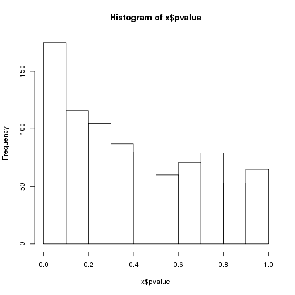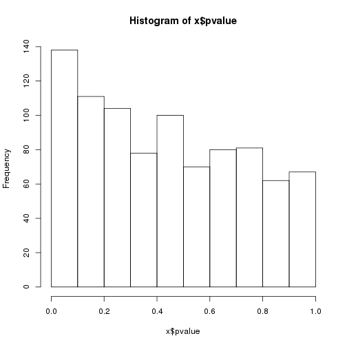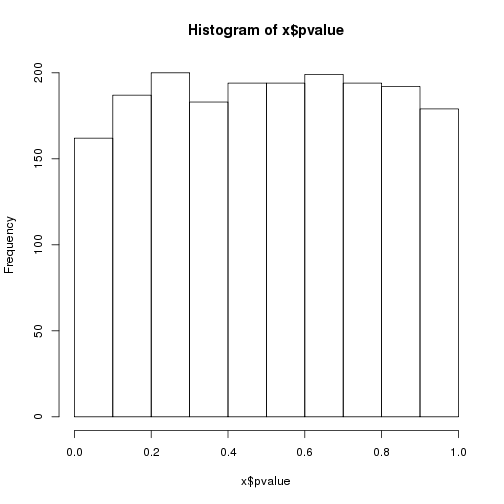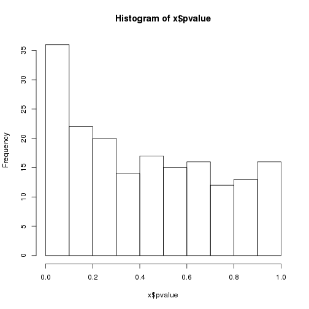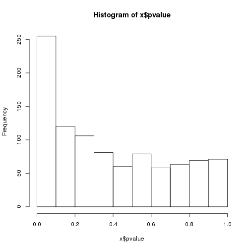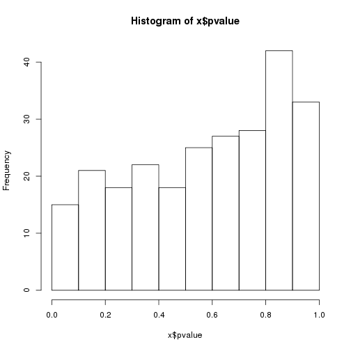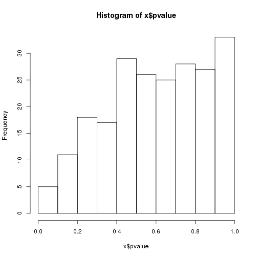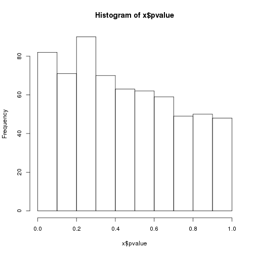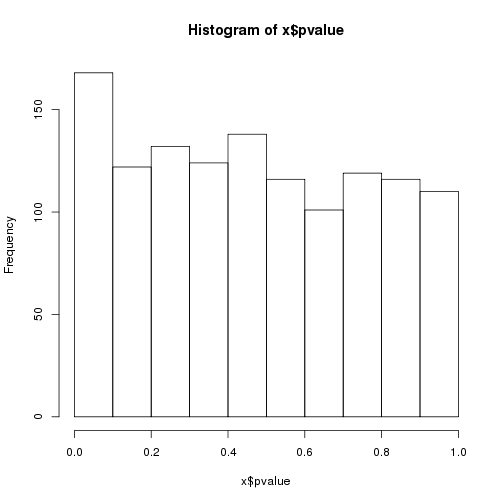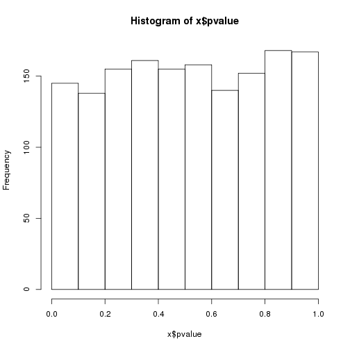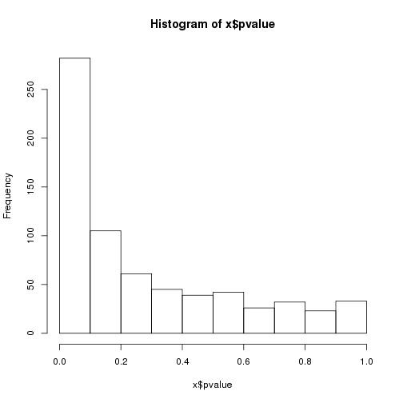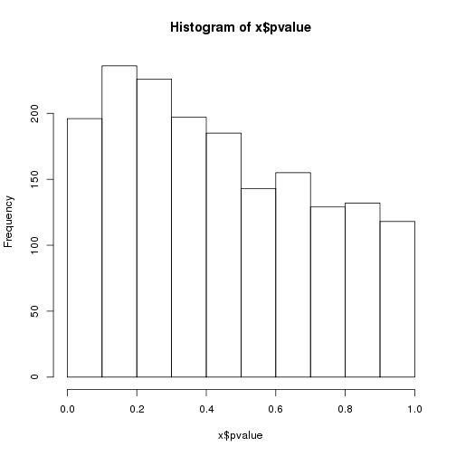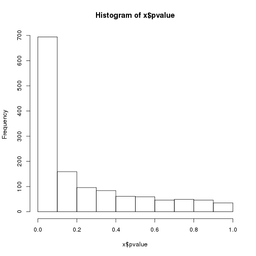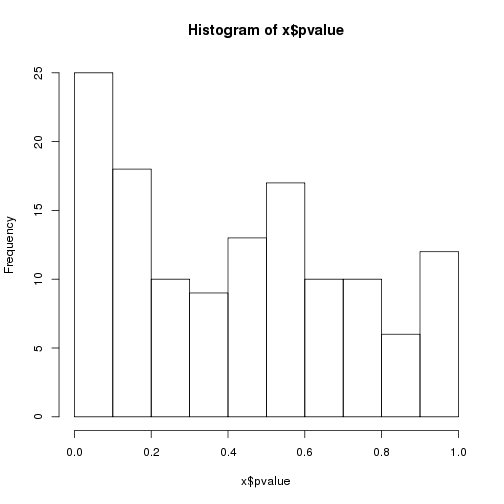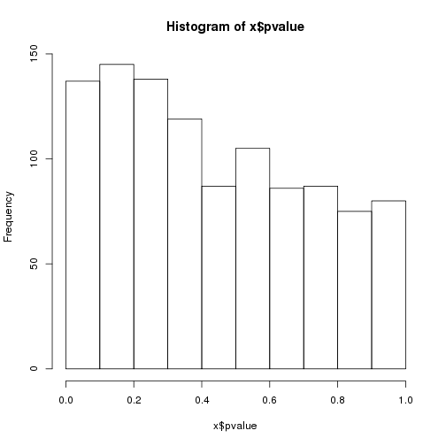

```r
lapply(tst, function(x) x$counts)
```

```
## $`ssc-let-7d-5p`
##  [1] 175 116 105  87  80  60  71  79  53  65
## 
## $`ssc-let-7g`
##  [1] 138 111 104  78 100  70  80  81  62  67
## 
## $`ssc-miR-128`
##  [1] 162 187 200 183 194 194 199 194 192 179
## 
## $`ssc-miR-1306-3p`
##  [1] 36 22 20 14 17 15 16 12 13 16
## 
## $`ssc-miR-140-5p`
##  [1] 255 120 106  81  60  79  58  63  69  71
## 
## $`ssc-miR-1468`
##  [1] 15 21 18 22 18 25 27 28 42 33
## 
## $`ssc-miR-184`
##  [1]  5 11 18 17 29 26 25 28 27 33
## 
## $`ssc-miR-190b`
##  [1] 82 71 90 70 63 62 59 49 50 48
## 
## $`ssc-miR-345-3p`
##  [1] 168 122 132 124 138 116 101 119 116 110
## 
## $`ssc-miR-429`
##  [1] 145 138 155 161 155 158 140 152 168 167
## 
## $`ssc-miR-6782-3p`
##  [1] 282 105  61  45  39  42  26  32  23  33
## 
## $`ssc-miR-7135-3p`
##  [1] 196 236 226 197 185 143 155 129 132 118
## 
## $`ssc-miR-874`
##  [1] 694 159  96  84  61  59  46  49  46  35
## 
## $`ssc-miR-95`
##  [1] 25 18 10  9 13 17 10 10  6 12
## 
## $`ssc-miR-9785-5p`
##  [1] 137 145 138 119  87 105  86  87  75  80
```

Recognize that the correlations may not be incredibly strong: many miRNAs can target one gene, 
and the effect of the miRNA on a given target varies. 

List of mRNA XLOC IDs that are significantly correlated per miRNA


```r
sig.mrnaR <- lapply(rst.corR, function(x) rownames(x)[x$qvalue < thres])

head(as.character(rownames(Mdge$genes)))
```

```
## [1] "XLOC_000001" "XLOC_000002" "XLOC_000003" "XLOC_000004" "XLOC_000005"
## [6] "XLOC_000006"
```

```r
Mdge$genes$geneXID<-as.character(rownames(Mdge$genes))

rst.corR[[2]][sig.mrnaR[[1]],]
```

```
##                    cor         z      pvalue    qvalue       pi0
## XLOC_001644  0.1631982  3.121065 0.001801983 0.1665260 0.6924629
## XLOC_002556 -0.1624681 -3.107101 0.001889322 0.1665260 0.6924629
## XLOC_004063  0.1715225  3.280260 0.001037114 0.1542586 0.6924629
## XLOC_014709  0.1396860  2.671408 0.007553373 0.3106876 0.6924629
```

```r
rst.corR[[1]][sig.mrnaR[[1]],]
```

```
##                    cor         z       pvalue      qvalue       pi0
## XLOC_001644  0.1906535  3.646130 2.662193e-04 0.038944877 0.6567395
## XLOC_002556 -0.2249726 -4.302461 1.689111e-05 0.009883916 0.6567395
## XLOC_004063  0.1995619  3.816497 1.353598e-04 0.036137592 0.6567395
## XLOC_014709  0.1954728  3.738296 1.852719e-04 0.036137592 0.6567395
```

Extract the correlations for those significant miRNA-mRNA pairs


```r
sig.mrnacorR <- lapply(rst.corR, function(x) x[x$qvalue < thres, "cor"])
```

Extract the names of the significant target mRNAs for use with DAVID:


```r
sig.mrnaR.names <- do.call(rbind, lapply(names(sig.mrnaR), function(x) data.frame(miRNA=rep(x, length(sig.mrnaR[[x]])), 
    Mdge$genes[sig.mrnaR[[x]], c("geneXID", "genes")])))
rownames(sig.mrnaR.names) <- NULL
dim(sig.mrnaR.names)
```

```
## [1] 722   3
```

```r
head(sig.mrnaR.names)
```

```
##             miRNA     geneXID    genes
## 1   ssc-let-7d-5p XLOC_001644    AP4E1
## 2   ssc-let-7d-5p XLOC_002556 PPP1R12B
## 3   ssc-let-7d-5p XLOC_004063    INTS2
## 4   ssc-let-7d-5p XLOC_014709     TIA1
## 5  ssc-miR-345-3p XLOC_007579   NANOS1
## 6 ssc-miR-6782-3p XLOC_002971  SUV39H2
```

These sums should match the summary.sigR "sig.neg" column


```r
unlist(lapply(sig.mrnacorR, function(x) sum(x < 0)))
```

```
##   ssc-let-7d-5p      ssc-let-7g     ssc-miR-128 ssc-miR-1306-3p 
##               1               0               0               0 
##  ssc-miR-140-5p    ssc-miR-1468     ssc-miR-184    ssc-miR-190b 
##               0               0               0               0 
##  ssc-miR-345-3p     ssc-miR-429 ssc-miR-6782-3p ssc-miR-7135-3p 
##               0               0              11               0 
##     ssc-miR-874      ssc-miR-95 ssc-miR-9785-5p 
##             333               0               0
```

Extract the significant negatively-correlated miRNA-mRNA pairs:


```r
sig.neg.mrnaR <- lapply(rst.corR, function(x) rownames(x)[x$qvalue < thres & x$cor<0])
```

Extract the names of those genes for use in DAVID analysis:


```r
sig.neg.mrnaR.names <- do.call(rbind, lapply(names(sig.neg.mrnaR), function(x) data.frame(miRNA=rep(x, length(sig.neg.mrnaR[[x]])), 
    Mdge$genes[sig.neg.mrnaR[[x]], c("geneXID", "genes")])))
rownames(sig.neg.mrnaR.names) <- NULL
dim(sig.neg.mrnaR.names)
```

```
## [1] 345   3
```

```r
head(sig.neg.mrnaR.names)
```

```
##             miRNA     geneXID    genes
## 1   ssc-let-7d-5p XLOC_002556 PPP1R12B
## 2 ssc-miR-6782-3p XLOC_002971  SUV39H2
## 3 ssc-miR-6782-3p XLOC_003672  MYADML2
## 4 ssc-miR-6782-3p XLOC_004328  MYADML2
## 5 ssc-miR-6782-3p XLOC_005987   ZDHHC3
## 6 ssc-miR-6782-3p XLOC_006585      TFG
```

Names of unique miRNA target genes per miRNA:


```r
unique(as.character(sig.neg.mrnaR.names$miRNA))
```

```
## [1] "ssc-let-7d-5p"   "ssc-miR-6782-3p" "ssc-miR-874"
```

```r
# lapply(unique(as.character(sig.neg.mrnaR.names$miRNA)), function(x) unique(as.character(sig.neg.mrnaR.names[sig.neg.mrnaR.names$miRNA==x, "genes"])))
```

----

Code received from DV 6/29/17

Correlation among miRNA expression 


```r
cor.mirna <- cor(t(v.mi$E[names(targets.mrna),]))
```

```r
corrplot(cor.mirna, method="number", mar=c(2,2,2,2), number.cex=0.7, tl.cex=0.8, tl.col="black", tl.srt=45, title="Correlation of microRNA Expression")
```


Xloc IDs of common targets per miRNA


```r
com.targets <- lapply(names(targets.mrna), function(x) lapply(targets.mrna, 
    function(y) targets.mrna[[x]][targets.mrna[[x]] %in% y]))
names(com.targets)<-names(targets.mrna)
```

Number of common targets per miRNA


```r
comM <- do.call(cbind, lapply(com.targets, 
    function(x) unlist(lapply(x, function(y) length(y)))))
colnames(comM) <- rownames(comM)
```

Proportion of common targets per miRNA


```r
comMperc <- do.call(cbind, lapply(names(targets.mrna), function(x) unlist(lapply(targets.mrna, 
    function(y) sum(targets.mrna[[x]] %in% y)/length(targets.mrna[[x]])))))
colnames(comMperc) <- rownames(comMperc)
```

```r
corrplot(comMperc, method="number", mar=c(2,2,2,2), number.cex=0.7, tl.cex=0.8, tl.col="black", tl.srt=45, title="Proportion of microRNA Targets in Common")
```


---
Number of times a single mRNA target is found significantly correlated to a miRNA


```r
idx <- rownames(summary.sigR)[summary.sigR$sig > 0]
tail(sort(table(unlist(lapply(idx, function(x) rownames(rst.corR[[x]])[rst.corR[[x]]$qvalue < thres])))),n=50)
```

```
## 
## XLOC_025058 XLOC_025271 XLOC_025273 XLOC_025281 XLOC_025304 XLOC_025306 
##           1           1           1           1           1           1 
## XLOC_025309 XLOC_025335 XLOC_025411 XLOC_025418 XLOC_025466 XLOC_025469 
##           1           1           1           1           1           1 
## XLOC_025570 XLOC_025712 XLOC_025731 XLOC_026350 XLOC_026707 XLOC_026716 
##           1           1           1           1           1           1 
## XLOC_026736 XLOC_027075 XLOC_027435 XLOC_027440 XLOC_027460 XLOC_027466 
##           1           1           1           1           1           1 
## XLOC_027476 XLOC_027580 XLOC_027623 XLOC_027654 XLOC_027830 XLOC_027833 
##           1           1           1           1           1           1 
## XLOC_027974 XLOC_028072 XLOC_028104 XLOC_028131 XLOC_028170 XLOC_028221 
##           1           1           1           1           1           1 
## XLOC_028229 XLOC_028271 XLOC_028297 XLOC_028378 XLOC_028395 XLOC_028423 
##           1           1           1           1           1           1 
## XLOC_028580 XLOC_028684 XLOC_028689 XLOC_005987 XLOC_009084 XLOC_009194 
##           1           1           1           2           2           2 
## XLOC_025534 XLOC_027447 
##           2           2
```

Identify target mRNAs that have significant correlation with multiple miRNAs:


```r
com.sig <- lapply(idx, function(x) lapply(com.targets[[x]][idx], 
    function(y) y[y %in% rownames(rst.corR[[x]])[rst.corR[[x]]$qvalue < thres]]))
names(com.sig) <- idx
com.sig <- lapply(com.sig, function(x) lapply(names(x), 
    function(y) x[[y]][x[[y]] %in% rownames(rst.corR[[y]])[rst.corR[[y]]$qvalue < thres]]))
for (i in idx){
    names(com.sig[[i]]) <- idx 
    com.sig[[i]] <- com.sig[[i]][-grep(i, names(com.sig[[i]]))]
}
```

Check that this function worked correctly:


```r
rst.corR[["ssc-miR-874"]][grep("XLOC_009194", rownames(rst.corR[["ssc-miR-874"]])),]
```

```
##                    cor         z      pvalue     qvalue       pi0
## XLOC_009194 -0.1683096 -3.218816 0.001287208 0.00790123 0.2691517
```

```r
rst.corR[["ssc-miR-6782-3p"]][grep("XLOC_009194", rownames(rst.corR[["ssc-miR-6782-3p"]])),]
```

```
##                    cor        z       pvalue     qvalue       pi0
## XLOC_009194 -0.2087623 -3.99245 6.539424e-05 0.02063121 0.4585607
```

List of mRNA significantly correlated to miRNA and also have an associated eQTL


```r
# load("/mnt/research/pigeqtl/analyses/eQTL/paper/output/corrected-Z/classified_peaks.Rdata")
# sig.mrna.eqtlR<-lapply(sig.mrnaR, function(x) regul[regul$gene %in% x,])
# sig.mrna.eqtlR
```

List of correlation results only for mRNA corrlelated to miRNA and have an associated eQTL


```r
# lapply(1:length(sig.mrnaR), function(x) rst.corR[[x]][sig.mrnaR[[x]][sig.mrnaR[[x]] %in% regul$gene],])
```

## Visualize

Plot the correlation vs the significance of the miRNA with its putative targets:


```r
# plot(rst.corR$"ssc-miR-874"$cor, 
# 	-log10(rst.corR$"ssc-miR-874"$qvalue),
# 	pch=20, 
# 	xlab="miRNA-mRNA Correlation",
# 	ylab="Significance (-log10(qvalue))", 
# 	main="ssc-miR-874", 
# 	cex.main=1.7,
# 	cex.lab=1.3,
# 	cex.axis=1.3)
# points(rst.corR$"ssc-miR-874"$cor[-log10(rst.corR$"ssc-miR-874"$qvalue)>(-log10(thres))], 
# 	-log10(rst.corR$"ssc-miR-874"$qvalue)[-log10(rst.corR$"ssc-miR-874"$qvalue)>(-log10(thres))], 
# 	pch=20,
# 	col="red")
# abline(a=-log10(thres), b=0, lty=5)
# text(rst.corR$"ssc-miR-874"["XLOC_011914","cor"], 
# 	-log10(rst.corR$"ssc-miR-874"["XLOC_011914","qvalue"]), 
# 	labels=paste(sig.mrna.eqtlR$"ssc-miR-874"$gene.name,
# 		format(round(rst.corR$"ssc-miR-874"["XLOC_011914","cor"], 3))),
# 	pos=4,
# 	col="blue")
```


Code to run with DV's "runR" hack:


```r
# 4_mRNA_miRNA_corr.R nodes=1:ppn=11,walltime=00:15:00,mem=20G
```

## Save Data


```r
write.table(sig.mrnaR.names, file="/mnt/research/ernstc_lab/miRNA_eQTL_Sscrofa11/6_mirna_eQTL_target_prediction/8_DAVID_cor_target_genes.txt", quote=FALSE, row.names=FALSE, col.names=FALSE)
write.table(sig.neg.mrnaR.names, file="/mnt/research/ernstc_lab/miRNA_eQTL_Sscrofa11/6_mirna_eQTL_target_prediction/9_DAVID_neg_cor_target_genes.txt", quote=FALSE, row.names=FALSE, col.names=FALSE)
save(rst.corR, summary.sigR, sig.mrnaR, sig.neg.mrnaR, sig.mrnaR.names, sig.neg.mrnaR.names, file="/mnt/research/ernstc_lab/miRNA_eQTL_Sscrofa11/6_mirna_eQTL_target_prediction/10_mrna_mirna_corr_rst.Rdata")
save(cor.mirna, com.targets, comM, comMperc, com.sig, file="/mnt/research/ernstc_lab/miRNA_eQTL_Sscrofa11/6_mirna_eQTL_target_prediction/11_mrna_mirna_corr_char.Rdata")
save(rMfit, rfit.mi, file="/mnt/research/ernstc_lab/miRNA_eQTL_Sscrofa11/6_mirna_eQTL_target_prediction/12_mrna_mirna_resid_exp.Rdata")
```

